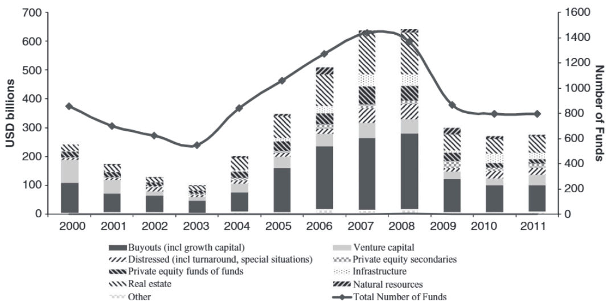
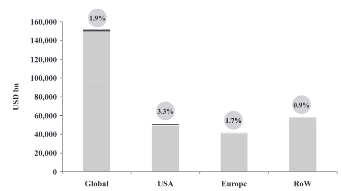
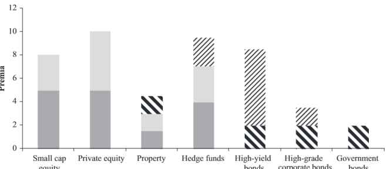
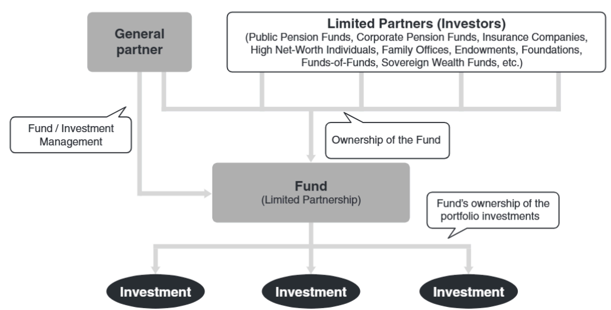
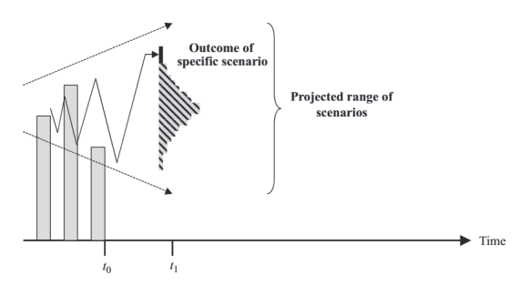
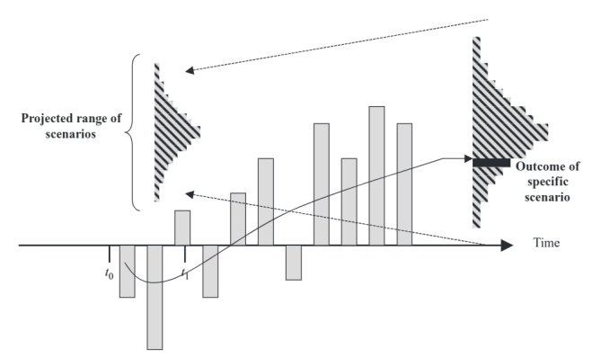
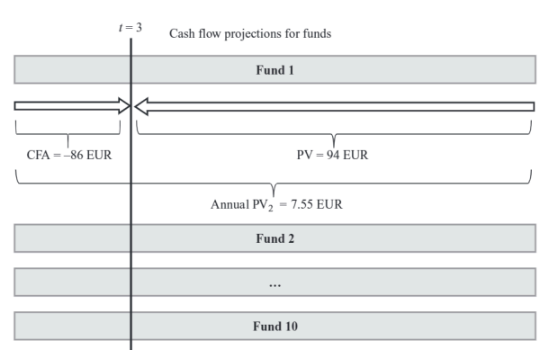
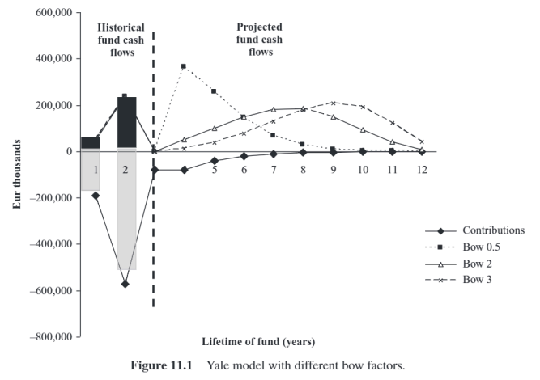

Les fonds Limited partnership  sont des véhicules d’investissement non enregistrés qui mettent en
commun des capitaux pour investir dans des capitaux privés et des actifs réels. Ces fonds sont mis en
place par des sociétés de gestion de fonds – aussi appelées « firmes » – pour attirer les investisseurs
institutionnels. Les fonds remplissent un certain nombre de fonctions. Ils permettent de déléguer le
processus d’investissement à des gestionnaires de fonds, qui ont une expérience significative dans le
filtrage, l’évaluation et la sélection d’opportunités d’investissement à fort potentiel de croissance
attendu. Ce potentiel est généralement exploité par une combinaison de mesures stratégiques, tactiques
et financières, nécessitant des compétences particulières en matière de contrôle, d’accompagnement et
de suivi de la gestion des sociétés en portefeuille. Enfin, les gestionnaires de fonds recherchent et sortent
des occasions et réalisent des gains en capital sur la cession de placements

Un partenariat est un contrat entre deux ou plusieurs personnes qui conviennent de mener ensemble une entreprise, d’y contribuer en y apportant des biens, des connaissances ou de la gestion, et d’en partager les bénéfices. La forme la plus simple de partenariat est le partenariat général. Dans un partenariat général, tous les partenaires gèrent l’entreprise et sont personnellement responsables de ses dettes, car chaque partenaire est à la fois agent et principal de la société, engageant ainsi celle-ci ainsi que les autres partenaires. Étant donné que ces responsabilités peuvent être importantes, une autre forme « asymétrique » de structure d’investissement a vu le jour : le partenariat limité (voir Figure 4.1). Dans un partenariat limité, les « commanditaires » renoncent à leur capacité de gérer l’entreprise. En contrepartie, leur responsabilité à l’égard des dettes du partenariat est limitée.

## La structure du *limited partnership*

La structure du *limited partnership* (LP), bien que définie dans des accords non standardisés, est devenue une quasi-norme dans de nombreuses juridictions.

- Les investisseurs, principalement des institutions dotées de structures de responsabilité adaptées, agissent comme **LPs**.
- Les LPs s’engagent à fournir un montant déterminé de capital au fonds.
- En tant que LPs, ils n'ont **que peu ou pas d'influence** sur la gestion quotidienne du fonds.
- Ils bénéficient d’un **droit de regard**, en siégeant parfois dans des comités consultatifs ou spéciaux, tout en étant protégés de la responsabilité personnelle.

- La durée de vie du fonds est contractuellement limitée, généralement entre **7 et 10 ans**, parfois jusqu’à **15 ans**.
- Les LPs **n'ont pas de droit de rachat anticipé**.
- Les **ventes secondaires** de parts doivent généralement être approuvées par le **GP**.

- L'objectif du GP est de réaliser tous les investissements **avant ou à la liquidation** du partenariat.
- Les **LPAs** (Limited Partnership Agreements) prévoient souvent une **prolongation possible de 1 ou 2 ans**, voire plus.

- Le capital est appelé sous forme de **contributions** pendant la période d’investissement (typiquement **3 à 5 ans**, parfois prolongée d’un an).
- Durant la période de **désinvestissement**, seuls les investissements existants et prometteurs sont soutenus avec des financements complémentaires, afin de maximiser la valeur jusqu’à la sortie finale.
- L’activité du GP est alors concentrée sur la **réalisation** des investissements et la **distribution des produits** aux LPs.

### Frais de gestion

- Les frais de gestion sont fonction de la taille du fonds et des ressources nécessaires pour appliquer la stratégie :
  - Environ **2,5 % du capital engagé** pour les fonds < 250 M€ ;
  - Entre **1,0 % et 1,5 %** pour les grands fonds de *buyout* ;
  - Entre **50 et 150 bps** pour les *funds-of-funds*.
- Ces frais sont généralement **réduits après la période d’investissement**, selon la part du portefeuille désinvestie.
- Certains **GPs** prélèvent également des **frais de transaction et de monitoring** auprès des entreprises en portefeuille — **peu visibles pour les LPs**.

### Carried interest (*carry*) et incitations

- Le **GP** touche en général un **salaire de base modeste**.
- Sa **principale incitation financière** est le **carried interest** (*carry*), généralement fixé à **20 % des profits réalisés**, parfois jusqu’à **30 %** pour quelques fonds américains de VC.
- Le **carry** est généralement soumis à un **taux de rendement minimal (hurdle rate)** :
  - Aux **États-Unis** :
    - Calculé **deal-by-deal** ;
    - Clause de **claw-back** incluse dans le LPA.
  - En **Europe** :
    - Aucun carry n’est versé tant que le **capital des LPs n’est pas intégralement remboursé** et que le **hurdle** n’est pas atteint.
    - Ensuite :
      - **100 % des gains** reviennent temporairement au GP (*période de catch-up*) ;
      - Puis les **distributions sont partagées** selon la clé de répartition convenue.

- Les **frais** et le **carry** ont un **impact important** sur les rendements nets des LPs.
- Les **frais de gestion et de transaction** ne dépendent **pas** de la performance, contrairement au carry.
- Selon **Metrick & Yasuda (2009)**, environ **60 % de la rémunération d’un GP** provient de **frais non liés à la performance**.
- Les GPs investissent souvent une **part importante de leur propre patrimoine** dans le fonds, afin d’aligner leurs intérêts avec ceux des LPs.

### Appels de capital et distributions

- Les **engagements des LPs** sont appelés de façon **progressive** (*just-in-time*) pour réaliser des investissements ou régler des frais.
- Les fonds **ne conservent pas de capital inutilisé**.
- Les LPs doivent répondre aux appels de fonds **dans un délai très court** (souvent **moins de 10 jours**).
- Lors de réalisations (cessions, dividendes, intérêts), les fonds sont **redistribués dès que possible** aux LPs.
- Le fonds est **auto-liquidatif**, les distributions intervenant principalement dans la **seconde moitié de la vie** du fonds.
- Les distributions peuvent également être faites **en nature** (*in kind*), sous forme de titres de sociétés en portefeuille, à condition qu’ils soient **cotés sur un marché public**.

## Le défaut de paiement est-il une option pour les LPs ?

- Théoriquement, selon **Litvak (2004)**, un LP peut choisir d’abandonner son investissement en **faisant défaut**.
  - Dans cette perspective, le **prix d’exercice** de cette option correspond à la **pénalité de défaut**, qu’il faut comparer aux **engagements non appelés** pouvant ainsi être "économisés".
  - Litvak conclut que **la menace de retrait de capital** constitue un **levier contractuel utile** pour limiter les coûts d’agence entre investisseurs et fonds de mauvaise qualité.

- Toutefois, **Fleischer (2004)** souligne que le défaut entraîne une **sanction réputationnelle** importante :
  - Un investisseur en défaut peut être **exclu de futurs fonds** de capital-investissement.
  - Les **conséquences d’un défaut vont au-delà des pénalités prévues dans le LPA**.

- L’**impact réputationnel** d’un défaut dépend du type d’investisseur :
  - Les **fonds de pension**, **dotations universitaires** et autres **acteurs récurrents** tiennent à leur réputation ;
  - Certains **individus** ou **entreprises** pourraient y être moins sensibles.

- Le marché des actifs privés repose fortement sur les **relations informelles** et la **réputation des participants**.
  - Un LP considéré comme non fiable aura **beaucoup de mal à rejoindre d’autres fonds**, notamment ceux **sur-souscrits**.
  - Les conséquences négatives d’un défaut répété peuvent **largement dépasser les économies potentielles** d’un retrait opportuniste.

- En pratique, un LP confronté à un fonds sous-performant **préfèrera céder sa part sur le marché secondaire** plutôt que de faire défaut (voir chapitre 6).

## Les limited partnerships comme réponse à l'incertitude et outil de contrôle

Malgré leurs avantages, les **limited partnerships** font souvent l’objet de critiques.

- On leur reproche notamment de pousser les **managers à produire des résultats rapides** afin de sécuriser des engagements pour leur **prochain fonds**.  
  - Cette logique est **contraire à l’esprit même** de l’investissement patient, nécessaire dans certaines classes d’actifs.

- Un exemple fréquemment cité est celui du **capital-risque (VC)**, où certaines participations sont **cédées trop tôt** par rapport à leur **durée de détention optimale**.

- En principe, une solution résiderait dans les **fonds evergreen**, c’est-à-dire des fonds sans échéance définie, à durée de vie **théoriquement illimitée**.

- Pourtant, l’industrie des actifs alternatifs continue d’utiliser ce que **Love (2009)** décrit comme des **« structures LP archaïques, spectaculairement inadaptées »** à l’investissement de long terme.

- Une explication se trouve dans la **structure de passif des investisseurs institutionnels**, comme les **fonds de pension à prestations définies (DB)** ou les **assureurs**, qui sont les **principaux LPs**.  
  - Leur **horizon d’investissement de 10 à 15 ans** correspond assez bien à la **durée de vie typique** d’un fonds en LP.

- Plus généralement, la **raison d’être** de la structure en LP réside dans sa **capacité à gérer l’incertitude** tout en **offrant des droits de contrôle aux investisseurs**.

## Le contrôle du point de vue des LPs

Alors que les **fund managers** peuvent préférer les **fonds evergreen**, car ces derniers leur permettent de lever du capital en continu, les **investisseurs** se montrent souvent réticents à l’idée d’être bloqués dans un véhicule sans échéance.

- Contrairement aux fonds evergreen, les **limited partnerships** suivent un **cycle de levée de fonds**, où les GPs retournent sur le marché à intervalles plus ou moins réguliers pour lever un nouveau fonds.
  - Cet intervalle est généralement d’environ **4 ans**, bien qu’il ait été plus court lors du **boom d’investissement du milieu des années 2000**.

- L’avenir du GP dépend fondamentalement du **succès de ses levées de fonds** :
  - Si la taille des fonds diminue, les **frais de gestion baissent**, ce qui oblige le GP à **réduire ses coûts fixes** ;
  - Dans les cas extrêmes, où aucun nouveau fonds n’est levé, une **liquidation complète** devient inévitable, les frais de gestion des anciens fonds s’épuisant.

Selon **Heikkilä (2004)**, cette **liquidation périodique** des fonds de private equity est **essentielle pour les LPs**, car le cycle de sortie et de réinvestissement leur permet :
- de **se retirer** des fonds gérés par des équipes peu performantes ou devenues obsolètes ;
- d’**éviter de payer pour un portefeuille existant**, ce qui simplifie l’entrée des nouveaux investisseurs ;
- de **repartir sur de nouvelles bases** avec des GPs au track record jugé solide.

- En général, les LPAs **interdisent la levée d’un fonds successeur** avec la même stratégie et le même manager :
  - tant que la période d’investissement du fonds actuel n’est pas terminée ;
  - ou tant qu’un **pourcentage élevé du fonds n’a pas encore été investi**.

- Les LPs exercent une **« pression évolutive »** en sélectionnant et en surveillant les GPs :
  - Cette pression constitue un **élément central de l’écosystème des actifs alternatifs**.
  - Elle **disparaîtrait** si les investisseurs détenaient également le **contrôle opérationnel** des fonds.

> La **séparation des fonctions** entre GP et LP dans une limited partnership constitue donc un **levier de gouvernance fondamental** dans ce type de structure.

## L’illiquidité des fonds en limited partnership

La **liquidité** d’un actif — ou son absence — correspond généralement à sa **capacité à être vendu et converti en liquidités** avec une perte de valeur minimale. Cette perte est liée aux **coûts de transaction**.

- Il n’existe pas de seuil précis de coûts qui permettrait de tracer une frontière nette entre **actifs liquides et illiquides**.
- La liquidité est donc **relative** : certains actifs sont simplement plus liquides que d’autres.

Comme évoqué dans le chapitre précédent, l’**illiquidité** peut exister même sur des **marchés réputés profonds** :
- Exemple : le **marché de la dette d’entreprise** peut manquer de liquidité à certains moments.
- Même sur le **marché boursier**, très actif en apparence, un investisseur peut se retrouver bloqué s’il détient une position trop importante par rapport aux **volumes journaliers échangés**.

Outre ce **« facteur de blocage »**, certains actifs ont des **caractéristiques très spécifiques**, rendant difficile la rencontre entre acheteur et vendeur.

Les **fonds en limited partnership** font partie des actifs les **plus illiquides** :

- Cette illiquidité est **connue dès le départ (ex ante)**, contrairement à d’autres classes d’actifs dont la liquidité peut **disparaître ex post**, en période de crise financière.
- Les investisseurs **acceptent volontairement cette illiquidité** afin de bénéficier d’une **prime de risque d’illiquidité**.
  - Cette prime compense l’absence de liquidité et augmente le rendement attendu.
  - Selon **Pastor & Stambaugh (2003)** et **Acharya & Pedersen (2005)**, plus un actif est illiquide, plus le **rendement exigé** est élevé.

> L’illiquidité élevée des fonds en limited partnership **n’est pas une conséquence involontaire** de leur structure contractuelle.

Au contraire :
- Elle fait **partie intégrante du design du véhicule d’investissement**.
- Elle a pour **fonction explicite d’empêcher** l’émergence d’un **véritable marché secondaire**, ce qui permet d’éviter la revalorisation constante et les contraintes imposées par certaines **normes comptables**.

## L’illiquidité comme source du rendement espéré

L’apport de capital institutionnel en dehors des marchés cotés permet aux entreprises en portefeuille **non cotées** de traverser des phases de difficultés ou de succès **sans être contraintes de publier des informations sensibles** qui pourraient nuire à l’investissement (par exemple à cause du comportement opportuniste de concurrents, fournisseurs ou clients).

- Les informations communiquées aux **LPs** sont strictement **confidentielles** et portent uniquement sur des aspects spécifiques de l’évolution des investissements sous-jacents.

En private equity, l’un des objectifs majeurs de la structure de fonds est de **protéger les jeunes entreprises du portefeuille**, en particulier :
- Celles en **phase de démarrage** ;
- Celles en **restructuration** ou en situation de retournement (**turnaround**).

Ce **bouclier contre les influences du marché** est essentiel :
- Pour éviter des réactions brutales des investisseurs ;
- Pour préserver le **financement stable** de projets comme l’**exploration** ou les **greenfield** (projets construits à partir de zéro) ;
- Pour prévenir les effets de **l’évolution imprévisible du sentiment de marché**, qui peut entraîner une **coupure brutale des financements**.

> Pour que ces investissements prennent de la valeur, ils doivent pouvoir compter sur **des ressources financières durables et prévisibles**, dans un **horizon de temps raisonnablement long**.

Ainsi, il est **conceptuellement inapproprié** d’évaluer la **valeur de marché** des investissements sous-jacents, notamment **en phase initiale**.

- Cela revient à dire que le **risque** et la **valorisation** sont mieux maîtrisés **au niveau du fonds lui-même**, plutôt qu’à celui de chaque entreprise du portefeuille.

## Le problème des "lemons" dans le marché secondaire des parts de fonds

- Les parts de **limited partnerships** sont légalement **illiquides**, mais des **transactions secondaires** existent en pratique.
- Ce marché est toutefois exposé au **"lemons problem"** (Akerlof, 1970) :  
  → **Asymétrie d’information** entre vendeur (bien informé) et acheteur (moins informé).  
  → L’acheteur, incertain de la qualité réelle du fonds, propose un **prix moyen**, décourageant les vendeurs de fonds de qualité.

- Cette dynamique peut :
  - Réduire les **prix du marché** ;
  - Faire fuir les bons vendeurs ;
  - Conduire à un **effondrement du marché** (plus de transactions).

- Dans le private equity :
  - Les **non-LPs** ont moins d’infos, donc hésitent à acheter même si le fonds est de qualité.
  - Des **écarts importants entre prix demandé et prix proposé** peuvent apparaître.

- **Mitigations possibles** :
  - Certains acteurs spécialisés disposent de **bases de données privées** pour réduire l’asymétrie d’information.
  - L’acheteur peut même, parfois, avoir **plus d’infos que le vendeur**.
  - La vente partielle de parts permet au vendeur de **maintenir son rôle de LP** et d’envoyer un signal positif sur la confiance dans le fonds.

## Illiquidité contractuelle et autres facteurs affectant la liquidité des fonds

### Illiquidité contractuelle
- Malgré les restrictions sur la transférabilité des parts dans le LPA, les **GPs donnent souvent leur accord** aux transactions secondaires.
- Selon Lerner et Schoar (2002) :
  - Les gestionnaires de fonds influencent le degré d’illiquidité pour attirer des investisseurs à “poches profondes” moins susceptibles de faire face à un choc de liquidité.
  - Cela facilite la levée de fonds futures.
  - Les GPs subissent aussi un **problème de “lemons”**, avec une asymétrie d’information sur la qualité des LPs entre les LPs existants et le reste des investisseurs.

### Incapacité à valoriser correctement
- Les prix sur le marché secondaire dépendent de nombreux facteurs :
  - Asymétrie d’information
  - Compétences en négociation
  - Pression pour conclure la transaction
  - Préférences différentes entre vendeurs (préférence liquidité à court terme) et acheteurs (préférence performance long terme)
- Le vrai prix économique d’un actif sous-jacent est **inobservable**, ce qui conduit à s’appuyer sur des **techniques d’évaluation par experts**.

### Effet de dotation (Endowment effect)
- Désigne la tendance des individus à attribuer plus de valeur à un bien qu’ils possèdent qu’au prix qu’ils accepteraient pour l’acheter (Thaler, 1980).
- Exemple classique : une famille qui hésite à vendre un tableau ancien, peu importe le prix offert.
- Dans les marchés financiers, cet effet est moins évident ; la **loss aversion** (aversion à la perte) est souvent plus pertinente.
- En private equity, la relation étroite et de confiance entre LPs et GPs renforce cet effet :  
  → Les investisseurs hésitent à rompre la relation, sauf raison très claire.

## Critiques de la structure de la société en commandite (Limited Partnership)

- **Acceptation volontaire de l’illiquidité** :  
  Les investisseurs savent que les limited partnerships sont illiquides et acceptent cette illiquidité pour bénéficier d’une prime de risque. Ce n’est pas un échec de marché mais une caractéristique essentielle pour générer des surperformances.

- **Critiques lors des cycles baissiers** :  
  Certains estiment que le modèle est « cassé » et voué à disparaître (ex. Scott, 2012).

- **Coût des levées de fonds périodiques** :  
  La collecte régulière de capitaux demande beaucoup de temps et ressources aux GPs, qui préfèreraient se concentrer sur l’investissement. Cela a motivé la création de véhicules cotés, notamment au sommet du dernier cycle.

- **Durée de vie insuffisante** :  
  Pour certains investissements, notamment en capital-risque early stage, la durée classique (environ 10 ans) ne suffit pas à développer pleinement les entreprises du portefeuille. Certains GPs militent pour des durées plus longues ou des structures evergreen.

- **Blocage du capital et manque de flexibilité pour les LPs** :  
  La période de blocage (10 ans ou plus) limite la capacité des investisseurs à rééquilibrer leurs portefeuilles, un problème aggravé en périodes d’incertitude économique.

- **Mauvaise alignement d’intérêts LP-GP** :  
  - Les frais fixes (hors performance) représentent environ 60 % de la rémunération des GPs (Metrick & Yasuda, 2009; Phalippou, 2009).  
  - Ce modèle, contesté par les LPs, peut décourager les GPs à céder les participations sous-performantes.

- **Absence de constitution de réserves pour les investisseurs** :  
  Contrairement aux actions cotées, les limited partnerships ne permettent pas de constituer des réserves de gains en capital non réalisés (UCGL), utiles notamment pour les compagnies d’assurance-vie pour lisser les rendements sur le long terme (Achleitner & Albrecht, 2011).

## Co-investissements

- **Définition** :  
  Le co-investissement consiste en une syndication de financement entre un fonds et un ou plusieurs de ses LPs.

- **Avantages** :  
  - Permet de contourner certaines limites des structures en limited partnership.  
  - Combine les compétences complémentaires des GPs (gestionnaires) et des LPs (investisseurs).  
  - Utile quand un fonds est trop petit pour acquérir seul un actif à rendement ajusté au risque attractif.  
  - Les LPs peuvent manquer de connaissances sectorielles ou de réseau pour sourcer ces deals seuls.

- **Différence avec l’investissement direct** :  
  - Les transactions sont sourcées, présélectionnées, structurées et évaluées par le gestionnaire du fonds.  
  - Les LPs n’ont généralement pas à payer de frais ni de carry sur les co-investissements.

- **Approches des LPs** :  
  - Certains adoptent une approche passive, déléguant entièrement au gestionnaire.  
  - D’autres agissent presque comme des investisseurs directs, avec une implication plus active.

## Comparaison des rendements private equity vs public equity

### Principales mesures pour créer de la valeur dans les LBOs :
1. **Mesures stratégiques**  
   - Initiatives buy-and-build  
   - Cessions d’activités non essentielles  
   - Développement de nouveaux produits et marchés  
   → Objectif : accroître la croissance de l’EBITDA et souvent expansion des multiples.

2. **Mesures opérationnelles**  
   - Amélioration de la qualité produit et de l’efficacité commerciale  
   - Réduction des coûts fixes  
   - Optimisation de la chaîne de valeur de l’entreprise

3. **Mesures financières**  
   - Maximisation de l’efficacité du capital  
   - Optimisation de la structure financière de l’entreprise

### Gouvernance et incitations :
- Alignement des intérêts de la direction et des propriétaires via des actions/options  
- Exposition à la baisse par investissement significatif des dirigeants dans l’entreprise

### Évidences empiriques :
- Années 1980 : gains significatifs en performance opérationnelle et valeur des entreprises (Kaplan & Strömberg, 2009).  
- Études 1990-2006 (Guo et al., 2011) : gains opérationnels plus modestes mais retours sur capital investis positifs et significatifs.  
- Valeur créée durable, comme le montrent les IPOs de sociétés issues de LBO (reverse LBO) (Cao & Lerner, 2009).

### Focus Europe :
- Analyse de 332 mid-market LBOs (1990-2011) par Kaserer (2011) :  
  - ~2/3 des retours bruts dus aux mesures stratégiques et opérationnelles (croissance des gains)  
  - Expansion des multiples négligeable  
  - Effet de levier contributeur d’un tiers mais statistiquement non significatif → levier profite peut-être davantage au vendeur qu’à l’acheteur.

- Achleitner et al. (2011) rapportent des résultats légèrement différents pour l’Europe et l’Amérique du Nord, suggérant une diversification des sources de performance.

### Compléments sur la comparaison des rendements private equity vs public equity

- **Achleitner et al. (2011)** soulignent que l'expansion des multiples joue aussi un rôle important, en plus des améliorations opérationnelles et du levier financier.
- **Acharya et al. (2013)**, sur 395 LBOs en Europe de l’Ouest (1991-2007), corrigent l'effet levier et trouvent une performance anormale significativement positive, tirée par une plus forte croissance des ventes et une amélioration des marges (EBITDA/ventes) comparées aux pairs cotés.

---

### Rendements nets pour les LPs :  
- Malgré la création de valeur dans les LBOs, cela ne garantit pas forcément des rendements attractifs pour les investisseurs limités (LPs).
- Les vendeurs capturent souvent une part importante de la valeur créée, via les primes payées par les fonds.
- Les GPs perçoivent aussi des frais de gestion et carried interest significatifs, ce qui réduit les retours nets pour les LPs.
- Ce qui importe aux LPs est la **distribution nette de frais** (retours nets).

---

### Études comparatives PME (Public Market Equivalent) :  
- **Kaplan et Schoar (2005)** :  
  - Analyse de 169 fonds buyout US levés avant 1995.  
  - PME = 1 signifie performance égale entre private equity et marché public.  
  - PME > 1 signifie surperformance du private equity.  
  - PME < 1 signifie sous-performance.  

- Résultats :  
  - PME de 0,97 sur leur échantillon → légère sous-performance nette par rapport au S&P 500.  
  - Sur une base pondérée par taille, PME = 0,93 → sous-performance plus marquée.  

- Conclusion : cette étude remet en question l’idée souvent avancée que le private equity surperforme nettement les marchés publics une fois frais et carried interest déduits.

---

### Mise à jour et critiques :  
- Phalippou et Gottschalg (2009) ont travaillé avec une version actualisée des données de Kaplan et Schoar, poursuivant l’analyse sur les rendements nets.

---

Ce bilan souligne la complexité d’évaluer la vraie valeur ajoutée du private equity pour les LPs, au-delà des performances brutes souvent mises en avant.

# Risque diversifiable et tarification des actifs en capital-investissement

Une des plus grandes avancées en théorie financière est la démonstration qu'une partie du risque d’investissement est **diversifiable** ou **idiosyncratique**. Ce qui importe réellement dans la construction de portefeuille, c’est la **corrélation entre les rendements des actifs** — un concept fondamental introduit par Markowitz (1952), Treynor (1962), Sharpe (1964), Lintner (1965) et Mossin (1966).

La théorie moderne du portefeuille (MPT) cherche à :

- Maximiser le rendement attendu pour un niveau de risque donné, ou
- Minimiser le risque pour un niveau de rendement attendu donné,

en allouant de manière optimale le capital entre différentes classes d’actifs.

Dans des marchés **efficients et complets**, sans frictions, le rendement attendu d’un actif reflète son **risque systématique (risque de marché ou bêta)** dans le portefeuille de marché global. Ce principe est au cœur du **Capital Asset Pricing Model (CAPM)**, qui stipule que le prix d’un actif dépend de son impact sur le profil risque-rendement du portefeuille de marché.

---

# Risque de marché et capital-investissement

- Des études comme celles de Kaplan et Schoar (2005) et Harris et al. (2012) calculent des **équivalents de marché public (PME)** en supposant un **bêta égal à 1** pour le capital-investissement.
- Or, les opérations de rachat avec effet de levier (buyouts) utilisent généralement un endettement moyen de 60:40 sur les dix dernières années.
- L’effet de levier amplifie les gains comme les pertes, ce qui implique que le **bêta devrait être supérieur à 1**, sauf si les améliorations opérationnelles compensent cet effet.

---

# Difficultés à estimer le risque et le rendement en capital-investissement

- Les modèles classiques supposent des actifs liquides, transparents, échangés sur des marchés sans friction, ce qui est rarement le cas du capital-investissement.
- Les rendements du capital-investissement sont peu fréquents et les bases de données peuvent être biaisées (surreprésentation des fonds performants).
- Les estimations d’**alpha** (rendement excédentaire) et de **bêta** (risque systématique) doivent donc être ajustées pour être significatives.

---

# Études empiriques sur le risque et rendement en capital-investissement

- **Ljungqvist et Richardson (2003)** (données au niveau des fonds, 1981-1993) :
  - Échantillon : 19 fonds VC et 54 fonds de rachat.
  - TRI net moyen : 19,81 %, contre 14,1 % pour le S&P 500 → surperformance notable.
  - Bêtas estimés : 1,08 pour les buyouts, 1,12 pour le VC.
  - Surperformance interprétée comme une **prime d’illiquidité** de 5–6 %.
  - Pas d’ajustement pour les différences de levier.

- **Driessen et al. (2011)** (données au niveau des fonds, 1980-2003) :
  - 272 fonds buyouts matures → bêtas entre 1,3 et 1,7.
  - Alpha légèrement négatif, statistiquement non significatif (-0,4 % à -1 %).
  - 686 fonds VC → bêtas de 2,4 à 2,7, alphas négatifs (-0,7 % à -1 %).

- Les études avec données au niveau des entreprises offrent plus de précision, mais excluent les frais de gestion et carried interest, reflétant donc des rendements bruts.

---

# Modèles en temps continu vs temps discret

- Le CAPM standard est un modèle en temps discret ; les données d’entreprise nécessitent souvent un modèle en temps continu.
- Ang et Sorensen (2011) suggèrent que le rendement anormal (alpha) en temps continu peut s’écrire comme :

\[
\alpha = \delta + 0,5 \sigma^2
\]

où \(\delta\) est la dérive et \(\sigma\) la volatilité.

---

# Risque et rendement en capital-risque (VC)

- **Cochrane (2005)** et **Korteweg et Sorensen (2011)** analysent des données d’entreprises VC.
  - Forte volatilité observée.
  - Cochrane estime un alpha annuel très élevé de 32 %, mais un bêta faible (0,6 à 1,9).
  - Korteweg et Sorensen trouvent des bêtas plus élevés (2,6 à 2,8) et des alphas positifs mais modestes.

## Transactions secondaires en capital-investissement

Les **transactions secondaires** désignent l’achat et la vente de parts préexistantes dans des fonds de private equity ou d’autres fonds d’investissements alternatifs, plus précisément les intérêts dans des sociétés en commandite (limited partnerships). Ces intérêts incluent à la fois :

- les **engagements déjà appelés** (capital déjà tiré par le gestionnaire, le GP),
- et les **engagements non appelés** (capital restant à appeler).

Il est important de ne pas confondre le transfert d’engagements d’investisseurs entre partenaires commanditaires (LPs) sur le marché secondaire avec les **secondary buyouts**, ou transactions similaires, où une opération de rachat est finalisée par la vente de la société sous-jacente à un autre fonds.

---

### La montée en puissance du marché secondaire

L’émergence d’un marché secondaire pour les parts dans des sociétés en commandite a été saluée comme l’avènement de la **liquidité** dans une classe d’actifs autrement illiquide. En réduisant le risque de liquidité, on s’attend généralement à ce que l’élargissement et l’approfondissement du marché secondaire contribuent à stimuler la croissance du marché primaire pour les investissements en private equity et dans les actifs réels.

Les arguments en faveur de ce développement sont les suivants :

- Les investisseurs à long terme, déjà exposés à ces classes d’actifs, pourraient être incités à augmenter leurs allocations actuelles.
- Un degré plus élevé de liquidité pourrait élargir l’univers des investisseurs potentiels, qui seraient autrement limités par la structure de leurs bilans et leur profil de passif.

Par ailleurs, la croissance des transactions secondaires a souvent été — à tort — considérée comme un moyen supérieur de découverte des prix par rapport aux estimations subjectives de la valeur nette d’inventaire (NAV) des capitaux investis.

---

### Importance et limites du marché secondaire

Le marché secondaire des investissements en fonds a connu un essor considérable au cours de la dernière décennie et représente l’un des développements majeurs dans l’histoire récente de l’investissement alternatif.

Indéniablement, ce marché n’aurait pas atteint son niveau actuel d’importance s’il n’avait pas apporté d’avantages significatifs pour les vendeurs et les acheteurs de parts de sociétés en commandite.

Cependant, il convient de noter que le marché secondaire **n’a pas modifié fondamentalement les caractéristiques intrinsèques des investissements en fonds**. Les défis auxquels les investisseurs font face pour mesurer et gérer les risques particuliers liés aux engagements dans les sociétés en commandite restent donc essentiellement inchangés.

# The Structure of the Secondary Market

## 6.1.1 Sellers and Their Motivations to Sell

Les vendeurs sur le marché secondaire sont des **LPs** (limited partners) dans des fonds de private equity ou des structures similaires investissant dans des actifs réels. Il existe différentes raisons pour lesquelles les LPs décident de vendre leurs parts dans ces fonds. 

De manière générale, on peut différencier :

- les ventes motivées principalement par des **contraintes de liquidité**,  
- et celles liées à une **reposition stratégique du portefeuille** de l’investisseur.

Comprendre ces différentes raisons est important pour évaluer la valeur informative des prix de transaction sur le marché secondaire.

---

### Ventes motivées par la liquidité

Pour ce qui est des ventes motivées par la liquidité, le désir de transférer des parts dans une société en commandite est généralement **cyclique**.

**Box 6.1** présente le cas de la **Harvard Management Company**, qui a attiré une grande attention publique en décidant de vendre un portefeuille de parts de fonds illiquides d’une valeur d’1 milliard USD durant la récente crise financière.

Il convient de préciser que la dotation de l’Université Harvard n’était pas la seule concernée. En réalité, beaucoup d’autres LPs avec une forte exposition au private equity et à d’autres classes d’actifs illiquides se sont retrouvés dans une situation où :

- les distributions se tarissaient,  
- alors que les appels de marge sur d’autres investissements, comme les hedge funds, augmentaient,  
- et où les rachats étaient réduits voire exclus.

Dans ce contexte, plusieurs LPs avec d’importants engagements non appelés (unfunded commitments) ont pris le risque important de ne pas pouvoir honorer les appels de capitaux et ont décidé de liquider leur position partiellement ou entièrement.

# The Structure of the Secondary Market

## 6.1.1 Sellers and Their Motivations to Sell

Les vendeurs sur le marché secondaire sont des **LPs** (limited partners) dans des fonds de private equity ou des structures similaires investissant dans des actifs réels. Il existe différentes raisons pour lesquelles les LPs décident de vendre leurs parts dans ces fonds. 

De manière générale, on peut différencier :

- les ventes motivées principalement par des **contraintes de liquidité**,  
- et celles liées à une **reposition stratégique du portefeuille** de l’investisseur.

Comprendre ces différentes raisons est important pour évaluer la valeur informative des prix de transaction sur le marché secondaire.

### Ventes motivées par la liquidité

Pour ce qui est des ventes motivées par la liquidité, le désir de transférer des parts dans une société en commandite est généralement **cyclique**.

**Box 6.1** présente le cas de la **Harvard Management Company**, qui a attiré une grande attention publique en décidant de vendre un portefeuille de parts de fonds illiquides d’une valeur d’1 milliard USD durant la récente crise financière.

Il convient de préciser que la dotation de l’Université Harvard n’était pas la seule concernée. En réalité, beaucoup d’autres LPs avec une forte exposition au private equity et à d’autres classes d’actifs illiquides se sont retrouvés dans une situation où :

- les distributions se tarissaient,  
- alors que les appels de marge sur d’autres investissements, comme les hedge funds, augmentaient,  
- et où les rachats étaient réduits voire exclus.

Dans ce contexte, plusieurs LPs avec d’importants engagements non appelés (unfunded commitments) ont pris le risque important de ne pas pouvoir honorer les appels de capitaux et ont décidé de liquider leur position partiellement ou entièrement.

# Synthèse : Contraintes de liquidité et ventes secondaires durant la crise financière 2008-2009

La crise financière de 2008-2009, déclenchée notamment par la faillite de Lehman Brothers, a provoqué une chute brutale des liquidités sur les marchés, impactant sévèrement les investisseurs en private equity. Face à la raréfaction des distributions et à l’augmentation des appels de marge, de nombreux investisseurs, notamment les grands fonds et dotations universitaires comme la Harvard Management Corporation (HMC), ont été contraints de vendre leurs parts dans des fonds illiquides via le marché secondaire.

Cette forte demande de liquidités a coïncidé avec un manque d’acheteurs, en raison d’une forte aversion au risque et d’un décalage important entre les valorisations attendues par les vendeurs et les prix proposés par les acheteurs, provoquant une chute de plus de 50 % du volume des transactions secondaires en 2009. HMC, par exemple, a dû liquider des actifs dans des conditions très défavorables, avec des ventes à 50-60 % de la valeur liquidative (NAV), et a même émis de la dette pour faire face à ses besoins en liquidités.

D’autres grands investisseurs comme CalPERS ont également subi de lourdes pertes, résultant en une révision de leurs stratégies d’allocation d’actifs pour mieux gérer les risques liés à la liquidité et aux marchés illiquides.

Cette crise a ainsi mis en lumière la vulnérabilité des investisseurs à long terme face aux contraintes de liquidité dans les actifs alternatifs, soulignant l’importance d’une gestion prudente des engagements et des prévisions de trésorerie dans ces investissements.

# Résumé – Ventes stratégiques sur le marché secondaire

Le marché secondaire est de plus en plus utilisé par les investisseurs en private equity pour gérer activement leurs portefeuilles. Les LPs peuvent vendre tout ou partie de leurs participations selon leurs objectifs.

Les motivations stratégiques incluent :
- Insatisfaction vis-à-vis des performances d’un fonds, conduisant à la revente pour réallouer le capital.
- Volonté de sécuriser les gains lorsque la croissance future est jugée limitée.
- Correction d’une surexposition involontaire au private equity, souvent causée par l’ajustement plus rapide des actifs liquides par rapport aux actifs illiquides (effet dénominateur).
- Rationalisation des portefeuilles pour se concentrer sur les relations clés et une gestion plus efficace.
- Contraintes réglementaires qui poussent à réduire les positions dans certaines classes d’actifs.

Ces ventes permettent aux investisseurs de mieux aligner leur portefeuille avec leurs objectifs d’allocation tout en gérant les contraintes de liquidité et de diversification.

Les institutions financières ont largement dominé les volumes de transactions secondaires entre 2008 et 2011.

# Résumé : Acheteurs et motivations à acheter sur le marché secondaire

Le marché secondaire du private equity, historiquement dominé par des fonds secondaires spécialisés, attire désormais un large éventail d’acheteurs non traditionnels (fonds de pension, assurances, dotations, family offices, etc.). Ces acheteurs sont motivés par plusieurs raisons :

- **Opportunités à prix réduit** : Acheter des actifs en difficulté avec des décotes importantes, à condition de disposer de liquidités pour couvrir les engagements non financés.
- **Moins d’incertitude** : Contrairement aux engagements primaires (« blind pools »), les investissements secondaires permettent d’analyser les sociétés en portefeuille, car une part importante du capital est déjà investie.
- **Transactions précoces** (« purchased primaries ») : Achat à un stade très précoce, parfois avant toute acquisition, souvent en situation de détresse, mais ces opérations ont fortement diminué depuis la crise de 2009.
- **Accès rapide et durée réduite** : Les transactions secondaires permettent d’accéder rapidement au private equity sans immobiliser le capital sur 10-12 ans, en réduisant la période de détention à 6-8 ans et en atténuant l’effet de la courbe en J (rendements négatifs en début de vie).
- **Avantage pour portefeuilles jeunes** : Utile pour les investisseurs avec des portefeuilles récents, afin d’obtenir plus rapidement des flux de trésorerie positifs.

En 2011, la majorité des fonds achetés sur le marché secondaire avaient entre 3 et 5 ans, ce qui illustre cette tendance à privilégier des fonds déjà partiellement investis.

# Résumé : La courbe en J (J-curve)

La courbe en J reflète la structure des fonds en commandite limitée, avec des coûts initiaux et des frais de gestion, ainsi que les politiques d’évaluation des gestionnaires.

- **Courbe en J des flux de trésorerie** : Les flux nets sont négatifs au début (période d’investissement) puis deviennent positifs lors de la cession des actifs.
- **Courbe en J de la valeur liquidative (NAV)** : La NAV diminue au début avant de s’améliorer dans les années suivantes.
- **Courbe en J de la performance** : Résulte des flux de trésorerie et de l’évaluation des actifs, avec des biais liés à l’incertitude des investissements sous-jacents.

Ce phénomène est souvent plus marqué pour les fonds de capital-risque, où la création de valeur prend plusieurs années. Cependant, certaines études récentes soulignent que cet effet est moins systématique, notamment pour les fonds créés après les années 1990.

Néanmoins, le cycle de vie spécifique des fonds en commandite crée des biais et distorsions importants à prendre en compte dans la modélisation des risques.

# Résumé : Intermédiation sur le marché secondaire

- Le marché secondaire a connu une forte croissance des transactions ces 10-15 dernières années, mais reste très opaque.
- Trouver un acheteur ou un vendeur est une étape clé, souvent initiée par les vendeurs, mais les acheteurs peuvent aussi chercher activement des opportunités.
- La transparence reste faible, malgré les efforts pour créer des plateformes dédiées ; les prix des transactions sont souvent inconnus.
- Le processus de vente est complexe et long : les petites transactions sont négociées bilatéralement, tandis que les grandes font souvent l’objet d’enchères avec intermédiaires.
- Les intermédiaires financiers (conseillers spécialisés ou agents de placement) jouent un rôle crucial pour structurer les offres, identifier les acheteurs et animer la compétition, avec des frais généralement entre 1% et 2%.
- Dans les enchères, plusieurs LPs sont contactés ; pour les grands portefeuilles, ceux-ci peuvent être segmentés pour attirer plus d’acheteurs.
- Le processus inclut souvent deux tours d’enchères, permettant de sélectionner un sous-groupe d’acheteurs les plus intéressés.

 # Stats marché secondaire
 
 
 # Résumé : Analyse des prix et dynamiques d’achat dans le marché secondaire

## Approche d’évaluation des actifs secondaires
- Peu d’acteurs se basent uniquement sur une analyse top-down.
- La plupart des acheteurs font une analyse bottom-up détaillée :
  - La NAV rapportée par les GPs est peu pertinente, car les actifs sous-jacents sont vendus dans le futur.
  - Analyse des sorties attendues (valeur, timing), appels de capitaux futurs, retour sur investissements futurs.
  - Utilisation d’une analyse des flux de trésorerie actualisés (DCF) pour déterminer le prix et le taux de rendement cible.
- Cette analyse est coûteuse en ressources, nécessitant l’examen détaillé de chaque société du portefeuille (EBITDA, endettement, croissance, multiples de sortie, etc.).
- Les hypothèses sont sensibles et les acheteurs testent différents scénarios macroéconomiques (croissance, taux d’intérêt, multiples).

## Difficultés spécifiques
- Évaluation des portefeuilles de capital-risque (VC) particulièrement complexe, en raison des résultats très dispersés (nombreuses pertes compensées par quelques succès).
- Les acheteurs de VC s’appuient souvent sur la réputation et les performances passées du gestionnaire (GP).

## Évaluation des engagements non financés
- Séparation des engagements pour frais et pour investissements.
- Examen du passé et qualité du GP pour estimer la valeur.
- L’engagement non financé peut être perçu comme un actif ou un passif.

## Taux de rendement cible (discount rate)
- Varie selon le segment (mezzanine < buyout < VC).
- Fluctue avec les conditions de marché : 
  - <15 % au pic du cycle,
  - jusqu’à 30 % fin 2008-début 2009 (crise financière).
- Plus stable et souvent plus élevé sur les petits segments moins transparents.

## Aspects tactiques
- Certains acheteurs évitent d’enchérir agressivement sur les méga-fonds 2007-2008, préférant attendre une décote.
- Les LPs déjà investis via primaire ont un avantage compétitif, mais sont limités par leurs contraintes de concentration.

## Perspective vendeur
- Prix d’achat souvent inférieur à la NAV communiquée par le GP, créant une perte comptable.
- Cette perte est douloureuse, notamment pour les gestionnaires d’actifs alternatifs rémunérés sur performance.
- Les vendeurs ont tendance à utiliser des taux d’actualisation plus faibles que les acheteurs, accentuant l’écart.

## Contexte marché en 2009
- Moyenne des meilleures offres initiales autour de 70 % de la NAV (fortes décotes).
- Malgré cela, volume des transactions a triplé en 2008 puis chuté de plus de 50 % en 2009.
- Gros écart entre offres hautes et basses reflétant l’incertitude et la diversité de qualité des actifs.
- Seuls les vendeurs en détresse ont accepté ces décotes, les autres ont préféré ne pas vendre.
- Décotes élevées dues en partie à l’inertie des NAV rapportées, qui étaient rapidement dépassées par la dégradation rapide du marché.
- Avec la correction des NAV par les GPs, les écarts entre prix d’achat et prix demandé se sont réduits, favorisant la reprise des transactions.
- Aujourd’hui, les décotes se stabilisent autour de 80 % des offres initiales, avec des prix de transaction souvent supérieurs.

---
Veux-tu que je développe certains points ou que je te prépare un résumé encore plus court ?

# Rendements des investissements sur le marché secondaire

- Les rendements des investissements secondaires dépendent des conditions d’offre et de demande au moment de la transaction.
- La valorisation des sociétés en portefeuille est basée sur l’information disponible au moment de la vente, ce qui peut entraîner une décote ou une prime par rapport à la NAV.
- Les engagements non financés sont souvent considérés en théorie financière comme ayant une valeur nette actuelle (NPV) nulle, mais les acheteurs secondaires peuvent leur attribuer une valeur différente basée sur des informations plus récentes sur le gestionnaire (GP).
- Les investissements secondaires ne permettent pas d’accéder à des opportunités aux valorisations historiques, mais constituent un segment de marché autonome, complémentaire aux fonds primaires.

## Comparaison des rendements secondaires et primaires
- Le rendement des fonds secondaires est souvent mesuré en IRR (taux de rendement interne) et TVPI (multiple sur capital investi).
- Les fonds secondaires ont généralement surperformé les fonds primaires en IRR sur la période 1998-2008, malgré des TVPI plus faibles en raison de leur durée plus courte.
- Exemple : Les fonds secondaires levés en 2004 ont généré un IRR moyen de 21,2 %, alors que les fonds primaires qu’ils ont acquis (levés entre 1998 et 2001) affichaient des IRR compris entre 6,7 % et 18,6 %.
- Cette surperformance reflète les caractéristiques particulières du marché secondaire, où les prix intègrent les informations disponibles au moment de la transaction, plus que la valeur fondamentale des actifs sous-jacents.

# Rendements des investissements sur le marché secondaire

- Les rendements des investissements secondaires dépendent des conditions d’offre et de demande au moment de la transaction.
- La valorisation des sociétés en portefeuille est basée sur l’information disponible au moment de la vente, ce qui peut entraîner une décote ou une prime par rapport à la NAV.
- Les engagements non financés sont souvent considérés en théorie financière comme ayant une valeur nette actuelle (NPV) nulle, mais les acheteurs secondaires peuvent leur attribuer une valeur différente basée sur des informations plus récentes sur le gestionnaire (GP).
- Les investissements secondaires ne permettent pas d’accéder à des opportunités aux valorisations historiques, mais constituent un segment de marché autonome, complémentaire aux fonds primaires.

## Comparaison des rendements secondaires et primaires
- Le rendement des fonds secondaires est souvent mesuré en IRR (taux de rendement interne) et TVPI (multiple sur capital investi).
- Les fonds secondaires ont généralement surperformé les fonds primaires en IRR sur la période 1998-2008, malgré des TVPI plus faibles en raison de leur durée plus courte.
- Exemple : Les fonds secondaires levés en 2004 ont généré un IRR moyen de 21,2 %, alors que les fonds primaires qu’ils ont acquis (levés entre 1998 et 2001) affichaient des IRR compris entre 6,7 % et 18,6 %.
- Cette surperformance reflète les caractéristiques particulières du marché secondaire, où les prix intègrent les informations disponibles au moment de la transaction, plus que la valeur fondamentale des actifs sous-jacents.

# Utilité des approximations par benchmark dans les actifs illiquides

- Dans les actifs illiquides comme les fonds de private equity, les données de marché statiques sont souvent peu fiables (spurious).
- Une idée courante est d’utiliser des indices cotés comme proxy, par exemple l’indice LPX 50 pour le private equity européen.
  - Sanyal (2009) considère le LPX 50 comme une bonne approximation, et des régulateurs comme EIOPA l’ont proposé pour le calcul des risques sous Solvency II.
  - Cependant, cette approche ignore que les fonds de private equity ont des profils de risque très différents des sociétés cotées, notamment en raison de l’illiquidité intégrée qui génère une prime spécifique.
- Des chercheurs utilisent aussi le NASDAQ pour approximer le capital-risque US, ou le Russell 2000 pour les buyouts américains.
  - Ces approximations sont simples à mettre en œuvre mais soulèvent des doutes sur leur pertinence réelle pour refléter le profil risque/retour des fonds privés.
- Même question pour l’utilisation des REITs comme proxy pour l’immobilier non coté.

## Cas des marchés émergents

- Les données historiques de rendement sont quasiment inexistantes.
- Trois approches pour allouer le capital sont identifiées, sans qu’aucune ne soit vraiment satisfaisante :
  1. **Position neutre au marché** : on investit dans les marchés émergents en proportion de leur poids dans le marché global du private equity (ex. 20% de l’allocation si ces marchés représentent 20% des engagements mondiaux).
     - Cette approche correspond à un portefeuille d’équilibre selon le modèle Black–Litterman (1992).
  2. (La suite n’est pas détaillée dans l’extrait, mais on imagine que d’autres approches incluent l’ajustement basé sur des attentes de rendement propres ou des décisions discrétionnaires.)
- Cette méthode neutre ne reflète pas la qualité relative ou l’attrait spécifique des marchés émergents pour les investisseurs.
- Le modèle Black–Litterman peut être utile pour intégrer des vues spécifiques et des degrés de confiance dans la construction des allocations.

# Risque de capital dans les investissements en fonds

## Distinction entre LP et GP
- **LP (Limited Partner)** : s'engage dans une société en commandite (partenariat) auto-liquidante, fournissant du capital qui peut ou non être restitué selon les termes du LPA (Limited Partnership Agreement).
- **GP (General Partner)** : acquiert des participations dans des sociétés du portefeuille, ce qui représente un investissement en fonds propres.

## Nature du risque pour les LP
- Les parts des LP dans le fonds sont très illiquides et peuvent être vues comme présentant un risque de défaut, similaire à un risque de crédit (Meyer et Mathonet, 2005).
- Des approches de type notation (rating-like) ont été développées pour évaluer ce risque au niveau des fonds en commandite, reconnues par le Comité de Bâle (BIS, 2001).

## Problème de la définition du défaut
- Aucun consensus clair sur ce qu’est un « défaut » pour un fonds.
- Possibles définitions :
  - Le fonds ne rembourse pas le capital aux LPs.
  - Le GP ne parvient pas à atteindre un taux de rendement minimum (hurdle rate).
- Le défaut ne peut être constaté qu’à la fin de la durée de vie du fonds, donc ce n’est pas un événement « annualisable » comme dans le crédit classique.

## Application des modèles de risque de crédit aux fonds
- Krohmer et Man (2007) ont utilisé une large base de données de 252 fonds (16 097 investissements) et appliqué un modèle de défaut (Wilson’s CreditPortfolioView™).
- Leur définition de défaut : perte totale (IRR = -100%).
- Résultats :
  - Taux de défaut élevé pour le capital-risque (30%).
  - Taux plus faible pour les buyouts (11,5%).

## Limites et critiques
- Ces taux semblent élevés comparés à d'autres études (Weidig & Mathonet, 2004 ; Diller, 2007).
- Les modèles de risque de crédit ne reflètent que le risque de perte (downside risk), sans considérer le potentiel de gain.
- Agréger les risques individuels sans prendre en compte la diversification conduit à une surévaluation du risque total.
- Les portefeuilles diversifiés compensent les pertes par les gains, réduisant le risque économique global.
- Le Comité de Bâle reconnaît que les plus-values latentes (non réalisées) peuvent amortir les pertes potentielles (BIS, 2001).

# Définition de la VaR pour un portefeuille de fonds

Pour un portefeuille donné de fonds, une probabilité et un horizon temporel, la **VaR** (Value at Risk) au temps t0 est définie comme la perte sur le portefeuille sur un horizon temporel donné \[t0, t1\] et pour un niveau de probabilité α, avec 0 ≤ α ≤ 1.

- **Hypothèses usuelles** : conditions économiques normales et pas de changement dans la composition du portefeuille de fonds.
- **Contexte réglementaire** : les régulateurs exigent généralement des niveaux de confiance de 99 à 99,5%, mais ces niveaux peuvent être peu pertinents pour les actifs illiquides à cause du nombre limité de données historiques.
- **Risques extrêmes** : un seuil trop élevé empêche la validation empirique des paramètres de risque. Les pertes potentielles peuvent être moins extrêmes mais plus fréquentes que les événements « une fois tous les 200 ans ».  
  Comme le souligne Mittnik (2011), se focaliser sur ces risques extrêmes revient à "demander à un médecin de déterminer la dose correcte d’un traitement en lui fournissant un thermomètre qui ne mesure que les températures à partir de 42°C".

## Critères pour une modélisation correcte du risque en fonds en commandite

1. Les modèles de risque doivent être **complets**, intégrant tous les paramètres pertinents.
2. Le risque financier est généralement modélisé en fonction de variables spécifiques de rendement, normalement l’IRR ou le multiple. Le résultat doit être cohérent avec les scénarios de flux de trésorerie.
3. Les mesures de risque doivent être **non biaisées** par rapport aux caractéristiques spécifiques du cycle de vie d’un fonds, notamment le fameux effet **J-curve**.  
   La valeur actualisée nette (NPV) moyenne pondérée de l’ensemble des fonds d’un portefeuille à un stade donné doit être nulle.
4. Le spectre des résultats projetés pour les rendements doit se réduire à mesure que les fonds mûrissent, signifiant une baisse monotone du risque sur la durée de vie du fonds.
5. La validation ex-post (back-testing) nécessite des prix observables. Pour les actifs négociables, les prix sont accessibles via le marché, mais pour les actifs illiquides, il faut utiliser des approximations ou des événements de liquidité observables.
6. La mesure du risque doit considérer que le risque peut être **atténué par diversification** ou **amplifié par des stratégies de surengagement**. Les risques sont **interconnectés**, ce que n’intègre pas l’approche PD/LGD (probability of default / loss given default).

# Value-at-Risk basé sur les séries temporelles de NAV

En finance, le risque est généralement mesuré par la volatilité du prix d’un actif. Conformément à l’approche standard moyenne-variance, le risque en private equity et classes d’actifs similaires est généralement calculé à partir des variations (trimestrielles) de la **NAV** (Net Asset Value) d’un portefeuille de fonds  
(exemples : McCrystal et Chakravarty, 2011 ; pour une discussion détaillée sur l’estimation du risque de marché en private equity, voir Chapitre 5).

Les chercheurs et investisseurs utilisent généralement des séries temporelles fournies par des vendeurs commerciaux de données (ex. Preqin, Thomson VentureXpert) ou des prestataires spécialisés (Cambridge Associates, Burgiss). Parfois, on utilise aussi des indices de private equity cotés en bourse.

---

## Calcul

Les calculs de rendement à partir des séries temporelles de NAV se basent typiquement sur la **formule modifiée de Dietz en chaîne**.

Soit NAV_{t-1} la NAV au début de la période $$t-1$$, qui se termine au temps $$t$$.

Le rendement $$R_{t,t-1}$$ de cette période est défini comme suit :

$$
R_{t,t-1} = \frac{
NAV_t - NAV_{t-1} - \sum_{i > t-1}^{i \leq t} Contributions_i + \sum_{i > t-1}^{i \leq t} Distributions_i
}{
NAV_{t-1} + \sum_{i > t-1}^{i \leq t} \left( Contributions_i \times \left(1 - \frac{i - t_1}{t - t_1} \right) \right) - \sum_{i > t-1}^{i \leq t} \left( Distributions_i \times \left(1 - \frac{i - t_1}{t - t_1} \right) \right)
}
$$

- Une **nouvelle acquisition** augmente la NAV.
- Une **cession** diminue la NAV, même si la valorisation des autres sociétés du portefeuille ne change pas.
- Durant la période, le fonds réalise des appels de fonds (drawdowns) et des distributions, modifiant la NAV finale.

La valeur de marché (MV) du portefeuille est supposée évoluer selon :

$$
MV_t = MV_{t-1} \times (1 + R_{t,t-1})
$$

Le rendement du premier point de données de la série est fixé à 0.

---

## Estimation de la volatilité

La série temporelle ainsi définie permet d’estimer la volatilité du portefeuille via l’écart-type des rendements logarithmiques des valeurs de marché :

$$
\log \left(\frac{MV_t}{MV_{t-1}}\right), \quad t = 1, \ldots, n-1
$$

L’écart-type annuel est dérivé à partir de celui des rendements trimestriels log, en « annualisant » :

$$
\sigma_{4t} = 2 \sigma_t, \quad t = 1, \ldots, n-1
$$

---

## Illustration

La Figure 9.2 montre la variation annuelle de la NAV des fonds de private equity entre 1980 et 2010 (source : Thomson Reuters).  
Par exemple, la NAV a augmenté de 59% en 1999, tandis que des baisses négatives ont aussi été observées.

Les variations de la valeur d’actif net (VAN) des fonds de private equity permettent de calculer des indices de rendement, comme l’indice Private Equity de Preqin. Une étude de l’EVCA (2012) utilisant ces données a calculé la Value-at-Risk (VaR) à un niveau de confiance de 99,5 % sur un horizon d’un an, en réponse aux exigences réglementaires de Solvabilité II.

L’EIOPA avait initialement proposé un facteur de stress de 49 % basé sur l’indice LPX 50 des private equity cotés, mais l’étude de l’EVCA a montré que ce facteur était trop élevé. Un facteur de choc inférieur à 38 % a été obtenu en se basant sur un indice construit à partir des VAN des fonds, avec une corrélation modérée entre private equity et actions publiques.

### Problèmes et limites

Les données de valeur nette d’inventaire (VAN) des fonds de private equity présentent plusieurs limites importantes :

- La fréquence des mises à jour de la VAN est faible, généralement trimestrielle, ce qui limite le nombre de points de données disponibles (environ 120 observations trimestrielles sur 30 ans aux États-Unis).
- Dans les marchés émergents, cette période d’observation est souvent encore plus courte, posant des problèmes économétriques.
- La VAN repose sur des évaluations subjectives plutôt que sur des prix de marché observables, ce qui entraîne un phénomène de "stale pricing" (prix figés) et une sous-estimation de la volatilité réelle des actifs.
- Cette sous-estimation peut conduire à une évaluation erronée du risque et des rendements ajustés au risque.
- Pour corriger ce biais, les séries temporelles de VAN doivent être "désaturées" (de-smoothed) par des méthodes statistiques adaptées.

Ces limites doivent être prises en compte dans l’analyse des risques des investissements en private equity.

### Ajustements des séries temporelles basées sur la VAN et limites

- Des techniques statistiques existent pour corriger le phénomène de "stale pricing" des séries NAV, comme celles proposées par Dimson (1979) ou Getmansky et al. (2004). Cependant, ces ajustements restent des approximations, car la vraie valeur n’est pas observable.

- La VAN ne tient pas compte de caractéristiques importantes du cycle de vie des fonds, telles que l’effet J-curve, l’utilisation future des engagements non appelés, les frais de gestion à venir, ni la valeur ajoutée par le gestionnaire. Pour les fonds matures, cette approximation est moins problématique, mais pour les fonds jeunes avec de nombreux engagements non tirés, le modèle basé sur la VAN est incomplet et biaisé.

- Les variations de la valeur du portefeuille sous-jacent ne se traduisent pas directement en flux de trésorerie pour les investisseurs (LP), car la décision de sortie appartient au gestionnaire (GP). Ceci rend difficile la réconciliation entre séries NAV et scénarios de cash flows.

- Le risque mesuré par la volatilité des NAV ne prend pas en compte l’âge du fonds : une baisse de 10% dans un fonds jeune peut être récupérée, alors que dans un fonds plus mature, l’impact est plus sévère. Cela viole le principe d’une diminution monotone du risque sur la vie d’un fonds.

- L’utilisation exclusive des NAV pour modéliser le risque peut surestimer ce risque, menant potentiellement à une sous-allocation sous-optimale en private equity.

- La formule de Dietz modifiée utilisée pour calculer les rendements intègre les flux de capitaux, mais ne distingue pas les fonds et leurs positions sous-jacentes. Or, les engagements non tirés, représentant un risque important, sont ignorés.

- Les fonds de private equity protègent les sociétés en portefeuille à différents stades contre les chocs de marché, ce qui complique l’évaluation du risque basée sur la VAN.

- Un indice peut servir de proxy pour le risque d’un portefeuille si sa composition reflète celle du portefeuille réel, ce qui est rarement le cas pour les LP moins diversifiés et plus exposés au risque.

Ces limites soulignent la complexité de mesurer et gérer le risque dans les fonds de private equity avec des données basées uniquement sur la VAN.

### VaR basée sur la volatilité des flux de trésorerie

Une alternative à la méthode basée sur la volatilité des VAN est de se concentrer sur la variabilité des résultats sur toute la durée de vie du portefeuille, et de calculer la VaR à partir des flux de trésorerie (Kaserer et Diller, 2004a; Diller, 2007; Diller et Herger, 2008).  
L’avantage principal de cette approche est qu’elle intègre correctement les engagements non tirés dans le calcul de la VaR.

Plutôt que d’utiliser des séries temporelles de rendements, cette méthode s’intéresse à la **dispersion de la richesse terminale**, directement liée au rendement attendu et à la volatilité.  
Étant donné que les valorisations de marché ne sont pas disponibles régulièrement pour les fonds en commandite, la période pertinente pour l’évaluation du risque est la durée de vie entière du portefeuille.

Idéalement, seules les données de fonds totalement liquidés devraient être utilisées. Mais, faute de suffisamment de fonds liquidés, on inclut souvent des fonds matures, encore actifs mais dépassant un certain âge minimum dans l’échantillon.  
Le calcul des flux entrants et sortants ainsi que la prise en compte de la dernière VAN rapportée permettent de calculer la valeur totale versée (TVPI). La fonction de densité de probabilité du TVPI peut alors être estimée.

Pour les fonds matures, la VAN a un poids moindre car la période d’investissement est terminée et les premières distributions ont eu lieu. Cette approche prend ainsi en compte non seulement les variations de la VAN mais aussi le comportement des flux de trésorerie.  
Le profil de risque d’un portefeuille est dérivé des rendements de fonds comparables et matures, ce qui permet de réduire les problèmes liés au faible nombre de points de données, comme l’autocorrélation ou la désimulation, en supposant que les fonds détenus performeront comme ceux du passé.

#### Processus pour calculer la VaR basée sur les flux de trésorerie :

- L’investisseur en t0 veut déterminer la VaR à t1 (typiquement la fin d’année).
- Il faut déterminer la distribution de probabilité de la valeur du portefeuille à t1.
- Une simulation de Monte Carlo est utilisée, tirant aléatoirement les rendements des fonds matures à partir d’une base de données représentative.
- Le nombre de simulations (runs) influence la stabilité des résultats.
- Pour chaque fonds, un scénario de flux de trésorerie est généré (détaillé au Chapitre 11).
- Chaque simulation utilise un nouveau jeu de paramètres aléatoires comme entrée du modèle de fonds.
- Les corrélations sont prises en compte en restreignant les tirages aléatoires à certaines sous-sections (ex. millésimes, stratégies).
- Les scénarios de tous les fonds sont agrégés pour former un scénario global de flux de trésorerie.
- Un taux d’actualisation adapté est appliqué pour déterminer la valeur actuelle nette (PV) de ce scénario.
- La compilation de toutes les PVs simulées forme la fonction de distribution.
- La VaR à un niveau de confiance α est déterminée à partir de cette distribution.

La volatilité annuelle peut être déduite en « annualisant à rebours » la dispersion de richesse terminale.

Cette méthode reflète les risques pour un investisseur disposant d’une liquidité suffisante pour répondre à tous les appels de capitaux, sans pression de vente sur le marché secondaire. Cette hypothèse est raisonnable pour la plupart des grands investisseurs institutionnels. Néanmoins, un test de financement est nécessaire pour confirmer la validité de cette hypothèse.

#### Deux approches pour calculer la VaR avec annualisation à rebours :

1. **Calcul basé sur séries temporelles**  
   Calcul de la VaR annuelle à partir de la PV d’une série de flux simulée par fonds sur toute la durée de vie (n périodes). La VaR pour une période donnée est basée sur la différence entre les PV de deux périodes.

2. **Calcul basé sur la croissance du fonds**  
   Calcul de la juste valeur du fonds à t=0 sur m simulations de séries de flux sur n périodes. Pour chaque scénario, on calcule la croissance linéaire sur la durée totale, puis les gains ou pertes par période. La VaR pour une période donnée est déduite des gains et pertes projetés à partir de la valeur initiale.

Il est crucial que le gestionnaire de risque comprenne les hypothèses, implications et limites de ces méthodes, pour choisir celle la mieux adaptée à ses objectifs.

### Calcul par séries temporelles (Time Series Calculation)

On considère un fonds unique avec des flux de trésorerie annuels sur une période n = 0 à 10 (durée de vie du fonds).  
Le fonds reçoit des contributions \( C_n \) de la période 0 à 4 (période d’investissement) et génère des distributions \( D_n \) ensuite.  
Le fonds retourne un multiple de 1,55 fois le capital investi avec un TRI (Taux de Rendement Interne) de 6,0%.

---

#### Étape 1 : Calcul des valeurs actuelles (PV) à partir de chaque période

On calcule la valeur actuelle (PV) du fonds à partir de chaque période jusqu’à la fin, en utilisant un taux d’actualisation \( d = 5\% \), représentant le coût d’opportunité.  

Exemple : au début de la période 3, on calcule la PV basée sur les flux de trésorerie de la période 3 à 10 :  
$$
PV_{t=3} = \sum_{n=3}^{10} \frac{D_n - C_n}{(1 + d)^n} = 94 \, EUR
$$

---

#### Étape 2 : Calcul de la VaR pour un portefeuille

On considère un portefeuille de 10 fonds sur 10 ans avec différentes périodes d’investissement et de désinvestissement, et des rendements différents.  
Pour simplifier, on suppose que tous les fonds démarrent la même année (ceci n’est pas obligatoire).

---

#### Ajustement des PV par les flux de trésorerie entre périodes

La PV à une période donnée \( t \) est ajustée en tenant compte des flux de trésorerie intervenus depuis la période précédente.  
Pour un intervalle d’une année, la PV actuelle est la PV précédente ajustée par les flux. Pour des intervalles plus longs, les flux doivent être capitalisés.

Exemple pour la période 3 :  
- Un flux de 50 EUR de la période 1 est capitalisé sur 2 périodes  
- Un flux de -20 EUR de la période 2 est capitalisé sur 1 période

La somme des flux de trésorerie actualisés (Cash Flow Adjustment, CFA) est :  
$$
CFA_{t=3} = \sum_{n=0}^{3} (D_n - C_n) \times (1 + d)^n = -86.13 \, EUR
$$

---

#### Calcul final de la PV annuelle à la période 3

La PV à la période 3 est la somme de la PV des flux futurs et de l’ajustement des flux passés :  
$$
PV_{t=3} = \sum_{n=3}^{10} \frac{D_n - C_n}{(1 + d)^n} + CFA_{t=3} = 94 + (-86.13) = 7.55 \, EUR
$$

La PV reste positive car le TRI (6%) est supérieur au coût d’opportunité (5%).

---

Ces PV calculées pour chaque période servent de base au calcul de la VaR du portefeuille.

### Calcul basé sur la croissance du fonds (Fund Growth Calculation)

Contrairement à l’approche par séries temporelles, cette méthode repose sur plusieurs trajectoires de simulation pour chaque fonds sur sa durée de vie restante.  
La VaR est calculée à partir de la différence entre la valeur actuelle (PV) de chaque simulation et la valeur actuelle courante du fonds.

---

#### Étapes du calcul de la VaR selon cette méthode :

1. Pour chaque fonds de l’échantillon, générer \( m \) scénarios de flux de trésorerie sur la durée de vie totale \( n \) du fonds.

2. Pour chaque scénario \( i \), calculer la valeur actuelle \( PV_i \) en utilisant un taux d’actualisation donné.

3. Calculer la valeur actuelle moyenne de tous les scénarios pour un fonds donné, afin d’en déduire la valeur « juste » (fair value) du fonds à \( t=0 \) :  
   $$
   \text{Avg}(PV) = \frac{1}{m} \sum_{i=1}^m PV_i
   $$

4. Pour chaque scénario \( i \), calculer le gain ou la perte sur la période en rapportant la différence entre la valeur moyenne et \( PV_i \) à la durée \( n \) (en années ou trimestres, selon la VaR souhaitée) :  
   $$
   \text{gain / perte} = \frac{\text{Avg}(PV) - PV_i}{n}
   $$
   Cette approche linéaire élimine les distorsions dues à la courbe en J ou à d’autres caractéristiques du cycle de vie du fonds.

5. À partir de ces gains et pertes, calculer la fonction de densité de probabilité annuelle ou trimestrielle.  
   Cela permet de calculer la VaR du portefeuille pour une période donnée et un niveau de confiance choisi.

---

#### Exemple simple

Pour déterminer la VaR sur 1 an d’un fonds unique, on réalise 3 scénarios de flux de trésorerie simulés avec un taux d’actualisation donné, produisant 3 valeurs actuelles \( PV \).  
La VaR est ensuite calculée à partir des écarts de ces \( PV \) par rapport à la valeur moyenne.

---

Cette méthode est particulièrement utile pour modéliser l’incertitude et la volatilité réelle du fonds en intégrant la variété des scénarios possibles, contrairement à l’approche par séries temporelles qui se base uniquement sur des flux passés.

# Diversification

Les investisseurs institutionnels (Limited Partners - LPs) détiennent généralement des portefeuilles diversifiés de fonds répartis selon plusieurs critères :

- stratégies d’investissement,
- actifs sous-jacents,
- gestionnaires de fonds,
- années de création (vintage years),
- secteurs d’activité,
- zones géographiques,
- devises.

---

## Effets de la diversification

1. **Diversification au niveau des gestionnaires et stratégies :**  
   Plus le nombre de fonds est élevé, plus la diversification entre les gestionnaires et leurs stratégies augmente, ce qui tend à réduire le risque global.

2. **Diversification au niveau des sociétés en portefeuille :**  
   Une diversification plus large au niveau des fonds signifie aussi une diversification plus importante des entreprises détenues dans ces fonds.  
   Par exemple :  
   - Un portefeuille de 10 fonds de private equity peut contenir entre 80 et 150 entreprises.  
   - Un portefeuille de 150 fonds peut contenir de 1200 à 2250 entreprises, acquises à différentes phases du cycle économique.

---

## Analyse empirique

- Échantillon : 3183 partenariats de private equity (fonds de rachat et capital-risque) des États-Unis et d’Europe, levés entre 1980 et 2006.
- Données de valorisation : fin septembre 2011.
- Critère : inclusion uniquement des fonds entièrement liquidés ou matures (en phase de désinvestissement).
- Utilisation : flux de trésorerie réels pour fonds liquidés (DPI) et dernier NAV comme flux final pour les autres (similaire au calcul TVPI).

---

## Exemple de distribution des performances (TVPI)

- Si un investisseur choisit au hasard un fonds d'une année vintage aléatoire (entre 1980 et 2006), la distribution des multiples est la suivante :  
  - **Mode** : proche de 1 (le résultat le plus probable est de récupérer son capital investi).  
  - Distribution asymétrique vers la droite avec des fonds atteignant des multiples de 5 ou plus.  
  - Moyenne TVPI = 1,62 (supérieure à la médiane de 1,24).  
  - Pertes limitées à un multiple de 0 (quelques fonds ont perdu tout le capital).  
  - Percentiles :  
    - 10e percentile : 0,6  
    - 5e percentile : 0,43  
    - 1er percentile : 0,14  
  - Ceci signifie que l’investisseur a 99% de confiance de ne pas perdre plus de 86% de son investissement à la fin du fonds.

# Cash-Flow-at-Risk (CFaR)

## Définition

- Le **Cash-Flow-at-Risk (CFaR)** est une mesure du risque qui évalue la **déviation maximale** entre les flux de trésorerie réels et un niveau cible (par exemple, un budget), due aux variations des facteurs de risque sous-jacents.
- Cette mesure est calculée sur une période donnée avec un niveau de confiance spécifié.

---

## Contexte d’utilisation

- Les investisseurs utilisent généralement la **Value-at-Risk (VaR)** pour mesurer le risque de leurs portefeuilles et évaluer leur adéquation en capital.
- Pour les entreprises non financières, la VaR est difficile à appliquer car leur valeur est souvent liée à des actifs fixes non facilement monétisables.
- Les entreprises industrielles préfèrent donc utiliser le CFaR, plus pertinent pour mesurer leurs risques liés aux flux de trésorerie.

---

## Période d’analyse

- **VaR** est souvent calculée sur des périodes très courtes (jours ou semaines) pour les actifs négociables.
- **CFaR** se concentre sur des périodes plus longues, généralement des trimestres, voire des années.

---

## Application aux actifs illiquides

- Pour les actifs financiers négociables, la VaR correspond souvent aussi au CFaR car les portefeuilles peuvent être convertis rapidement en liquidités.
- Ce n’est pas le cas pour les actifs illiquides (comme les fonds en private equity), ce qui rend le calcul du CFaR essentiel dans ces cas.

---

## CFaR dans un portefeuille de fonds

- La variation des flux de trésorerie dans un intervalle [t1, t2] est au cœur de l’analyse (voir Figure 9.15).
- Pour un Limited Partner (LP) :  
  - **Flux positifs** : nécessaires pour de nouveaux investissements ou pour honorer des appels de fonds futurs.  
  - **Flux négatifs** : exposent le LP à un risque de liquidité, car les liquidités disponibles pourraient être insuffisantes pour répondre à ses obligations financières.

---

# Modélisation des Fonds en Limited Partnership comme Actifs de Flux de Trésorerie

## Caractéristiques communes et différences

- Les fonds investissant dans des actifs comme l’infrastructure, les leveraged buyouts (LBO), le capital-risque (VC), l’immobilier et les ressources naturelles partagent de nombreuses caractéristiques.
- Ils peuvent donc être modélisés de manière similaire, bien que des différences statistiques notables existent entre ces classes d’actifs.

## Approche centrée sur les flux de trésorerie plutôt que sur les prix

- Plutôt que de considérer les fonds en limited partnership comme des actifs difficiles à trader, souvent vendus avec retard et à prix réduit, ces véhicules peuvent être vus comme des **“cash flow assets”**.
- L’objectif est de comprendre leurs flux de trésorerie, ce qui est essentiel pour la construction efficace des portefeuilles, plutôt que de tenter de modéliser leurs prix de marché.

## Objectifs de la modélisation

1. **Commitment pacing**  
   Gestion du rythme d’engagement des capitaux pour atteindre l’allocation cible dans la classe d’actifs (Kocis et al., 2009).

2. **Gestion de la liquidité**  
   Identifier les excès ou déficits de capital, évaluer la probabilité de défaut de l’investisseur et ajuster les portefeuilles en conséquence (Diller et Jäckel, 2010).

3. **Gestion du risque**  
   Atteindre un équilibre ciblé entre risques et récompenses via :  
   - la distribution des flux de trésorerie futurs par période,  
   - la distribution des gains et pertes finaux,  
   - la distribution du rendement final du portefeuille,  
   - la probabilité de ne pas atteindre un objectif de rendement (Diller, 2007).

4. **Suivi des projections**  
   Comparer les résultats projetés et réalisés afin de vérifier et corriger les hypothèses sous-jacentes si nécessaire.

## Risques pré- et post-investissement

- Les risques liés aux retours sur investissement ne doivent pas être considérés comme les seuls.
- Le capital non appelé (undrawn capital) représente un risque important avant investissement :  
  - Risque d’insuffisance de liquidités pour honorer les appels de fonds,  
  - Risque lié à l’investissement du capital non appelé dans des titres peu liquides pouvant entraîner des pertes à la revente.

## Gestion du capital retourné

- Comment sera réinvesti le capital remboursé par les fonds ?  
- Idéalement, il devrait être recyclé dans d’autres fonds, mais le calendrier des appels de fonds est incertain.  
- Garder trop de capital en réserve peut entraîner un **risque de manque à gagner** lié aux coûts d’opportunité de ne pas atteindre l’allocation cible.

---

Cette analyse souligne l’importance d’une gestion active et anticipative des flux de trésorerie dans les portefeuilles de fonds en limited partnership pour optimiser la performance et maîtriser les risques.

> « Dans les discussions publiques sur la météo et le climat, les mots scénarios, projections, prédictions et prévisions sont souvent utilisés de manière interchangeable, comme s’ils étaient complètement synonymes. »  
> — MacCracken (2001)

---

## Contexte et enjeux

- Les gestionnaires d’investissement modélisent principalement pour **aider à la prise de décision** ou résoudre des problèmes.
- On attend souvent des modèles qu’ils **prédissent avec une grande précision**, ce qui peut fonctionner dans des environnements stables et stationnaires.
- Cependant, pour les actifs alternatifs, les distributions ne sont pas stationnaires, et la capacité à prédire précisément est donc illusoire.

---

## Clarification des termes

Il y a souvent une confusion entre :

- Scénarios
- Projections
- Prédictions
- Prévisions

L’attente d’une prévision précise peut être trompeuse, notamment pour les actifs peu liquides.

### Problèmes identifiés :

- Les régulateurs exigent des tests a posteriori (back-testing) qui supposent des processus stables et prévisibles, ce qui n’est pas toujours le cas.
- Les approches par « meilleurs cas » / « pires cas » ne résolvent pas entièrement le problème de l’incertitude.

---

## Définitions et distinctions

### Projection

- Affirmation **conditionnelle** : un événement se produira **à condition que** certaines hypothèses soient respectées.
- Le modèle lie les résultats futurs aux conditions, qui peuvent être probabilistes.
- Exemple : les appels de fonds d’un fonds ne peuvent pas dépasser les engagements, et les distributions suivent avec un certain délai.
- Les projections ne permettent pas de prévoir précisément, mais fournissent une information utile.

### Prévision

- Projection où la condition est **supposée remplie**.
- C’est la projection la plus probable.
- Résumé statistique des avis d’experts.
- Suppose un processus stable modélisable, permettant le back-testing.
- Objectif : déterminer ce qui **va** arriver avec un certain degré de précision.
- La précision diminue rapidement avec l’horizon temporel.

### Scénario

- Ensemble de futurs possibles **cohérents, plausibles, mais structurellement différents**.
- Contrairement aux projections et prévisions, les scénarios ne comportent pas de probabilités.
- Ils proposent des images alternatives de la manière dont l’avenir pourrait se dérouler.

---

## Implications pratiques

- L’économie est un système complexe, sans cycle fixe ; l’histoire ne se répète pas.
- Les projections permettent d’identifier ce qui **ne se produira pas** même en période turbulente.
- Elles doivent être accompagnées d’une **surveillance constante des hypothèses et paramètres**.
- Cela permet d’élaborer des **prévisions glissantes**, c’est-à-dire des mises à jour régulières à court terme pour garder le contrôle du portefeuille.
- La valeur des projections réside dans une **boucle de contrôle rigoureuse** :
  - surveiller et ajuster régulièrement hypothèses et données,
  - relancer fréquemment les modèles,
  - s’adapter aux changements du contexte.

---

## Résumé

| Terme       | Nature                          | Probabilité | Objectif                      | Hypothèses                     |
|-------------|--------------------------------|-------------|------------------------------|-------------------------------|
| Projection  | Affirmation conditionnelle      | Probabiliste| Fournir une vision conditionnelle | Condition à vérifier           |
| Prévision   | Projection la plus probable     | Probabiliste| Prévoir l’issue la plus probable | Condition supposée remplie     |
| Scénario    | Ensemble de futurs possibles    | Non attribuée| Explorer différentes alternatives | Pas d’attribution de probabilité |

---

*Les projections ne sont pas des boules de cristal, mais leur suivi régulier et leur adaptation en font des outils précieux pour piloter un portefeuille et gérer l’incertitude.*

Takahashi et Alexander (2001) décrivent le modèle « classique » non probabiliste pour les fonds en commandite, connu simplement sous le nom de « modèle Yale ». Ce modèle permet aux investisseurs institutionnels de projeter les valeurs futures des actifs et les flux de trésorerie pour des fonds dans des classes d’actifs alternatifs illiquides. Entre 2001 et 2005, leur article *Illiquid Alternative Asset Fund Modelling* a été téléchargé plus de 10 000 fois sur le site du Yale School of Management International Center for Finance, témoignant de l’acceptation large du modèle Yale et de techniques similaires, qui ont ensuite été développées dans plusieurs autres publications (de Zwart et al., 2007 ; Hoek, 2007 ; Tolkamp, 2007).

Le modèle Yale reproduit le cycle d’investissement réel du fonds en commandite, distinguant les contributions comme entrées de trésorerie, les distributions comme sorties de trésorerie, et les actifs sous-jacents du fonds. Le calendrier des flux ainsi que le rendement du capital engagé sont modélisés de manière déterministe (c’est-à-dire que pour un ensemble donné de paramètres, le modèle fournit un seul résultat). Néanmoins, les auteurs notent que les projections s’ajustent étonnamment bien aux données historiques. Le modèle utilise les meilleures informations disponibles à chaque étape (par exemple, les contributions sont projetées à partir de l’engagement non tiré pour l’année, et les distributions tiennent compte, entre autres, de la valorisation actuelle).

### Caractéristiques du modèle Yale

L’objectif est de modéliser les contributions et distributions pour chaque période restante de vie du fonds. Le rythme d’investissement et de désinvestissement pilote les caractéristiques des contributions et distributions. Les flux sont modélisés période par période et fonds par fonds, puis agrégés au niveau du portefeuille.

Le modèle fonctionne avec des données annuelles, mais peut être étendu pour intégrer des intervalles trimestriels typiques.

- L’investissement dans un fonds commence par un engagement de capital (CC).
- Le capital engagé n’est pas investi immédiatement ni en totalité, mais appelé par les gestionnaires « juste à temps », c’est-à-dire au moment des opportunités d’investissement.
- Le capital versé à la période t, noté PIC_t, est la somme des contributions des périodes précédentes :  
$$
PIC_t = \sum_{i=0}^{t-1} C_i
$$
- L’engagement restant (ou engagement non tiré) est la différence entre le capital engagé CC et les contributions déjà versées.  
- La contribution nette à la période t dépend du taux de contribution RC_t, qui varie selon l’âge du fonds et définit le pourcentage de l’engagement restant appelé :  
$$
C_t = RC_t \times (CC - PIC_t)
$$

En théorie, $$RC_t$$ peut être personnalisé pour chaque fonds, mais en pratique il est souvent défini par sous-classe d’actifs ou année de millésime (vintage year). Si l’engagement non tiré est nul, aucune contribution n’est appelée. Ce calendrier implique que l’engagement ne sera jamais totalement appelé, ce qui reflète la réalité où de nombreux fonds sous-investissent.

- Chaque période, une partie de la valeur nette d’inventaire (NAV) du fonds est distribuée. Les distributions $D_t$ à la période t dépendent du taux de distribution $RD$, de la NAV de la période précédente $$NAV_{t-1}$$ et d’un taux de croissance fixe $G$ :  
$$
D_t = RD \times NAV_{t-1} \times (1 + G)
$$

Le taux $$G$$ combine les retours réalisés et non réalisés. La NAV évolue selon :  
$$
NAV_t = NAV_{t-1} \times (1 + G) + C_t - D_t
$$

- Alors que le taux de contribution est fixé selon un calendrier, le modèle Yale suppose que le taux de distribution dépend de la durée de vie du fonds $$L$$, ainsi que du plus grand entre un rendement fixe $$Y$$ et un taux proportionnel à l’âge du fonds (appelé « facteur arc » $$B$$) :  
$$
RD = \max\left[Y, \left(\frac{t}{L}\right)^ B\right]
$$

Essentiellement, cette fonction décrit si le taux de distribution augmente ou diminue au cours de la vie du fonds. Le rendement $Y \leq 1$ est introduit pour rendre le modèle Yale utile pour différents types de fonds. Il fixe un niveau minimum de distribution et sert à modéliser des actifs générant un revenu périodique, comme l’immobilier ou les infrastructures. Les fonds possédant des actifs comme le capital-risque (VC) peuvent ne pas générer de revenus périodiques. Dans ce cas, le rendement est fixé à zéro.

Selon la valeur de $B$, le taux de distribution est plus élevé soit au début, soit à la fin de la vie du fonds. En traçant la relation entre l’âge du fonds et son taux de distribution pour différentes valeurs de $B$, on observe que pour $B = 1$, la courbe est une droite, alors que pour $B \neq 1$ elle suit une courbe, d’où le nom de « facteur arc » (bow factor). Pour $B < 1$, la courbe est concave, tandis que $B = 0$ représente le cas extrême où la totalité de la NAV de la période $NAV_t$ est immédiatement distribuée.

Pour $B > 1$, la courbe est convexe ; lorsque $B \to \infty$, on atteint l’extrême où la totalité de la $NAV_t$ est distribuée à la toute fin, c’est-à-dire lorsque $t = L$, et

$$
RD = \left(\frac{L}{L}\right)^B = 1
$$

Le taux de distribution ne peut évidemment jamais dépasser 1, sinon plus que la NAV serait distribuée :

$$
RD = \min\left[1, \left(\frac{t}{L}\right)^B \right]
$$

Pour $B = 1$, le taux de distribution ne change pas d’une période à l’autre. Par exemple, pour un fonds avec une durée de vie $L = 10$ ans, chaque année 10 % de la NAV courante serait distribuée. Notez que même si le taux reste constant, le montant distribué chaque année varie.

Pour $B > 1$, le taux de distribution augmente avec l’âge du fonds, tandis que pour $B < 1$, il est plus élevé dans les premières années du fonds. Plus le facteur arc est élevé, plus il faut attendre longtemps avant que des distributions significatives ne commencent.

Par exemple, si $B = 2$ et que le fonds, avec une durée de vie supposée de 10 ans, est dans sa huitième année, alors le taux proportionnel à l’âge du fonds est :

$$
\left(\frac{8}{10}\right)^2 = 0.64 = 64\%
$$

Tolkamp (2007) a étendu le modèle Yale en introduisant un indice de performance qui influence les rendements des différentes années de millésime d’un portefeuille, lié à l’environnement macroéconomique. Ce modèle considère des taux de croissance variables chaque année plutôt que fixes.

Hoek (2007) a proposé une autre version utilisant des données agrégées et intégrant des taux de croissance et de distribution stochastiques, dépendant notamment des rendements des marchés publics avec un certain délai.

Malgré ces améliorations, ces modèles restent déterministes dans leurs résultats pour un jeu de paramètres donné, ce qui limite leur précision sur le long terme. Le nombre important de paramètres à estimer complique aussi leur utilisation.

Le modèle Yale et ses extensions reposent sur la génération des flux de trésorerie futurs à partir du NAV, avec un taux de croissance équivalent au TRI. Cependant, l’ajustement des projections aux nouvelles informations, comme la durée de vie du fonds, est complexe et ne garantit pas toujours la cohérence entre les flux modélisés et les TRI intermédiaires.

# Limites

Le modèle Yale est simple et facile à mettre en œuvre, avec peu de variables d'entrée. Il peut être utilisé même en l'absence de données historiques significatives. Cependant, cette simplicité est aussi sa faiblesse : la qualité des résultats dépend fortement du choix des paramètres d'entrée. Ce modèle ne vise pas à prévoir la performance d'investissement du fonds, car le taux de croissance \(G\) attendu est un paramètre d'entrée.

Contrairement à un modèle probabiliste, une seule exécution produit un résultat unique, sans intervalle de confiance ni variabilité des flux de trésorerie annuels. Le modèle Yale ne permet donc pas de gérer le risque de liquidité ni de calculer un Cash-Flow-at-Risk (CFaR). Il est aussi difficile de comparer l'évolution réelle du portefeuille avec celle modélisée, notamment en raison de l'absence de prise en compte des processus stochastiques et des corrélations entre classes d'actifs.

Le modèle suppose un taux de croissance constant, égal au rendement final du fonds, ce qui n'est pas observable en cours de vie. La valeur nette d'inventaire (NAV) calculée est issue de la logique interne du modèle et ne correspond généralement pas aux chiffres comptables fournis par le gestionnaire.

L'estimation du taux de croissance (IRR final) et de ses fluctuations reste délicate. L'IRR intermédiaire (IIRR) est souvent utilisé, mais devient fiable seulement après la période d'investissement. Plutôt que de baser les projections sur l'IRR, il est préférable de considérer la durée de vie (\(L\)) et le multiple sur capital investi (TVPI) comme deux paramètres indépendants. Le redimensionnement de la durée de vie permet de modéliser le risque de liquidité, tandis que celui du TVPI modélise le risque de capital.

# PROBABILISTIC MODELS

Les modèles probabilistes cherchent à fournir des moyennes fiables ou des plages de résultats possibles, particulièrement pertinentes pour des portefeuilles de fonds plutôt que pour des fonds isolés.

Kocis et al. (2009) ont développé un modèle basé sur la somme des contributions et distributions annuelles de chaque fonds dans une base de données, exprimées en pourcentage de la taille du fonds. Ils supposent que contributions, distributions et valorisations sont indépendantes, ce qui peut être discuté, mais évite une complexité excessive. Leur étude montre que l’ajout d’analyses temporelles n’est pas toujours bénéfique.

Une méthode clé repose sur l’utilisation de bibliothèques de flux de trésorerie historiques. Une telle bibliothèque $H$ contient un ensemble d’historiques de flux $h_i$ pour $m$ fonds liquidés et comparables, chacun avec une durée de vie $L = n_i$ périodes :

$$
H \equiv \{ h_1, \dots, h_m \}
$$

Chaque élément $h_i$ est défini par son capital engagé $CC_i$, ses contributions $C_1, \dots, C_{n_i}$ et distributions $D_1, \dots, D_{n_i}$ :

$$
h_i \equiv \{ CC_i, C_1, \dots, C_{n_i}, D_1, \dots, D_{n_i} \}
$$

L’enjeu est de sélectionner des fonds historiques comparables et d’ajuster ces historiques pour correspondre aux caractéristiques spécifiques d’un fonds donné, notamment son âge, sa durée de vie et son multiple (TVPI).

Il est possible de tirer au hasard une série de flux dans la bibliothèque $H$ ou de construire des flux « synthétiques » adaptés à la situation du fonds analysé. Cela suppose que le comportement passé reste pertinent pour le futur, ce qui est une hypothèse forte, surtout quand les données historiques sont limitées.

Pour pallier le faible nombre d’observations, on peut adapter les séries historiques en modifiant leur durée de vie et leur taille via un facteur d’échelle, supposant que les schémas de flux restent similaires quelle que soit la performance du fonds.

## 2 Projecting a fund’s lifetime

Pour les fonds ayant atteint une certaine maturité, il faut aussi prévoir leurs flux de trésorerie restants. Plusieurs défis se posent : quelle durée restante choisir pour un fonds ? Comment assurer la cohérence entre les flux passés et futurs ?

### Internal age

L’**âge interne** mesure l’avancement du fonds à un instant donné, basé sur l’investissement et le désinvestissement de ses entreprises. Il est défini comme la moitié de la somme des ratios d’investissement et de désinvestissement, prenant une valeur entre 0 et 1.

La modélisation des contributions est simple, car elle est souvent définie dans l’accord de partenariat limité avec un maximum convenu. Elles évoluent de 0 jusqu’à la taille du fonds. En pratique, la totalité n’est pas toujours appelée, et certains fonds autorisent des appels supérieurs (ex : réinvestissement des frais de gestion). En utilisant une échelle de 0 à 1, l’« âge contribution » s’écrit :

$$
0 \leq \frac{\sum_{i=1}^t C_i}{\sum_{i=1}^L C_i} \leq 1
$$

Les distributions sont plus difficiles à modéliser, car leur total est connu seulement en fin de vie du fonds. On peut estimer les distributions à partir de statistiques de marché (remboursements moyens) ou utiliser une approximation via la NAV plus les sommes non tirées. En échelle 0 à 1, l’« âge distribution » s’écrit :

$$
0 \leq \frac{\sum_{i=1}^t D_i}{NAV_t + Undrawn_t + \sum_{i=1}^t D_i} \leq 1
$$

En combinant âge contribution et âge distribution, on obtient une estimation de l’âge interne du fonds. Pour simplifier, on divise par 2 afin d’obtenir un âge interne variant entre 0 et 1 :

$$
IA = \frac{1}{2} \times \left( \frac{\sum_{i=1}^t C_i}{\sum_{i=1}^L C_i} + \frac{\sum_{i=1}^t D_i}{NAV_t + Undrawn_t + \sum_{i=1}^t D_i} \right)
$$

Cet âge interne permet d’aligner la durée contractuelle du fonds avec son âge actuel.

---

### Expected lifetime of a fund

Pour refléter la certitude croissante sur la projection de la durée de vie d’un fonds, la volatilité projetée doit être large pour les fonds jeunes, plus faible pour les fonds en maturation, et nulle pour les fonds liquidés.

L’estimation de la durée de vie attendue d’un fonds à l’instant 0 est notée $\bar{L}_0$. Cette estimation peut être la durée contractuelle ou la moyenne historique des fonds comparables.

À un instant $t+1$, la durée attendue est projetée à partir de la durée à $t$ et de l’âge interne :

$$
\bar{L}_{t+1} = \bar{L}_t \times (1 - IA_{t+1}) + t + 1
$$

avec $\bar{L}_t \geq t$ pour tout $t \geq 0$.

La distribution de la durée n’est pas symétrique autour de $\bar{L}_0$, car la durée peut être plus longue que contractuelle, mais rarement plus courte.

Au début de la vie, la déviation maximale vers le bas est $d$ périodes, et vers le haut $u$ périodes. Si la durée actuelle dépasse $\bar{L}_t - d$, on peut simuler la durée projetée par Monte Carlo dans l’intervalle :

$$
\left[ \max\{ \bar{L}_t - (1 - IA_t) \times d ; t \}, \; \bar{L}_t + (1 - IA_t) \times u \right]
$$

Les paramètres $d$ et $u$ s’appuient sur l’expérience historique.

---

### Scaling operations

On suppose que les séries de flux passées sont représentatives des futurs flux. Comment ajuster une série de flux $h$ de la bibliothèque $H$ avec une durée $L^* = n$ et un multiple $TVPI^*$ à une durée projetée $L = m$ ou un multiple $TVPI$ projeté ?

#### Scaling d’une durée

Pour un fonds avec durée $L^* = n$, contributions $\{C^*_1, \dots, C^*_n\}$ et distributions $\{D^*_1, \dots, D^*_n\}$, étaler ces flux sur une durée $m$ au lieu de $n$ sans changer $TVPI^*$ revient à répartir les distributions :

$$
D^*_{i,j} = \frac{D^*_i}{m}, \quad i=1,\dots,n; \; j=1,\dots,m
$$

On réétiquette $D^+_{(i-1)m+j} = D^*_{i,j}$.

La distribution pour la période $j$ devient :

$$
D_j = \sum_{i=(j-1)n+1}^{j \times n} D^+_i
$$

Cette transformation ne modifie pas le $TVPI$ projeté.

#### Scaling d’un multiple TVPI

Avec les contributions $\{C^*_1, \dots, C^*_L\}$ et distributions $\{D^*_1, \dots, D^*_L\}$, on a :

$$
TVPI^* = \frac{\sum_{i=1}^L D^*_i}{\sum_{i=1}^L C^*_i}
$$

Pour un $TVPI$ projeté, on ajuste les distributions (pas les contributions) :

$$
C_i = C^*_i, \quad D_i = \frac{TVPI}{TVPI^*} \times D^*_i, \quad i=1,\dots,n
$$

# SCENARIOS

Toute approche de modélisation a ses limites, car elle dépend fortement de la collecte de données internes et externes issues de flux de trésorerie passés pour déterminer les distributions de fréquence et de gravité. Il est dangereux de se concentrer excessivement sur les données historiques ; il faut plutôt prendre en compte les conditions latentes sous-jacentes qui émergent des changements de marché et dont l'impact se propage à travers le portefeuille.

Une approche alternative importante est donc l’utilisation de **scénarios**, qui, dans le cadre de cette discussion, désignent des techniques fortement basées sur les jugements et les apports des professionnels de l’investissement, plutôt que sur un modèle probabiliste ou non probabiliste.

Ce qui est pertinent pour les projections dépend de la perspective et de la proportionnalité. On pourrait dire que les gestionnaires de fonds visent et sont donc exposés à des événements rares à fort impact, comme les IPO. Les Limited Partners (LPs), quant à eux, sont principalement exposés à des événements relativement fréquents avec un impact individuel faible à modéré.

L’expérience suggère que, dans les actifs alternatifs, la majeure partie des gains agrégés provient d’un petit nombre de gros événements. Les événements mineurs fréquents capturés par les statistiques fournissent peu d’information et sont presque sans importance dans la décision d’investir dans une classe d’actifs. On peut avancer que la gestion des risques pour les actifs alternatifs ne consiste pas à éliminer les petits risques, mais plutôt à développer le bon « filet » pour les événements à fort impact qui sont cruciaux pour la réussite.

Comme les positions dans les fonds ne peuvent pas être infiniment petites, toutes les opportunités ne peuvent pas être saisies ni tous les marchés couverts. Cela implique aussi une intégration beaucoup plus forte de la gestion des risques dans le processus global d’investissement comparé aux classes d’actifs plus conventionnelles.

Il existe aussi des situations – le capital-risque (VC) en est l’exemple classique – où les moyennes historiques ne conduisent qu’à la conclusion que l’activité ne devrait pas être poursuivie. Deux voies sont alors envisageables pour surmonter ce problème de manière significative :

1. **Intégrer les compétences de sélection**, c’est-à-dire éliminer des statistiques les données qui biaisent trop négativement. Comment améliorer la stratégie d’investissement dépasse le cadre de cette discussion, mais jusqu’où peut-on aller dans un environnement compétitif ?

2. **Se concentrer sur les valeurs extrêmes** — des gains importants mais rares et imprévisibles — dans la distribution. Des gains élevés et fréquents seraient l’idéal dans les actifs alternatifs, mais en général (la bulle internet en est une exception) cela reste largement illusoire.

Ces gains élevés sont très improbables ; sinon, cela ne serait pas une classe d’actifs alternative (tout le monde voudrait y investir) et donc aucune statistique fiable ne pourrait exister, ce qui limite l’usage des modèles probabilistes.

Cela a aussi des conséquences sur l’exigence de back-testing d’un modèle : les facteurs faciles à quantifier ne sont pas forcément pertinents, alors que pour les facteurs les plus importants à la raison d’être de la classe d’actifs, peu d’éléments factuels au-delà du jugement d’expert peuvent être fournis. Voir Table 11.1.

Dans ce contexte, l’utilisation de scénarios peut être l’approche la plus appropriée pour déterminer les chiffres des événements à fort impact et faible fréquence qui pilotent les flux de trésorerie du fonds. En utilisant des données pertinentes et des évaluations de l’environnement économique, les scénarios s’appuient fortement sur le jugement d’experts pour déterminer la pertinence et combler les lacunes des données.

L’analyse de scénario à haut niveau garantit que tous les facteurs matériels sont identifiés. En pratique, ce processus se déroule en trois étapes :

- Identifier les scénarios et déterminer leurs paramètres.
- Faire examiner les scénarios et paramètres par des experts métier.
- Obtenir l’approbation d’un comité de direction.

Les scénarios ne s’appliquent pas seulement aux événements rares à fort impact, mais aussi aux projections à long terme avec leurs potentielles ruptures fondamentales dans les conditions globales.

Van der Heijden (1996) souligne que les scénarios ne peuvent être ni prouvés ni réfutés, car ils ne prétendent pas…
# MÉLANGE DES PROJECTIONS GÉNÉRÉES PAR DIFFÉRENTS MODÈLES

Les scénarios sont une approche pragmatique qui peut donner des résultats raisonnables et sont peu coûteux à mettre en œuvre. Ils sont faciles à adapter et à ajuster en fonction des circonstances changeantes. En général, les modélisateurs doivent se méfier du désir humain de trouver une « solution miracle » et éviter de se focaliser de manière simpliste sur une seule technique. En pratique, il est donc recommandé d’utiliser des hybrides combinant scénarios et modèles probabilistes.

Les approches stochastiques pour les projections de flux de trésorerie capturent bien les événements fréquents à faible impact, tandis que les techniques par scénarios sont mieux adaptées aux événements rares et de grande ampleur. Un « mélange » de plusieurs approches est souvent nécessaire, mais cela implique un redimensionnement des flux de trésorerie restants du fonds pour assurer la cohérence, en ce sens que la durée de vie projetée et le TVPI projeté ne changent pas.

Pour pouvoir mélanger une projection dérivée d’un autre modèle B sur l’intervalle de temps $[l_{\text{start}}; l_{\text{end}}]$ avec $1 \leq l_{\text{start}} < l_{\text{end}} \leq L$, et celle générée par un modèle A pour la durée de vie entière $L$ du fonds, la projection sur $[l_{\text{start}}; l_{\text{end}}]$ doit avoir une « couverture complète » au sens où, pendant cet intervalle, le modèle B doit couvrir tous les flux du fonds.

Avant mélange, le modèle A a généré une projection des contributions $C_i^*$ et des distributions $D_i^*$ pour $i=1, \ldots, L$ avec
$$
\text{TVPI}^* = \frac{\sum_{i=1}^L D_i^*}{\sum_{i=1}^L C_i^*}.
$$

Entre $[l_{\text{start}}; l_{\text{end}}]$, les flux $D_i^*$ et $C_i^*$ sont remplacés par ceux générés par le modèle B, notés $D_i^+$ et $C_i^+$.

Pour assurer la cohérence, les flux restants générés par le modèle A sur l’intervalle $[l_{\text{end}} + 1; L]$ doivent être redimensionnés par un facteur $s$ tel que :
$$
\frac{\sum_{i=1}^{l_{\text{start}} - 1} D_i^*}{\sum_{i=1}^{l_{\text{start}} - 1} C_i^*} 
+ \frac{\sum_{i=l_{\text{start}}}^{l_{\text{end}}} D_i^+}{\sum_{i=l_{\text{start}}}^{l_{\text{end}}} C_i^+} 
+ s \cdot \frac{\sum_{i=l_{\text{end}} + 1}^L D_i^*}{\sum_{i=l_{\text{end}} + 1}^L C_i^*} = \text{TVPI}^*.
$$

Cela implique que le facteur de redimensionnement $s$ est donné par :
$$
s = \left(\text{TVPI}^* - \frac{\sum_{i=1}^{l_{\text{start}} - 1} D_i^*}{\sum_{i=1}^{l_{\text{start}} - 1} C_i^*} - \frac{\sum_{i=l_{\text{start}}}^{l_{\text{end}}} D_i^+}{\sum_{i=l_{\text{start}}}^{l_{\text{end}}} C_i^+}\right) \times \frac{\sum_{i=l_{\text{end}} + 1}^L C_i^*}{\sum_{i=l_{\text{end}} + 1}^L D_i^*}.
$$

Il faut s’assurer que
$$
\sum_{i=l_{\text{end}} + 1}^L D_i^* > 0,
$$
et que
$$
\text{TVPI}^* - \frac{\sum_{i=1}^{l_{\text{start}} - 1} D_i^*}{\sum_{i=1}^{l_{\text{start}} - 1} C_i^*} - \frac{\sum_{i=l_{\text{start}}}^{l_{\text{end}}} D_i^+}{\sum_{i=l_{\text{start}}}^{l_{\text{end}}} C_i^+} > 0.
$$

Si ces conditions ne sont pas remplies, les projections du modèle B ne permettent pas de redimensionner les flux restants de manière cohérente avec les projections du modèle A sur la durée totale $L$.

Par ailleurs, il se peut que le modèle B projette $l_{\text{end}} > L$, c’est-à-dire une durée de vie qui dépasse la projection initiale du fonds.

Un tel résultat n’est pas nécessairement erroné : cela peut arriver si de meilleures données sont disponibles pour un fonds donné, « écrasant » ainsi les résultats du modèle A.

La nouvelle projection des contributions sur toute la durée du fonds est alors :
$$
C_i = \begin{cases}
C_i^* & \text{pour } i = 1, \ldots, l_{\text{start}} - 1 \\
C_i^+ & \text{pour } i = l_{\text{start}}, \ldots, l_{\text{end}} \\
C_i^* & \text{pour } i = l_{\text{end}} + 1, \ldots, L
\end{cases}
$$

Les distributions intègrent le facteur de redimensionnement :
$$
D_i = \begin{cases}
D_i^* & \text{pour } i = 1, \ldots, l_{\text{start}} - 1 \\
D_i^+ & \text{pour } i = l_{\text{start}}, \ldots, l_{\text{end}} \\
s \cdot D_i^* & \text{pour } i = l_{\text{end}} + 1, \ldots, L
\end{cases}
$$

#  Stress test

Les produits innovants réguliers comme les actifs alternatifs manquent souvent des données nécessaires pour alimenter les modèles. Dans cet environnement d’incertitude élevée, il existe aussi des limites à la valeur prédictive des données historiques, ce qui suscite des inquiétudes aussi bien chez les décideurs que chez les régulateurs. En effet, suite à la crise débutant en 2008, le Comité de Bâle sur le contrôle bancaire a envisagé d’abandonner la VaR comme principale mesure sur laquelle le capital risque de marché est calculé (Carver, 2012). 

À la place, de nombreux praticiens soutiennent que la VaR devrait être complétée par des tests de stress.

Même s’il n’est pas possible d’anticiper précisément les résultats, il est néanmoins possible et pertinent d’évaluer et de quantifier l’impact de chocs susceptibles de modifier matériellement les projections, et d’étudier l’effet de tels scénarios extrêmes sur le portefeuille. Pour les modèles de flux de trésorerie des fonds et les modèles de portefeuille associés, un certain nombre de stress doivent être appliqués dans la simulation.

Le stress testing implique d’introduire des hypothèses plus pessimistes, ce qui le rend beaucoup plus subjectif que la VaR car il prend mal en compte les corrélations et dépend fortement du choix des scénarios. Le stress testing est avant tout un outil de gestion des risques où la précision est moins importante.

En plus d’augmenter la durée de vie projetée d’un fonds et de diminuer son TVPI projeté, plusieurs autres stress doivent être appliqués dans la simulation, par exemple en supposant des distributions retardées, des contributions accélérées ou une volatilité accrue des flux de trésorerie du fonds.

---

## Contributions accélérées

Une manière d’accélérer les contributions

$$
\{ C_1^*, \ldots, C_L^* \}
$$

sur la durée de vie $L^* = n$ d’un fonds peut être le « front loading », c’est-à-dire la compression de la période des contributions à $m < n$ :

$$
C_{i,j}^* = \frac{C_i^*}{m} \quad ; \quad i = 1, \ldots, n ; \quad j = 1, \ldots, m
$$

On re-numérote ensuite

$$
C_{(i-1) \cdot m + j}^+ = C_{i,j}^+
$$

et on pose

$$
C_j = \sum_{i = (j-1) \cdot n + 1}^{j \cdot n} C_i^+ \quad ; \quad j = 1, \ldots, m \quad \wedge \quad C_j = 0 \quad ; \quad j = m + 1, \ldots, n.
$$

Cette opération laisse le calendrier des distributions inchangé, c’est-à-dire :

$$
D_i = D_i^* \quad , \quad i = 1, \ldots, n.
$$

Voir Figure 11.7.

---

## Distributions ralenties

De la même façon, les distributions

$$
\{ D_1^*, \ldots, D_n^* \}
$$

peuvent être ralenties pendant la durée de vie $L^* = n$ du fonds par un « back loading », c’est-à-dire en compressant la période des distributions à $m < n$ :

$$
D_{i,j}^* = \frac{D_j^*}{m} \quad ; \quad i = 1, \ldots, n ; \quad j = 1, \ldots, m
$$

On re-numérote

$$
D_{(i-1) \cdot m + j}^+ = D_{i,j}^*
$$

et on pose

$$
D_j^* = 0 \quad ; \quad j = 1, \ldots, n - m
$$

et

$$
D_j = \sum_{i = (j-1) \cdot n + 1}^{j \cdot n} D_i^* \quad ; \quad j = n - m + 1, \ldots, n.
$$
