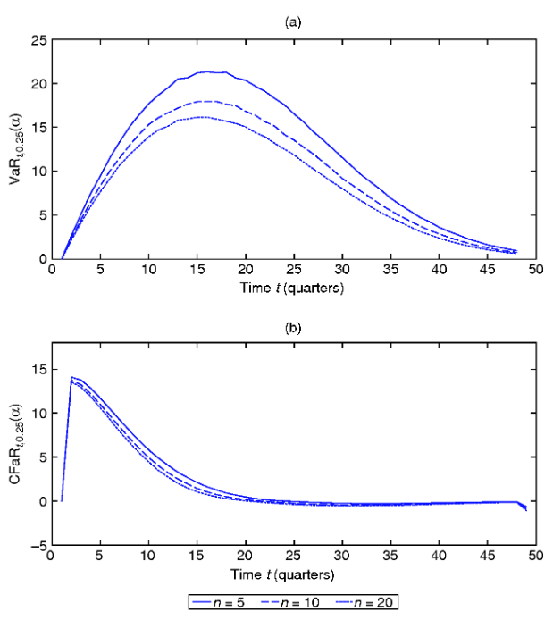
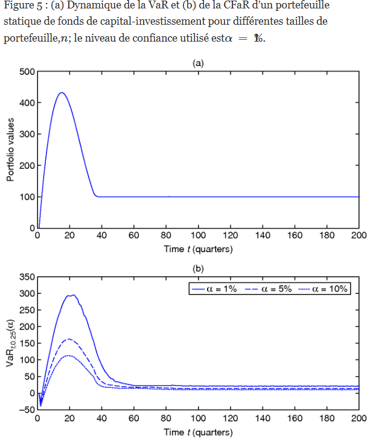

https://www.risk.net/journal-of-risk/5311701/risk-management-for-private-equity-funds

SSRN

Equilibrium Liquidity Premia of Private Equity Funds Axel Buchner∗

Les fonds de capital-investissement présentent au moins deux caractéristiques institutionnelles clés qui les distinguent des investissements traditionnels en actions ou obligations cotées et rendent la gestion des risques complexe. Premièrement, les investissements dans ces fonds sont illiquides et à long terme. Leur échéance est généralement de dix à quatorze ans, et les marchés secondaires pour leurs positions restent très inefficaces, ce qui rend la vente de leurs positions coûteuse pour les investisseurs. Deuxièmement, les investissements dans ces fonds impliquent une dynamique spécifique de retraits et de distributions de capitaux. L'investisseur effectue d'abord un engagement initial en capital, puis transfère des montants spécifiques à l'associé commandité en réponse aux appels de capitaux (ou retraits de capitaux)

Le moment et le montant des appels de capitaux ne sont connus qu'après leur annonce, et il existe généralement un décalage important entre le moment où les capitaux sont engagés dans un fonds et celui où ils sont effectivement utilisés pour l'investissement. De plus, les versements en espèces des fonds de capital-investissement sont également incertains, bien qu'importants, en raison de la durée de vie limitée des fonds. Ainsi, le capital investi évolue de manière dynamique tout au long de la durée de vie d’un fonds, et les investissements dans des fonds de capital-investissement nécessitent une gestion active des flux de trésorerie liés aux appels de capitaux et aux distributions.

Compte tenu de ces particularités, un cadre de gestion des risques pour les investissements des fonds de capital-investissement doit prendre en compte trois principales sources de risque.

Risque de marché : le risque de perte des cours de marché des sociétés du portefeuille détenues par un fonds expose les investisseurs au risque de marché. 
(ii) Risque de liquidité : l'illiquidité des participations des sociétés de capital-investissement expose les investisseurs au risque de liquidité des actifs associé à la vente de positions sur les marchés secondaires à des rabais potentiellement importants et ex ante incertains sur la valeur liquidative d'un fonds. 
(iii) Risque de financement (ou de trésorerie) : le calendrier et l'ampleur imprévisibles des flux de trésorerie des fonds présentent des risques de financement et de trésorerie pour les investisseurs. En particulier, les engagements en capital sont contractuellement contraignants, et le défaut de paiement de ces engagements peut entraîner la perte totale de la participation du partenariat de capital-investissement

Ce cadre de gestion des risques repose sur un modèle de la dynamique des fonds de capital-investissement, dont trois composantes principales correspondent aux phases essentielles de leur cycle de vie : les prélèvements sur le capital engagé versé au fonds ; la performance des investissements effectués par le fonds ; et les distributions de dividendes et de produits retirés du fonds. En effet, un processus log-normal standard, corrélé aux rendements boursiers globaux, est utilisé pour la dynamique de la valeur d'investissement.

Les prélèvements et les distributions de capital sont modélisés par deux processus stochastiques pour la dynamique des taux de prélèvements et de remboursements. Tenant compte du fait que la vitesse des prélèvements et des distributions de capital peut être affectée par la situation économique générale, le modèle intègre également la possibilité que les taux de prélèvements et de remboursements soient corrélés aux rendements boursiers globaux. Compte tenu de ce modèle stochastique, nous proposons dans cet article trois mesures de risque pour les investissements des fonds de capital-investissement.

Le risque de marché est appréhendé à l'aide d'une approche de valeur à risque (VaR), qui est devenue la mesure standard utilisée par les analystes financiers pour quantifier ce risque (voirJorion 2001).1Généralement, la VaR est définie comme la perte potentielle maximale d'un portefeuille d'instruments financiers, avec une probabilité donnée et sur un horizon donné. Autrement dit, il s'agit d'un chiffre indiquant le montant qu'une institution financière peut perdre avec une probabilité donnée et sur un horizon temporel donné. Les implémentations standard de la VaR supposent un contexte statique dans lequel la composition d'une position reste inchangée au fil du temps, c'est-à-dire qu'aucune entrée ni sortie de trésorerie ne se produit sur l'horizon de la VaR.

En revanche, l'approche VaR présentée ici est dynamique, car elle prend également en compte la variation de l'exposition au risque de l'investisseur tout au long du cycle de vie du fonds, avec des retraits et des distributions de capital progressifs.

La mesure de la VaR développée repose sur l'hypothèse implicite qu'un investisseur peut à tout moment vendre sa position dans le fonds à la valeur liquidative actuelle de celui-ci. En réalité, les participations dans les fonds de capital-investissement sont très illiquides et ne peuvent généralement être cédées qu'avec une certaine décote sur les marchés secondaires du capital-investissement. Afin de tenir compte de ce risque de liquidité, le calcul de la VaR est étendu à une VaR ajustée à la liquidité (LVaR). L'idée principale est d'inclure les décotes des marchés secondaires comme coût de liquidité exogène dans le calcul de la VaR. En tenant compte du caractère imprévisible de la dynamique des décotes sur le marché secondaire, les décotes sont ainsi modélisées à l'aide d'un processus d'Ornstein-Uhlenbeck à retour à la moyenne, également supposé corrélé aux rendements boursiers agrégés.

Enfin, pour appréhender le risque de financement (ou de trésorerie), l'article introduit une mesure de flux de trésorerie à risque (CFaR). Cette mesure est définie comme la variation (perte) de la trésorerie de l'investisseur, qui n'est dépassée qu'avec une probabilité donnée, sur un horizon temporel donné. Cette mesure est également dynamique et son interprétation varie selon les étapes du cycle de vie du fonds.

Après avoir calibré le modèle de manière à ce que les paramètres correspondent à un investissement dans un fonds de rachat classique, les mesures de risque développées sont illustrées par des simulations de Monte-Carlo. Les résultats soulignent l'existence de schémas spécifiques au capital-investissement en termes de dynamique de la VaR, qu'un cadre de gestion des risques judicieux pour les investisseurs doit prendre en compte. En particulier, la VaR augmente initialement fortement jusqu'à un horizon de temps fixe, puis culmine et diminue jusqu'à zéro tout au long de la vie du fonds

Ce comportement est cohérent avec le cycle de vie typique des fonds de capital-investissement. À mesure que le fonds réduit progressivement ses capitaux et constitue son portefeuille d'investissement, l'exposition au risque de l'investisseur augmente considérablement. Une fois le niveau maximal atteint, la VaR à horizon fixe décroît rapidement vers zéro, à mesure que les distributions de capital du fonds diminuent progressivement l'exposition au risque de l'investisseur.	

Une comparaison entre les mesures simulées de VaR et de LVaR met en évidence que les effets de l'illiquidité sur l'exposition au risque de l'investisseur tout au long de la vie d'un fonds peuvent être substantiels. Cependant, les résultats numériques montrent également que l'illiquidité n'augmente l'exposition au risque de l'investisseur que si l'horizon temporel considéré est plus court que la durée de vie restante totale du fonds, le risque de liquidité étant entièrement résolu lors de la liquidation finale du fonds. Les effets du risque de liquidité sont donc spécifiques à chaque investisseur. Pour les investisseurs confrontés au risque d'être contraints de vendre leurs positions de capital-investissement sur les marchés secondaires en raison d'un choc de liquidité inattendu pendant la durée de vie du fonds, ignorer le risque de liquidité peut conduire à une sous-estimation substantielle des chiffres du risque.

En revanche, pour les investisseurs disposant de réserves de trésorerie suffisantes et d'une faible probabilité de subir des chocs de liquidité inattendus, le risque de liquidité n'a qu'une importance mineure*

La dynamique de la mesure CFaR simulée illustre également l'évolution du risque de trésorerie avec le stade de développement du fonds. Au début de la vie d'un fonds, lorsque celui-ci commence à appeler des capitaux auprès des investisseurs, le CFaR est important et donne une mesure du risque de financement, c'est-à-dire le montant maximal de liquidités qu'un investisseur doit détenir en réserve pour pouvoir répondre aux appels de capitaux avec une probabilité donnée. Plus tard dans la vie du fonds, lorsqu'il commence à sortir progressivement de ses portefeuilles et à restituer les produits aux investisseurs, le CFaR diminue et donne une mesure du risque de distribution. Autrement dit, sa valeur négative donne une indication du montant minimal de liquidités distribuées par le fonds de capital-investissement sur un horizon temporel donné avec une probabilité donnée.

Enfin, notre modèle et notre analyse numérique sont étendus à un contexte de portefeuille. Nous considérons à la fois un portefeuille statique et un portefeuille dynamique de fonds de capital-investissement. Dans le cas d'un portefeuille statique, nous supposons que l'engagement en capital de chaque fonds est fixé lors de la constitution du portefeuille et reste inchangé par la suite. Les résultats numériques illustrent comment la diversification du portefeuille peut contribuer à réduire les mesures de VaR et de CFaR.

Comme prévu, la réduction du risque augmente avec le nombre de fonds en portefeuille. Dans le cas d'un portefeuille dynamique, nous développons une nouvelle stratégie d'engagement dynamique pour les investisseurs en fonds de capital-investissement qui visent un montant constant de capital investi dans ces fonds au fil du temps. Les résultats numériques montrent que cette stratégie dynamique conduit à une VaR à horizon fixe qui converge vers un niveau constant au fil du temps. Les résultats montrent également que la constitution d'un portefeuille de capital-investissement à partir de zéro peut nécessiter beaucoup de temps et implique généralement un certain surengagement initial.

Cet article s'appuie sur des études évaluant les caractéristiques de risque et de rendement, ou la dynamique des flux de trésorerie, des investissements en capital-investissement. Parmi les recherches importantes dans ce domaine, on peut citer celles de Cochrane (2005) , Kaplan et Schoar (2005) , Ljungqvist et al (2008) , Phalippou et Gottschalg (2009) , Korteweg et Sorensen (2010) , Robinson et Sensoy (2011) , Driessen et al (2012) , Ang et al (2013) , Ewens et al (2013) , Harris et al (2014) et Hochberg et al (2014) .

Cependant, aucune de ces études ne développe de modèle de risque intégré pour les investissements en capital-investissement. La seule publication scientifique dans le domaine de la gestion des risques est une étude de Bongaerts et Charlier (2009) qui appliquent les modèles de risque de crédit existants aux investissements individuels en capital-investissement.2Cependant, leur modèle est difficile à calibrer et ne prend pas en compte les risques de liquidité et de trésorerie liés aux investissements des fonds de capital-investissement.

À notre connaissance, aucune autre étude n'a développé un modèle de risque pour les investissements en capital-investissement qui tienne compte des risques de marché, de liquidité et de trésorerie à l'aide de mesures VaR standard. L'élaboration d'un modèle suffisamment exploitable pour quantifier précisément ces risques constitue la principale contribution de cet article.

Le reste de cet article est organisé comme suit. La section 2 présente le modèle de la dynamique des fonds de capital-investissement. La section 3 développe les trois mesures de risque. La section 4 montre comment ces mesures de risque peuvent être estimées à l'aide de simulations de Monte Carlo. La section 5 présente les résultats de l'étalonnage du modèle et de l'analyse numérique du modèle. La section 6 étend le modèle et l'analyse numérique au contexte d'un portefeuille. La section 7 conclut. Les détails de l'étalonnage du modèle sont décrits dans les annexes A et B en ligne

# 2 Le modèle

Cette section développe le modèle utilisé pour dériver les mesures de risque des fonds de capital-investissement. Ce modèle est formulé dans un cadre temporel continu. On suppose que toutes les variables aléatoires introduites ci-après sont définies sur un espace de probabilités.( Ω , F, P ) , et que toutes les variables aléatoires indexées part sont mesurables par rapport à la filtration{Ft} , représentant les informations généralement disponibles pour tous les investisseurs

2.1 Dynamique des fonds de capital-investissement 

Suivant la construction typique des fonds de capital-investissement, la modélisation de la dynamique des fonds de capital-investissement nécessite la modélisation des trois composantes principales : la valeur d’investissement, les prélèvements de capital et les remboursements de rendement.

2.1.1 Valeur d'investissement 

La première étape de la modélisation des fonds de capital-investissement consiste à caractériser la dynamique de valeur. Prenons l'exemple d'un fonds dont la durée de vie légale totale est donnée parTl . LaisserVt désignent la valeur du portefeuille d'investissement du fonds à un moment donnét ; prélèvements cumulés sur le capital des commanditaires (LP) jusqu'à présentt sont représentés parDt , et les distributions de capital cumulées aux LP jusqu'à présentt sont représentés parRt Pour simplifier les choses, on suppose que le rendement de tout flux de trésorerie investi dans le fonds peut être décrit par une distribution normale avec une moyenne constante, une volatilité constante et une corrélation constante avec les rendements globaux du marché boursier.

Hypothèse 2.1 .

La dynamique de la valeur du fonds,Vt , sous la mesure de probabilité objectiveP peut être décrit par le processus stochastique{Vt, 0 ≤ t ≤Tl} : dVt=Vt(μVdt +βVσMdBM, t+σεdBε , t) + dDt− dRt, (2.1) where μV> 0 est le taux de rendement moyen,σM> 0 est la volatilité du rendement du marché boursier global,βV is the market beta of the fund and σε> 0 is idiosyncratic volatility; BM,t est un mouvement brownien standard qui entraîne les rendements globaux du marché boursier3etBε,t is a second Brownian motion, representing idiosyncratic shocks, ie, dBM,tdBε , t=0 .

Cette spécification de la dynamique des valeurs est simple. Le premier terme du côté droit de l'équation,Vt(μVdt+βVσMdBM, t+σεdBε , t) , stipule que le changement instantané de valeur d'un fonds de capital-investissement est dû à la performance de l'investissement déjà en place à un moment donnét . On suppose que les investissements en place ont des rendements normalement distribués avec une moyenne constante donnée parμV et une variance totale donnée parσ2V=β2Vσ2M+σ2ε , oùβ2Vσ2M représente la variance systématique etσ2ε est la variance idiosyncrasique.

Cette spécification prend en compte l'importante possibilité que les rendements des investissements des fonds de capital-investissement et les rendements boursiers globaux soient (potentiellement) fortement corrélés avec un coefficient de corrélation donné parρV=βVσM/σV Les gestionnaires de fonds de capital-investissement perçoivent à la fois des frais de gestion annuels fixes, généralement de 1,5 à 2,5 % du capital engagé, et une commission de performance (carried interest), généralement égale à 20 % des plus-values. Ces frais sont implicitement intégrés dans ( 2.1 ) en définissantμV soit le rendement attendu du fonds après déduction de tous les frais. Par conséquent, le modèle suppose que les frais diminuent simplement le rendement attendu du fonds

Les deuxième et troisième termes du côté droit de ( 2.1 ) montrent que les valeurs des fonds sont augmentées par les baisses instantanées de capital,dDt , et diminué par les distributions instantanées de capital,dRt . En incluantdDt etdRt Dans l'article ( 2.1 ), nous prenons en compte le fait que les investissements des fonds de capital-investissement impliquent généralement des retraits progressifs de capital et génèrent d'importantes distributions intermédiaires de capital tout au long du cycle de vie du fonds. Il convient de noter que les distributions de capital (qu'elles soient sous forme de liquidités ou de titres négociables) sont directement versées aux investisseurs à mesure que le fonds se désinvestit. Par conséquent, les distributions de capital ne font que diminuer la valeur du fonds.Vt , et il n’est pas nécessaire d’imposer une quelconque hypothèse sur le réinvestissement des flux de trésorerie intermédiaires.

Une caractéristique supplémentaire importante du modèle est qu'il permet à un fonds de générer un rendement excédentaire ajusté au risque, appelé alpha. Formellement, ce rendement excédentaire après frais est défini comme suit : 
αV=μV−rf−βV(μM−rf) , (2.2) 

oùμM> 0 est le taux de rendement moyen du marché boursier global etrf est le taux sans risque constant. Intuitivement, cet alpha correspond au rendement excédentaire ajusté du risque (après frais) des sociétés du portefeuille détenues et gérées par le fonds de capital-investissement. Ce rendement excédentaire peut résulter d'une meilleure gouvernance ou de la compétence de gestion du commandité (voir, par exemple, Sorensen et al.) . 2014).

2.1.2 Tirages de capitaux 

Pour modéliser les retraits de capital, on suppose que le fonds dispose d'un capital initial engagé donné parC0 et une période d'engagement totale (c'est-à-dire la période pendant laquelle les retraits de capital peuvent se produire) donnée parTc (avecTc≤Tl ). Nous supposons qu'au momentt le capital est prélevé sur le capital engagé restant non utilisé, c'est-à-direC0−Dt , à un certain taux stochastiqueδt . 

Hypothèse 2.2 .La dynamique des prélèvements cumulés de capitaux,Dt , peut être décrit par l'équation différentielle ordinaire 

dDt=δt(C0−Dt)1{ 0 ≤ t ≤Tc}dt , (2.3)

où1{ ⋅ } est une fonction indicatrice. Le taux de tirage du fondsδt est supposé suivre un processus stochastique{δt, 0 ≤ t ≤Tc} défini par δt= δ+σδBδ, t, (2.4) oùδ> 0 est la moyenne du taux de tirage etσδ> 0 reflète la volatilité du taux de tirage ;Bδ, t est un troisième mouvement brownien standard, pour lequel on suppose quedBδ, tdBM, t=ρδdt etdBδ, tdBε , t= 0 Afin d'éviter des taux de tirage négatifs,δ+t= max(δt, 0 ) est utilisé dans l'implémentation du modèle.

Dans la plupart des cas, les retraits de capitaux des fonds de capital-investissement se concentrent sur les premières années (voire les premiers trimestres) de leur existence. Après une activité d'investissement initiale intense, les retraits sont effectués à un rythme décroissant, car les nouveaux investissements sont moins nombreux et les investissements complémentaires s'étalent sur plusieurs années. Ce schéma temporel typique se reflète bien dans la structure de ( 2.3 ), qui implique que les retraits de capitaux initialement importants au démarrage d'un fonds diminuent de manière exponentielle sur la période d'engagement.Tc . Dans ce cadre de modélisation, les prélèvements cumulés,Dt , ne peut également jamais dépasser le capital total engagé,C . En même temps, le modèle autorise une certaine fraction deC à ne pas tirer, car la période d'engagementTc Il sert de seuil de retrait des capitaux. Enfin, le modèle intègre également la possibilité importante que la vitesse de retrait ait une corrélation non nulle.ρδ avec les rendements globaux du marché boursier.

2.1.3 Distributions de capital 

La dernière étape de la modélisation des fonds de capital-investissement consiste à caractériser la dynamique des distributions de capital. Sachant que le montant et le calendrier des remboursements dépendent de la performance du portefeuille d'investissement du fonds, on suppose que les distributions de capital au momentt se produisent à un rythme stochastiqueνt de la valeur totale du portefeuille d'investissementVt du fonds. Hypothèse 2.3 .La dynamique des distributions de capital cumulées,Rt , peut être décrit par

Pour $t < T_{\mathrm{l}}$ :
$$
\mathrm{d}R_t = \nu_t V_t\, \mathrm{d}t
$$

et pour $t \leq T_{\mathrm{l}}$ :
$$
R_t = \int_0^t \nu_u V_u\, \mathrm{d}u + V_t \cdot 1_{\{t = T_{\mathrm{l}}\}}
$$

Le taux de distribution du fonds $\nu_t$ est supposé suivre un processus stochastique $\{\nu_t,\ 0 \leq t \leq T_{\mathrm{l}}\}$ avec la spécification suivante :

$$
\nu_t = \bar{\nu} t + \sigma_\nu B^{\nu}_t \tag{2.6}
$$

où $\bar{\nu}, \sigma_\nu > 0$ sont des constantes. $B^{\nu}_t$ est un quatrième mouvement brownien standard, pour lequel on suppose que :

- $\mathrm{d}B^{\nu}_t \, \mathrm{d}B^{M}_t = \rho_\nu \, \mathrm{d}t$
- $\mathrm{d}B^{\nu}_t \, \mathrm{d}B^{\varepsilon}_t = 0$

Afin d'éviter des taux de distribution négatifs, on utilise la transformation suivante dans l'implémentation du modèle :

$$
\nu^+_t = \max(\nu_t,\ 0)
$$

L'équation différentielle ordinaire pourt <Tl dans ( 2.5 ) illustre que les remboursements de capital se produisent à un certain rythmeνt de la valeur d'investissement. Cela revient essentiellement à supposer un processus de dividendes pour les fonds de capital-investissement tout au long de leur vie, similaire à la spécification utilisée par Takahashi et Alexander (2002) et Malherbe (2004) . De plus, l'hypothèse selon laquelle la dynamique du taux de distribution peut être décrite par le processus de Lévy donné dans ( 2.6 ) est plausible, car cette spécification reflète bien le cycle de vie typique des investissements des fonds de capital-investissement, où les distributions de capital (moyennes) sont faibles au départ et augmentent sur la durée de vie limitée du fonds à mesure que de plus en plus d'investissements sont progressivement retirés.

Ce comportement peut facilement être déduit de l'espérance inconditionnelle de ( 2.6 ).E[νt] = νt , qui augmente linéairement au fil du temps. De plus, en autorisant une corrélation non nulle,|ρν| ≤ 1 , entre les variations du taux de distribution et les rendements boursiers globaux, nous intégrons l'importante possibilité que la situation générale de l'économie (ou du marché boursier) influence la rapidité des distributions de capital. Par exemple, si1 ≥ρν> 0 , alors des distributions rapides de capital deviendront plus probables pendant les périodes d'expansion boursière. Enfin, la spécification intégrale pourRt dans ( 2.5 ) prend en compte qu'un fonds de capital-investissement est entièrement liquidé àTl , la fin de sa durée de vie légale. Par conséquent, les distributions de capital cumulées sur toute la durée de vie d'un fonds doivent également inclure le produit final de la liquidation des actifs du fonds à l'échéance,Tl .

2.2 Position de l'investisseur

Pour définir la dynamique de la position d'un investisseur lorsqu'il investit dans un fonds de capital-investissement, supposons que les engagements de capital non tirés,C0−Dt , rester investi à un taux constant (sans risque)rc jusqu'à ce qu'ils soient effectivement prélevés par la direction du fonds, et que les distributions de capital intermédiaires soient réinvesties au tauxrc pour la durée de vie restante du fonds. Comme ci-dessus, soitVt être la valeur liquidative d'un investissement dans un fonds de capital-investissement à un moment donnét pour un engagement initial donnéC0 . De plus, on désigne parCt la position de trésorerie de l'investisseur à un moment donnét . Ensuite, la valeur de la position de l'investisseur au momentt est donné parPt≡Vt+Ct , ce qui reflète le fait que la position de l'investisseur est constituée de la valeur liquidative du fonds de capital-investissement et de ses liquidités. La dynamique deVt etCt sont donnés par

$$
= V_t \left( \mu_V\, \mathrm{d}t + \beta_V \sigma_M\, \mathrm{d}B_{M,t} + \sigma_{\varepsilon}\, \mathrm{d}B_{\varepsilon,t} \right) + \mathrm{d}D_t - \mathrm{d}R_t,
$$

avecV0= 0 etC0> 0 . Les équations ( 2.7 ) et ( 2.8 ) montrent que les prélèvements de capitaux (dDt ) diminuer la valeurCt , car l'investisseur doit réduire ses liquidités pour répondre aux appels de capitaux, alors que ceux-ci augmentent la valeur nette d'inventaireVt du fonds. En revanche, les distributions de capital (dRt ) d'un fonds de capital-investissement diminuent la valeur liquidativeVt et augmenter la valeur deCt , car ils sont censés être réengagés dans des fonds de capital-investissement. De ( 2.7 ) et ( 2.8 ), il résulte que la dynamique de valeur de la position de l'investisseur est donnée par

$$
\mathrm{d}P_t = \mathrm{d}V_t + \mathrm{d}C_t = V_t \left( \mu_V\, \mathrm{d}t + \beta_V \sigma_M\, \mathrm{d}B_{M,t} + \sigma_{\varepsilon}\, \mathrm{d}B_{\varepsilon,t} \right) + C_t r_{\mathrm{c}}\, \mathrm{d}t.
$$

Notez que ( 2.9 ) implique que la distribution des rendements est non stationnaire et ne peut être décrite par une distribution normale. Par conséquent, les techniques standard de calcul de la VaR, fondées sur l'hypothèse de rendements normalement distribués et stationnaires, ne peuvent être appliquées au modèle.

3 Mesures de risque 

Compte tenu des spécificités des investissements des fonds de capital-investissement, un cadre de gestion des risques doit prendre en compte plusieurs sources de risque. Cette section passe en revue les principales et élabore des mesures adéquates pour les appréhender. 

3.1 Sources de risque 

Les investisseurs de fonds de capital-investissement sont exposés à trois principales sources de risque.

Risque de marché : le risque de perte des cours de marché des sociétés du portefeuille détenues par un fonds expose les investisseurs au risque de marché.
(2) Risque de liquidité : l'illiquidité des participations des sociétés de capital-investissement expose les investisseurs au risque de liquidité des actifs associé à la vente sur les marchés secondaires avec une décote par rapport à la valeur liquidative du fonds.
(3) Risque de financement (ou de trésorerie) : l'imprévisibilité des flux de trésorerie présente des risques de financement et de trésorerie pour les investisseurs. En particulier, les engagements en capital sont contractuellement contraignants, et le défaut de paiement peut entraîner la perte totale de la participation du partenariat de capital-investissement.

En tenant compte de ces principales sources de risque, cette section développe trois mesures de risque pour les investissements des fonds de capital-investissement : la VaR, la CFaR et la LVaR.

3.2 Valeur à risque

La mesure la plus couramment utilisée pour mesurer l'exposition au risque de marché est la VaR. Elle a été développée et adoptée en réponse à des catastrophes financières, comme celles de la Barings Bank, d'Orange County et de la Metallgesellschaft. Après son développement par JP Morgan au début des années 1990, le concept a finalement été accepté par la communauté financière lorsque le Comité de Bâle sur le contrôle bancaire a autorisé les institutions financières à quantifier leurs risques de marché à l'aide de modèles internes de VaR. Un traitement standard de la VaR est disponible dans Jorion (2001) . Aujourd'hui, la norme du secteur financier est la définition suivante de la VaR (voir Jorion2001): « [c'est] la perte d'une position financière ou d'un portefeuille, qui est dépassée avec une certaine probabilité donnéeα , sur un horizon temporel donné. »

En supposant un horizon temporel,h , cette définition se traduit par la VaR de la position de l'investisseur dans le cadre du modèle développé comme
$$
\Pr(P_t - P_{t+h} \leq \mathrm{VaR}_{t,h}(\alpha)) = 1 - \alpha, \quad \alpha \in [0,1],
$$

oùPt Il s'agit de la valeur de la position de l'investisseur, dont la dynamique est donnée par ( 2.9 ). Intuitivement, cette VaR peut être interprétée comme la perte la plus importante subie par l'investisseur du fonds de capital-investissement sur une période donnée.h , dans des « conditions normales de marché ». Notez que l'indice de tempst dansVaRème​​( α ) Cela tient compte du fait que les retraits progressifs et les distributions intermédiaires de capital conduisent à une situation où la VaR du modèle n'est pas invariante dans le temps. Étant donné que les fractions de la position de l'investisseur investie dans le fonds de capital-investissement et dans l'actif sans risque évoluent de manière stochastique,VaRème​​( α ) La valeur à risque évolue également tout au long de la durée de vie du fonds. En revanche, les calculs de VaR standard reposent généralement sur un contexte statique où les pondérations relatives de toutes les positions ne changent pas au fil du temps.

3.3 Valeur à risque ajustée en fonction de la liquidité 

La mesure VaR définie dans ( 3.1 ) est basée sur l'hypothèse implicite qu'un investisseur peut vendre sa position dans le fonds à la valeur liquidative actuelle du fondsVt à tout momentt ∈ [ 0 ,Tl] En réalité, les participations dans les fonds de capital-investissement sont très illiquides, car il n'existe pas de marché organisé et liquide où les fonds peuvent être négociés à faible coût. Les investisseurs exposés au capital-investissement et ayant besoin de liquidités immédiates doivent vendre leurs participations dans un fonds de capital-investissement sur les marchés secondaires du capital-investissement. Cependant, ces marchés secondaires sont encore relativement immatures et leur tarification est très inefficace. Par conséquent, la vente de positions dans les fonds n'est généralement possible qu'avec une décote par rapport à la valeur liquidative actuelle ; voir Kleymenova et al .2012) , qui montrent que l'éventail des décotes peut être large et dépend du type d'actif et de l'environnement de marché

Ainsi, les investisseurs peuvent être exposés à un risque de liquidité important lorsqu'ils doivent vendre un fonds de capital-investissement avant sa liquidation. Ignorer ce risque de liquidité peut sous-estimer considérablement l'exposition réelle de l'investisseur au risque.

Afin de tenir compte de cet effet, le calcul de la VaR présenté ci-dessus peut être étendu à une LVaR. L'idée principale de cette LVaR est d'inclure les décotes du marché secondaire comme risque de liquidité exogène dans le calcul de la VaR. Ceci est réalisé en tenant compte du fait que la valeur liquidative d'un fonds de capital-investissement n'est généralement pas égale à sa valeur liquidative actuelle, mais doit être ajustée des décotes du marché secondaire. En d'autres termes, alors que la mesure standard de la VaR présentée ci-dessus prend en compte la pire valeur liquidative d'un fonds pour un certain niveau de confiance,α , la LVaR considère le pire prix de transaction qui pourrait être obtenu pour un fonds sur les marchés secondaires du capital-investissement pour un certain niveau de confianceα . Cette idée se traduit par la définition formelle suivante deLVaR( α ) :

$$
\Pr\left(P_t - \left[(1 - \pi_{t+h})V_{t+h} + C_{t+h}\right] \leq L \, \mathrm{VaR}_{t,h}(\alpha)\right) = 1 - \alpha, \quad \alpha \in [0,1],
$$

oùπt + h est la décote du marché secondaire pour le fonds à un moment donnét + h . Parce que la position de trésorerie de l'investisseurCt + h n'est pas affecté par les remises du marché secondaire, le terme[ ( 1 −πt + h)Vt + h+Ct + h] est égal à la valeur de la position totale de l'investisseur après liquidation du fonds sur les marchés secondaires.

La LVaR définie dans ( 3.2 ) nécessite une hypothèse sur la dynamique des décotes du marché secondaire. Afin d'intégrer la propriété de retour à la moyenne et le fait que les décotes peuvent également devenir négatives en période d'expansion, un processus d'Ornstein-Uhlenbeck est utilisé pour le taux d'actualisation du marché secondaire.πt .

Hypothèse 3.1 .Le taux d'escompte du marché secondaireπt est supposé suivre un processus stochastique{πt, 0 ≤ t ≤Tl} , défini par

$$
\mathrm{d}\pi_t = \kappa_{\pi}(\theta_{\pi} - \pi_t)\,\mathrm{d}t + \sigma_{\pi}\,\mathrm{d}B_{\pi,t},
$$

oùθπ> 0 est la moyenne à long terme du taux d'actualisation,κπ> 0 est le taux de retour à cette moyenne etσπ> 0 reflète la volatilité du taux d’actualisation ;Bπ, t est un cinquième mouvement brownien standard pour lequel on suppose quedBπ, tdBM, t=ρπdt etdBπ, tdBε , t= 0 . Ce processus présente une propriété de retour à la moyenne, c'est-à-dire que le taux d'actualisation fluctue de manière aléatoire autour du niveau moyen (à long terme).θπ . De plus, la spécification autorise également une corrélation non nulleρπ entre les variations des décotes sur les marchés secondaires et les rendements boursiers globaux. Ceci est fait ici pour tenir compte du fait que la situation générale de l'économie (ou du marché boursier) peut également affecter les décotes sur les marchés secondaires.

Notez que nous devons également imposer ici la restriction suivante :( 1 −πt + h) ≥ 0 pour éviter les valeurs de liquidation négatives sur le marché secondaire. Ceci est réalisé en utilisantπ+t + h= min(πt + h, 1 ) dans la mise en œuvre du modèle.

3.4 Flux de trésorerie à risque

Étant donné que les investisseurs en fonds de capital-investissement sont généralement également préoccupés par le volume et le calendrier des flux de trésorerie du fonds (c'est-à-dire les retraits et les distributions de capital), une troisième mesure de risque adéquate pouvant être définie pour les investissements en fonds de capital-investissement est le CFaR. Cette mesureCFaR( α ) est défini comme le changement (la perte) de la position de trésorerie de l'investisseur, qui est dépassé avec une certaine probabilité donnéeα , sur un horizon temporel donné. Formellement, en supposant un horizon temporel égal àh , cette définition de CFaR se traduit par

$$
\Pr\left(C_t - C_{t+h} \leq \mathrm{CFaR}_{t,h}(\alpha)\right) = 1 - \alpha, \quad \alpha \in [0,1],
$$

oùCt est la position de trésorerie de l'investisseur avec une dynamique donnée par ( 2.8 ). L'interprétation de cette mesure varie selon le stade de développement du fonds. Au début de sa vie, lorsqu'il commence à prélever progressivement des capitaux auprès des investisseurs et à constituer le portefeuille d'investissement,CFaRème​​( α ) est positif et donne le montant maximum de liquidités que l'investisseur doit conserver en réserve sur l'horizon temporel,h , afin de pouvoir répondre aux appels de fonds de la direction du fonds. Plus tard dans la vie d'un fonds, lorsque celui-ci commence à se désinvestir progressivement et à distribuer les produits aux investisseurs,CFaRème​​( α ) deviendra éventuellement négatif et sa valeur absolue donne une indication du montant minimum de liquidités distribuées par le fonds de capital-investissement sur l'horizon temporel h

Notez que la VaR définie dans ( 3.1 ) et la CFaR définie dans ( 3.4 ) sont égales lorsqu'elles sont calculées sur la durée de vie totaleTl du fonds, c'est-à-dire,

$$
\mathrm{VaR}_{0,T_{\mathrm{l}}}(\alpha) = \mathrm{CFaR}_{0,T_{\mathrm{l}}}(\alpha).
$$

Cette relation découle du changement de valeur de la position de l'investisseur sur la durée de vie totale du fonds,P0−PTl , équivaut à la variation de leur position de trésorerie,C0−CTl , car les fonds sont entièrement liquidés à la fin de leur durée de vieTl , et par conséquentV0−VTl= 0 est valable par définition.

4 simulations de Monte Carlo 

Le modèle développé dans les sections précédentes est dépendant du chemin : à la fois la valeur nette d'inventaireVt d'un fonds et de la trésorerie de l'investisseurCt à tout momentt dépendent de l'historique complet des retraits et des distributions de capitaux passés. Ces dépendances de trajectoire peuvent être facilement prises en compte en utilisant des simulations de Monte-Carlo pour calculer les mesures de risque développées d'un investissement dans un fonds de capital-investissement. Cette section développe une version à temps discret du modèle et montre comment les mesures de risque peuvent être estimées à l'aide de simulations de Monte-Carlo.

4.1 Version à temps discret du modèle 

Afin de mettre en œuvre la simulation de Monte Carlo, l'intervalle de temps[ 0 ,Tl] est divisé enK intervalles discrets, chacun de longueurΔt . Ensuite, toutes les quantités pertinentes sont considérées à des moments équidistants,tk= kΔt , oùk = 1 , … , K etK=Tl/ Δt . Un schéma approprié pour discrétiser la dynamique de valeur d’un fonds de capital-investissement est le schéma d’Euler.5L'application de ce schéma à l'EDS ( 2.1 ) donne
$$
V_{k+1} = V_k \left[ 1 + \mu_V \Delta t + \beta_M \sigma_M \varepsilon_{M,k+1} \sqrt{\Delta t} + \sigma_{\varepsilon} \varepsilon_{\varepsilon,k+1} \sqrt{\Delta t} \right] - \Delta R_{k+1} + \Delta D_{k+1},
$$

ùεM, 1,εM, 2, … ,εM,K etεε , 1,εε , 2, … ,εε , K sont des séquences indépendantes et identiquement distribuées (iid) de variables normales standard non corrélées. La dynamique des retraits de capitaux, ( 2.3 ), peut être représentée en temps discret comme6

$$
\Delta D_{k+1} = \delta_{k+1}^{+} (C_0 - D_k) \Delta t,
$$

avec la dynamique du taux de tirage donnée par

$$
\delta_{k+1}^{+} = \max\left(\delta + \sigma_{\delta} \varepsilon_{\delta,k+1} \sqrt{(k+1) \Delta t},\, 0\right),
$$

oùεδ, 1,εδ, 2, … ,εδ, K est une troisième séquence iid de variables normales standard. De même, une version appropriée à temps discret de la dynamique des distributions de capital, spécification ( 2.5 ), est

$$
\Delta R_{k+1} = \nu_{k+1}^{+} V_{k} \Delta t \quad \text{if } k+1 < K \quad \text{and} \quad \Delta R_{K} = V_{K},
$$

avec une dynamique de taux de distribution donnée par

$$
\nu_{k+1}^{+} = \max \left( \nu (k+1) \Delta t + \sigma_{\nu} \varepsilon_{\nu, k+1} \sqrt{(k+1) \Delta t},\, 0 \right),
$$

oùεν, 1,εν, 2, … ,εν, K est une quatrième séquence iid de variables normales standard. La corrélation constanteρδ du taux de drawdown avec les rendements du marché et la corrélation constanteρν du taux de distribution avec les rendements du marché peut être obtenu en fixant
$$
\varepsilon_{\delta,k} = \rho_{\delta} \varepsilon_{M,k} + \sqrt{1 - \rho_{\delta}^2} \, \varepsilon_{1,k} \quad \text{and} \quad
\varepsilon_{\nu,k} = \rho_{\nu} \varepsilon_{M,k} + \sqrt{1 - \rho_{\nu}^2} \, \varepsilon_{2,k},
$$

oùε1 , k etε2 , k sont des variables normales standard qui ne sont pas corrélées entre elles (et avec toutes les autres variables aléatoires introduites ici). En utilisant le schéma d'Euler pour approximer le processus de taux d'actualisation, ( 3.3 ), la dynamique en temps discret est donnée par

$$
\pi_{k+1} = \pi_k + \kappa_{\pi} (\theta_{\pi} - \pi_k) \Delta t + \sigma_{\pi} \varepsilon_{\pi, k+1} \sqrt{\Delta t},
$$

oùεν, 1,εν, 2, … ,εν, K est une autre séquence iid de variables normales standard, qui a une corrélation constanteρπ avec la séquenceεM, 1,εM, 2, … ,εM, K , c'est-à-dire,εν, k=ρνεM, k+1 −ρ2ν−−−−−√ε3 , k , oùε3 , k est une variable normale standard qui n'est pas corrélée à toutes les autres variables aléatoires introduites ci-dessus. Notez queπ+k + 1= min(πk + 1, 1 ) est utilisé dans la mise en œuvre du modèle pour éviter les valeurs de liquidation négatives du marché secondaire

En utilisant ces spécifications, la dynamique en temps discret de la position de l'investisseur et de ses avoirs en liquidités peut être représentée comme suit

$$
P_{k+1} = P_{k} + V_{k} \big(\mu_{V} \Delta t + \beta_{M} \sigma_{M} \varepsilon_{M,k+1} \sqrt{\Delta t} + \sigma_{\varepsilon} \varepsilon_{\varepsilon,k+1} \sqrt{\Delta t} \big) + C_{k} r_{\mathrm{f}} \Delta t,
$$

4.2 Estimation des mesures de risque par simulation 

Pour évaluer numériquement les mesures de risque développées dans la section 3 , considérons une expérience d'échantillonnage de Monte Carlo composée deM Réplications indépendantes des approximations à temps discret du modèle ci-dessus. Pour obtenir une estimation de la VaR standard définie dans ( 3.1 ), notonsLk , je lek l'observation de la perte de l'investisseur sur l'horizon temporel,h , dans leje ème réplication :

$$
L_{k,i} = P_{k,i} - P_{k+h,i}.
$$

LaisserF^L , k( x ) désignent la distribution approximative des pertesL basé sur leM réplications simulées :

$$
\hat{F}_{L,k}(x) = \frac{1}{M} \sum_{i=1}^M 1_{\{L_{k,i} \leq x\}}.
$$

En utilisant la distribution approximativeF^L , k( x ) , une estimation simple de la VaR au niveau de confianceα est donné par le quantile empirique, c'est-à-dire

$$
\widehat{\mathrm{VaR}}_{k,h}(\alpha) = \hat{F}_{L,k}^{-1}(1-\alpha),
$$

avec l'inverse de la fonction constante par morceauxF^L , k défini parF^− 1L , k( u ) = inf{ x :F^L , k( x ) ≥u} . Dans des conditions minimales (voir, par exemple, Serfling1980), l'estimationVaRˆk , h( α ) converge vers le vrai modèleVaRk , h( α ) avec une probabilité de 1 commeM→ ∞ .

De même, les mesures LVaR et CFaR définies dans ( 3.2 ) et ( 3.4 ) peuvent être estimées par

$$
\widehat{\mathrm{LVaR}}_{k,h}(\alpha) = \hat{F}_{L^{\mathrm{ad}},k}^{-1}(1-\alpha),
$$
$$
\widehat{\mathrm{CFaR}}_{k,h}(\alpha) = \hat{F}_{L^{\mathrm{c}},k}^{-1}(1-\alpha),
$$

ùF^Lannonce, k( x ) désigne la distribution approximative des pertes ajustées de liquiditéLannonce dans la position de l'investisseur, avecLannoncek , je=Pk , je− [ ( 1 −πk + h , i)Vk + h , i+Ck + h , i] , etF^Lc, k( x ) désigne la distribution approximative des pertesLc dans la position de trésorerie de l'investisseur, avecLck , je=Ck , je−Ck + h , i .

| Parameter                                      | Notation | Value |
|-----------------------------------------------|----------|-------|
| Risk-free rate                                | $r_f$    | 0.05  |
| Expected return of stock market               | $\mu_M$  | 0.11  |
| Total volatility of stock market returns      | $\sigma_M$ | 0.15  |
| Total volatility of PE fund returns            | $\sigma_V$ | 0.40  |
| Market beta of PE funds                        | $\beta_V$ | 1.30  |
| Alpha of PE funds                              | $\alpha$  | 0.04  |
| Idiosyncratic volatility of PE fund returns   | $\sigma_\varepsilon$ | 0.35  |
| Return correlation between stock market and PE fund returns | $\rho_V$ | 0.49  |
| Drawdown rate of PE funds                      | $\delta$  | 0.41  |
| Volatility of the drawdown rate                | $\sigma_\delta$ | 0.21  |
| Correlation of the drawdown rate with stock market returns | $\rho_\delta$ | 0.50  |
| Average distribution rate                      | $\nu$     | 0.08  |
| Volatility of the distribution rate            | $\sigma_\nu$ | 0.11  |
| Correlation of the distribution rate with stock market returns | $\rho_\nu$ | 0.80  |
| Long-run mean of secondary market discounts   | $\theta_\pi$ | 0.16  |
| Mean-reversion speed of secondary market discounts | $\kappa_\pi$ | 0.42  |
| Volatility of secondary market discounts       | $\sigma_\pi$ | 0.16  |
| Initial secondary market discount               | $\pi_0$   | 0.28  |
| Correlation between stock market returns and changes in secondary market discounts | $\rho_c$ | -0.60 |
| Life of PE fund investment (in years)          | $T_l$     | 12    |

5 Analyse numérique 

Cette section illustre le modèle développé et les mesures de risque à travers un exemple numérique et discute de ses implications. L'analyse du modèle illustre l'évolution des mesures de risque tout au long du cycle de vie d'un fonds et effectue une analyse de sensibilité mettant en évidence les effets des chocs sur les principaux paramètres du modèle. 

5.1 Paramètres du modèle calibré 

L'analyse commence par la question de savoir quelles sont les valeurs raisonnables des paramètres du modèle. Les paramètres de base sont choisis ci-dessous de manière à correspondre à un investissement dans un fonds de rachat moyen. Les détails de l'étalonnage du modèle sont présentés dans les annexes A et B en ligne. Le tableau 1 présente un résumé des valeurs de base des paramètres utilisées pour l'analyse numérique ultérieure.

La figure 1 illustre la dynamique des prélèvements et des distributions de capital cumulés, des flux de trésorerie nets et de la valeur du fonds. Il est important de noter que les schémas de base des graphiques du modèle présentés dans la figure sont conformes aux attentes raisonnables concernant le comportement des fonds de capital-investissement. En particulier, les flux de trésorerie générés par le modèle présentent naturellement un décalage entre les prélèvements et les distributions, reproduisant le cycle de développement typique d'un fonds et conduisant à la courbe en J caractéristique du capital-investissement pour les flux de trésorerie nets cumulés du fonds, observée dans la figure 1 (c). De plus, il convient de noter que la dynamique de la valeur du fonds, illustrée dans la figure 1 (d), est également conforme aux attentes.

Plus précisément, la valeur du fonds augmente au fil du temps, à mesure que le portefeuille d'investissement se constitue, et diminue vers la fin, à mesure que le nombre d'investissements restant à récolter diminue. Le modèle reflète également la nature erratique des flux de trésorerie et de la dynamique de la valeur des fonds de capital-investissement réels, illustrée dans la figure 1 par les intervalles de confiance à 80 % (lignes pointillées). De plus, il est important de souligner que le modèle est suffisamment flexible pour générer des schémas potentiellement très variés de prélèvements et de distributions de capitaux. En modifiant les principaux paramètres du modèle, il est possible de contrôler le calendrier et l'ampleur des flux de trésorerie du fonds.

5.3 Dynamique de la valeur à risque

Les parties (a) et (b) de la figure 2 illustrent la dynamique de la VaR simulée. La partie (a) montre comment la VaR à l'initiation du fonds (c'est-à-dire àt = 0 ),VaR0 , h( α ) , change avec l'horizon temporel,h . Cela révèle des tendances intéressantes. Pour un niveau de confiance donné (10 %, 5 % et 1 %), comme horizon temporel,h , augmente,VaR0 , h( α ) La valeur de l'actif progresse fortement au départ, puis culmine et s'oriente légèrement vers le bas. Cette forte hausse initiale est conforme aux attentes.

À mesure que le fonds réduit progressivement son capital et reconstitue son portefeuille d'investissement, l'exposition au risque de l'investisseur, et donc sa perte maximale potentielle à un certain niveau de confiance, augmente sensiblement. La légère baisse de la VaR pour les horizons longsh est due aux effets cumulatifs sur les rendements des fonds, qui réduisent la probabilité de pertes importantes à long terme. La réduction de la VaR est toutefois faible, car les distributions de capital intermédiaires limitent les effets cumulatifs sur les rendements des fonds

Le comportement de la VaR dépend également du niveau de confiance choisi : pour des niveaux de confiance élevés,VaR0 , h( α ) atteint un pic plus rapidement puis chute plus prononcée ; pour les niveaux de confiance faibles,VaR0 , h( α ) atteint un pic plus lentement, puis se maintient près de son niveau maximal. Notez que la valeur maximale deVaR0 , h( α ) est bien inférieure à l'engagement initial de l'investisseur, fixé à 100, pour tous les niveaux de confiance considérés. Ainsi, la perte maximale possible d'un investissement dans un fonds de capital-investissement est généralement bien inférieure à l'engagement total de l'investisseur.

La figure 2 (b) illustre plus en détail la dynamique de la VaR sur la durée de vie du fonds pour un horizon temporel fixe de trois mois, c'est-à-direh = 0,25 . Comme prévu, la VaR à horizon fixe de l'investissement du fonds,VaRt , 0,25( α ) , augmente à mesure que le fonds puise dans ses capitaux et culmine autour de sa valeur moyenne maximale (voir également la figure 1 ). Une fois ce niveau maximal atteint,VaRt , 0,25( α ) décroît rapidement vers zéro à mesure que les distributions de capital du fonds diminuent progressivement l'exposition au risque de l'investisseur. Cette tendance générale s'observe pour tous les niveaux de confiance considérés. Cependant, les résultats montrent également queVaRt , 0,25( α ) atteint un pic plus rapidement pour les niveaux inférieurs de α .

Globalement, la dynamique illustrée dans les parties (a) et (b) de la figure 2 souligne l'existence de schémas spécifiques de la VaR en matière de capital-investissement, qu'un cadre de gestion des risques judicieux doit prendre en compte. Ces schémas résultent directement de la complexité des structures de flux de trésorerie des investissements des fonds de capital-investissement, qui conduisent à une situation où la composition du capital investi et des liquidités évolue de manière dynamique tout au long de la vie du fonds. En revanche, les implémentations standard de la VaR supposent généralement un contexte statique, où la composition d'une position reste inchangée sur l'horizon temporel de la VaR. Pour mettre en évidence ces différences, le tableau 2 compare la VaR à l'initiation du fonds pour un investissement dans un fonds de capital-investissement et un investissement dans un fonds commun de placement pour différentes raisons.h Afin de rendre les deux investissements de fonds comparables, on suppose que la taille de l'investissement dans les fonds communs de placement est égale à l'engagement en capital dans le fonds de capital-investissement,C0= 100 , et que les fonds communs de placement et les fonds de capital-investissement ont le même alpha, le même bêta et la même volatilité idiosyncratique.7Les paramètres du modèle utilisés pour le fonds de capital-investissement sont à nouveau ceux indiqués dans le tableau 1. Les résultats du tableau 2 montrent plusieurs différences importantes. Premièrement, comme un fonds de capital-investissement n'est jamais entièrement investi, en raison des distributions de capital intermédiaires, la VaR d'un investissement dans un fonds commun de placement est plus élevée que celle d'un investissement dans un fonds de capital-investissement pour tous les horizons temporels considérés. Ainsi, lorsqu'ils sont appliqués aux investissements dans des fonds de capital-investissement, les calculs de VaR standard peuvent conduire à des conclusions biaisées sur l'exposition réelle au risque de l'investisseur. Deuxièmement, la VaR d'un investissement en capital-investissement est très faible pour les horizons temporels courts car les fonds de capital-investissement impliquent des prélèvements de capital progressifs, et la diminution de la VaR est plus prononcée pour les horizons temporels longs en raison des distributions de capital intermédiaires.

5.4 Dynamique de la valeur à risque ajustée en fonction de la liquidité 

Les parties (c) et (d) de la figure 2 comparent la VaR standard à la LVaR obtenue en corrigeant les valeurs des fonds pour tenir compte des éventuelles décotes du marché secondaire. Le niveau de confiance utilisé pour cette comparaison est de 1 %. Comme prévu, les résultats soulignent que l'illiquidité accroît l'exposition au risque de l'investisseur. En ce sens, la figure 2 (c) montre queLVaR à l'initiation du fonds,LVaR0 , h( α ) , est généralement supérieur à la normeVaR0 , h( α ) . Cependant, la figure montre également que l'illiquidité n'augmente l'exposition au risque de l'investisseur que si l'horizon temporel,h , à l'étude est inférieure à la durée de vie légale totale des fonds,Tl , commeLVaR0 ,Tl( α ) =VaR0 ,Tl( α ) La logique économique derrière ce résultat est simple. Étant donné qu'un fonds de capital-investissement est entièrement liquidé à la fin de sa durée de vie légale, le risque de liquidité est entièrement résolu àTl . Ainsi, le risque de liquidité n'est important que s'il existe une inadéquation entre l'horizon de détention attendu de l'investisseur,h et la durée de vie légale d'un fonds. Par conséquent, pour les investisseurs à long terme disposant de réserves de trésorerie suffisantes, le risque de liquidité n'a qu'une importance mineure.

a dynamique du LVaR à trois mois,LVaRt , 0,25( α ) , illustrées dans la figure 2 (d), soulignent en outre que les effets de l'illiquidité sur l'exposition au risque de l'investisseur tout au long de la vie du fonds peuvent être substantiels. Pour un niveau de confiance donné de 1 %, la perte maximale pouvant survenir sur une période de trois mois passe d'environ 41 à 66. Ainsi, pour les investisseurs confrontés au risque de chocs de liquidité inattendus et devant vendre leurs positions en capital-investissement sur les marchés secondaires, ignorer le risque de liquidité peut conduire à une sous-estimation substantielle de l'exposition au risque. 

5.5 Dynamique des flux de trésorerie à risque 

La dynamique de la mesure CFaR développée est illustrée dans les parties (e) et (f) de la figure 2. Les résultats soulignent qu'un investisseur est exposé à un risque de financement (ou de trésorerie) substantiel lorsqu'il investit dans des fonds de capital-investissement. De la même manière que ci-dessus, la figure 2 (e) montre comment le CFaR évolue à l'amorçage du fonds.CFaR0 , h( α ) , change avec l'horizon temporel,h . Conformément aux attentes,CFaR0 , h( α ) augmente rapidement pendant la période d'engagement, lorsque le fonds commence à puiser dans le capital, et atteint un maximum après environ douze à quinze trimestres, selon lesα choisi. Il est important de noter que le niveau maximum est inférieur à l'engagement initial de l'investisseur,C0= 100 , pour tous les niveaux de confiance considérés. Cela s'explique par le fait que les fonds de capital-investissement commencent généralement à distribuer des capitaux avant que le capital engagé ne soit entièrement utilisé. Ainsi, les investisseurs n'ont généralement pas besoin de réserver la totalité de leur capital engagé en liquidités, car les distributions des investissements existants peuvent servir à financer partiellement les engagements ouverts. Une fois le niveau maximal atteint,CFaR0 , h( α ) diminue car les distributions de capital du fonds augmentent progressivement la trésorerie de l'investisseur. Il est également intéressant d'observer le comportementCFaR0 , h( α ) changements avec leα choisi. Pour les horizons temporels courts, les différences entre les courbes pour différents niveaux deα sont petits, mais ils deviennent plus grands à mesure queh tend vers la durée de vie du fonds,Tl La raison derrière ce résultat est que les distributions de capital impliquent des niveaux d’incertitude plus élevés que les retraits de capital.

L'horizon fixeCFaR pourh = 0,25 La figure 2 (f) illustre plus en détail l'évolution du risque de trésorerie selon le stade de développement du fonds. Aux premiers stades de la vie d'un fonds, lorsqu'il commence à solliciter des capitaux auprès des investisseurs,CFaRt , 0,25( α ) est important et donne une mesure du risque de financement, c'est-à-dire le montant maximal de liquidités que l'investisseur doit détenir en réserve au cours du trimestre suivant pour pouvoir répondre aux appels de fonds. Plus tard dans la vie d'un fonds, lorsqu'il commence à se désengager progressivement des sociétés de son portefeuille et à restituer les produits aux investisseurs,CFaRème​​( α ) diminue et donne une mesure du risque de distribution, c'est-à-dire la valeur négative deCFaRème​​( α ) donne une indication du montant minimum de liquidités distribuées par le fonds de capital-investissement au cours du prochain trimestre.

5.6 Analyse de sensibilité

Dans le contexte de forte incertitude qui caractérise le capital-investissement, la valeur prédictive des paramètres de modèles calibrés à partir de données historiques présente des limites. Il est donc pertinent d'évaluer et de quantifier l'impact des chocs paramétriques susceptibles de modifier sensiblement les projections de risque. Les figures 3 et 4 illustrent plusieurs de ces chocs qui devraient être appliqués aux tests de résistance.

Figure 3 : Analyse de sensibilité VaR : les lignes pointillées montrent le cas de référence et les lignes continues mettent en évidence l'effet des changements de paramètres ; le niveau de confiance utilisé estα = 1 %.

Figure 4 : Analyse de sensibilité pour (a) LVaR et (b) CFaR : les lignes pointillées montrent le cas de référence et les lignes continues mettent en évidence l'effet des changements de paramètres ; le niveau de confiance utilisé estα = 1 %. La figure 3 identifie les principaux facteurs de la VaR. L'analyse numérique précédente utilisait un alpha annuel strictement positif de 4 % pour les fonds de rachat. Cependant, certaines études ne trouvent aucune preuve d'alpha positif pour les fonds de rachat (voir, par exemple, Driessen et al.) . 2012). La figure montre qu'un alpha annuel inférieur, de− 4 %, conduit à une VaR à horizon fixe plus faible plus tard dans la vie du fonds. Les principaux paramètres de risque du modèle sont le bêta de marché du fonds,βV , et sa volatilité idiosyncratique,σε Conformément aux attentes, la figure montre qu'une augmentation de ces deux paramètres de risque, représentée ici par une multiplication de ces deux paramètres par 1,5, entraîne une augmentation substantielle de la VaR à horizon fixe. La figure 3 explore plus en détail les effets d'une extension importante du modèle sur la dynamique de la VaR. Les opérations de rachat impliquent généralement des ratios d'endettement élevés dès le début, qui diminuent progressivement tout au long de la durée de vie de l'investissement. Concernant le degré d'endettement financier, Groh et Gottschalg (2009) font état d'un ratio d'endettement moyen d'environ 3,0 à la clôture de la transaction et d'environ 1,3 à la sortie. Par définition, le bêta à effet de levier (ou sur capitaux propres) d'un investissement boursier moyen est égal à 1, et, avec un ratio d'endettement typique de 0,5, le bêta sans effet de levier (ou sur actifs) est de 0,66. En supposant ici que les investissements de rachat d'entreprise présentent des bêtas sans effet de levier moyens similaires à ceux des actions cotées en bourse, un taux d'imposition des sociétés de 30 % et un bêta d'endettement de 0,1 (voir Kaplan et Stein) .1990), un simple calcul de Modigliani–Miller donne un bêta à effet de levier de 1,84 à la clôture de la transaction et de 1,17 à la sortie de la transaction. Afin d'explorer les effets de l'évolution de l'effet de levier de la transaction sur la dynamique de la VaR, on suppose que le bêta du fonds diminue linéairement de 1,84 à 1,17 sur la durée de vie du fonds. Les effets de cette extension du modèle sur la VaR trimestrielle sont également illustrés dans la figure 3. Les résultats montrent qu'une baisse du bêta conduit à une VaR à horizon fixe plus élevée par rapport au cas de bêta constant de base. Cependant, l'effet est relativement faible.

De plus, la dynamique de la VaR dépend également des paramètres de drawdown et de taux de distribution. La figure montre qu'un taux de drawdown moyen plus élevé,δ , entraîne un rythme d'investissement plus rapide et donc une augmentation plus rapide de la VaR en début de vie du fonds, ainsi que des niveaux maximaux de VaR plus élevés. L'effet d'une diminution du taux de distribution moyen,ν , qui peut survenir en période de ralentissement économique, lorsque les opportunités de sortie des fonds de capital-investissement se dégradent, est d'augmenter la VaR, en particulier dans les dernières phases de la vie d'un fonds. Cela est dû au fait qu'une plus faibleν conduit à une durée moyenne d’investissement plus longue, ce qui augmente l’exposition au risque de l’investisseur.

Outre ces paramètres du modèle, la mesure de la LVaR est également influencée par la dynamique des décotes du marché secondaire. La figure 4 (a) montre qu'un taux d'actualisation moyen à long terme plus élevé,θπ , et une volatilité plus élevée,σπ , augmenter la LVaR à horizon fixe. L'effet d'un taux de retour à la moyenne plus élevé,κπ , consiste à diminuer légèrement la LVaR, ce qui est vrai car un taux de retour à la moyenne élevé atténue partiellement la volatilité. De plus, en augmentant la corrélation,ρπ , du taux d'actualisation avec les rendements du marché boursier augmente la LVaR, car cela conduit à une situation où les valeurs élevées des fonds coïncident avec des taux d'actualisation élevés.

La figure 4 (b) met en évidence les principaux facteurs à l'origine de la mesure CFaR développée. Les résultats indiquent qu'une volatilité plus élevée,σδ , du taux de tirage augmente le risque de financement au début d'un fonds, tandis qu'une volatilité plus élevée du taux de distribution augmente l'incertitude sur les flux de trésorerie dans les dernières étapes de la vie du fonds

6 Extension aux portefeuilles de fonds de capital-investissement 

L'analyse précédente ne portait que sur les investissements d'un seul fonds. Dans la section suivante, elle est étendue au contexte d'un portefeuille. L'absence de sous-additivité de la VaR nécessite une modélisation explicite des portefeuilles de fonds de capital-investissement. Cette section examine un portefeuille statique et un portefeuille dynamique de fonds.

6.1 Portefeuille statique de fonds

Supposons que le portefeuille de fonds soit constitué den Fonds de capital-investissement individuels. Nous considérons d'abord un portefeuille de fonds dit statique. Dans ce cas, l'engagement initial en capital,C( je )0 , à chaque fondsi = 1 , … , n est fixée lors de la constitution du portefeuille et reste inchangée par la suite. La valeur totale du portefeuille de fonds est donnée parVt=∑ni = 1V( je )t . Pour simplifier, on suppose ici que tous les fonds commencent àt = 0 et ont la même durée d'engagement,Tc , et la même durée de vie légale totale,Tl . Cependant, les fonds du modèle peuvent présenter des caractéristiques de risque et de rendement différentes, ainsi que des dynamiques de tirage et de remboursement différentes. Un modèle complet du portefeuille de fonds est alors obtenu par le système suivant d'équations de distribution des risques pour tous les fonds.1 ≤ i ≤ n :

$$
\begin{aligned}
\mathrm{d}V_t^{(i)} &= V_t^{(i)} \left( \mu_V^{(i)} \, \mathrm{d}t + \beta_V^{(i)} \sigma_M \, \mathrm{d}B_{M,t} + \sigma_\varepsilon^{(i)} \, \mathrm{d}B_{\varepsilon,t}^{(i)} \right) + \mathrm{d}D_t^{(i)} - \mathrm{d}R_t^{(i)}, \quad \text{(6.1)} \\
\mathrm{d}D_t^{(i)} &= \delta_t^{(i)} \left(C_0^{(i)} - D_t^{(i)} \right) \mathrm{d}t, \quad \delta_t^{(i)} = \delta^{(i)} + \sigma_\delta^{(i)} B_{\delta,t}^{(i)}, \quad \text{(6.2)} \\
\mathrm{d}R_t^{(i)} &= \nu_t^{(i)} V_t^{(i)} \, \mathrm{d}t, \quad \nu_t^{(i)} = \nu^{(i)} t + \sigma_\nu^{(i)} B_{\nu,t}^{(i)} \quad \text{(6.3)}
\end{aligned}
$$

$$
\begin{aligned}
\mathrm{d}B_{M,t} \, \mathrm{d}B_{\varepsilon,t}^{(i)} &= 0, \\
\mathrm{d}B_{\delta,t}^{(i)} \, \mathrm{d}B_{M,t} &= \rho_\delta^{(i)} \, \mathrm{d}t, \\
\mathrm{d}B_{\delta,t}^{(i)} \, \mathrm{d}B_{\varepsilon,t}^{(i)} &= 0, \\
\mathrm{d}B_{\nu,t}^{(i)} \, \mathrm{d}B_{M,t} &= \rho_\nu^{(i)} \, \mathrm{d}t, \\
\mathrm{d}B_{\nu,t}^{(i)} \, \mathrm{d}B_{\varepsilon,t}^{(i)} &= 0, \quad \text{pour tout } i = 1, \dots, n.
\end{aligned}
$$

pour tousi = 1 , … , n . De plus, il convient de noter que la corrélation entre la dynamique du taux de drawdown de deux fondsje etj (i ≠ j ) est donné dans le modèle parρ( jej )δ=ρ( je )δρ( j )δ et la corrélation entre la dynamique du taux de distribution de deux fondsje etj (i ≠ j ) est donné parρ( jej )ν=ρ( je )νρ( j )ν Ces deux coefficients constituent également d'importants paramètres de gestion des risques. En particulier, les corrélations moyennes de l'ensemble des fonds du portefeuille contrôlent la diversification des tirages et des distributions : plus les corrélations moyennes sont faibles, plus la diversification des politiques de tirage et de remboursement est importante, ce qui assure des flux de trésorerie plus réguliers ; à l'inverse, plus les corrélations moyennes sont élevées, plus la diversification est faible, ce qui peut entraîner des flux de trésorerie plus irréguliers au sein du portefeuille.

6.2 Portefeuille dynamique de fonds 

Afin de développer une stratégie de portefeuille dynamique pour les investissements dans des fonds de capital-investissement, supposons que l'investisseur s'engage à investir des capitaux dans de nouveaux fonds à une certaine fréquence.Δt (par exemple, trimestriellement). Par souci de simplicité, on suppose que l'investisseur ne peut engager de capitaux que dans un seul fonds à chacun des moments équidistants : fondsi = 1 commence à l'heuret = 0 , fondsi = 2 commence à l'heureΔt , et ainsi de suite; fondsi = k commence à l'heuret = ( k − 1 )Δt . Pour chaque fondsje , l'investisseur peut choisir dynamiquement la taille de l'engagement en capital,C( je )0 . Conformément à la littérature sur les stratégies d’engagement du capital-investissement (voir, par exemple, Nevins 2004; de Zwart et al 2012), on suppose ci-après que l'investisseur souhaite atteindre un montant constant de capital investi dans des fonds de capital-investissement au fil du temps. Le modèle permet d'atteindre cet objectif en élaborant une stratégie d'engagement dynamique telle que la différence au carré entre le niveau d'investissement cible constant,V^ , et l'espérance conditionnelle de la valeur du portefeuille modèle est minimisée à chaque instant :

$$
\min_{C_0^{(k)}} \left( \hat{V} - \mathbb{E} \left[ V_{k\Delta t} \mid \mathcal{F}_{(k-1)\Delta t} \right] \right)^2.
$$

En utilisant des versions à temps discret des processus ( 6.1 )–( 6.3 ), l’espérance conditionnelle contenue dans ( 6.4 ) peut être énoncée comme

$$
\mathbb{E}\left[V_{k\Delta t} \mid \mathcal{F}_{(k-1)\Delta t}\right] = 
\sum_{i=1}^{k-1} V^{(je)}_{(k-1)\Delta t} \left(1 + \mu_V^{(je)} \Delta t\right)
+ \sum_{i=1}^{k-1} \delta^{(je)} \left(C_0^{(je)} - D^{(je)}_{(k-1)\Delta t}\right)\Delta t 
- \sum_{i=1}^{k-1} \nu^{(je)} \left[k\Delta t - (i-1)\Delta t\right] V^{(je)}_{(k-1)\Delta t} \Delta t 
+ \delta^{(k)} C_0^{(k)} \Delta t.
$$

Les trois premiers termes du côté droit de ( 6.2 ) sont égaux à la valeur attendue du portefeuille de tous les investissements de fonds déjà en place, notée parV∗kΔt ci-après. Le quatrième terme correspond à la variation attendue de la valeur du portefeuille en raison du nouvel engagement de capital pour financerk . En utilisant l'approximation à temps discret ( 6.2 ), l'engagement optimal pour financerk ,C( k )0 , peut être dérivée en prenant les dérivées de la fonction objective ( 6.4 ). Cela donne

$$
C_0^{(k)} = \max\left\{ \frac{\hat{V} - V_k^*}{\delta^{(k)} \Delta t},\ 0 \right\}
$$

où prendre le maximum ici garantit que l'engagement optimalC( k )0 ne peut pas devenir négatif. L'interprétation de ( 6.6 ) est simple. L'investisseur prendra de nouveaux engagements de financement.k si la valeur attendue du portefeuille des investissements du fonds déjà en place est inférieure à l'objectifV^ , et ne prendra pas de nouveaux engagements si le niveau cible est dépassé. Globalement, cela donne lieu à une stratégie d'engagement dynamique innovante et simple à mettre en œuvre. Comme le montre l'analyse numérique ci-dessous, cette stratégie présente également l'avantage de générer une VaR constante à horizon fixe dans le temps.

Les résultats numériques ultérieurs sont également dérivés de simulations de Monte Carlo des processus à temps discret présentés dans la section 4.1 . À des fins d'illustration du modèle, on suppose ci-après que tous les fonds du portefeuille ont les mêmes paramètres de modèle, qui sont à nouveau ceux indiqués dans le tableau 1 . Pour illustrer les mesures de risque pour un portefeuille statique de fonds, supposons que l'engagement total en capital de l'investisseur soit égal àC0= 100 et est réparti de manière égale entre lesn fonds du portefeuille. La figure 5 (a) illustre la dynamique de la VaR statique du portefeuille sur la durée de vie du fonds, pour un horizon de trois mois. La dynamique de la VaR est calculée pour un niveau de confiance deα = 1 % et sont affichés pour différentes tailles de portefeuille,n Comme prévu, les différents graphiques présentent la même évolution temporelle que la dynamique de la VaR d'un fonds individuel, illustrée à la figure 2 (b). Ce comportement est dû au fait que nous supposons que tous les fonds démarrent àt = 0 et ont la même durée de vie légaleTl= 12 années. La figure montre également que la diversification du portefeuille réduit la VaR, car la dynamique de valeur des fonds en portefeuille n'est pas parfaitement corrélée. Comme prévu, cette réduction du risque augmente avecn . De plus, le portefeuille statique à horizon fixe CFaR pourh = 0,25 la figure 5 (b) illustre comment le risque de trésorerie change avec la taille,n , du portefeuille. À l'instar de la VaR, les résultats révèlent que le risque de trésorerie est légèrement réduit par la diversification, puisque les baisses de capital (et les distributions de capital) des fonds du portefeuille ne sont pas non plus parfaitement corrélées dans le modèle.

Enfin, la nouvelle stratégie d'engagement dynamique est illustrée à la figure 6. La dynamique des valeurs moyennes du portefeuille présentée dans la partie (a) révèle que la stratégie d'engagement développée conduit (en moyenne) à la bonne allocation cible aux fonds de capital-investissement, puisque la valeur moyenne du portefeuille converge vers le niveau cible deV^= 100 Au fil du temps. La dynamique illustrée à la figure 6 (a) révèle en outre que la convergence vers la valeur cible du portefeuille peut nécessiter un temps considérable lorsqu'un investisseur doit constituer un portefeuille de capital-investissement de A à Z. Dans la simulation, il faut environ trente-huit trimestres, soit 9,5 ans, pour que la valeur moyenne du portefeuille se rapproche de la valeur cible. De plus, la figure implique que la constitution d'un portefeuille de capital-investissement nécessite généralement un certain degré de surengagement, où les engagements initiaux dépassent l'exposition cible. Ce surengagement accélère la convergence vers l'exposition cible, mais présente l'inconvénient que la valeur moyenne du portefeuille dépasse initialement le niveau cible. Ce résultat est cohérent avec les résultats d'autres études qui montrent également que la constitution d'un portefeuille de fonds de capital-investissement nécessite un certain degré de surengagement initial (voir, par exemple, de Zwart et al.) . 2012La figure 6 (b) illustre plus en détail la dynamique de la VaR du portefeuille au fil du temps pour un horizon fixe de trois mois. Les résultats montrent que la VaR à horizon fixe converge également vers un niveau constant au fil du temps. Par conséquent, l'investisseur peut atteindre une exposition au risque constante dans le cadre de la stratégie d'engagement dynamique développée.

7 Conclusion 

Bien que la gestion des risques soit un domaine bien étudié en modélisation financière depuis plus de trois décennies, notre compréhension de la manière de quantifier et de gérer correctement les risques liés aux investissements en capital-investissement reste limitée. En raison de caractéristiques institutionnelles qui compliquent l'utilisation des outils standards de gestion des risques, la plupart des investisseurs utilisent encore des approches relativement simplistes pour mesurer les risques liés aux investissements en capital-investissement. Cependant, avec une exposition croissante au capital-investissement, il est devenu plus important de bien comprendre et de quantifier correctement les risques liés aux investissements dans cette classe d'actifs. De plus, une gestion des risques plus sophistiquée sera également un catalyseur essentiel à la croissance future de cette classe d'actifs. Étonnamment, la littérature académique a largement négligé ce fait ; à l'heure actuelle, nous manquons d'un modèle de risque adéquat pour le capital-investissement permettant de traiter avec précision tous les risques pertinents.

Cet article vise à combler une lacune dans la littérature en développant le premier cadre complet de gestion des risques pour les investissements dans les fonds de capital-investissement. Ce cadre aborde les trois principales sources de risque auxquelles les investisseurs en capital-investissement sont confrontés lorsqu'ils investissent dans cette classe d'actifs : le risque de marché, le risque de liquidité et le risque de trésorerie. Ce cadre repose sur un modèle stochastique de la dynamique de la valeur et des flux de trésorerie des fonds de capital-investissement, qui nous a permis de dériver trois mesures de risque dynamiques pour les investissements dans ces fonds : la VaR, la LVaR et la CFaR. Nous avons calibré le modèle sur des données de fonds de rachat et illustré la dynamique des mesures de risque à l'aide de simulations de Monte-Carlo. Une extension du modèle a également étudié la dynamique des mesures de risque pour les portefeuilles de fonds et développé une nouvelle stratégie d'engagement dynamique pour les fonds de capital-investissement, permettant aux investisseurs d'atteindre une VaR constante à horizon fixe. Déclaration d'intérê