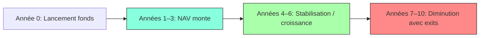

# 📉 Réaction du Private Equity en Période de Crise (Récession, Choc Systémique)

Ce document présente une analyse chiffrée de la réaction des fonds de private equity en période de crise (récession, choc systémique, etc.), basée sur des données historiques (ex. 2008–2009) et des rapports sectoriels (Bain, Preqin, PitchBook, Cambridge Associates).

---

## 🔻 1. Impact sur les Multiples (EV/EBITDA, Entry/Exit Multiples)

### 📉 Contraction des multiples de valorisation

- **Multiples d'entrée (Entry multiples)** :
  - Baisse de **10% à 30%**.
  - Exemple 2008–2009 : passage de **9–10x à 6–7x** (PitchBook, Bain & Co).

- **Multiples de sortie (Exit multiples)** :
  - Forte baisse, reports fréquents des exits.
  - Réduction moyenne des multiples de **20% à 40%**.

---

## 📉 2. Performance des Fonds pendant une Crise

- **IRR (Internal Rate of Return)** :
  - Baisse de **5 à 10 points**.
  - Exemple : Fonds LBO millésimes 2006 vs. 2009 :
    - **2006** : IRR médian ≈ **11.2%**
    - **2009** : IRR médian ≈ **6.1%**

- **TVPI (Total Value to Paid-In Capital)** :
  - Réduction à **1.2–1.5x** vs. **1.6–2.0x** en période normale.

---

## 🔁 3. Capital Calls : Intensification

- Appels de fonds plus fréquents pour :
  - Soutenir les participations en difficulté.
  - Profiter d’opportunités distressed.

- **Ratio Capital Called / Committed Capital** :
  - En temps normal : **30–50%**
  - En crise : **60–80%** (source : Preqin, McKinsey PE Report)

---

## 💸 4. Cash-Out et Distributions (DPI)

- Ralentissement des distributions vers les LPs :
  - **DPI (Distributions to Paid-In Capital)** en baisse de **30% à 50%**.
  - Exemple : en 2009, distributions en baisse de **>60%** par rapport à 2007 (source : Bain).

- Stratégie fréquente : **"Wait and See"** en attendant une reprise des valorisations.

---

## 💥 5. Levier Financier & Risque de Défaut

- Entreprises de PE souvent très endettées :
  - Accès au crédit limité en crise.
  - Risques de restructurations ou défauts accrus.

- Exemples réels :
  - **TXU**, **Caesars Entertainment** (défauts/restructurations post-2008).

---

## 📊 Synthèse – Impacts Chiffrés

| Élément                    | Norme (hors crise) | En crise           | Variation          |
|---------------------------|--------------------|--------------------|--------------------|
| Entry EV/EBITDA Multiple  | 9–10x              | 6–7x               | -30%               |
| Exit Multiple             | 10–12x             | 7–9x               | -20 à -40%         |
| IRR net médian            | 12–15%             | 5–8%               | -5 à -10 points    |
| Capital Called            | 30–50%             | 60–80%             | +30%               |
| DPI (cash-out)            | 1.0x–1.5x          | 0.5x–1.0x          | -30 à -50%         |

---

## 📌 Conclusion

- Le private equity réagit à la crise par :
  - **Retard des exits**,
  - **Augmentation des appels de fonds**,
  - **Moins de liquidité pour les LPs**,
  - **Opportunités "distressed" intéressantes** pour les fonds actifs.

- Les fonds lancés pendant la crise (millésimes 2009–2010) ont souvent généré **de meilleures performances à long terme**.

---

## 📎 Sources

- Bain & Company – Global Private Equity Reports
- Preqin – Private Equity Data
- PitchBook – Global PE Multiples
- Cambridge Associates – Private Equity Benchmarking
- McKinsey – Global Private Markets Review

---

# 2

# 📉 Réaction du Private Equity en Temps de Crise selon la Durée de Vie d’un Fonds

Ce document présente une analyse chiffrée de la manière dont un fonds de **Private Equity** réagit en période de **crise (récession, choc systémique, etc.)**, en fonction de sa **durée de vie typique (~10 ans)** et de l’évolution de sa **NAV (Net Asset Value)**.

---

## ⏳ Durée de vie typique d’un fonds PE

Un fonds de private equity suit généralement cette courbe de vie :

| Phase                | Années      | Description                          |
|---------------------|-------------|--------------------------------------|
| **Investment period** | 0–5 ans     | Investissements et capital calls     |
| **Holding period**    | 3–8 ans     | Croissance, création de valeur       |
| **Exit period**       | 6–10 ans    | Réalisations, distributions          |

---

## 🧭 Phase 1 : Période d’Investissement (Années 0–5)

### 🔻 En période de crise (ex. 2008, 2020) :
- **Opportunité d’acheter à bas prix** : entry multiples réduits.
- **Capital calls** augmentés pour saisir ces opportunités.
- **NAV initiale** volatile, souvent faible la 1re année.

### 📊 Effets chiffrés :
| Indicateur                  | Normal              | En crise              |
|----------------------------|---------------------|------------------------|
| Entry EV/EBITDA            | 9–10x               | 6–7x (-30%)           |
| Capital Call / Commit (%)  | 30–40%              | 50–60% (+20 pts)      |
| NAV an 1                   | ~15–25% du capital  | ~10–15%               |

---

## 🧭 Phase 2 : Période de Holding (Années 3–8)

### 🔻 En période de crise :
- **NAV en baisse** sur les sociétés existantes : effet combiné de contraction des multiples et baisse d’EBITDA.
- **Moins de refinancement possible**, levier contraint.
- **Soutien aux portefeuilles** via follow-ons → capital calls additionnels.

### 📉 Impact typique sur NAV :
- Chute temporaire de **15% à 40%** de la NAV selon la profondeur de la crise.
- Exemple : en 2009, les NAV moyennes ont chuté de **32% en un an** (Cambridge Associates).

### 📊 Effets chiffrés :
| Indicateur           | Pré-crise         | En crise           |
|----------------------|-------------------|--------------------|
| NAV médiane an 4     | 60–80% du capital | 40–60%             |
| Valeur portefeuille  | En croissance     | En baisse de 20–40%|
| Appels de fonds      | Modérés           | +10–20% supplémentaires |

---

## 🧭 Phase 3 : Exit et Liquidation (Années 6–10)

### 🔻 En crise :
- **Exits repoussés** : marché M&A et IPO en pause.
- **Exit multiples réduits** → baisse du TRI et DPI.
- **NAV finale** affectée si vente forcée ou valorisations basses.

### 📉 Sorties ralenties :
- En 2009, le volume global des exits a chuté de **plus de 60%**.
- Certains fonds ont **prolongé leur vie jusqu'à 12–14 ans** pour attendre une reprise des marchés.

### 📊 Effets chiffrés :
| Indicateur        | Norme            | En crise             |
|-------------------|------------------|-----------------------|
| DPI (Cash distribué) | 1.0x–1.5x       | 0.5x–1.0x (-30–50%)   |
| NAV an 10         | proche de 0      | Peut rester >20% si exits retardés |
| TRI Net           | 12–15%           | 5–8% (-5 à -10 pts)   |

---

## 📈 Évolution typique de la NAV (hors crise vs crise)

<!DOCTYPE html>
<html lang="fr">
<head>
  <meta charset="UTF-8">
  <title>Private Equity - NAV, Capital Call et Cash Out</title>
  
  
</head>
<body>

  <h2>Évolution de la NAV (Private Equity) sur 10 ans</h2>
  <canvas id="navChart" width="600" height="300"></canvas>

  <h2>Capital Calls vs. Cash Out – Normal vs. Crise</h2>
  <canvas id="cashChart" width="600" height="300"></canvas>

  

</body>
</html>

# TOP

<!DOCTYPE html>
<html lang="fr">
<head>
  <meta charset="UTF-8" />
  <title>Private Equity - J-Curve, NAV, TVPI, IRR</title>
  
  
</head>
<body>

  <h2>Évolution d’un fonds Private Equity</h2>
  <button id="toggleButton">Passer au scénario : Crise</button>
  <canvas id="peChart" width="800" height="400"></canvas>

  

  

</body>
</html>
