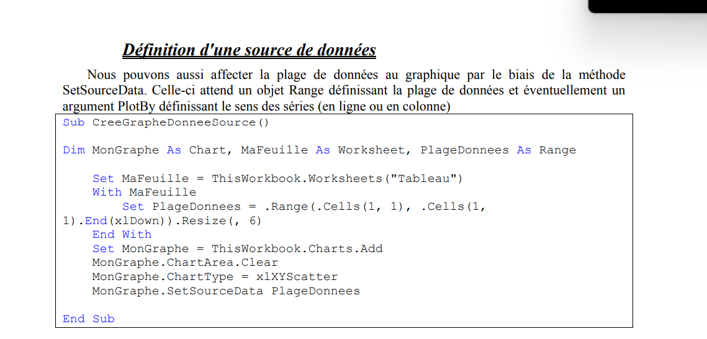
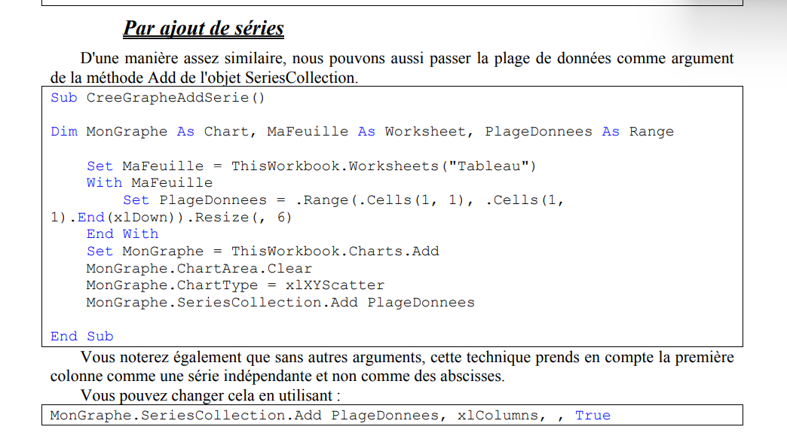
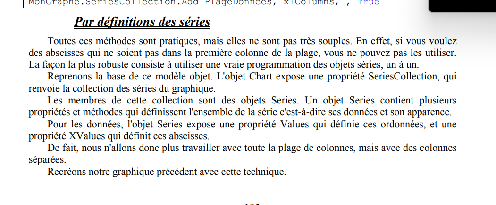
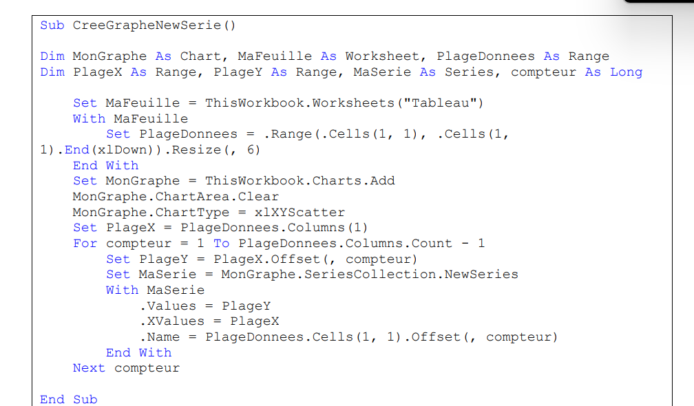
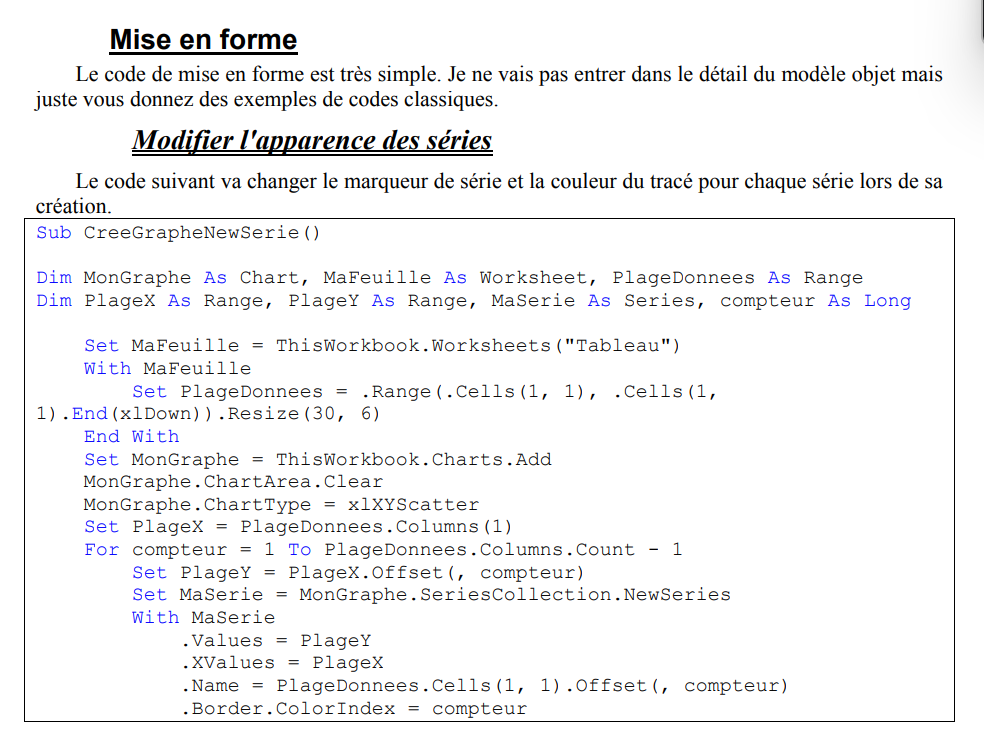
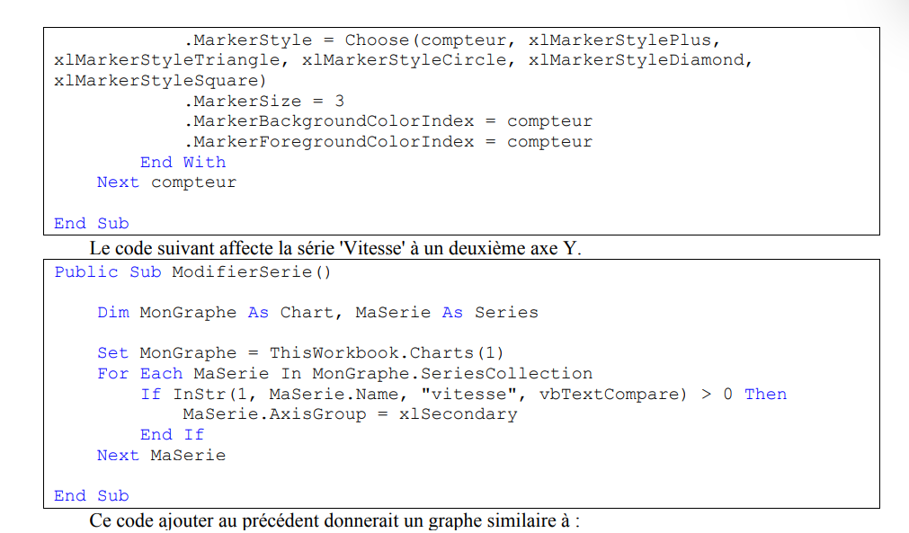
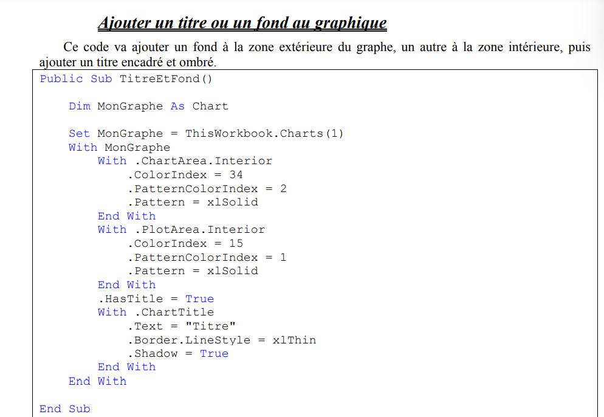
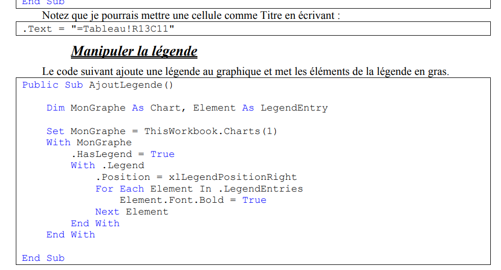
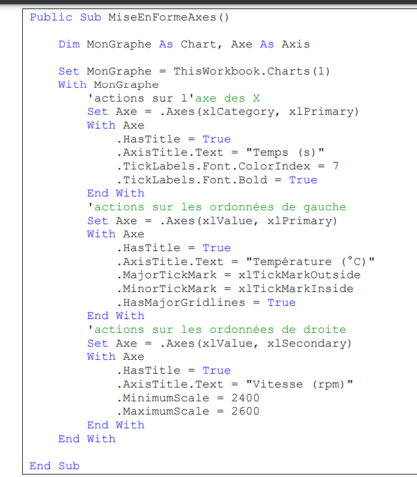

private function ColorIndex(ByVal index as integer) as string

ColorIndex=Choose(index,"noir","blanc")

end function


Private Function Signe2(ByVal valeur as double) as integer

 Signe2=Switch(valeur<0,-1,valeur=0,0,valeur>0,1)
 
 aa=Switch(IsArray(Valeur),"Tableau",Isempty(Valeur),"empty",IsDate(Valeur),"Date",IsNumeric(Valeur),"Nombre")
 
on peut aussi imbriquer

aa=Switch(IsArray(Valeur),"Tableau",Isempty(Valeur),"empty",IsDate(Valeur),"Date",IsNumeric(Valeur),Switch(Valeur-int(Valeur)<>0,"Decimal",Valeur-Int(Valeur) Mod 1 =0,"Entier"))

end function


Sub UnionRng()

dim MaPlage as range

	With ThisWorbook.worksheets("test")
	Set MyPlage=.Range(.cells(2,1),.cells(25,2))
	Set MyPlage=Application.Union(MyPlage,.cells(2,4).Resize(24))
Set MyPlage=Application.Union(MyPlage,.cells(2,7).Resize(24))
	end with
	
end sub

```vb
Public Function PlageValeur2(ByVal ValeurCherchee As Variant, ByVal PlageRecherche As Range) As Range
    Dim Colonne As Range

    ' Check if the search value exists in the search range
    If Application.WorksheetFunction.CountIf(PlageRecherche, ValeurCherchee) = 0 Then Exit Function

    ' Iterate through each column in the search range
    For Each Colonne In PlageRecherche.Columns
        ' Check if the search value exists in this column
        If Application.WorksheetFunction.CountIf(Colonne, ValeurCherchee) > 0 Then
            ' Filter the column to show only the rows with the search value
            Colonne.AutoFilter 1, ValeurCherchee
            
            ' Hide the header row temporarily
            PlageRecherche.Cells(1).EntireRow.Hidden = True
            
            ' Add the visible cells with the search value to the result range
            If PlageValeur2 Is Nothing Then
                Set PlageValeur2 = Colonne.SpecialCells(xlCellTypeVisible)
            Else
                Set PlageValeur2 = Application.Union(PlageValeur2, Colonne.SpecialCells(xlCellTypeVisible))
            End If
            
            ' Remove the filter and unhide the header row
            Colonne.AutoFilter
            PlageRecherche.Cells(1).EntireRow.Hidden = False
        End If
    Next Colonne
End Function
```

# Créer un Graphique

Dans la création du graphique, on entend à minima, la création de l'objet graphe et la création d'au moins une série.

Pour créer une feuille graphique, nous aurons donc un code de la forme :

```vba
Classeur.Charts.Add
```

Pour créer un graphique incorporé, nous aurons un code de la forme :

```vba
Classeur.Feuille.ChartObjects.Add

```
Pour pouvoir manipuler facilement notre graphique, nous allons l'affecter à une variable objet de type Chart.

Pour créer une feuille graphique nous allons avoir :
```vba
Sub FeuilleGraphique()

    Dim MonGraphe As Chart, MaFeuille As Worksheet, PlageDonnees As Range

    Set MonGraphe = ThisWorkbook.Charts.Add

End Sub

```
Dans le cas du graphique incorporé c'est un peu différent. Lors de sa création dans la méthode Add, celle-ci attend quatre arguments définis tels que :

```vba
### Function Add(Left As Double, Top As Double, Width As Double, Height As Double) As ChartObject

Vous devez donc définir des coordonnées Gauche et Haute ainsi qu'une largeur et une hauteur.  
On peut soit passer des valeurs directement telles que :

```vba
Sub GraphiqueIncorpore()

    Dim MonGraphe As Chart, MaFeuille As Worksheet, PlageDonnees As Range

    Set MaFeuille = ThisWorkbook.Worksheets("Tableau")
    With MaFeuille
        Set PlageDonnees = .Range(.Cells(1, 1), .Cells(1, 1).End(xlDown)).Resize(, 6)
        Pl

```

```vba
Sub GrahphiqueIncorpore

dim mongraphe as chart,mafeuille as worksheet,plagegraphique as range

set mafeuille=thisworkbook.worksheets("tableau")
with mafeuille
set plagegraphique=.range("H1N20")
set mongraphe=.chartsobjects.add(plagegraphique.left,plagegraphique.Top,plagegraphique.width,plagegraphique.height).chart
end with
```

```vba

```


a
	



# top













Public Function dhRandomShuffle(Optional lngItems As Long = 10) _
 As Long()
 Dim alngValues() As Long
 Dim i As Long
 Dim lngPos As Long
 Dim lngTemp As Long

 ReDim alngValues(1 To lngItems)
 ' Fill in the original values.
 For i = 1 To lngItems
 alngValues(i) = i
 Next i

 ' Loop through all the items except the last one.
 ' Once you get to the last item, there's no point
 ' using Rnd, just get it.
 For i = lngItems To 2 Step -1
 ' Get a random number between 1 and i
 lngPos = Int(Rnd * i) + 1
 lngTemp = alngValues(lngPos)
 alngValues(lngPos) = alngValues(i)
 alngValues(i) = lngTemp
 Next i
 dhRandomShuffle = alngValues()
End Function


Public Function dhHexToBinary(strNumber As String) As String
 Dim strTemp As String
 Dim strOut As String
 Dim i As Integer
 For i = 1 To Len(strNumber)
 Select Case Mid(strNumber, i, 1)
 Case "0"
 strTemp = "0000"
 Case "1"
 strTemp = "0001"
 Case "2"
 strTemp = "0010"
 Case "3"
 strTemp = "0011"
 Case "4"
 strTemp = "0100"
 Case "5"
 strTemp = "0101"
 Case "6"
 strTemp = "0110"
 Case "7"
 strTemp = "0111"
 Case "8"
 strTemp = "1000"
 Case "9"
 strTemp = "1001
 Case "A"
 strTemp = "1010"
 Case "B"
 strTemp = "1011"
 Case "C"
 strTemp = "1100"
 Case "D"
 strTemp = "1101"
 Case "E"
 strTemp = "1110"
 Case "F"
 strTemp = "1111"
 Case Else
 ' This can’t happen, right?
 strTemp = ""
 End Select
 strOut = strOut & strTemp
 Next i
 dhHexToBinary = strOut
End Function

Public Function dhBinarytoHex(ByVal strNumber As String) As String
 Dim strTemp As String
 Dim intI As Integer
 Dim intLen As Integer
 Dim strOut As String
 ' First, pad the value to the left, with "0".
 ' To do this, find the length of the string
 ' rounded to the next highest multiple of 4.
 intLen = Len(strNumber)
 ' Find the next higher multiple of 4:
 intLen = Int((intLen - 1) / 4 + 1) * 4
 strNumber = Right$(String(intLen, "0") & strNumber, intLen)
 ' Now walk through each group of 4 digits, converting each
 ' to hex.
 For intI = 1 To intLen Step 4
 Select Case Mid(strNumber, intI, 4)
 Case "0000"
 strTemp = "0"
 Case "0001"
 strTemp = "1"
 Case "0010"
 strTemp = "2"
 Case "0011"
 strTemp = "3"
 Case "0100"
 strTemp = "4"
 Case "0101"
 strTemp = "5"
 Case "0110"
 strTemp = "6"
 Case "0111"
 strTemp = "7"
 Case "1000"
 strTemp = "8"
 Case "1001"
 strTemp = "9"
 Case "1010"
 strTemp = "A"
 Case "1011"
 strTemp = "B"
 Case "1100"
 strTemp = "C"
 Case "1101"
 strTemp = "D"
 Case "1110"
 strTemp = "E"
 Case "1111"
 strTemp = "F"
 End Select
 strOut = strOut & strTemp
 Next intI
 dhBinarytoHex = strOut
End Function

Public Function dhBinaryToDec(ByVal strNumber As String) As Long
 dhBinaryToDec = CLng("&H" & dhBinarytoHex(strNumber))
End Function
Public Function dhDecToBinary(ByVal lngNumber As Long) As String
 Dim strTemp As String
 Dim intI As Integer
 strTemp = Hex(lngNumber)
 strTemp = dhHexToBinary(strTemp)
 ' Rip off leading 0s.
 Do While Left(strTemp, 1) = "0"
 strTemp = Mid(strTemp, 2)
 Loop
 dhDecToBinary = strTemp
End Function


Public Function dhNumToStr(ByVal varValue As Variant) As String
 On Error GoTo HandleErrors

 Dim intTemp As Integer
 Dim varNames As Variant	
 Dim lngDollars As Long
 Dim intCents As Integer
 Dim strOut As String
 Dim strTemp As String
 Dim intI As Integer

 If Not IsNumeric(varValue) Then Exit Function

 ' 999,999,999.99 is the largest possible value.
 If varValue > 999999999.99 Then Exit Function
 varNames = Array("", "Thousand", "Million")

 varValue = Abs(varValue)
 lngDollars = Int(varValue)
 intCents = (varValue - lngDollars) * 100
 If lngDollars > 0 Then
 ' Loop through each set of three digits,
 ' first the hundreds, then thousands, and then
 ' millions.
 Do
 intTemp = lngDollars Mod 1000
 lngDollars = Int(lngDollars / 1000)
 ' Prepend spelling of new triplet of digits to the
 ' existing output.
 If intTemp <> 0 Then
 strOut = dhHandleGroup(intTemp) & " " & _
 varNames(intI) & " " & strOut
 End If
 intI = intI + 1
 Loop While lngDollars > 0
 ' Handle the cents.
 strOut = RTrim(strOut) & " and " & _
 Format$(intCents, "00") & "/100"
 End If

ExitHere:
 dhNumToStr = strOut
 Exit Function


HandleErrors:
 ' Handle all errors by returning an empty string
 strOut = ""
 Resume ExitHere
End Function


Private Function dhHandleGroup(ByVal intValue As Integer) As String
 ' Called by dhNumToStr
 Static varOnes As Variant
 Static varTens As Variant
 Dim strOut As String
 Dim intDigit As Integer

 If IsEmpty(varOnes) Then
 varOnes = Array("", "One", "Two", "Three", "Four", "Five", _
 "Six", "Seven", "Eight", "Nine", "Ten", _
 "Eleven", "Twelve", "Thirteen", "Fourteen", "Fifteen", _
 "Sixteen", "Seventeen", "Eighteen", "Nineteen", "Twenty")
 End If
 If IsEmpty(varTens) Then
 ' Elements 0 and 1 in this array aren't used.
 varTens = Array("", "", "Twenty", "Thirty", "Forty", _
 "Fifty", "Sixty", "Seventy", "Eighty", "Ninety")
 End If

 ' Get the hundreds digit, and then the rest.
 intDigit = intValue \ 100
 intValue = intValue Mod 100

' If there's a hundreds digit, add that now.
 If intDigit > 0 Then strOut = varOnes(intDigit) & " Hundred"

 ' Handle the tens and ones digits.
 Select Case intValue
 Case 1 To 20
 strOut = strOut & varOnes(intValue)
 Case 21 To 99
 intDigit = intValue \ 10
 intValue = intValue Mod 10
 If intDigit > 0 Then
 strOut = strOut & " " & varTens(intDigit)
 End If
 If intValue > 0 Then
 strOut = strOut & "-" & varOnes(intValue)
 End If
 End Select
 dhHandleGroup = strOut
End Function


Public Function dhFirstDayInMonth(Optional dtmDate As Date = 0) As Date
 ' Return the first day in the specified month.

 ' Did the caller pass in a date? If not, use
 ' the current date.
 If dtmDate = 0 Then
 dtmDate = Date
 End If

 dhFirstDayInMonth = DateSerial( _
 Year(dtmDate), Month(dtmDate), 1)
End Function
Public Function dhLastDayInMonth(Optional dtmDate As Date = 0) As Date
 ' Return the last day in the specified month.

 ' Did the caller pass in a date? If not, use
 ' the current date.
 If dtmDate = 0 Then
 dtmDate = Date
 End If

 dhLastDayInMonth = DateSerial( _
 Year(dtmDate), Month(dtmDate) + 1, 0)
End Function


Public Function dhFirstDayInWeek(Optional dtmDate As Date = 0) As Date
 ' Returns the first day in the week specified by the
 ' date in dtmDate. Uses localized settings for the first
 ' day of the week.

 ' Did the caller pass in a date? If not, use
 ' the current date.
 If dtmDate = 0 Then
 dtmDate = Date
 End If

 dhFirstDayInWeek = dtmDate - _
 Weekday(dtmDate, vbUseSystemDayOfWeek) + 1
End Function
Public Function dhLastDayInWeek(Optional dtmDate As Date = 0) As Date
 ' Returns the last day in the week specified by the
 ' date in dtmDate.
 ' Uses localized settings for the first day of the week.

 ' Did the caller pass in a date? If not, use
 ' the current date.
 If dtmDate = 0 Then
 dtmDate = Date
 End If
 dhLastDayInWeek = dtmDate - _
 Weekday(dtmDate, vbUseSystemDayOfWeek) + 7
End Function


Public Function dhFirstDayInYear(Optional dtmDate As Date = 0) As Date
 ' Return the first day in the specified year.

 ' Did the caller pass in a date? If not, use
 ' the current date.
 If dtmDate = 0 Then
 dtmDate = Date
 End If

 dhFirstDayInYear = DateSerial(Year(dtmDate), 1, 1)
End Function
Public Function dhLastDayInYear(Optional dtmDate As Date = 0) As Date
 ' Return the last day in the specified year.
 ' Did the caller pass in a date? If not, use
 ' the current date.
 If dtmDate = 0 Then
 dtmDate = Date
 End If

 dhLastDayInYear = DateSerial(Year(dtmDate), 12, 31)
End Function


Private Function IsWeekend(dtmTemp As Date) As Boolean
 ' If your weekends aren't Saturday (day 7)
 ' and Sunday (day 1), change this routine
 ' to return True for whatever days
 ' you DO treat as weekend days.
 Select Case WeekDay(dtmTemp)
 Case vbSaturday, vbSunday
 IsWeekend = True
 Case Else
 IsWeekend = False
 End Select
End Function


Public Function dhCNumDate(ByVal lngdate As Long, _
 ByVal strFormat As String) As Variant
 ' Convert numbers to dates, depending on the specified format
 ' and the incoming number. In this case, the number and the
 ' format must match, or the output will be useless.

 Dim intYear As Integer
 Dim intMonth As Integer
 Dim intDay As Integer

 Select Case strFormat
 Case "MMDDYY"
 intYear = lngdate Mod 100
 intMonth = lngdate \ 10000
 intDay = (lngdate \ 100) Mod 100

 Case "MMDDYYYY"
 intYear = lngdate Mod 10000
 intMonth = lngdate \ 1000000
 intDay = (lngdate \ 10000) Mod 100
 
 Case "DDMMYY"
 intYear = lngdate Mod 100
 intMonth = (lngdate \ 100) Mod 100
 intDay = lngdate \ 10000

 Case "DDMMYYYY"
 intYear = lngdate Mod 10000
 intMonth = (lngdate \ 10000) Mod 100
 intDay = lngdate \ 1000000
 
 Case "YYMMDD", "YYYYMMDD"
 intYear = lngdate \ 10000
 intMonth = (lngdate \ 100) Mod 100
 intDay = lngdate Mod 100

 Case Else
 ' Raise an error and get out.
 ' Error 5 normally indicates an invalid parameter.
 Err.Raise 5, "dhCNumDate", "Invalid parameter"
 End Select
 dhCNumDate = DateSerial(intYear, intMonth, intDay)
End Function


Public Function dhCStrDate( _
 strDate As String, Optional strFormat As String = "") As Date

 ' Given a string containing a date value, and a format
 ' string describing the information in the date string,
 ' convert the string into a real date value.
 '
 Dim strYear As String
 Dim strMonth As String
 Dim strDay As String

 Select Case strFormat
 Case "MMDDYY", "MMDDYYYY"
 strYear = Mid$(strDate, 5)
 strMonth = Left$(strDate, 2)
 strDay = Mid$(strDate, 3, 2)
 
 Case "DDMMYY", "DDMMYYYY"
 strYear = Mid$(strDate, 5)
 strMonth = Mid$(strDate, 3, 2)
 strDay = Left$(strDate, 2)

 Case "YYMMDD"
 strYear = Left$(strDate, 2)
 strMonth = Mid$(strDate, 3, 2)
 strDay = Right$(strDate, 2)
 
 Case "YYYYMMDD"
 strYear = Left$(strDate, 4)
 strMonth = Mid$(strDate, 5, 2)
 strDay = Right$(strDate, 2)

 Case "DD/MM/YY", "DD/MM/YYYY"
 strYear = Mid$(strDate, 7)
 strMonth = Mid$(strDate, 4, 2)
 strDay = Left$(strDate, 2)

 Case "YY/MM/DD"
 strYear = Left$(strDate, 2)
 strMonth = Mid$(strDate, 4, 2)
 strDay = Right$(strDate, 2)

 Case "YYYY/MM/DD"
 strYear = Left$(strDate, 4)
 strMonth = Mid$(strDate, 6, 2)
 strDay = Right$(strDate, 2)
 
 Case Else
 ' If none of the other formats were matched, raise
 ' an error and get out.
 Err.Raise 5, "dhCStrDate", "Invalid parameter"
 End Select
 dhCStrDate = DateSerial(Val(strYear), Val(strMonth), Val(strDay))
End Function


Public Function dhCountWorkdays( _
 ByVal dtmStart As Date, ByVal dtmEnd As Date, _
 Optional rst As ADODB.Recordset = Nothing, _
 Optional strField As String = "") _
 As Integer
 ' Count the business days (not counting weekends/holidays) in
 ' a given date range.

 Dim intDays As Integer
 Dim dtmTemp As Date
 Dim intSubtract As Integer

 ' Swap the dates if necessary.
 If dtmEnd < dtmStart Then
 dtmTemp = dtmStart
 dtmStart = dtmEnd
 dtmEnd = dtmTemp
 End If
 ' Get the start and end dates to be weekdays.
 dtmStart = SkipHolidays(rst, strField, dtmStart, 1)
 dtmEnd = SkipHolidays(rst, strField, dtmEnd, -1)
 If dtmStart > dtmEnd Then
 ' Sorry, no Workdays to be had. Just return 0.
 dhCountWorkdays = 0
 Else
 intDays = dtmEnd - dtmStart + 1

 ' Subtract off weekend days. Do this by figuring out how
 ' many calendar weeks there are between the dates, and
 ' multiplying the difference by two (because there are two
 ' weekend days for each week). That is, if the difference
 ' is 0, the two days are in the same week. If the
 ' difference is 1, then we have two weekend days.
 intSubtract = (DateDiff("ww", dtmStart, dtmEnd) * 2)

 ' The answer to our quest is all the weekdays, minus any
 ' holidays found in the table.
 ' If rst is Nothing, this call won't subtract any dates.
 intSubtract = intSubtract + _
 CountHolidays(rst, strField, dtmStart, dtmEnd)

 dhCountWorkdays = intDays - intSubtract
 End If
End Function


Public Function dhFormatInterval(dtmStart As Date, datend As Date, _
 Optional strFormat As String = "H:MM:SS") As String
 ' Return the difference between two times,
 ' formatted as specified in strFormat.
 
 Dim lngSeconds As Long
 Dim decMinutes As Variant
 Dim decHours As Variant
 Dim decDays As Variant

 Dim intSeconds As Integer
 Dim intMinutes As Integer
 Dim intHours As Integer

 Dim intRoundedHours As Integer
 Dim intRoundedMinutes As Integer

 Dim strDay As String
 Dim strHour As String
 Dim strMinute As String
 Dim strSecond As String
 Dim strOut As String

 Dim lngFullDays As Long
 Dim lngFullHours As Long
 Dim lngFullMinutes As Long

 Dim strDelim As String
 
 Const dhcDays As String = "Days"
 Const dhcHours As String = "Hours"
 Const dhcMinutes As String = "Minutes"
 Const dhcSeconds As String = "Seconds"

 Const dhcDay As String = "Day"
 Const dhcHour As String = "Hour"
 Const dhcMinute As String = "Minute"
 Const dhcSecond As String = "Second"


 ' If you don't want to use the local delimiter,
 ' but a specific one, replace the next line with
 ' this:
 ' strDelim = ":"
 strDelim = GetTimeDelimiter()
 
  ' Calculate the full number of seconds in the interval.
 ' This limits the calculation to 2 billion seconds (68 years
 ' or so), but that's not too bad. Then calculate the
 ' difference in minutes, hours, and days, as well.
 lngSeconds = DateDiff("s", dtmStart, datend)
 decMinutes = CDec(lngSeconds / 60)
 decHours = CDec(decMinutes / 60)
 decDays = CDec(decHours / 24)

 ' Get the full hours and minutes, for later display.
 lngFullDays = Int(decDays)
 lngFullHours = Int(decHours)
 lngFullMinutes = Int(decMinutes)

 ' Get the incremental amount of each unit.
 intHours = Int((decDays - lngFullDays) * 24)
 intMinutes = Int((decHours - lngFullHours) * 60)
 intSeconds = CInt((decMinutes - lngFullMinutes) * 60)
 
 ' In some instances, time values must be rounded.
 ' The next two lines depend on the fact that a true statement
 ' has a value of -1, and a false statement has a value of 0.
 ' The code needs to add 1 to the value if the following expression
 ' is true, and 0 if not.
 intRoundedHours = intHours - (intMinutes > 30)
 intRoundedMinutes = intMinutes - (intSeconds > 30)

 ' Assume all units are plural, until you find otherwise.
 strDay = dhcDays
 strHour = dhcHours
 strMinute = dhcMinutes
 strSecond = dhcSeconds

 If lngFullDays = 1 Then strDay = dhcDay
 Select Case strFormat
 Case "D H"
 If intRoundedHours = 1 Then strHour = dhcHour
 strOut = _
 lngFullDays & " " & strDay & " " & _
 intRoundedHours & " " & strHour
 
 Case "D H M"
 If intHours = 1 Then strHour = dhcHour
 If intRoundedMinutes = 1 Then strMinute = dhcMinute
 strOut = _
 lngFullDays & " " & strDay & " " & _
 intHours & " " & strHour & " " & _
 intRoundedMinutes & " " & strMinute

 Case "D H M S"
 If intHours = 1 Then strHour = dhcHour
 If intMinutes = 1 Then strMinute = dhcMinute
 If intSeconds = 1 Then strSecond = dhcSecond
 strOut = _
 lngFullDays & " " & strDay & " " & _
 intHours & " " & strHour & " " & _
 intMinutes & " " & strMinute & " " & _
 intSeconds & " " & strSecond
 
 Case "D H:MM" ' 3 Days 2:46"
 strOut = lngFullDays & " " & strDay & " " & _
 intHours & strDelim & Format(intRoundedMinutes, "00")

 Case "D HH:MM" ' 3 Days 02:46"
 strOut = lngFullDays & " " & strDay & " " & _
 Format(intHours, "00") & strDelim & _
 Format(intRoundedMinutes, "00")

 Case "D HH:MM:SS" ' 3 Days 02:45:45"
 strOut = lngFullDays & " " & strDay & " " & _
 Format(intHours, "00") & strDelim & _
 Format(intMinutes, "00") & strDelim & _
 Format(intSeconds, "00")

 Case "H M" ' 74 Hours 46 Minutes"
 If lngFullHours = 1 Then strHour = dhcHour
 If intRoundedMinutes = 1 Then strMinute = dhcMinute
 strOut = lngFullHours & " " & strHour & " " & _
 intRoundedMinutes & " " & strMinute
 
 Case "H:MM" ' 74:46 (leading 0 on minutes, if necessary)
 strOut = lngFullHours & strDelim & _
 Format(intRoundedMinutes, "00")
 
 
 Case "H:MM:SS" ' 74:45:45"
 strOut = lngFullHours & strDelim & _
 Format(intMinutes, "00") & strDelim & _
 Format(intSeconds, "00")

 Case "M S" ' 4485 Minutes 45 Seconds
 If lngFullMinutes = 1 Then strMinute = dhcMinute
 If intSeconds = 1 Then strSecond = dhcSecond
 strOut = lngFullMinutes & " " & strMinute & " " & _
 intSeconds & " " & strSecond
 Case "M:SS" ' 4485:45 (leading 0 on seconds)"
 strOut = lngFullMinutes & strDelim & _
 Format(intSeconds, "00")

 Case Else
 strOut = vbNullString
 End Select
 dhFormatInterval = strOut
End Function

Sub TestInterval()
 Dim dtmStart As Date
 Dim dtmEnd As Date
 dtmStart = #1/1/97 12:00:00 PM#
 dtmEnd = #1/4/97 2:45:45 PM#
 Debug.Print dhFormatInterval(dtmStart, dtmEnd, "D H")
 end sub
 
 
 
Function dhBinarySearch( _
    varItems As Variant, varSought As Variant, ColNumber As Long) As Long

    Dim lngLower As Long
    Dim lngMiddle As Long
    Dim lngUpper As Long

    ' Initialisation des bornes inférieures et supérieures pour les lignes
    lngLower = LBound(varItems, 1)
    lngUpper = UBound(varItems, 1)
    
    ' Boucle de recherche binaire
    Do While lngLower < lngUpper
        ' Calcul du milieu de la plage actuelle
        lngMiddle = (lngLower + lngUpper) \ 2
        
        ' Comparaison avec la valeur recherchée dans la colonne spécifiée
        If varSought > varItems(lngMiddle, ColNumber) Then
            lngLower = lngMiddle + 1
        Else
            lngUpper = lngMiddle
        End If
    Loop
    
    ' Vérification finale pour voir si l'élément recherché est trouvé
    If varItems(lngLower, ColNumber) = varSought Then
        dhBinarySearch = lngLower
    Else
        dhBinarySearch = -1
    End If
End Function


Sub dhFindAndReplace(modAny As CodeModule)
 Dim lngStartLine As Long
 Dim lngStartCol As Long
 Dim lngEndLine As Long
 Dim lngEndCol As Long
 Dim strLine As String
 Const dhcFind = "Copyright 2000"
 Const dhcReplace = "Copyright © 2000"
' Use the passed code module
 With modAny
 ' Set initial parameters
 lngStartLine = 1
 lngStartCol = 1
 lngEndLine = .CountOfLines
 lngEndCol = Len(.Lines(.CountOfLines, 1))
 ' Keep searching until no other
 ' occurrences are found
 Do While .Find(dhcFind, lngStartLine, _
 lngStartCol, lngEndLine, lngEndCol, True)
 ' Replace the line that contains
 ' the text with a new one
 strLine = .Lines(lngStartLine, 1)
 strLine = Left(strLine, lngStartCol - 1) & _
 dhcReplace & Mid(strLine, lngEndCol)
 .ReplaceLine lngStartLine, strLine
 ' Reset parameters
 lngStartLine = lngEndLine + 1
 lngStartCol = 1
 lngEndLine = .CountOfLines
 lngEndCol = Len(.Lines(.CountOfLines, 1))
 Loop
 End With
End Sub


# son


Declare PtrSafe Function PlaySound Lib "winmm.dll" _
 Alias "PlaySoundA" (ByVal lpszSoundName As String, _
 ByVal hMod As Long, ByVal uFlags As Long) As Long
 
 
 Sub testmsM()
 
 
    Call dhMsgBeep("coucou")
 
 End Sub
 
 Function dhMsgBeep(strMsg As String, _
 Optional lngType As Long = 0, _
 Optional strCaption As String = "") As Long
 
 
    Dim lngSound As Long
    ' Get sound type
    lngSound = lngType And &HF0
    ' Play sound
    'Call MessageBeep(lngSound)
    ' Show message box
    If strCaption = "" Then
    dhMsgBeep = MsgBox(strMsg, lngType)
    Else
    dhMsgBeep = MsgBox(strMsg, lngType, strCaption)
    End If
 
End Function


 
 Sub dssd()
 
 
     Call PlaySound("C:\Users\etien\OneDrive\Bureau\Music\Ave-Maria-_Extended_-HD.wav", 0&, _
 SND_ANSYC Or SND_FILENAME)
 
 
 'Call PlaySound("", 0&, SND_NODEFAULT)
 
 'If Not CBool(PlaySound("MYSOUND.WAV", 0&, SND_NODEFAULT)) Then
 ' Something went wrong!
'End If


 
 End Sub
 
 #
 
  Sub CreateChartWithRangesAndFixedName()
    Dim xData As Range
    Dim yData As Range
    Dim serName As Range
   
    'set the ranges to get the data and y value label
    Set xData = Range("B3:B12")
    Set yData = Range("C3:C12")
    Set serName = Range("C2")
   
    'get reference to ActiveSheet
    Dim sht As Worksheet
    Set sht = ActiveSheet
   
    'create a new ChartObject at position (48, 195) with width 400 and height 300
    Dim chtObj As ChartObject
    Set chtObj = sht.ChartObjects.Add(48, 195, 400, 300)
   
    'get reference to chart object
    Dim cht As Chart
    Set cht = chtObj.Chart
   
    'create the new series
    Dim ser As Series
    Set ser = cht.SeriesCollection.NewSeries
   
    ser.Values = yData
    ser.XValues = xData
    ser.Name = serName
   
    ser.ChartType = xlXYScatterLines


Sub CreateEmptyChart()
 'get reference to ActiveSheet
 Dim sht As Worksheet
 Set sht = ActiveSheet
 'create a new ChartObject at position (0, 0) with width 400 and height 300
 Dim chtObj As ChartObject
 Set chtObj = sht.ChartObjects.Add(0, 0, 400, 300)
 'get refernce to chart object
 Dim cht As Chart
 Set cht = chtObj.Chart
 'additional code to modify the empty chart
 '...
 End Sub
 
  Sub CreateChartUsingSeriesFormula()
 Dim xData As Range
 Dim yData As Range
 Dim serName As Range
 'set the ranges to get the data and y value label
 Set xData = Range("B3:B12")
 Set yData = Range("C3:C12")
 Set serName = Range("C2")
 'get reference to ActiveSheet
 Dim sht As Worksheet
 Set sht = ActiveSheet
 'create a new ChartObject at position (48, 195) with width 400 and height 300
 Dim chtObj As ChartObject
 Set chtObj = sht.ChartObjects.Add(48, 195, 400, 300)
 'get refernce to chart object
 Dim cht As Chart
 Set cht = chtObj.Chart
 'create the new series
 Dim ser As Series
 Set ser = cht.SeriesCollection.NewSeries
 'set the SERIES formula
 '=SERIES(name, xData, yData, plotOrder)
 Dim formulaValue As String
    formulaValue = "=SERIES(" & _
        serName.Address(, , , True) & "," & _
        xData.Address(, , , True) & "," & _
        yData.Address(, , , True) & ",1)"
    ser.Formula = formulaValue
    ser.ChartType = xlXYScatterLines
 End Sub
 
 #
 
  time1 = Timer
 For Each iCell In MyRange
   iCell = "text"
 Next iCell
 time2 = Timer
 For i = 1 To 30
   MyRange.Cells(i) = "text"
 Next i
 time3 = Timer
 debug.print "Proc1 time: " & cStr(time2-time1)
 debug.print "Proc2 time: " & cStr(time3-time2
 
 
  Private Declare PtrSafe Function getFrequency Lib "Kernel32" Alias "QueryPerformanceFrequency"
 (cyFrequency As Currency) As Long
 Private Declare PtrSafe Function getTickCount Lib "Kernel32" Alias "QueryPerformanceCounter"
 (cyTickCount As Currency) As Long
 Function MicroTimer() As Double
    Dim cyTicks1 As Currency
    Static cyFrequency As Currency
    MicroTimer = 0
    If cyFrequency = 0 Then getFrequency cyFrequency        'Get frequency
    getTickCount cyTicks1                                   'Get ticks
    If cyFrequency Then MicroTimer = cyTicks1 / cyFrequency 'Returns Seconds
	
	
	
	
	
	Sub Make50Charts()
 Dim ChartData As Range
 Dim i As Long
 Dim leftPos As Long, topPos As Long
' Delete existing charts if they exist
 With Worksheets("Sheet2").ChartObjects
 If .Count > 0 Then .Delete
 End With
' Initialize positions
 leftPos = 0
 topPos = 0
' Loop through the data
 For i = 2 To 51
' Determine the data range
 With Worksheets("Sheet1")
 Set ChartData = Union(.Range("A1:F1"), _
 
 .Range(.Cells(i, 1), .Cells(i, 6)))
 End With
' Create a chart
 Call CreateChart(ChartData, leftPos, topPos, 180, 120)
' Adjust positions
 If (i - 1) Mod 5 = 0 Then
 leftPos = 0
 topPos = topPos + 120
 Else
 leftPos = leftPos + 180
 End If
 Next i
End Sub


```vba

Function MonteCarloStockPrice(S0 As Double, mu As Double, sigma As Double, T As Double, simulations As Integer) As Variant
Dim simulatedPrices() As Double

ReDim simulatedPrices(1 To simulations)

Dim dt As Double, drift As Double, volatility As Double, i As Integer

dt = T / simulations

drift = (mu - 0.5 * sigma ^ 2) * dt

volatility = sigma * Sqr(dt)

For i = 1 To simulations

simulatedPrices(i) = S0 * Exp(drift + volatility * Application.NormSInv(Rnd()))

Next i

MonteCarloStockPrice = simulatedPrices

End Function

```

Public Function get_col_letter_from_col_index(ByVal col_index As Long) As String

    Dim split_array As Variant
    
    split_array = Split(ActiveSheet.Cells(1, col_index).Address(True, False), "$")
    get_col_letter_from_col_index = split_array(0)
    
End Function

Function get_col_number_from_header(ByVal col_name As String, ByRef ws As Worksheet, ByVal row_number As Long) As Long
    
    Dim my_rng As Range
    
    Set my_rng = ws.Rows(row_number).Find(What:=col_name, LookAt:=xlWhole)
    
    get_col_number_from_header = my_rng.Column
    
End Function

Function FctAutoFilter(RngToFilter As Range, KeyValueToFilter As Variant)

    'Pour AutoFilter

    Dim clsError        As cls_error_handler
    Dim DictColToFilter As New Dictionary
    Dim KeyCol          As Variant
    Dim ValueToFilter   As Variant
    Dim i               As Byte
    
    Set clsError = New cls_error_handler: clsError.SetLoc "Mod_Step5NewTreatment", "FctAutoFilter"

    ColGrappeBilanSteve = FctGetNumColumn(sht_maq_traitement1, PublicVarStr_GrappeBilanSteve)
    ColDevise = FctGetNumColumn(sht_maq_traitement1, PublicVarStr_Devise)
    ColDomaine = FctGetNumColumn(sht_maq_traitement1, PublicVarStr_Domaine)

    DictColToFilter.Add ColGrappeBilanSteve, ""
    DictColToFilter.Add ColDevise, ""
    DictColToFilter.Add ColDomaine, ""
    
    RngToFilter.AutoFilter
    i = 0
    For Each KeyCol In DictColToFilter.Keys
        ValueToFilter = Split(CStr(KeyValueToFilter), PublicVarSplit)(i)
        RngToFilter.AutoFilter Field:=CInt(KeyCol), Criteria1:=ValueToFilter, Operator:=xlFilterValues
        i = i + 1
        If i = 3 Then Exit For
    Next KeyCol
    
End Function

Function FctGetDataAfterAutoFilter() As Variant

    'Pour AutoFilter

    Dim clsError        As cls_error_handler
    Dim ArrTemp         As Variant
    Dim row             As Range
    Dim RngInitial      As Range
    Dim RngAfterFilter  As Range
    Dim i               As Long
    Dim j               As Long
    Dim LastCol         As Integer
    Dim LastRow         As Integer
    Dim LastRowFilter   As Integer
    
    Set clsError = New cls_error_handler: clsError.SetLoc "Mod_Step5NewTreatment", "FctGetDataAfterAutoFilter"

    With sht_maq_traitement1
        LastCol = .UsedRange.Columns.count
        LastRow = .UsedRange.Rows.count
        LastRowFilter = .AutoFilter.Range.Columns(2).SpecialCells(xlCellTypeVisible).Cells.count
        Set RngInitial = .Range("A1").CurrentRegion
        Set RngAfterFilter = .Range("A1" & ":" & FctGetColLetterFromInt(LastCol) & LastRow).SpecialCells(xlCellTypeVisible)
    End With

    If Not RngAfterFilter.SpecialCells(xlCellTypeVisible).count > 0 Then Exit Function

    i = 1
    ReDim ArrTemp(1 To LastCol, 1 To LastRowFilter)

    For Each row In RngAfterFilter.Rows
        If Not row.Hidden Then
            For j = LBound(ArrTemp, 1) To UBound(ArrTemp, 1)
                ArrTemp(j, i) = row.Cells(j)
            Next j
            If i = LastRowFilter Then
                Exit For
            Else
                i = i + 1
            End If
        End If
    Next row

    ArrTemp = WorksheetFunction.Transpose(ArrTemp)
    FctGetDataAfterAutoFilter = FctIfArrIsNotEmpty(ArrTemp, "FctGetDataAfterAutoFilter")
    
    'Retirer Filtre
    RngAfterFilter.AutoFilter
    Set ArrTemp = Nothing
        
End Function

Private Function IsInCollection(Coln As Object, Item As String) As Boolean
    Dim Obj As Object
    On Error Resume Next
    Set Obj = Coln(Item)
    IsInCollection = Not Obj Is Nothing
End Function
