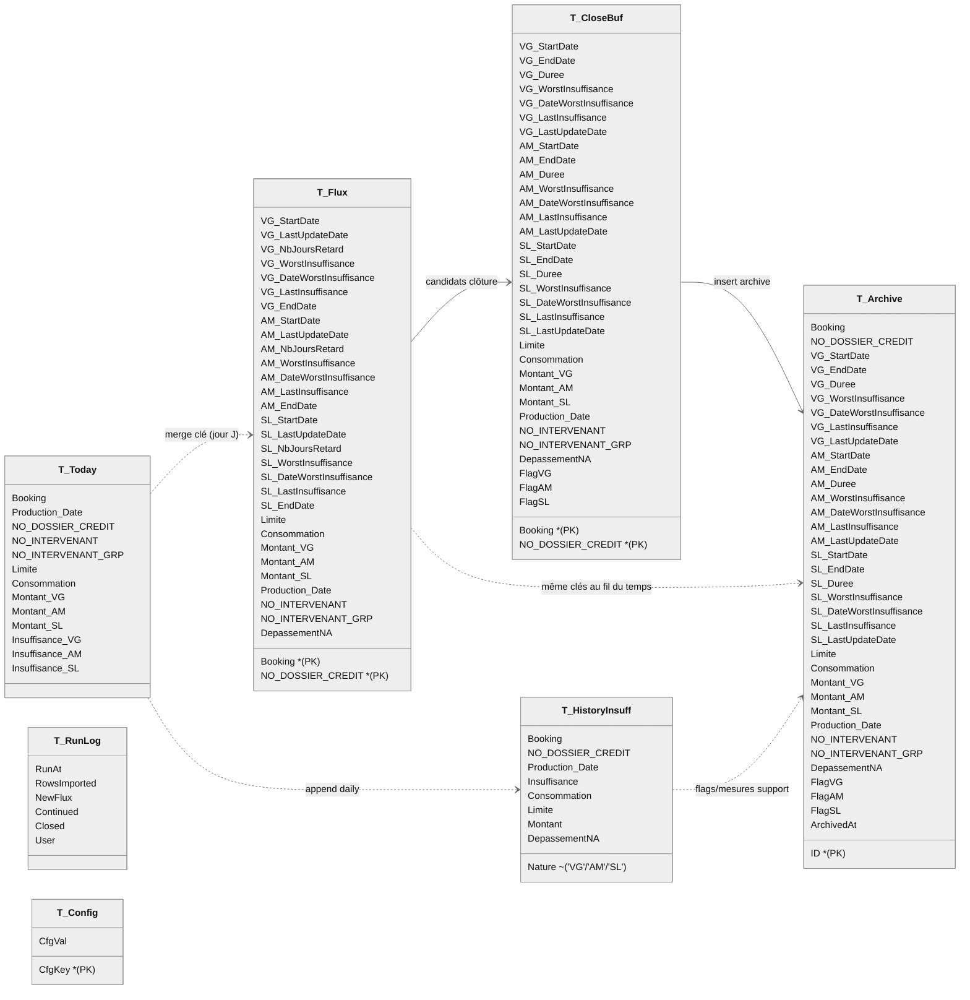

[TOC]

# Documentation technique — **Pipeline Retards 3-en-1 (VG/AM/SL)**  
_VBA Excel ⟷ Access (ACE/OLEDB) — Archivage, Historisation et Flux_

> **Version :** 1.0 (générée automatiquement)  
> **Portée :** Cette documentation décrit le fonctionnement complet du code VBA fourni (`MAJ_Retards_Daily_3in1_NoNzIif2` et modules associés), la logique métier, les étapes d’historisation, la structure de la base Access, les cas particuliers et des exemples d’exécution. Le contenu est en **Markdown** (à lire tel quel dans n’importe quel éditeur ou sur GitHub/VS Code).

## Contexte

**Objectif**

Suivi quotidien des crédits lombards de banque privée exposés au risque de marché. Les données arrivent chaque jour sous forme de feuille Excel (une ligne par clé affaire) et décrivent, pour trois natures indépendantes. VG (valeur de gage / LTV), AM (appel de marge) et SL (seuil de liquidité), l’état d’insuffisance et les montants associés. L’objectif est d’industrialiser la chaîne : ingestion, normalisation, compteurs de jours de retard par nature, historisation journalière, clôture et archivage des épisodes, puis reporting.

**But**

Constituer une base Access unique qui maintient l’état courant des retards par clé (table Flux), archive les épisodes clôturés (table Archive), enregistre une série temporelle journalière (table History), et enrichit la feuille Excel en sortie avec NB jours, dates de début/fin et dépassements. Le dispositif doit permettre de suivre l’évolution d’un dossier (jours et montants en retard) par nature, de produire des KPI et des analyses (tops, réouvertures, multi-natures, etc.).

**Champs initiaux (feuille Excel — quotidien)**

- Booking (CAI, IND, etc., p)
- Production Date
- NO DOSSIER CREDIT
- NO NTERVENANT
- NO NTERVENANT GRP
- Limite
- Consommation
- Montant VG (valeur de gage / LTV)
- Montant AM (appel de marge)
- Montant SL (seuil de liquidité)
- Insuffisance VG (= ABS(Consommation) − ABS(Montant VG))
- Insuffisance AM
- Insuffisance SL

Clé métier : l’unicité s’entend sur Booking + NO DOSSIER CREDIT (un même NDC peut exister sur plusieurs places).

**Mécanisme**

- Import & normalisation : la feuille du jour est chargée dans T_Today, valeurs nettoyées, clés dédupliquées, et calcul du dépassement non autorisé DepassementNA = (ABS(Consommation) > Limite).
- Flux (état courant) : pour chaque clé et VG/AM/SL, un sous-épisode démarre quand Insuffisance < 0, incrémente un compteur de jours à chaque jour de continuité, conserve le WorstInsuffisance (le plus négatif) et sa date.
- Clôture & archive : dès que l’insuffisance repasse ≥ 0 (ou si la clé disparaît), l’épisode est figé avec StartDate / EndDate / NbJoursRetard / Worst / DateWorst / LastInsuffisance et archivé dans T_Archive avec FlagVG/FlagAM/FlagSL (natures réellement closes).
- Historisation : chaque jour et par nature, un point est inséré dans T_HistoryInsuff (insuffisance, montants, limite/consommation, NA).
- Enrichissement Excel : ajout en sortie des colonnes NB Jours retard, Date début, Date fin pour VG/AM/SL, plus le flag DepassementNA.

**Tables & rôles (bref)**

-  T_Today : staging du jour (miroir de la feuille).
- T_Flux : une ligne par clé, avec trois sous-épisodes VG/AM/SL : StartDate, LastUpdateDate, NbJoursRetard, WorstInsuffisance, DateWorstInsuffisance, LastInsuffisance (+ contexte : Limite, Consommation, montants, intervenants, DepassementNA).
- T_Archive : épisodes clôturés (blocs VG/AM/SL renseignés selon ce qui se ferme), + FlagVG/FlagAM/FlagSL.
- T_HistoryInsuff : séries temporelles (1 point/jour/nature/clé).
- T_Close : buffer du jour pour figer proprement les clôtures multiples.
- T_RunLog : journal d’exécution ; T_Config : paramètres (ex. date simulée).

## 0) Vue d’ensemble

### Objectif
Automatiser le suivi des **épisodes de retard** sur trois natures (*VG*, *AM*, *SL*), en :
- **ingérant** les données du jour (Excel → `T_Today`),
- **normalisant** et **neutralisant** les `NULL`,
- **historisant** (journal quotidien dans `T_HistoryInsuff`),
- **pilotant** un **flux** des épisodes ouverts (`T_Flux`) avec règles « démarrage / continuation / fermeture »,
- **archivant** les épisodes clos (`T_Archive`), avec un **buffer de clôture** (`T_CloseBuf`),
- **enrichissant** la feuille Excel (NB jours, dates début/fin par nature, dépassement NA),
- **traçant** un journal d’exécution (`T_RunLog`),
- et **supportant un mode simulation** de la date de production (« **TEST_MODE** » via `T_Config`).

### Schéma (simplifié)
```
Excel (feuille du jour) 
   └─► LoadTodayIntoAccess ─► T_Today ─► NormalizeToday
                                  │
                                  ├─► AppendHistory ─► T_HistoryInsuff (journal quotidien)
                                  │
                                  └─► ProcessBusinessRules_3in1_NoNzIif (transaction)
                                          ├─ Démarrages / Continuations / Pires / DepassementNA ► T_Flux
                                          ├─ BuildCloseBuffer ► T_CloseBuf
                                          ├─ InsertCloseBufferToArchive ► T_Archive
                                          └─ Purge FLUX des sous-épisodes clos
                                  │
                                  └─► EnrichSheetFromFlux_3in1 (retours infos ► feuille)
                                  └─► WriteRunLog ► T_RunLog
```

---

## 1) Paramètres & constantes

- **TEST_MODE** (`Boolean`) : *True* en simulation (lab), *False* en prod.  
  - **Effets** : force `T_Today.[Production Date]` à la **date simulée** (`SimDate` dans `T_Config`) et **avance** cette date à chaque run de `TEST_STEP_DAYS` (via `BumpSimDate`).
- **TEST_STEP_DAYS** (`Long`) : incrément de la date simulée par exécution.
- **TEST_START_DATE** (`Date`) : date de départ de la simulation (littéral US `#mm/dd/yyyy#`).
- **DB_NAME** : `Lombards2.accdb` (base Access locale au classeur).
- **Tables** (noms) :  
  `T_Flux`, `T_Archive`, `T_Today`, `T_HistoryInsuff`, `T_RunLog`, `T_CloseBuf`, `T_Config`.
- **Colonnes Excel** attendues en ligne 1 (en-têtes) : `Booking`, `Production Date`, `NO DOSSIER CREDIT`, `NO INTERVENANT`, `NO INTERVENANT GRP`, `Limite`, `Consommation`, `Montant VG`, `Montant AM`, `Montant SL`, `Insuffisance VG`, `Insuffisance AM`, `Insuffisance SL`.  
  - *Alias tolérés* : `"NO NTERVENANT"`, `"NO NTERVENANT GRP"`, `"Montant VG (valeur de gage-LTV)"`.

---

## 2) Structures Access (DDL)

### 2.1 `T_Flux` — **Épisodes ouverts (courant)**
- **Clé primaire** : `(Booking, [NO DOSSIER CREDIT])` — une ligne par **clé métier** (pas par nature).
- **Champs par nature** :  
  `*_StartDate`, `*_LastUpdateDate`, `*_NbJoursRetard`, `*_WorstInsuffisance`, `*_DateWorstInsuffisance`, `*_LastInsuffisance`, `*_EndDate` (nullable).  
  pour `VG`, `AM`, `SL`.
- **Champs communs** : `Limite`, `Consommation`, `[Montant VG]`, `[Montant AM]`, `[Montant SL]`, `[Production Date]`, `[NO INTERVENANT]`, `[NO INTERVENANT GRP]`, `DepassementNA ('YES'/'NO')`.

### 2.2 `T_Archive` — **Épisodes clos (historisés)**  
- **Clé** : `ID COUNTER` (auto-incrément).  
- **Bloc par nature** (VG/AM/SL) : `*_StartDate`, `*_EndDate`, `*_Duree`, `*_WorstInsuffisance`, `*_DateWorstInsuffisance`, `*_LastInsuffisance`, `*_LastUpdateDate`.  
- **Champs communs** + `FlagVG/FlagAM/FlagSL` (natures **fermées** dans la ligne).

### 2.3 `T_Today` — **Staging du jour**  
Feuille Excel → staging brut (après `NormalizeToday`, `NULL` → 0 sur montants/insuffisances).

### 2.4 `T_HistoryInsuff` — **Historique quotidien**  
Unique `(Booking, NDC, Nature, Production Date)` : une **obs/jour/nature** (Insuffisance, Consommation, Limite, Montant, DepassementNA).

### 2.5 `T_RunLog` — **Journal d’exécution**
`RunAt`, `RowsImported`, `NewFlux`, `Continued`, `Closed`, `User`.

### 2.6 `T_CloseBuf` — **Buffer de clôture (technique)**
Contient **temporairement** les blocs à archiver ce jour (une ligne par **clé** avec 0-3 sous-blocs natures).

### 2.7 `T_Config` — **Paramétrage (SimDate)**
Clé/valeur : `CfgKey`, `CfgVal` (clé primaire). Utilisé pour `SimDate`.

> Les **DDL** complets sont générés par `GetDDL_*`. Les **index** sont vérifiés/créés par `CreateIndexesIfNotExists` :
- `T_Archive` : `IX_Arc3_Key (Booking, NDC)`, `IX_Arc3_VG_End`, `IX_Arc3_AM_End`, `IX_Arc3_SL_End`.
- `T_Today` : `IX_Today_Key (Booking, NDC)`.
- `T_Flux` : `IX_Flux3_VG_Start`, `IX_Flux3_AM_Start`, `IX_Flux3_SL_Start`.

---

## 3) Orchestration principale

### Macro d’entrée : `MAJ_Retards_Daily_3in1_NoNzIif2()`
1. **(Optionnel)** `EnsureDatabaseAndSchema` *(commenté dans le code)*  
   Crée la base & tables si absentes.
2. `LoadTodayIntoAccess` : **purge** `T_Today` puis **insère** chaque ligne Excel (paramétrée via ADO `Command`).
3. `NormalizeToday` : **upper/trim** clé, **neutralise** `NULL` (zéro), **résout les doublons** (garde la **date de prod la plus récente**), et en **TEST_MODE** force `Production Date = SimDate`.
4. `AppendHistory` : insère dans `T_HistoryInsuff` les observations **du jour** (VG/AM/SL) si non-déjà présentes (contrainte d’unicité). Met *DepassementNA='YES'* si `Abs(Conso)>Limite`.
5. `ProcessBusinessRules_3in1_NoNzIif` *(en transaction)* :
   - **INSERT** en `T_Flux` toute **clé** avec *au moins* une insuffisance `<0` (si absente).
   - **Démarrages** par nature (si `*_StartDate` `NULL` et insuff `<0`) : initialise compteurs/pires.
   - **Continuations** (si insuff `<0` et `ProdDate` progresse) : incrémente `*_NbJoursRetard` de `DateDiff`, met à jour *last*, **améliore le « pire »** si besoin.
   - **DepassementNA** (mise à jour après continuation).
   - **Clôture** : `BuildCloseBuffer` ► `InsertCloseBufferToArchive` ► **purge** des sous-épisodes clos dans `T_Flux` ; **supprime** la ligne si **plus aucun** sous-épisode ouvert.
6. `EnrichSheetFromFlux_3in1` : crée/alimente dans la feuille des colonnes **NB jours** & **dates début/fin** par nature, + flag **Dépassement NA**.
7. `WriteRunLog` : log des volumes (`RowsImported`, `NewFlux`, `Continued`, `Closed`).  
8. **TEST_MODE** : `BumpSimDate` (avance la date simulée de `TEST_STEP_DAYS`).

> **Robustesse** : `ScreenUpdating` & `Calculation` sont désactivés pendant l’exécution. Gestion d’erreur centrale + rebasculage des options Excel. Toute la logique critique FLUX/ARC s’effectue dans **une transaction** (commit/rollback).

---

## 4) Détail des principales étapes

### 4.1 Ingestion (Excel → `T_Today`)
- Mapping dynamique des colonnes via recherche d’en-têtes (gestion des alias/typos pour *INTERVENANT* et *Montant VG*).
- Inserteur paramétré ADO (`?`) pour 13 champs, **une insertion par ligne** (avec `BeginTrans/CommitTrans`).

**Cas particuliers :**
- **Aucun enregistrement** (feuille vide) → aucun insert, la suite fonctionne mais fera zéro action.
- **En-tête manquant** → `Err.Raise` avec message explicite (“Colonne introuvable : …”).

### 4.2 Normalisation (`NormalizeToday`)
- **Clé métier** = `(UCase(Booking), Trim([NO DOSSIER CREDIT]))`.
- **Dates** : force `[Production Date]=Date()` si `NULL` (ou `SimDate` en test).
- **Numériques** : `Limite/Conso/Montants/Insuff` → `0` si `NULL`.
- **Doublons** : si même clé métier mais *dates de prod différentes*, **supprime** la plus **ancienne**.
- **TEST_MODE** : remplace la date par `SimDate` (depuis `T_Config`), pour enchaîner les runs « jour par jour » sur un **jeu statique**.

### 4.3 Historisation quotidienne (`AppendHistory`)
- Insère **VG/AM/SL** *du jour* **si** l’observation `(clé+nature+date)` est **absente**.
- **DepassementNA** : mis à **'YES'** si `Abs(Conso) > Limite` (join `T_Today` ↔ history du jour).

**Bénéfices** : *audit trail*, reconstitutions **snapshots** (« ouvert à D si Insuffisance<0 dans `T_HistoryInsuff` à D »).

### 4.4 Règles de gestion « 3-en-1 » (`ProcessBusinessRules_3in1_NoNzIif`)
- **Insertion FLUX** si *au moins une* insuff `<0` **et** clé absente.
- **Démarrage** (par nature) à détection du premier `<0` :  
  `*_StartDate = ProdDate`, `*_NbJoursRetard = 1`, `*_WorstInsuffisance = InsuffCourante`, `*_DateWorstInsuffisance = ProdDate`, `*_LastInsuffisance = InsuffCourante`.
- **Continuation** si `<0` et `ProdDate` > `*_LastUpdateDate` :  
  `*_NbJoursRetard += DateDiff('d', *_LastUpdateDate, ProdDate)` ; refresh *last* & champs communs (limite, conso, montants, intervenants).
- **Pire** : si `InsuffCourante < *_WorstInsuffisance` (plus **négatif**), alors met à jour `Worst*` & `DateWorst*`.
- **DepassementNA** : recalculé **après** continuations (sur `T_Today`).  
- **Clôture** par nature si **aujourd’hui** l’insuffisance **n’est plus** `<0` (ou si la clé a **disparu** de `T_Today`) :
  - Alimente `T_CloseBuf` (voir §5) puis **archive** la/les natures fermées (copie des blocs natures et champs communs) → `T_Archive`.
  - **Purge** `T_Flux` : met les blocs natures fermés à `Null`; **supprime** la ligne si les **3** natures sont `Null`.

> **Note** : Le code contient une **ancienne logique** de fermeture par natures (INSERTs direct dans `T_Archive`) **commentée** au profit du mécanisme robustifié via **buffer** (`T_CloseBuf`).

---

## 5) Buffer de clôture (`T_CloseBuf`) — mécanisme

### 5.1 Construction (`BuildCloseBuffer`)
1. **Vider** le buffer.
2. **Identifier** les **clés à clôturer** : toute clé de `T_Flux` dont *au moins* une nature répond à :  
   - `Today.absent` **ou** `Insuffisance(nature) >= 0`.
3. **Renseigner** chaque **bloc nature** dans `T_CloseBuf` (VG / AM / SL) **uniquement** si cette nature se ferme aujourd’hui :  
   - `*_StartDate`, `*_Duree` (= `*_NbJoursRetard`), `*_WorstInsuffisance`, `*_DateWorstInsuffisance`, `*_LastInsuffisance`, `*_LastUpdateDate`, `Flag*='YES'`,  
   - `*_EndDate =` `t.Production Date` **si Today présent** sinon `*_LastUpdateDate` (clé disparue).
4. **Renseigner** les **champs communs** (préférence à `T_Today` si présent, sinon `T_Flux`).  
5. **Calculer `DepassementNA`** :  
   - si Today dispo : `IIf(Abs(t.Consommation)>t.Limite, 'YES','NO')` ;  
   - sinon hérité de `T_Flux` (même règle).
6. *(Optionnel – désactivé par défaut)* **Chevauchements** via `T_HistoryInsuff` pour **forcer des Flags** multi-natures si insuff <0 durant la période — **désactivé** pour que l’archive **reflète uniquement ce qui se ferme** aujourd’hui.

### 5.2 Insertion dans l’archive (`InsertCloseBufferToArchive`)
- **Un seul INSERT…SELECT** du buffer vers `T_Archive` (copie des 3 blocs natures + communs + flags + `DepassementNA`).  
- Renvoie le **nombre de lignes archivées** (utilisé comme `closedFlux`).

---

## 6) Enrichissement de la feuille (`EnrichSheetFromFlux_3in1`)

- Ajoute si besoin les colonnes :
  - `NB Jours retard VG / AM / SL`
  - `Date début VG / AM / SL`
  - `Date fin VG / AM / SL`
  - `Dépassement non autorisé`
- Charge en dictionnaires :
  - **Flux** (par nature) : `(StartDate, NbJoursRetard)` par clé en cours.
  - **Archive (du jour de la feuille)** : date de **fin** si la clé s’est **fermée ce jour-là** (par nature).
- Renseigne **ligne par ligne** à partir de `(Booking || NO DOSSIER CREDIT)` (upper/trim côté code).  
- Met en forme **nombre** et **date**.

---

## 7) Simulation et configuration

- `T_Config (CfgKey, CfgVal)` : stocke `SimDate` au format `yyyy-mm-dd`.
- `GetSimDate` : lit/initialise la `SimDate` (par défaut = `TEST_START_DATE`).
- `BumpSimDate` : avance de `TEST_STEP_DAYS` par run.
- Utilitaires : `SetSimDateManual`, `ShowSimDate`.

**Exemple** :  
En **TEST_MODE=True**, avec `TEST_START_DATE=2024-01-01` et `TEST_STEP_DAYS=1`, chaque clic sur la macro « avance » le temps d’un **jour** sans toucher au fichier Excel source : idéal pour **rejouer** une saison d’événements.

---

## 8) Règles métier — synthèse

- **Ouverture** d’un sous-épisode **nature** `N∈{VG,AM,SL}` si et seulement si `Insuffisance N < 0`.  
- **Continuation** si `Insuff N < 0` **et** la **Production Date** du jour **progresse** (évite double-compte si plusieurs lignes le même jour).  
- **Durée** (= jours) via **`DateDiff`** entre `*_LastUpdateDate` et la date du jour cumulée dans `*_NbJoursRetard`.
- **Pire insuffisance** : minimum (plus négatif) des insuffisances observées sur l’épisode ; `*_DateWorstInsuffisance` mémorise le jour du pire.  
- **Fermeture** d’un sous-épisode si la clé **disparaît** de `T_Today` **ou** `Insuffisance N >= 0`.  
- **Dépassement non autorisé (NA)** : `'YES'` si `Abs(Consommation) > Limite`, `'NO'` sinon.  
- **Multi-natures** : un **épisode composite** est capturé par les **Flags** `VG/AM/SL` au moment de **clôture** (par nature). Option d’élargir via `T_HistoryInsuff` (désactivé par défaut).

---

## 9) Cas particuliers & garde-fous

- **Doublons** dans `T_Today` : si mêmes `(Booking, NDC)` avec dates différentes, la **plus récente** est **gardée** (les autres **supprimées**).
- **NULL** : neutralisés côté `T_Today` (zéro) pour éviter les `Nz()`/`IIf()` en masse dans les règles.
- **Transactions** : toute la logique FLUX/ARC se fait en **BEGIN/COMMIT/ROLLBACK**. En cas d’erreur → **rollback**.
- **Idempotence** :
  - `AppendHistory` évite les doublons via **contrainte unique** + `WHERE NOT EXISTS`.
  - `Insert FLUX` protège via `NOT EXISTS` sur clé.  
- **Suppression de ligne FLUX** : si **aucune** nature n’est ouverte après purges (3 `StartDate` `NULL`) → `DELETE` la ligne.  
- **RecordsAffected** : encapsulé dans une fonction `RecordsAffected(cn)` pour **fiabiliser** le comptage après `Execute` (selon ACE).

---

## 10) Exemples d’enchaînement (timeline)

**Hypothèse** : clé (B=“BK1”, NDC=“C001”), **VG** devient `<0` le 05/02, puis redevient `>=0` le 10/02.  
- **05/02** :  
  - Insert **FLUX** (si absent), **démarrage VG** : `VG_StartDate=05/02`, `VG_NbJoursRetard=1`, `Worst=Insuff(05/02)`.
  - `T_HistoryInsuff` reçoit 1 ligne `Nature='VG'` au **05/02**.
- **06,07,08,09/02** :  
  - **Continuations** (si `<0`) → `VG_NbJoursRetard` cumulés (via `DateDiff`), mise à jour du *pire* si plus négatif.
  - `T_HistoryInsuff` : 1 obs/jour/nature.
- **10/02** :  
  - **Clôture** VG (insuff `>=0`) : `T_CloseBuf` créé, `VG_EndDate=10/02`, `Duree` = nb jours cumulé, puis **INSERT** dans `T_Archive`.
  - **Purge** VG en `T_Flux`. Si aucune autre nature ouverte, la **ligne FLUX** est supprimée.

---

## 11) Requêtes utiles (rappels ciblés)

- **Unpivot (normalisation) à partir de l’archive** :
```sql
SELECT ID AS ArcID, Booking, [NO DOSSIER CREDIT], 'VG' AS Nature,
       VG_StartDate AS StartDate, VG_EndDate AS EndDate, VG_Duree AS Duree,
       VG_WorstInsuffisance AS WorstInsuffisance, VG_LastInsuffisance AS LastInsuffisance,
       VG_LastUpdateDate AS LastUpdateDate, [Montant VG] AS Montant, FlagVG AS Flag,
       [Production Date], Limite, Consommation, DepassementNA, [NO INTERVENANT], [NO INTERVENANT GRP]
FROM T_Archive WHERE FlagVG='YES'
UNION ALL
SELECT ID, Booking, [NO DOSSIER CREDIT], 'AM',
       AM_StartDate, AM_EndDate, AM_Duree,
       AM_WorstInsuffisance, AM_LastInsuffisance, AM_LastUpdateDate,
       [Montant AM], FlagAM, [Production Date], Limite, Consommation, DepassementNA,
       [NO INTERVENANT], [NO INTERVENANT GRP]
FROM T_Archive WHERE FlagAM='YES'
UNION ALL
SELECT ID, Booking, [NO DOSSIER CREDIT], 'SL',
       SL_StartDate, SL_EndDate, SL_Duree,
       SL_WorstInsuffisance, SL_LastInsuffisance, SL_LastUpdateDate,
       [Montant SL], FlagSL, [Production Date], Limite, Consommation, DepassementNA,
       [NO INTERVENANT], [NO INTERVENANT GRP]
FROM T_Archive WHERE FlagSL='YES';
```

- **Version avec date du pire** (`WorstDate`) :
```sql
SELECT ID AS ArcID, Booking, [NO DOSSIER CREDIT], 'VG' AS Nature,
       VG_StartDate AS StartDate, VG_EndDate AS EndDate, VG_Duree AS Duree,
       VG_WorstInsuffisance AS WorstInsuffisance, VG_DateWorstInsuffisance AS WorstDate,
       VG_LastInsuffisance AS LastInsuffisance, VG_LastUpdateDate AS LastUpdateDate,
       [Montant VG] AS Montant, FlagVG AS Flag, [Production Date], Limite, Consommation,
       DepassementNA, [NO INTERVENANT], [NO INTERVENANT GRP]
FROM T_Archive WHERE FlagVG='YES'
UNION ALL
SELECT ID, Booking, [NO DOSSIER CREDIT], 'AM',
       AM_StartDate, AM_EndDate, AM_Duree,
       AM_WorstInsuffisance, AM_DateWorstInsuffisance,
       AM_LastInsuffisance, AM_LastUpdateDate, [Montant AM], FlagAM,
       [Production Date], Limite, Consommation, DepassementNA, [NO INTERVENANT], [NO INTERVENANT GRP]
FROM T_Archive WHERE FlagAM='YES'
UNION ALL
SELECT ID, Booking, [NO DOSSIER CREDIT], 'SL',
       SL_StartDate, SL_EndDate, SL_Duree,
       SL_WorstInsuffisance, SL_DateWorstInsuffisance,
       SL_LastInsuffisance, SL_LastUpdateDate, [Montant SL], FlagSL,
       [Production Date], Limite, Consommation, DepassementNA, [NO INTERVENANT], [NO INTERVENANT GRP]
FROM T_Archive WHERE FlagSL='YES';
```

---

## 12) Bonnes pratiques & extensions

- **Index** : conserver ceux proposés (perf sur clos/stats unpivot).  
- **Évolutivité** : ajouter une **4ᵉ nature** suit un patron clair : ajouter colonnes `T_Flux` / `T_Archive` / mise à jour règles (start/continue/close) + enrichissement feuille + unpivot requêtes.
- **Qualité** :
  - Valider que **toute clé** en `T_Today` ait une **Production Date** cohérente (en prod, éviter d’écraser par `Date()` — ici géré par la simulation).
  - Sur Excel : sécuriser l’**ordre et l’orthographe** des en-têtes (déjà contrôlé — message explicite si absent).
- **Monitoring** : exploiter `T_RunLog` pour des KPI « **importés / nouveaux flux / continués / clos** » par jour.
- **Reporting** : les packs de requêtes fournis (volumétries, durées, SLA, transitions, réouvertures, etc.) consomment l’unpivot `Q_Arc_UnpivotNature` et/ou `T_HistoryInsuff`.

---

## 13) FAQ / pièges fréquents

- **Pourquoi `*_NbJoursRetard` démarre à 1 ?**  
  Car le jour de **démarrage** compte comme **premier jour** (convention).  
- **Pourquoi on cumule via `DateDiff` ?**  
  Pour tolérer les **sauts** de dates (ex. week-ends, données manquantes) et rester exact.
- **Comment est calculée `Duree` dans l’archive ?**  
  Copiée depuis `*_NbJoursRetard` au moment de la **clôture**.
- **Pourquoi un buffer `T_CloseBuf` ?**  
  Pour **fiabiliser** l’archivage multi-natures en une **seule passe**, éviter les **courses** entre natures et garantir l’atomicité avant purge du flux.
- **`DepassementNA` se base sur quoi ?**  
  **Toujours** `Abs(Consommation) > Limite` (d’abord via Today, sinon via Flux au jour de close).

## 14) Check-list RUN (prod)

1. **TEST_MODE=False** (en prod).
2. La base `Lombards2.accdb` est **accessible** (droits/lock).  
3. Feuille Excel du jour **correctement mappée** (en-têtes).  
4. Lancement : `MAJ_Retards_Daily_3in1_NoNzIif2`  
   → vérifier message final et éventuellement `T_RunLog`.
5. Dashboards / export : consommer `T_Archive`, `T_Flux`, `T_HistoryInsuff` selon besoin.

## 15) Schéma Base

