# Modèles de modélisation & stress‐testing des cash-flows Private Equity  
*(version remaniée, sans doublons, prête à coller dans Joplin)*

## 1. Modèle **Takahashi–Alexander (TA)**  

Le comportement des cash flows dans le Private Equity varie selon la stratégie (buyout, VC, infrastructure, dette privée…)

Les vintages (année de création du fonds) influencent la vitesse d’appel et de distribution (ex : marché haussier vs baissier)

La taille du fonds modifie aussi la dynamique (fonds plus gros appellent souvent plus lentement)

Les conditions économiques et réglementaires changent avec le temps

### Objectif  
Projeter la **courbe de J** (capital calls & distributions) d’un fonds ou d’un portefeuille de fonds.

### Fonctionnement pas-à-pas  
1. **Paramètres d’entrée**  
   - Engagement $E$  
   - Durée cible $T$ (10–12 ans)  
   - Vecteurs de pourcentages $c_t$ (appels) et $d_t$ (distributions) calibrés sur l’historique.  

2. **Cash-flows annuels**  
   $C_t = E \times c_t$  
   $D_t = E \times d_t$

3. **Indicateurs clés**  
   $NCF_t = D_t - C_t$  
   $TVPI = \frac{\sum_{t=1}^{T} D_t + NAV_T}{\sum_{t=1}^{T} C_t}$  
   $DPI = \frac{\sum_{t=1}^{T} D_t}{\sum_{t=1}^{T} C_t}$

### Avantages / limites  
✔︎ Simplicité  
✖︎ Peu granulaire, pas de lien macro

---

## 2. **Log-Normal / Gamma Monte-Carlo**  

### Objectif  
Créer $N$ trajectoires probabilistes de cash-flows pour mesurer la liquidité et la VaR de trésorerie.

### Processus  
1. **Distribution**  
   Appels $C_t$ et distributions $D_t$ sont tirés de $\mathcal{LN}(\mu,\sigma)$ ou $\Gamma(k,\theta)$ selon la stratégie.

2. **Simulation**  
   - Boucle de $n = 1\dots N$ trajectoires sur $t = 1\dots T$  
   - Agrégation : distribution empirique du cash net

3. **Sorties clefs**  
   - Probabilité $P(Cash < 0)$  
   - VaR et ES de liquidité  
   - Courbes centiles (P5, P50, P95)

---

## 3. **Commitment Pacing Models** (ILPA, StepStone, Meketa)

### Objectif  
Déterminer combien engager chaque année pour maintenir une allocation cible $A^*$ du portefeuille total.

### Algorithme générique  
1. **Inputs** :  
   - NAV $NAV_t$  
   - Engagements non appelés $U_t$  
   - Flux projetés $C_t, D_t$  

2. **Formule de rattrapage** :  
   $E_{\text{new},t} = A^* \times Portefeuille^{\text{tot}}_t - (NAV_t + U_t)$

3. **Boucle annuelle** jusqu’à convergence.

---

## 4. **Paramétrique bottom-up (StepStone Cash Flow Engine)**  

### Objectif  
Fusionner profils spécifiques de chaque fonds.

### Étapes  
1. Pour chaque fonds $i$ :  
   - Profil d’appels $c_{i,t}$  
   - Distributions $d_{i,t}$  
   - Multiple cible $TVPI_i$  

2. **Agrégation portefeuille** :  
   $C_t = \sum_i E_i c_{i,t}$  
   $D_t = \sum_i E_i d_{i,t}$

---

## 5. **Vintage-Year Regression Models**

### Objectif  
Relier performance future ($TVPI$, $IRR$) à l’année de lancement et aux variables macro.

### Forme  
$TVPI_i = \alpha + \beta_1 GDP_{\text{vintage}(i)} + \beta_2 \Delta \text{Spread} + \varepsilon_i$

---

## 6. **Stochastic Vintage Layering (SVL)**  

### Objectif  
Superposer plusieurs millésimes stochastiques pour un portefeuille complet.

### Fonctionnement  
- Génère chaque année un lot de nouveaux fonds  
- Superposition des couches $C_{i,t}, D_{i,t}$  
- Simulation de chocs : gel de distributions, NAV drop, capital calls accélérés

---

## 7. **NAV Proxy / Regression Models**

### Objectif  
Interpoler la NAV entre deux reportings.

### Forme  
$NAV_t = \alpha + \beta \cdot Index_{t-1} + \gamma \cdot NAV_{t-1} + \varepsilon_t$

---

## 8. **Public Market Equivalent (PME, PME+, Direct Alpha)**  

### Objectif  
Comparer la performance PE à celle d’un indice public.

### PME classique  
$PME = \frac{\sum_t D_t \cdot \frac{I_T}{I_t}}{\sum_t C_t \cdot \frac{I_T}{I_t}}$

- PME+ : ajustement pour égaler NAV  
- Direct Alpha : $\alpha = \ln(1 + IRR_{PE}) - \ln(1 + IRR_{\text{indice}})$

---

## 9. **Yale / Swensen Allocation Philosophy**  

### Objectif  
Stratégie long-terme : accepter l’illiquidité pour capter un alpha illiquide.

### Application  
Définit la cible PE ($A^*$) dans les modèles de pacing.

---

## 10. **Stochastic Commitment & Cash-Flow Models (Gieger, Phalippou inspired)**  

- Basés sur distributions empiriques  
- Simulation complète avec chocs macro  
- Intégrés dans des outils industriels (eFront, Canoe, BlackRock Aladdin…)

---

## Récapitulatif synthétique

# Classement des modèles PE Cash Flows (du plus utilisé au moins utilisé)

| Rang | Modèle | Date approx. | Utilisateurs principaux | Synthèse fonctionnelle |
|------|--------|---------------|--------------------------|-------------------------|
| 1️⃣ | Takahashi–Alexander (TA) | ~2002 | Banques, assureurs, consultants | Simule cash-flows stylisés en % d’engagement ; modèle de courbe en J ; simple à calibrer sur historique. |
| 2️⃣ | Commitment Pacing (ILPA, StepStone) | ~2008 | Fonds de pension, fonds souverains, endowments | Détermine les montants d’engagements à réaliser chaque année pour maintenir une allocation cible en PE. |
| 3️⃣ | Log-normal / Gamma Monte Carlo | ~2005–2010 | Risk managers, ALM, assureurs | Génère des trajectoires stochastiques d’appels/distributions ; permet stress tests, VaR liquidité. |
| 4️⃣ | PME / PME+ / Direct Alpha | ~2004 / ~2012 / ~2014 | LPs, consultants, GPs | Compare la performance d’un portefeuille PE à un indice public en termes de timing et de rendement. |
| 5️⃣ | Vintage-Year Regression | ~2012 | Chercheurs, actuaires, reporting | Régression sur TVPI / IRR en fonction de l’année de vintage et de variables macro (GDP, taux, spreads). |
| 6️⃣ | NAV Proxy / NAV Regression | ~2010 | PE cotés, analystes | Estime NAV entre deux dates de reporting à partir d’indices publics (type MSCI World) avec modèle de régression. |
| 7️⃣ | StepStone Cash Flow Engine | ~2015 | Fonds de fonds, multi-managers | Modèle bottom-up utilisant un profil stylisé ou réel de chaque fonds : % appelés, TVPI cible, ramp-up. |
| 8️⃣ | Stochastic Vintage Layering (SVL) | ~2018 | Banques, grands asset managers | Simule plusieurs générations de fonds avec chocs macro possibles (gel de distribution, capital call forcé, perte NAV). |
| 9️⃣ | Stochastic Commitment & CF (Gieger, Phalippou) | ~2016 | Plateformes SaaS PE (Canoe, Aladdin) | Moteurs de flux stochastiques intégrés aux outils pro, basés sur données empiriques et distributions probabilistes. |
| 🔟 | Yale / Swensen Allocation Philosophy | ~1990 | Endowments, long-term allocators | Philosophie d’allocation stratégique sur long terme : acceptation de l’illiquidité contre performance supérieure. |

**Recommandation :**
- Démarre avec TA et ILPA Pacing  
- Ajoute du Monte-Carlo pour la VaR  
- Passe à SVL ou bottom-up si portefeuille complexe

# 📉 Stress Test – Private Equity (Scénario Récession Sévère)

## 🔹 Hypothèse : marché secondaire inactif
- Aucun acheteur secondaire pendant 3 ans
- → Allongement du **time-to-exit**
- → Augmentation de la **duration économique** du portefeuille
- → Diminution de la liquidité globale du fonds

---

## 🔹 Scénario Combiné : « Récession Sévère »

- **NAV** : -35 % immédiat
- **Cash Out** : -50 % ou reporté de 2 ans
- **Multiples de sortie** : -25 %
- **Marché secondaire** : gelé pendant 3 ans

---

## 🧠 Indicateurs à recalculer sous stress

| Indicateur                | Effet sous stress                           |
|---------------------------|---------------------------------------------|
| 🔻 **IRR projeté**         | Baisse significative (retard flux + baisse NAV) |
| 📉 **TVPI**               | Peut tomber sous 1x                         |
| 💰 **DPI**                | Ralentissement des distributions            |
| 📦 **Valeur de gage**     | Réduction jusqu’à -50 %                    |
| ⚠️ **Loan-to-Value (LTV)**| Peut dépasser le seuil de déclenchement     |
| 🕒 **Time to Liquidity**  | Allongement (scénario de blocage secondaire) |

---

## 📌 Interprétation

- **Risque de défaut de couverture (collateral call)** si le LTV dépasse 60–70 %
- **Risque de cash drag** pour les LPs : distributions repoussées
- **Pertes en valeur** si le portefeuille doit être liquidé anticipativement

---

## 🔐 Application

- Scénario utile en **ALM bancaire / assureur**, **crédit Lombard**, ou **analyse LP**.
- Peut être intégré dans des modèles TA / J-Curve pour projections stressées.

Les GPs peuvent appeler du capital pour :

Soutenir les participations existantes (bridge financing, recap)

Saisir des opportunités d'acquisitions en distressed

Respecter les obligations de financement déjà engagées

Ce phénomène est appelé :

🧨 "Liquidity squeeze" ou "denominator effec

# Indices cotés du Private Equity

Les indices cotés du **private equity** regroupent des sociétés cotées qui investissent majoritairement en private equity (fonds cotés, gestionnaires, BDCs). Voici les principaux indices utilisés comme références :

---

| Nom de l'indice                         | Fournisseur           | Description synthétique                                                                 |
|---------------------------------------|-----------------------|-----------------------------------------------------------------------------------------|
| **LPX Composite Index**                 | LPX Group             | Indice mondial des sociétés cotées avec une exposition dominante en private equity.     |
| **S&P Listed Private Equity Index**    | S&P Dow Jones Indices | Regroupe sociétés cotées actives en private equity, y compris fonds cotés et BDCs.      |
| **MSCI Private Equity & Venture Capital Index** | MSCI                 | Indice thématique des sociétés cotées avec une exposition significative en PE & VC.    |
| **FTSE Listed Private Equity Index**   | FTSE Russell          | Mesure la performance des sociétés cotées dont l'activité principale est le PE.         |

---

## Autres références liées

- **Cambridge Associates PME indices**  
  Méthodologie de comparaison de la performance PE avec indices publics (non coté).

- **Indices Business Development Companies (BDC)**  
  BDCs sont des véhicules cotés investissant dans des entreprises privées, souvent intégrés dans indices PE cotés.

# Indices cotés du Private Equity

Les indices cotés du **private equity** regroupent des sociétés cotées qui investissent majoritairement en private equity (fonds cotés, gestionnaires, BDCs). Voici les principaux indices utilisés comme références :

| Nom de l'indice                         | Fournisseur           | Description synthétique                                                                 |
|---------------------------------------|-----------------------|-----------------------------------------------------------------------------------------|
| **LPX Composite Index**                 | LPX Group             | Indice mondial des sociétés cotées avec une exposition dominante en private equity.     |
| **S&P Listed Private Equity Index**    | S&P Dow Jones Indices | Regroupe sociétés cotées actives en private equity, y compris fonds cotés et BDCs.      |
| **MSCI Private Equity & Venture Capital Index** | MSCI                 | Indice thématique des sociétés cotées avec une exposition significative en PE & VC.    |
| **FTSE Listed Private Equity Index**   | FTSE Russell          | Mesure la performance des sociétés cotées dont l'activité principale est le PE.         |
| **Russell 2000 / Russell 3000**        | FTSE Russell          | Indices larges de petites et moyennes capitalisations, souvent utilisés comme benchmark dans les comparaisons PME / PE. |

HEME INDICES
STOXX® EUROPE PRIVATE EQUITY 20 INDEX

| Nom de l'indice                          | Fournisseur            | Description synthétique                                                     |
|----------------------------------------|------------------------|---------------------------------------------------------------------------|
| **LPX Europe Index**                    | LPX Group              | Indice dédié aux sociétés cotées européennes actives en private equity.   |
| **Stoxx Europe Private Equity Index**  | STOXX Limited          | Indice qui suit les principales sociétés européennes cotées dans le PE.  |
| **FTSE AIM All-Share Index**            | FTSE Russell           | Indice des petites et moyennes entreprises cotées sur le marché AIM UK, inclut plusieurs acteurs PE. |
| **Euronext Private Equity Index**      | Euronext               | Indice sectoriel sur certaines places boursières européennes, incluant sociétés PE. |

## Autres références liées

- **Cambridge Associates PME indices**  
  Méthodologie de comparaison de la performance PE avec indices publics (non coté).

- **Indices Business Development Companies (BDC)**  
  BDCs sont des véhicules cotés investissant dans des entreprises privées, souvent intégrés dans indices PE cotés.

---

## Utilités de ces indices

- Servent de benchmark public pour investisseurs en PE coté.  
- Suivent la performance des véhicules cotés exposés au PE.  
- Facilitent la comparaison PE non coté vs actifs cotés exposés au PE.

---

Souhaites-tu une liste des principaux fonds cotés en PE composant ces indices, ou des liens vers leurs fiches détaillées ?

# Chiffres

https://www.bain.com/insights/outlook-is-a-recovery-starting-to-take-shape-global-private-equity-report-2025/

https://www.mckinsey.com/industries/private-capital/our-insights/global-private-markets-report

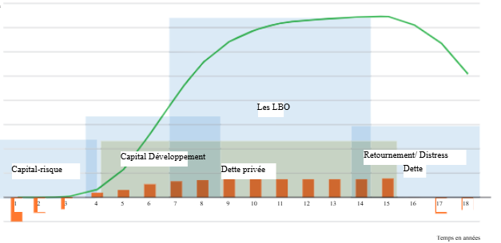

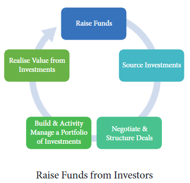

Les gestionnaires de fonds réalisent des rendements principalement grâce aux gains en capital réalisés en vendant ou en flottant des placements en capital-investissement, mais aussi grâce aux recapitalisations de revenus et de dividendes, que nous examinons au chapitre 3. La grande majorité des sorties de capital-investissement se font par des acheteurs commerciaux ou d’autres fonds de capital-investissement. L’industrie parle généralement maintenant d’un horizon de sortie de quatre à six ans, ce qui signifie que l’investissement sera fait avec l’hypothèse explicite qu’il sera vendu ou introduit en bourse dans ce délai. Cet horizon de sortie est à l’origine de la critique selon laquelle le capital-investissement est une stratégie d’investissement à court terme. Les gestionnaires de capital-investissement élaborent souvent leurs voies de sortie probables avant de faire un investissement.

Lorsqu’un fonds de capital-investissement est censé avoir levé 1 milliard de dollars, il ne reçoit pas 1 milliard de dollars en espèces de la part des investisseurs dès le premier jour. Les investisseurs n’avancent de l’argent au fonds de capital-investissement qu’en fonction des besoins. Ce qu’ils ont, c’est l’accès à une facilité pouvant aller jusqu’à 1 milliard de dollars qu’ils peuvent puiser au fur et à mesure des besoins pour financer des investissements. Il s’agit d’une distinction cruciale entre les gestionnaires de fonds cotés, qui détiennent des actifs, y compris des liquidités de temps à autre, pour le compte d’investisseurs, et les gestionnaires de fonds de capital-investissement qui ne puisent des liquidités qu’en fonction des besoins et remboursent les liquidités que le fonds reçoit de son investissement.

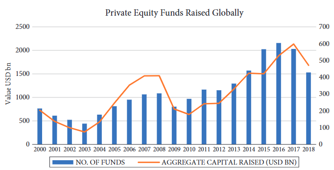
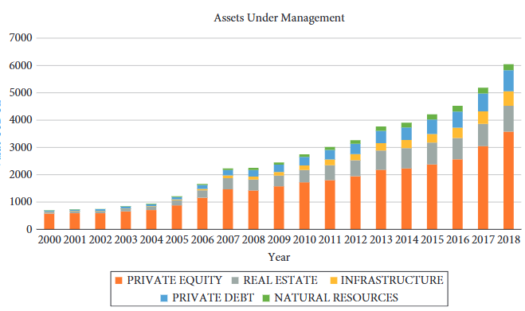
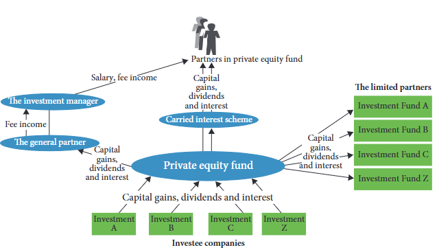

Valeur agrégée ($bn) des opérations de rachat par des fonds d’investissement par pays, 2009–18
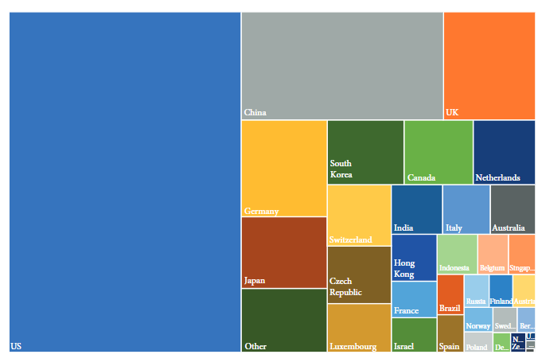

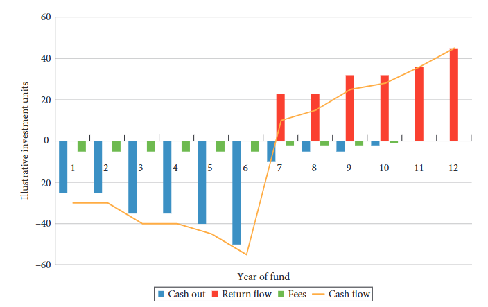

DPI mesure la distribution en pourcentage du capital versé ;

TVPI mesure la valeur totale en pourcentage du capital versé.

# Tableau des indices utilisés dans les PME (Public Market Equivalent)

# Tableau des indices utilisés dans les PME (Public Market Equivalent)

| Index                  | Type of PME | PME Model        | Index Description                                 | Potential Uses       |
|------------------------|-------------|------------------|---------------------------------------------------|----------------------|
| S&P 500                | LN-PME      | Long Nickels     | Largest 500 US quoted companies                   | US PE                |
| S&P 500                | KS-PME      | Kaplan Schoar    | Largest 500 US quoted companies                   | US PE                |
| S&P 500                | PME+        | PME+             | Largest 500 US quoted companies                   | US PE                |
| RUSSELL 2000           | LN-PME      | Long Nickels     | 2000 Smallest companies in Russell 3000           | US PE                |
| RUSSELL 2000           | KS-PME      | Kaplan Schoar    | 2000 Smallest companies in Russell 3000           | US PE                |
| RUSSELL 2000           | PME+        | PME+             | 2000 Smallest companies in Russell 3000           | US PE                |
| RUSSELL 3000           | LN-PME      | Long Nickels     | Largest 3000 US quoted companies                  | US PE                |
| RUSSELL 3000           | KS-PME      | Kaplan Schoar    | Largest 3000 US quoted companies                  | US PE                |
| RUSSELL 3000           | PME+        | PME+             | Largest 3000 US quoted companies                  | US PE                |
| MSCI EMERGING MARKETS  | LN-PME      | Long Nickels     | Mid and large cap from 26 emerging economies      | Emerging markets PE  |
| MSCI EMERGING MARKETS  | KS-PME      | Kaplan Schoar    | Mid and large cap from 26 emerging economies      | Emerging markets PE  |
| MSCI EMERGING MARKETS  | PME+        | PME+             | Mid and large cap from 26 emerging economies      | Emerging markets PE  |
| MSCI EUROPE STANDARD   | LN-PME      | Long Nickels     | Mid and large cap from 15 developed economies     | European PE          |
| MSCI EUROPE STANDARD   | KS-PME      | Kaplan Schoar    | Mid and large cap from 15 developed economies     | European PE          |
| MSCI EUROPE STANDARD   | PME+        | PME+             | Mid and large cap from 15 developed economies     | European PE          |
| MSCI US REIT           | LN-PME      | Long Nickels     | US equity real estate investment trusts (REITs)   | US property          |
| MSCI US REIT           | KS-PME      | Kaplan Schoar    | US equity real estate investment trusts (REITs)   | US property          |
| MSCI US REIT           | PME+        | PME+             | US equity real estate investment trusts (REITs)   | US property          |
| MSCI WORLD             | LN-PME      | Long Nickels     | Mid and large cap from 23 developed economies     | Global PE            |
| MSCI WORLD             | KS-PME      | Kaplan Schoar    | Mid and large cap from 23 developed economies     | Global PE            |
| MSCI WORLD             | PME+        | PME+             | Mid and large cap from 23 developed economies     | Global PE            |

Combiner les multiples monétaires et le TRI : « Espace IRR/DPI »	
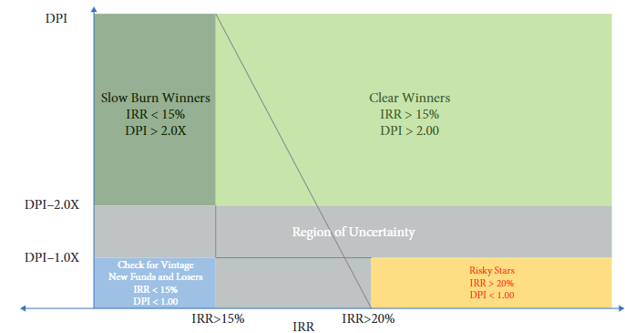
Les TRI (qui comprennent les actifs à l’évaluation) capturent le coût d’opportunité et le DPI capture les multiples en espèces, hors valorisations.

Les TRI qui sont motivés par des valorisations élevées ont de faibles DPI. Il s’agit de stars potentielles, mais tout investisseur doit examiner de près la base d’évaluation qui sous-tend les calculs. À l’inverse, des TRI élevés avec des DPI élevés sont les grands gagnants avec peu de risque résiduel de sous-performance.

Lorsque les TRI sont faibles mais que les multiples de flux de trésorerie sont élevés, vous envisagez des succès à combustion lente où le temps a réduit le TRI malgré le fort multiple de trésorerie.

Si les fonds sont matures et ont un faible DPI et un faible TRI, ils sont probablement, mais pas certainement, sous-performants. Un retournement significatif de la valorisation qui génère des flux de trésorerie est nécessaire pour se déplacer vers la droite dans le diagramme.

Les zones difficiles à évaluer sont les domaines où les fonds sont jeunes, le DPI est inférieur à ~2,0 et les TRI ne sont pas exceptionnels. C’est la région où le jugement et la chance sont nécessaires.

Pour donner une idée de ce à quoi ressemble l’univers des fonds, nous vous présentons ci-dessous une analyse des fonds de la base de données Preqin.

L'«Multiple expansion » est le processus qui consiste à acheter un dollar donné de flux de trésorerie à une valeur inférieure à celle à laquelle vous le vendez finalement à l’avenir. De nombreuses sociétés de capital-investissement recherchent des accords exclusifs qui leur permettent d’acheter des actifs à un coût inférieur à celui qu’elles peuvent vendre à des acquéreurs stratégiques ou au marché public à l’avenir. Au cours du boom des rachats par emprunt (LBO) des années 2000, la hausse des multiples des marchés publics a permis aux investisseurs en capital-investissement d’acheter des entreprises, de les conserver pendant un certain temps, puis de les vendre lorsque les multiples de marché augmentaient. La durabilité de l’exécution d’un programme de capital-investissement basé sur l’expansion multiple est toutefois soumise à la concurrence et aux cycles généraux du marché.

 La note commence par examiner deux approches de l’analyse des flux de trésorerie actualisés, les flux de trésorerie en capital (CCF) et le coût moyen pondéré du capital (WACC). 
 
 L’évaluation de chaque entreprise comparable repose implicitement sur des hypothèses d’évaluation DCF
 

# Marché organisé du capital-investissement

- Le marché est dominé par des **fonds**, généralement structurés en **sociétés en commandite**, qui servent d’intermédiaires financiers principaux.
- Ces fonds sont créés et gérés par des **sociétés de gestion de fonds** (ou sociétés de capital-investissement).
- Les investisseurs, appelés **commanditaires** (LP), mettent en commun des capitaux dans ces fonds pour investir dans des sociétés privées.
- Les gestionnaires, appelés **commandités** ou **gestionnaires de fonds**, comprennent notamment des sociétés de capital-risque et des gestionnaires de rachats.

## Objectifs et structure

- Les véhicules d’investissement sont structurés pour :
  - Accroître la **transparence** (les investisseurs sont considérés comme investissant directement dans les sociétés du portefeuille),
  - Réduire l’**imposition**,
  - Limiter la **responsabilité** (les investisseurs ne perdent que le capital engagé).

## Fonds de capital-investissement et fonds de fonds

- Les fonds de capital-investissement sont le type d’investissement institutionnel le plus courant.
- Le **mandant** fournit les ressources, tandis que le **gestionnaire du programme** agit comme agent et investit les capitaux en tant que LP.

### Fonds de fonds

- Ce sont des véhicules qui réunissent des capitaux d’investisseurs pour investir dans un portefeuille diversifié de fonds.
- Ils peuvent être spécialisés par secteur ou région, ou suivre une approche généraliste.

### Activités principales des fonds de fonds

1. **Investissements primaires** dans des sociétés en commandite nouvellement créées (blind pool — capital engagé sans connaître précisément les sociétés du portefeuille).
2. **Co-investissements** aux côtés des investissements primaires, nécessitant une expertise directe.
3. **Investissements secondaires** dans des fonds existants ou portefeuilles directs, une niche pour certains fonds spécialisés (ex. Coller Capital, Greenpark Capital, Lexington Partners).

## Particularités des fonds de fonds

- Un fonds de fonds peut avoir des relations établies avec des gestionnaires par des investissements existants.
- Leur portefeuille futur est donc plus **prévisible** que dans un pool aveugle classique.
- Les fonds de fonds sont commercialisés soit en mode **aveugle**, soit en mode **éclairé** (où certains ou tous les fonds ciblés sont connus).
 # Investir dans des fonds de fonds : avantages et considérations

## 7.4.2.1 Diversification et intermédiation

- Les fonds de fonds permettent un accès rapide et diversifié au capital-investissement.
- Ils offrent une **protection contre les baisses** grâce à la diversification, notamment sur des marchés émergents, nouvelles technologies ou nouvelles équipes.
- Des études (Weidig et Mathonet 2004 ; Mathonet et Meyer 2007) montrent que les fonds de fonds ont des performances similaires aux fonds individuels, mais avec moins de volatilité extrême.
- Ils permettent aux **petites institutions** d’atteindre une diversification significative.
- Pour les grandes institutions, les fonds de fonds réduisent les coûts administratifs en mutualisant les frais et en augmentant la taille des engagements.

## 7.4.2.2 Ressources et informations

- Les fonds de fonds fournissent une **expertise** en diligence raisonnable, surveillance et restructuration.
- Ils disposent d’un vaste réseau et accès à des fonds de haute qualité.
- La gestion des liquidités, les négociations et la structuration de contrats demandent des ressources importantes et des compétences spécialisées.
- Être un nouvel investisseur direct dans le capital-investissement est difficile ; les fonds de fonds facilitent cet accès grâce à leur présence continue dans l’industrie et leur compréhension du marché.

## 7.4.2.3 Compétences et expertise en matière de sélection

- Les gestionnaires de fonds de fonds sont censés :
  - Accéder aux fonds les plus performants (par invitation ou identification précoce).
  - Identifier des fonds jeunes prometteurs.
  - Jouer un rôle éducatif auprès d’investisseurs moins expérimentés en expliquant les risques et particularités des fonds sélectionnés.
 
 ### Cycle de vie des relations LP-GP

- Les GP doivent lever de nouveaux fonds environ tous les 3 à 5 ans, lorsque le capital de leur fonds actif est pleinement investi ou réservé aux suivis.
- Les relations LP-GP évoluent à travers plusieurs tours d’investissement, créant un **cercle vertueux** d’expérience et d’augmentation de la taille des fonds.
- Les acteurs expérimentés bénéficient de ces relations à long terme.
- Initialement, les critères sont stricts, et les premiers fonds ne génèrent pas forcément beaucoup de profits pour les gestionnaires.
- Un bon **track record** facilite la levée de fonds suivante, rendant la collecte moins coûteuse pour les fonds réputés.	

  Les GP sont confrontés au dilemme de savoir s’il faut réaliser un investissement sur une courte période pour optimiser le TRI ou le conserver et essayer d’optimiser le multiple. Par exemple, est-il préférable de générer un TRI de 50 % sur une période de trois mois, ce qui donne un multiple de 1,11 × sur le capital investi, ou seulement un TRI de 10 % sur une période de trois ans, ce qui conduit à un multiple de 1,33 × ? Le rendement préférentiel standard, basé sur le TRI, incite les premiers. Une autre solution consiste à baser le rendement privilégié sur le multiple.

Les commissions incitatives sont utilisées pour récompenser les gestionnaires lorsque le fonds se porte bien, mais l’absence de ces frais ne constitue pas à elle seule une punition suffisante lorsque le gestionnaire sous-performe. Avec ce type de structure, plus un gestionnaire prend de risques, plus le potentiel de hausse est important, avec peu d’impact immédiat des pertes à la baisse. C’est pourquoi l’apport en capital du GP est si important.

### 1. **Le rattrapage (catch-up)**
- **Définition** : Mécanisme selon lequel les GPs reçoivent 100 % des distributions au-delà d’un seuil de rendement (hurdle rate) jusqu’à atteindre leur quote-part (carried interest).
- **Exemple typique** : Si le hurdle est de 8 % et le carry est de 20 %, alors après que les LPs aient récupéré leur capital + 8 %, le GP peut recevoir 100 % des flux jusqu’à avoir reçu 20 % des gains totaux, puis la distribution repasse à 80/20.

> **Problème** : Ce système n'est **pas information-preserving**. Des valeurs d'actifs brutes différentes peuvent produire la même VNI (valeur nette d'inventaire) à cause du fonctionnement du rattrapage.

## Le Co-investissement dans le Capital-Investissement : Enjeux, Avantages et Limites

### 1. Pourquoi les LP recourent à l’intermédiation ?
- Les institutions évitent l’investissement direct dans les entreprises non cotées faute de :
  - Compétences internes spécialisées
  - Structures d’incitation adéquates
- Exception : cas des **co-investissements**, souvent à côté des GP

---

### 2. Co-investissement ≠ Investissement direct
- Le co-investissement est **proposé par le GP** aux LP pour des deals spécifiques
- Les LP **n'ont généralement pas d’initiative directe** dans la sélection

---

### 3. **Problèmes et Risques**
- Étude de Fang, Ivashina & Lerner (2012) :
  - **Sous-performance des co-investissements** par rapport aux investissements directs indépendants
  - Les co-investissements impliquent souvent des **transactions plus grosses** (x5 la taille moyenne) → plus risquées
  - Risque de **problème d’agence** : les GPs peuvent proposer aux LP des "lemons" (opérations moins prometteuses)
  - Les LP sont **passifs**, réactifs à ce qu’on leur propose

---

### 4. **Pratiques et Frais**
- Co-investissements **souvent sans frais** de gestion ni carried interest
  - → Car le LP est déjà engagé dans le fonds
  - → Peut apporter une **expertise sectorielle** ou stratégique
- ⚠️ Certains LP **préfèrent payer** des frais (carried interest/frais de gestion) pour **aligner les incitations**

---

### 5. **Avantages des co-investissements pour les LP**

#### a. **Réduction des frais**
- Évite une **double couche** de frais (fonds + sous-jacents)

#### b. **Ciblage stratégique**
- Permet d’**affiner l’allocation sectorielle ou géographique**
- Réduit l’exposition aux entreprises en **phase pré-revenus**

#### c. **Diversification optimisée**
- Évite la **surdiversification** du portefeuille
- Permet d’augmenter l’exposition sur les meilleures cibles sans lancer un nouveau fonds

#### d. **Flexibilité de liquidité**
- Outil de gestion dans une **stratégie de surengagement**
- Co-investissement = **option** que le LP peut refuser en cas de tension de liquidité

#### e. **Moins de dilution**
- Surtout pertinent dans les petits fonds et en capital-risque
- Renforce le pouvoir d'investissement sans inviter d’autres GPs (évite conflits)

#### f. **Double niveau d’analyse**
- Diligence partiellement déléguée au GP
- Le LP bénéficie d’un **filtrage professionnel**

#### g. **Meilleur suivi des fonds**
- Accès à **des informations plus riches** que les rapports standards
- Aide à comprendre le fonctionnement du GP → Meilleure sélection future

#### h. **Accès aux meilleurs fonds**
- Permet de **bâtir des relations** avec des fonds "sur invitation seulement"
- Potentiel accès anticipé à des fonds fermés

#### i. **Réduction de l’effet de la courbe en J**
- Déploiement plus rapide du capital
- Flux de trésorerie plus réguliers que via les engagements de fonds classiques

---

### 6. **Limites pratiques**
- Offre de co-investissement souvent **irrégulière et de faible qualité**
- **Volume insuffisant** pour lisser significativement la courbe en J sur de grands portefeuilles
- Co-investir nécessite des **ressources internes** pour la diligence et le suivi

---

### 7. Conclusion
Le co-investissement est un **outil stratégique puissant** pour les LP, à condition de :
- Ne pas l’envisager comme **passif**
- Développer une capacité interne d’analyse
- Gérer activement les relations avec les GPs
- Être sélectif dans les deals acceptés

Analyse comparative du capital-investissement

Le benchmarking vise à évaluer la performance d’une entité spécifique en la comparant à une norme ou à un point de référence. Les investisseurs institutionnels en général, et les investisseurs institutionnels en capital-investissement (PE) en particulier, s’appuient sur des indices de référence lorsqu’ils prennent des décisions d’allocation d’actifs. Les gestionnaires de capital-investissement s’appuient également sur des références. Un benchmark répond aux besoins suivants :

Dans le cadre du processus d’allocation d’actifs stratégique, au cours duquel les propriétés risque-rendement des classes d’actifs sont évaluées et une allocation optimale au sein d’un portefeuille diversifié est déterminée

En tant que norme ou point de référence permettant d’évaluer la performance d’un titre ou d’un gestionnaire d’investissement

Il s’agit d’une norme utilisée par les gestionnaires d’investissement pour comparer leur performance afin de commercialiser leurs services et de communiquer avec les investisseurs actuels et potentiels.

Dans le cadre du processus visant à fournir les bons incitatifs aux gestionnaires, à déterminer où et quels types d’améliorations sont nécessaires dans le processus d’investissement, et à analyser comment les gestionnaires concurrents atteignent leurs niveaux de performance élevés

Le processus de construction et d’utilisation d’un benchmark nécessite les éléments suivants :

Évaluer un actif de capital-investissement et mesurer la performance de cet actif

Choisir l’indice de référence approprié pour un investissement en capital-investissement direct, un fonds de capital-investissement ou un fonds de fonds

Comparaison de la performance de cet actif de capital-investissement avec l’indice de référence

Les investissements en capital-investissement présentent des caractéristiques clés qui distinguent cette classe d’actifs des autres classes d’actifs et impliquent que les techniques d’étalonnage et de construction de portefeuille seront différentes (cf. chapitre 9).

Dans le cas des fonds de capital-investissement, l’analyse comparative est normalement effectuée à partir des performances financières passées d’un gestionnaire de fonds particulier et, en tant que telle, fait partie du processus de due diligence. Cependant, le benchmarking peut également couvrir la performance financière actuelle et est donc également utilisé comme critère de sélection (analyse des antécédents) dans le processus de surveillance.

# 📊 Évaluation & Performance des Fonds de Capital-Investissement (Private Equity)

## 🧾 Évaluation des Actifs de Capital-Investissement (PE)

### 🔹 Caractéristiques générales

- L’évaluation des investissements en capital-investissement est difficile :
  - Peu ou pas d’historique d’exploitation.
  - Parfois aucune rentabilité.
- Basée sur des **opinions professionnelles** (pas des prix de marché).
- Comparable à d'autres actifs **illiquides** (ex : fonds immobiliers privés).

### 🔹 Normes d’évaluation

- Utilisation des normes **IPEV** (International Private Equity and Venture Capital Valuation Guidelines).
- Premières directives publiées en 2005, mises à jour en 2015.

### 🔹 Capital-risque (VC)

- Difficile à évaluer par méthode DCF (actualisation des flux de trésorerie).
- Repose surtout sur :
  - Actifs incorporels (brevets, compétences des fondateurs).
  - Taille de marché attendue.
  - Valeur de sortie estimée par rapport à des sociétés comparables.
- Les **multiples** sont utilisés en l’absence de flux de trésorerie fiables.
- Risques :
  - Surévaluation fréquente.
  - Peu d’investisseurs.
  - Peu ou pas de surveillance externe (ex : créanciers).
  - Risques détectés tardivement (lors de cycles futurs de levée de fonds).

### 🔹 Investissements de rachat (Buyouts)

- Évaluation plus simple :
  - Utilisation de DCF ou de multiples.
- Surveillance accrue par :
  - Syndicats de prêteurs.
  - Souscripteurs d’obligations à haut rendement.
- L’effet de levier est limité par les prêteurs ⇒ plafonnement implicite de la valorisation.

---

## 📈 Mesure de la Performance des Fonds de Capital-Investissement

### 🔹 Problématique

- Le capital-investissement suit des **flux de trésorerie irréguliers**, non compatibles avec les méthodes classiques de mesure de rendement utilisées pour les actifs liquides.
- Les **rendements pondérés dans le temps** ne reflètent pas la performance réelle des gestionnaires de PE.

### 🔹 Méthodes adaptées au PE

- On privilégie les **rendements pondérés en fonction de la trésorerie** (cash-weighted returns).
- Chaque montant investi a le **même poids** dans l’analyse.

### 🔹 Indicateurs clés

- **TRI** : Taux de Rendement Interne
  - Taux d’actualisation qui égalise les **VA des distributions** (entrées) et des **appels de capitaux** (sorties).
- **TVPI** : Total Value to Paid-In
  - TVPI = (Valeur actuelle des actifs restants + distributions totales) / capital total investi.
- **TRI provisoire (TIIR)** : inclut la valeur liquidative (VNI) du fonds.
- **Multiples monétaires** : autre façon de mesurer le rendement, sans prise en compte de la durée.

### 🔹 Limites des mesures traditionnelles

- Les mesures comme le **TRI** et le **TVPI** ne permettent pas :
  - De comparer le PE aux actions cotées.
  - De mesurer l’effet du **temps** (durée de l’investissement).
- Ne sont utiles que pour des comparaisons **intra-PE**, pas avec d’autres classes d’actifs.

---

## 🧮 Mesures Équivalentes au Marché Public (Public Market Equivalent, PME)

### 🔹 Objectif

- Comparer les rendements du PE à ceux d’un indice boursier (ex : MSCI World).
- Reflète le **coût d’opportunité** du capital.

### 🔹 Méthodologie PME

1. Simuler un investissement des flux de trésorerie dans un indice de marché (benchmark).
2. Calculer la valeur future (FV) des cash flows investis dans ce benchmark.
3. Calculer un TRI ou un multiple basé sur cette valeur future.

---

## ✅ Résumé des Méthodes

| Méthode | Type | Avantages | Limites |
|--------|------|-----------|---------|
| TRI | Cash-weighted | Tient compte du timing des flux | Ne compare pas bien avec les actifs liquides |
| TVPI | Multiple monétaire | Simple, global | Ignore la durée |
| TIIR | TRI ajusté avec VNI | Inclut la valeur résiduelle | Peut être biaisé |
| PME | Benchmark-based | Comparaison avec le marché public | Hypothèses fortes |

# Valuation in Private Equity 

  # Valorisation d'entreprise par la méthode CCF et la formule de Gordon-Shapiro

## Contexte général

La valorisation d’entreprise repose sur l’actualisation des **flux futurs de trésorerie** générés par ses activités. Plusieurs approches sont utilisées, dont :

- **Free Cash Flow (FCF)** : flux disponibles pour tous les apporteurs de capitaux après investissements.
- **Capital Cash Flow (CCF)** : flux de trésorerie avant service de la dette mais après impôts.
- **Adjusted Present Value (APV)** : méthode qui sépare la valeur créée par l’exploitation et celle créée par la structure de financement.

La méthode **CCF** est adaptée quand la structure de capital est **stable** ou **ciblée**, et elle **intègre directement les avantages fiscaux liés aux intérêts** dans le taux d’actualisation.

---

##  1. Calcul du Free Cash Flow (FCF)

Le **FCF** (flux de trésorerie disponible) est défini par :

$$
FCF_t = EBIT_t \cdot (1 - \tau) + DEPR_t - CAPEX_t - \Delta WK_t - autres_t
$$

Avec :
- $EBIT_t$ : Bénéfice avant intérêts et impôts à la période $t$
- $\tau$ : Taux d’imposition
- $DEPR_t$ : Amortissements
- $CAPEX_t$ : Dépenses en capital
- $\Delta WK_t$ : Variation du fonds de roulement
- $autres_t$ : Autres charges hors exploitation (ex. provisions, salaires dus)

---

##  2. Valorisation avec la méthode Capital Cash Flow (CCF)

La valeur de l’entreprise à $t = 0$ est obtenue par actualisation des flux $CCF_t$ :

$$
V_0 = \sum_{t=1}^{T} \frac{CCF_t}{(1 + r_A)^t}
$$

Où :
- $V_0$ : Valeur actuelle de l’entreprise
- $r_A$ : Coût moyen pondéré du capital sans impôt (WACC non fiscal)
- $CCF_t$ : Capital Cash Flow à la période $t$

Le $CCF$ inclut les flux d'exploitation **et** les économies d'impôt liées aux intérêts d'emprunt.

---

##  3. Valeur terminale avec la formule de Gordon-Shapiro

Lorsque la croissance devient stable après une période de prévision explicite, on utilise la **croissance perpétuelle** (Gordon-Shapiro) :

$$
TV_T = \frac{CF_{T+1}}{r - g} = \frac{CF_T \cdot (1 + g)}{r - g}
$$

Avec :
- $TV_T$ : Valeur terminale en fin de période $T$
- $CF_T$ : Flux de trésorerie à la période $T$
- $g$ : Taux de croissance perpétuel
- $r$ : Taux d’actualisation

Cette valeur est ensuite comparée au coût de l’investissement pour déterminer si l’entreprise ou l’individu doit réaliser le projet.  

La méthode **CCF** moins le coût de l’investissement $I$ donne un terme très utilisé : la **valeur actuelle nette (VAN ou NPV en anglais)**.

$$
NPV = PV_{CCF} - I
$$

où :  
- $NPV$ (VAN) : valeur actuelle nette  
- $PV_{CCF}$ : valeur actuelle des Capital Cash Flows  
- $I$ : coût de l’investissement initial

##  4. Estimation du risque : le bêta et le CAPM

###  Modèle d’évaluation des actifs financiers (CAPM)

$$
R_e = R_f + \beta \cdot (R_m - R_f)
$$

Où :
- $R_e$ : Coût des capitaux propres
- $R_f$ : Taux sans risque
- $\beta$ : Sensibilité de l’actif au risque de marché
- $R_m - R_f$ : Prime de risque de marché

###  Bêta désendetté (Unlevered Beta)

Pour comparer le risque systématique indépendamment de la structure de capital, on calcule le **bêta désendetté** :

$$
\beta_U = \frac{\beta_L}{1 + (D/E) \cdot (1 - \tau)}
$$

Avec :
- $\beta_U$ : Bêta désendetté (unlevered)
- $\beta_L$ : Bêta observé (leveraged)
- $D/E$ : Ratio d’endettement (valeurs de marché)
- $\tau$ : Taux d’imposition effectif

## Étapes d’estimation du bêta (comparables)

1. Identifier des entreprises **comparables cotées**.
2. Estimer leur $\beta_L$ à partir d'une **régression historique** :
   $$
   R_{i,t} - R_f = \alpha + \beta_L \cdot (R_{M,t} - R_f) + \varepsilon_t
   $$
3. Obtenir leurs données $D$, $E$, et $\tau$.
4. Calculer $\beta_U$ pour chaque comparable.
5. Relever (re-leverage) si nécessaire pour adapter à la structure cible :
   $$
   \beta_{L,\text{cible}} = \beta_U \cdot \left[1 + (D/E)_\text{cible} \cdot (1 - \tau)\right]
   $$

##  Résumé des points clés

- **FCF** : Flux disponibles pour les apporteurs de capitaux.
- **CCF** : Inclut les économies d’impôt sur intérêts et s’actualise avec $r_A$.
- **Gordon-Shapiro** : Fournit une estimation de valeur terminale sous croissance perpétuelle.
- **CAPM + bêta** : Permet de déterminer le coût du capital en lien avec le risque systématique.

* Le bêta n’est pas une vérité absolue : Il ne faut pas considérer le bêta comme un fait exact ou un taux d’actualisation infaillible. Le modèle CAPM et ses calculs de coûts du capital restent controversés et approximatifs.

* Mesures imprécises : Les estimations de bêta comportent souvent des erreurs importantes. Deux entreprises similaires peuvent avoir des bêta très différents, et la précision individuelle d’un bêta est généralement faible.

* Utiliser des comparables : Pour réduire le bruit statistique, il est conseillé d’utiliser plusieurs entreprises comparables et de faire une moyenne. Attention toutefois à ne pas inclure des entreprises trop différentes, ce qui biaiserait les résultats.

* Difficulté à trouver des comparables pertinents : Il faut choisir des sociétés proches en termes d’activité et de structure, ce qui demande une analyse fine des métiers et des poids relatifs des segments d’activité.

* Le bêta varie dans le temps : Le risque systématique et la structure financière d’une entreprise changent, donc le bêta peut évoluer d’une année à l’autre, ce qui impose de la prudence dans son usage sur des périodes longues.

# WACC et valorisation d'entreprise

Le **WACC** (Weighted Average Cost of Capital) et la méthode **CCF** (Capital Cash Flow) utilisent tous deux les mêmes flux de trésorerie opérationnels (FCF) et les mêmes bêtas d’actifs pour la valorisation d’entreprise.

La principale différence entre ces deux méthodes réside dans la manière dont les avantages fiscaux liés à la dette sont pris en compte.

---

## Méthode WACC

La méthode **WACC** actualise les flux de trésorerie après paiement des intérêts (Free Cash Flows to Firm, FCF) avec un taux d’actualisation qui reflète la structure financière de l’entreprise et intègre l’avantage fiscal de la dette.

Le **coût moyen pondéré du capital (WACC)** est défini par la formule suivante :

$$
WACC = \frac{E}{D + E} \times r_E + \frac{D}{D + E} \times r_D \times (1 - \tau)
$$

où :

- $E$ : valeur de marché des fonds propres  
- $D$ : valeur de marché de la dette  
- $r_E$ : coût des capitaux propres  
- $r_D$ : coût de la dette  
- $\tau$ : taux d’imposition effectif  

---

La valeur actuelle des flux de trésorerie, qui représente la valeur de l’entreprise, est calculée en actualisant les flux de trésorerie disponibles (FCF) avec le WACC :

$$
V_0 = \sum_{t=1}^{T} \frac{FCF_t}{(1 + WACC)^t}
$$

où :

- $FCF_t$ : flux de trésorerie disponible à la période $t$ (après paiement des intérêts)  
- $T$ : dernière période de projection explicite  

---

### Valeur terminale et croissance perpétuelle

Pour estimer la valeur de l’entreprise au-delà de la période explicite $T$, on utilise souvent la formule de croissance perpétuelle (modèle de Gordon-Shapiro) :

$$
TV_T = \frac{CF_{T+1}}{WACC - g} = \frac{CF_T \times (1 + g)}{WACC - g}
$$

où :

- $TV_T$ : valeur terminale à la fin de la période $T$  
- $CF_T$ : flux de trésorerie à la période $T$  
- $CF_{T+1}$ : flux projeté à la période $T+1$  
- $g$ : taux de croissance perpétuel des flux de trésorerie (à long terme)  

Ainsi, la valeur actuelle totale (présente) des flux de trésorerie avec croissance perpétuelle s’écrit :

$$
PV = \sum_{t=1}^{T} \frac{CF_t}{(1 + WACC)^t} + \frac{CF_{T+1}}{(WACC - g) \times (1 + WACC)^T}
$$

Cette approche permet de valoriser l’entreprise en tenant compte de :

- la structure financière (via le WACC)  
- les avantages fiscaux de la dette (intégrés dans le WACC via $(1-\tau)$)  
- la croissance durable des flux de trésorerie au-delà de la période de projection  

La valeur actuelle nette (VAN) du projet est donnée par l’équation suivante :

$$
VAN = VA - I
$$

où :  
- $VA$ est la valeur actuelle des flux de trésorerie attendus du projet  
- $I$ est l’investissement initial

Les valeurs obtenues avec les méthodes WACC (Weighted Average Cost of Capital) et CCF (Capital Cash Flow) devraient être très proches. 

* La méthode CCF est souvent plus simple à utiliser et permet de calculer explicitement la valeur actuelle nette des avantages fiscaux liés à l’endettement (bouclier fiscal).

* La méthode WACC est plus intuitive lorsque vous travaillez avec un ratio d’endettement stable (structure capitalistique équilibrée).

#  MÉTHODOLOGIE D’ÉVALUATION PAR MULTIPLES

Une méthode d’évaluation courante, souvent utilisée en complément des flux de trésorerie actualisés (DCF), est l’évaluation par multiples. Cette méthode est largement pratiquée par les banquiers d’investissement, investisseurs en capital-investissement et analystes financiers.

Elle consiste à identifier une entreprise ou un groupe d’entreprises comparables à celle à évaluer. Ces entreprises comparables sont choisies en fonction de critères comme l’industrie, la taille, les performances passées, le modèle d’affaires ou les taux de croissance.

## Principe de la méthode

1. **Calcul des multiples**  
   On calcule un multiple pour chaque entreprise comparable, généralement le rapport entre une **valeur d’entreprise** (EV) et une mesure de performance financière (chiffre d’affaires, EBITDA, bénéfice net, etc.).

2. **Application des multiples**  
   Le multiple obtenu est ajusté si nécessaire, puis appliqué à la même mesure de performance de l’entreprise cible pour en déduire sa valeur.

## Ajustements et précautions

- Si une seule entreprise comparable est disponible, il est crucial d’ajuster le multiple pour refléter les différences de croissance, risque et génération de flux de trésorerie.
- Les multiples doivent correspondre à des entreprises similaires en termes de flux de trésorerie attendus, croissance et risque.
- La méthode est une variante de la méthode DCF, utilisant la notion de **valeur terminale** basée sur un multiple.

## Formule du multiple de flux de trésorerie (cash flow multiple)

Le multiple d’évaluation peut être calculé à partir de la relation entre la valeur et le flux de trésorerie actualisé à perpétuité, avec croissance constante \(g\) :

$$
\text{Multiple}_{CF} = \frac{CF \times (1 + g)}{r_a - g}
\tag{13}
$$

où :

- \(CF\) = flux de trésorerie de la période courante  
- \(g\) = taux de croissance à long terme (perpétuel)  
- \(r_a\) = coût du capital des actifs (taux d’actualisation)

## Exemple : Multiple EBITDA

Le multiple basé sur l’EBITDA est souvent utilisé. Il se calcule via une fonction \(F\) qui convertit l’EBITDA en flux de trésorerie, puis applique le même principe :

$$
\text{Multiple}_{EBITDA} = F(\text{EBITDA}) \times \frac{1 + g}{r_a - g}
\tag{14}
$$

## Choix des multiples : cash flow vs autres mesures

- Les multiples basés sur le **cash flow** sont généralement préférables car ils reflètent mieux la capacité réelle de l’entreprise à générer des liquidités.
- L’EBITDA est souvent plus proche du cash flow que les mesures comme le bénéfice net ou le chiffre d’affaires.
- Il faut toujours vérifier la relation entre la mesure choisie (revenus, bénéfices, EBITDA) et les flux de trésorerie réels.
- Par exemple, deux entreprises avec des revenus identiques peuvent avoir des marges de cash flow très différentes, ce qui impactera leur valeur réelle.

## Importance de la croissance et du risque

Le multiple dépend fortement des hypothèses sur :

- La croissance à long terme \(g\) : un multiple plus élevé correspond à une croissance attendue plus forte.
- Le taux d’actualisation \(r_a\) : reflète le risque de l’entreprise.

Si l’entreprise comparable croît plus vite que l’entreprise cible, utiliser son multiple sans ajustement entraînera une **surévaluation**.

- Privilégier les multiples **forward-looking** (basés sur projections futures) plutôt que les multiples historiques (backward-looking), car ils sont plus précis.
- Comparer les risques des entreprises comparables avec ceux de l’entreprise évaluée.

### Impact du taux d’actualisation sur les multiples

- Lorsque le **taux d’actualisation** d’une entreprise augmente, le **multiple** applicable diminue, car des flux de trésorerie plus risqués ont une valeur moindre.
- Si vous évaluez une entreprise avec une entreprise comparable dont le taux d’actualisation est plus faible, il faut **ajuster à la baisse le multiple** de l’entreprise comparable pour refléter ce risque plus élevé.

### Limites de l’évaluation par multiples

- Chaque multiple correspond à un flux de trésorerie actualisé d’une seule étape.
- Les évaluations par multiples doivent être utilisées comme **complément** à d’autres méthodes.
- Une analyse approfondie par flux de trésorerie actualisés (DCF) donne généralement des résultats plus fiables qu’une évaluation rapide par multiples.

### Choix de la méthode d’évaluation

- Pour une entreprise stable et un investissement unique, le **CCF** ou le **WACC** standard conviennent, fournissant des résultats similaires.
- Les investisseurs en capital-investissement préfèrent souvent les modèles de valorisation **LBO** adaptés à leurs objectifs de rendement.
- Une évaluation réfléchie via des entreprises comparables permet de valider la cohérence des autres méthodes.

Exemple
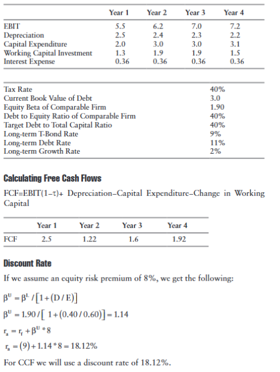
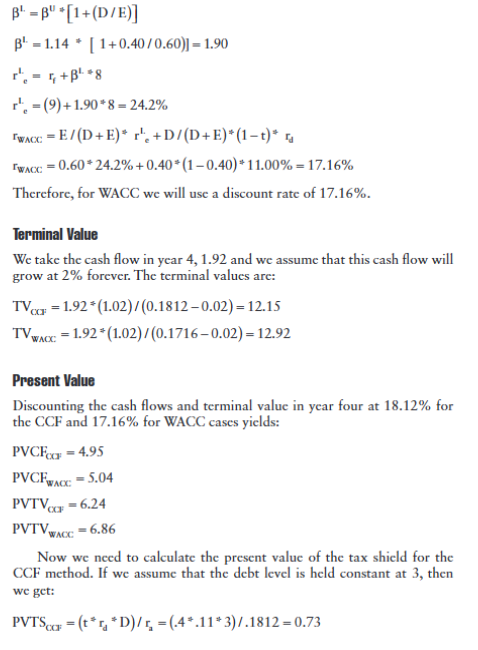
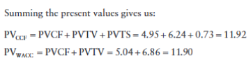