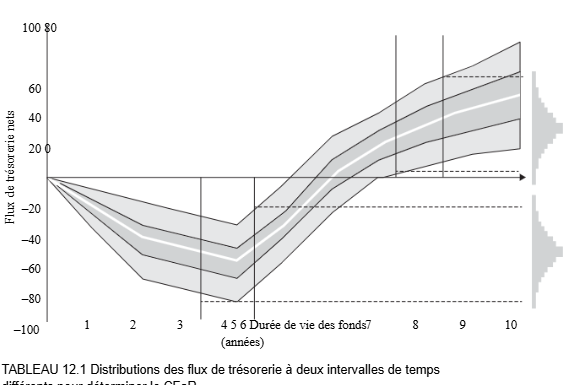
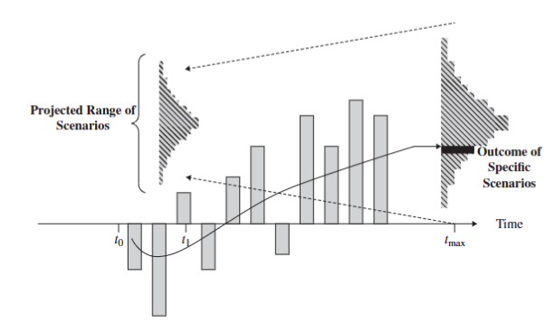
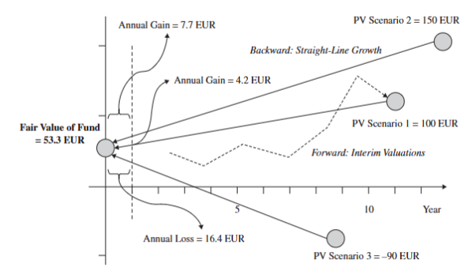
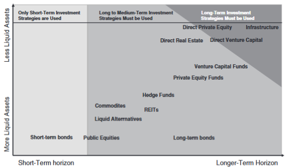
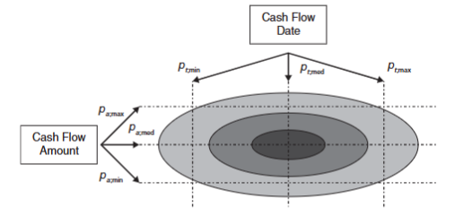

# Taux de Rendement Interne (TRI)

Le TRI est le taux d’actualisation implicite qui rend la valeur actualisée nette de tous les flux de trésorerie égale à zéro. C’est la mesure de performance la plus couramment utilisée en capital-investissement, mais il présente plusieurs limites, notamment sa forte sensibilité au calendrier et à la taille des flux de trésorerie.

Le TRI est particulièrement utile lorsque les investissements et désinvestissements sont irréguliers, comme c’est souvent le cas dans les fonds de capital-investissement.

Mathématiquement, le TRI est déterminé en résolvant l’équation suivante :

$$
\sum_{t=0}^T \frac{D_t}{(1 + IRR)^t} - \sum_{t=0}^T \frac{C_t}{(1 + IRR)^t} = 0
$$

- $D_t$ : distribution du fonds à la période $t$  
- $C_t$ : apport ou prélèvement en capital à la période $t$  
- $IRR$ : taux de rendement interne net des investisseurs à l’échéance $T$

# TRI Provisoire (IIRR)

Le TRI provisoire est utilisé pour les fonds non liquidés. Il prend en compte la valeur résiduelle ou valeur liquidative ($NAV_T$) des avoirs du fonds comme un flux de trésorerie final. C’est une estimation et non un rendement réel.

La formule est :

$$
\sum_{t=0}^T \frac{D_t}{(1 + IIRR)^t} - \sum_{t=0}^T \frac{C_t}{(1 + IIRR)^t} + \frac{NAV_T}{(1 + IIRR)^T} = 0
$$

- $NAV_T$ : valeur liquidative du fonds à l’instant $T$  
- $IIRR$ : taux de rendement interne intermédiaire net des investisseurs à l’instant $T$

# Taux de Rendement Interne Modifié (MIRR)

Le TRI suppose que les distributions sont réinvesties au même taux que le TRI, ce qui peut être irréaliste. Le TRI modifié corrige cela en utilisant un taux de réinvestissement donné.

La formule du MIRR est :

$$
MIRR = \left( \frac{FV(\text{flux positifs au taux de réinvestissement})}{PV(\text{flux négatifs au coût du capital})} \right)^{\frac{1}{T}} - 1
$$

Mathématiquement :

$$
MIRR_T = \left( \frac{\sum_{t=0}^T D_t \times (1 + RR)^{T - t}}{\sum_{t=0}^T \frac{C_t}{(1 + CC)^t}} \right)^{\frac{1}{T}} - 1
$$

- $RR$ : taux de réinvestissement prévu jusqu’à la période $T$  
- $CC$ : coût du capital des investisseurs jusqu’à la période $T$  
- $D_t$ : distributions à la période $t$  
- $C_t$ : apports à la période $t$  
- $MIRR_T$ : taux de rendement interne modifié jusqu’à la période $T$

Si la valeur liquidative résiduelle du fonds est utilisée dans le numérateur pour calculer la valeur future des entrées, le MIRR est ajusté en conséquence.

**Note :** Le signe négatif au dénominateur reflète que les valeurs absolues des flux négatifs sont utilisées pour calculer la valeur actualisée.

## Autres mesures de performance couramment utilisées

Le TRI n’est pas la seule mesure de performance utilisée par l’industrie. Voici quelques autres mesures couramment utilisées :

- Le ratio distribution sur capital versé (DPI), ou rendement réalisé, est le rapport entre la distribution cumulative aux investisseurs et le capital total appelé auprès des investisseurs.

$$
DPI_T = \frac{\sum_{t=0}^T D_t}{\sum_{t=0}^T C_t}
$$

où :  
- $D_t$ est la distribution pendant la période $t$,  
- $C_t$ est le capital appelé pendant la période $t$.

- Le ratio valeur résiduelle sur capital versé (RVPI), ou rendement non réalisé, à l’instant $T$ est le rapport entre la valeur totale des investissements non réalisés à l’instant $T$ et le capital total appelé auprès des investisseurs lors des périodes précédentes :

$$
RVPI_T = \frac{NAV_T}{\sum_{t=0}^T C_t}
$$

- Le ratio valeur totale sur capital versé (TVPI), ou rendement total, est une mesure de la distribution cumulative aux investisseurs plus la valeur totale des investissements non réalisés par rapport au capital total appelé auprès des investisseurs :

$$
TVPI_T = \frac{\sum_{t=0}^T D_t + NAV_T}{\sum_{t=0}^T C_t} = DPI_T + RVPI_T
$$

Notez que ces ratios mesurent les rendements nets sur le capital investi et ne prennent donc pas en compte la valeur temporelle de l’argent, contrairement au TRI.

Il est important de souligner que l’industrie du capital-investissement tente effectivement d’évaluer la valeur nette d’inventaire (VNI) à la fin de chaque trimestre. Les mesures IIRR, RVPI et TVPI sont calculées sur la base de ces valeurs résiduelles. Leur estimation constitue la partie la plus délicate de l’évaluation des rendements, ce qui explique pourquoi un benchmarking quantitatif doit être complété par une analyse qualitative.

Le DPI, mesuré uniquement à partir du capital distribué, est considéré comme la mesure de rendement la plus fiable, en particulier pour les fonds plus matures.

# Courbe en J (J Curve)

L’un des premiers concepts que les investisseurs dans les fonds de capital-investissement rencontreront est la (tristement) célèbre **courbe en J**, également appelée **crosse de hockey** (voir graphique 8.2).

L’Association européenne du capital-investissement et du capital-risque (EVCA) définit la courbe en J comme la « courbe générée par le tracé des rendements générés par un fonds de capital-investissement en fonction du temps (de la création à la fin) ».

La courbe en J classique de la performance des fonds est principalement due au fait que les politiques de valorisation suivies par l’industrie, combinées à l’incertitude inhérente aux investissements en capital-investissement, empêchent la réévaluation à la hausse des investissements prometteurs jusqu’à assez tard dans la vie d’un fonds, tandis que les frais, les coûts et les dépenses sont immédiatement déduits.

En conséquence, les fonds de capital-investissement ont tendance à afficher une baisse apparente de leur valeur au cours des premières années d’existence, ce que l’on appelle la **vallée des larmes**, avant de commencer à montrer les rendements positifs espérés dans les dernières années de la vie du fonds.

Après environ cinq ans, l’IIRR donnera une indication raisonnable du TRI final à l’échéance du fonds. Cette période est généralement plus courte pour les fonds de rachat que pour les fonds de démarrage et d’expansion.

Il y a quelque temps, on a postulé que l’introduction des lignes directrices d’évaluation de l’IPEV entraînerait l’extinction de la courbe en J, car une valeur vraiment juste pour les fonds éliminerait le biais conservateur causé par la passation en charges anticipée des coûts et la passation en charges différée.

# TYPES DE BENCHMARKS

Swamy, Zeltser, Kazemi et Szado (2011) voient deux grandes approches de la construction des indices de référence, aboutissant à des indices de référence basés sur les actifs et sur les groupes de pairs. Un indice de référence basé sur l’actif est construit en utilisant des titres publics ou privés comme composants. Les indices d’actions, d’obligations, de matières premières et la plupart des indices immobiliers sont de ce type. Par exemple, l’indice S&P 500 est construit comme un portefeuille pondéré en fonction de la capitalisation des 500 plus grandes actions négociées aux États-Unis. Un indice de référence basé sur un groupe de pairs est construit à partir des portefeuilles de gestionnaires de placements comme composants. Par exemple, l’indice CISDM Equity Long/Short est un portefeuille équipondéré de gestionnaires de fonds spéculatifs qui suivent cette stratégie.

Une autre catégorisation est selon que les rendements sont mesurés comme absolus ou relatifs :

- Un rendement absolu est tout simplement le rendement d’un actif ou d’un portefeuille pour une période donnée.
- Un rendement relatif est la différence entre un rendement absolu et les rendements de l’actif ou du portefeuille auquel il est comparé. Les gestionnaires doivent s’appuyer sur des indices de référence relatifs afin d’évaluer comment un actif se compare à un autre.

Le capital-investissement est souvent perçu comme une classe d’actifs à rendement absolu, ce qui se reflète dans l’intéressement aux plus-values, qui est la principale incitation des gestionnaires de fonds et qui est généralement soumis à un taux de rendement minimal, ou rendement préférentiel, de sorte qu’il ne commence à s’accumuler qu’une fois que les investisseurs ont récupéré leur capital et un taux de rendement minimum convenu à l’avance

## Capital-investissement coté

Outre les données sur le capital-investissement coté disponibles en bourse, les associations de capital-investissement cotées ont développé leurs propres indices, tels que le LPX 50. Ces indices suivent les fonds cotés de fonds, de fonds et de sociétés de capital-investissement cotées. Ils sont basés sur des données à jour, sont investissables et proposent des transactions quotidiennes ; Par conséquent, ils satisferaient normalement aux propriétés d’un indice de référence d’investissement approprié, tel que défini à la section 

Cependant, ces indices ne reflètent pas l’univers d’actifs dans lequel les investisseurs institutionnels investissent habituellement. Par exemple, l’indice S&P PE contient Blackstone, une émission d’actions où les revenus comprennent les frais gagnés par le GP et non le rendement des investissements sous-jacents. De plus, le capital-investissement coté ne présente pas les mêmes caractéristiques de risque et de rendement que le capital-investissement non coté. Les caractéristiques statistiques des indices de capital-investissement cotés, telles que la volatilité et la corrélation avec d’autres actifs, dépendent principalement de l’évolution des marchés publics (c’est-à-dire des variations à court terme de l’offre et de la demande) plutôt que de la valeur intrinsèque des actifs sous-jacents.

## Indices d’actions publiques

Étant donné que les actifs de capital-investissement typiques ne sont pas investissables, une autre approche consiste à prendre comme point de référence des titres cotés en bourse qui sont censés avoir les mêmes expositions au risque. En effet, les indices d’actions publiques sont parmi les indices de référence les plus couramment utilisés dans le capital-investissement (Nikulina, Calnan et Disdale 2012). On pense que ces indices sont exposés aux mêmes environnements de marché et présentent des caractéristiques de risque similaires à celles du capital-investissement.

Un indice de référence souvent utilisé est un objectif de rendement exprimé sous forme de prime par rapport aux actions de sociétés ouvertes (p. ex., de 300 à 500 points de base par rapport aux actions de sociétés ouvertes). Cet indice de référence est hybride, étant à la fois un indice de référence relatif (indice d’actions publiques) et un indice de référence absolu (premium). Son utilisation est justifiée par le fait que l’allocation PE est souvent obtenue au détriment des fonds propres publics et peut donc être considérée comme une sorte de coût d’opportunité perçu pour le capital-investissement.

Le concept d’équivalent de marché public offre une solution simple au problème de l’étalonnage des performances (voir section 8.5). L’équivalent du marché public (EMP) est une mesure de rendement indicielle qui utilise les indices de marché pour refléter le coût d’opportunité du capital.

Le PME correspond au rendement pondéré en fonction de la trésorerie qui aurait été obtenu en investissant dans un indice boursier en même temps que le fonds de capital-investissement effectue un appel de fonds et en vendant des actions indicielles chaque fois que le fonds redistribue du capital aux investisseurs. Cette stratégie d’investissement vise à reproduire le modèle irrégulier d’investissement et de désinvestissement de l’investissement en capital-investissement afin de permettre une comparaison approximative des rendements. Étant donné que le PEP est basé sur les mêmes entrées et sorties de fonds que le fonds de capital-investissement, on peut se demander pourquoi il y aurait une différence dans les rendements. En fait, la différence provient du résultat net des processus d’investissement et de désinvestissement dans le fonds indiciel, qui donne soit un solde positif (le marché public affiche une performance plus élevée), soit un solde négatif (le marché public affiche une performance plus faible).

### 8.4.2.1 Application des indices d’actions publiques

Le fondement de diverses approches d’EMP est l’utilisation d’un indice coté en bourse pour calculer les valeurs futures des flux de trésorerie comme s’ils avaient été investis dans cet indice. Par exemple, supposons que la valeur de l’indice coté en bourse à l’instant t soit donnée par $I_t$. Supposons que $D_t$ est le flux de trésorerie reçu au temps $t$. Si ce flux de trésorerie était un investissement dans l’indice, sa valeur future en temps $T$ serait donnée par :

$$
D_t \times \frac{I_T}{I_t}
$$

La valeur future de toutes les distributions et contributions peut être calculée de la même manière :

$$
FV(D) = FV(\text{Distributions}) = \sum_{t=0}^T D_t \times \frac{I_T}{I_t} \tag{8.8}
$$

$$
FV(C) = FV(\text{Contributions}) = \sum_{t=0}^T C_t \times \frac{I_T}{I_t} \tag{8.9}
$$

Une approche particulière du PME, connue sous le nom de ratio PME, utilise les valeurs futures mentionnées selon l’équation suivante :

$$
\text{PME Ratio} = \frac{FV(D) + NAV}{FV(C)}
$$

# Groupes de pairs en capital-investissement (PE)

En capital-investissement, il est courant d’utiliser une cohorte de pairs d’un millésime, d’une zone géographique et d’un groupe de pairs spécifique à un stade ou à un objectif, et d’exprimer le résultat de performance d’un fonds donné en termes de quartile dans lequel il se situe au sein de cette cohorte. Une cohorte de pairs fait référence à un groupe de fonds ou d’investissements de capital-investissement qui partagent certaines caractéristiques importantes. Par exemple, on peut considérer les fonds de capital-investissement européens d’un millésime particulier comme formant une cohorte de pairs. D’autres caractéristiques, telles que l’orientation sectorielle, le stade d’investissement ou même la taille, peuvent être prises en compte dans la création de ces groupes. Un joueur le plus performant au cours d’un millésime lamentable peut à peine restituer les fonds investis, alors que lors de certaines années spectaculaires, même les fonds du quatrième quartile ont généré des rendements à deux chiffres. La figure 8.5 présente un exemple d’analyse comparative de chaque fonds. Le fonds de référence commence comme un fonds du quatrième quartile et se déplace après plusieurs trimestres dans la zone du premier quartile pour atteindre un sommet avec un IIRR de 25 %. Il descend ensuite dans le deuxième quartile et termine sa vie à la limite entre le premier et le deuxième quartile.

Un fonds du quartile supérieur est généralement défini comme un fonds qui fait partie des 25 % des fonds les plus performants de son groupe de pairs au moment de l’analyse comparative. Cela amène certains à conclure que seulement 25 % des fonds peuvent légitimement être qualifiés dans le quartile supérieur. Le fait est que beaucoup plus de fonds sur le marché sont étiquetés et commercialisés dans le quartile supérieur. L’une des raisons en est qu’à l’exception du ratio de 25 % lui-même, rien d’autre dans cette définition n’est gravé dans le marbre (voir le chapitre 9). Par exemple, différents gestionnaires de fonds ou consultants peuvent utiliser différents groupes de pairs pour calculer le rendement relatif de différents fonds. De plus, différentes périodes peuvent être utilisées pour comparer les performances. Même si le même groupe de pairs et la même période sont utilisés, différentes mesures de performance (par exemple, TRI, TVPI ou PME) peuvent être utilisées pour comparer la performance. Par exemple, alors qu’un fonds peut être classé dans le quartile supérieur à l’aide du TRI, il peut être classé comme un fonds du quartile intermédiaire sur la base de TVPI. Il est donc bon d’évaluer un fonds à l’aide de diverses mesures, mais aussi de faire preuve de discernement.

## Définition et utilité  
- Un groupe de pairs est un ensemble de fonds similaires, avec un profil de risque comparable (style, spécialisation, zone géographique, stade d’investissement, etc.).  
- Permet de comparer la performance d’un fonds donné à celle d’autres fonds similaires pour évaluer son positionnement (benchmarking).  
- Par exemple, fonds PE européens d’un millésime donné ou fonds capital-risque d’un secteur particulier.

## Structure des données  
- Les fonds sont classés en quartiles (top 25 %, deuxième quartile, etc.) pour situer leur performance dans le groupe.  
- Un fonds peut évoluer dans différents quartiles au cours de sa vie.  
- Plusieurs mesures de performance peuvent être utilisées : TRI (taux de rendement interne), TVPI (total value to paid-in), PME (public market equivalent), etc.  
- Différents groupes de pairs ou périodes peuvent donner des résultats différents, il est donc conseillé d’utiliser plusieurs mesures et d’interpréter avec discernement.

## Fournisseurs de données  
- Les données proviennent de prestataires comme Cambridge Associates, Preqin, Burgiss, Pitchbook, etc.  
- Ces bases de données sont souvent incomplètes et biaisées car elles reposent sur des données autodéclarées :  
  - Certains fonds ne fournissent pas d’informations, notamment les fonds sous-performants.  
  - La qualité et la couverture des données varient.  
  - Risque de double comptage (ex. fonds de fonds).  
  - Certains fonds ne sont pas investissables ou ont des seuils d’entrée élevés.

## Problèmes et limites  
- Les groupes de pairs changent avec le temps, la population de fonds évolue, et les fonds à différentes phases de leur cycle de vie compliquent la comparaison.  
- Certains fonds peuvent être fermés à de nouveaux investisseurs, limitant l’investissabilité.  
- Malgré ces limites, la comparaison par groupe de pairs reste un outil répandu, notamment pour surmonter certains biais liés au cycle de vie des fonds (ex. courbe en J).

## Biais et distorsions courants  
- **Biais d’évaluation** : Valorisation des actifs privés souvent subjective, pouvant être manipulée à court terme par les gestionnaires (valorisations à la hausse).  
- **Tarification obsolète** : Données financières peu fréquentes et parfois décalées.  
- **Biais d’historique instantané** : Surperformance initiale gonflée, selon ce que les gestionnaires choisissent de déclarer.  
- **Biais de sélection** : Base de données ne couvrant pas tous les fonds, notamment ceux fermés ou sous-performants.  
- **Biais de survie** : Surreprésentation des fonds ayant survécu, qui ont généralement mieux performé ; les fonds en échec disparaissent des statistiques, ce qui fausse les résultats vers le haut.

## Perspectives  
- Malgré ces biais, les praticiens acceptent souvent ces limites ou les jugent peu influentes.  
- Le biais de survie peut être moins problématique pour le PE en raison de la structure rigide des fonds et de leur cycle de vie long, avec peu d’entrées/sorties fréquentes.

# Gestion active vs passive en capital-investissement

Les gestionnaires peuvent décider d’être passifs et de structurer un portefeuille de manière à imiter au plus près le marché (ou un indice). Par définition, le suivi d’une stratégie d’investissement active implique que le niveau de risque pris par le gestionnaire va changer. 

S’il n’existe pas d’indices ou d’indices de référence de marché bien définis, la stratégie d’investissement de chaque gestionnaire devra comporter un certain degré d’activité. Non seulement les marchés du capital-investissement manquent d’indices investissables bien définis, mais ils ont également tendance à être inefficaces sur le plan de l’information. Cela signifie que non seulement les gestionnaires doivent faire preuve d’un certain degré d’activité, mais que certains gestionnaires actifs peuvent être en mesure de générer des rendements ajustés au risque anormaux sur une base constante.

## Contrôle des différences de risque

Les gestionnaires peuvent décider d’être passifs et de structurer un portefeuille de manière à imiter au plus près le marché (ou un indice). Par définition, le suivi d’une stratégie d’investissement active implique que le niveau de risque pris par le gestionnaire va changer. S’il n’existe pas d’indices ou d’indices de référence de marché bien définis, la stratégie d’investissement de chaque gestionnaire devra comporter un certain degré d’activité. Non seulement les marchés du capital-investissement manquent d’indices investissables bien définis, mais ils ont également tendance à être inefficaces sur le plan de l’information. Cela signifie que non seulement les gestionnaires doivent faire preuve d’un certain degré d’activité, mais que certains gestionnaires actifs peuvent être en mesure de générer des rendements ajustés au risque anormaux sur une base constante.

Habituellement, il existe deux façons de contrôler les différences de risque : de manière non quantitative, en contraignant un gestionnaire à n’investir que dans des actifs comparables à ceux du groupe de pairs, puis en comparant la performance du gestionnaire à la performance de ce groupe de pairs ; et quantitativement, en exigeant que la performance du gestionnaire réponde à certaines normes quantitatives et en ajustant la performance ex post du gestionnaire en fonction du risque. Par exemple, il peut être exigé que la volatilité, le bêta ou la baisse anticipée de la performance du gestionnaire restent dans une fourchette donnée. Alternativement, la performance ex post du gestionnaire peut être ajustée pour comparer sa performance à celle d’un groupe de pairs ou d’un indice de marché public. En théorie, l’impact du risque peut être contrôlé à l’aide de mesures de rendement ajustées au risque à la fois dans l’indice de référence et dans le fonds. Cependant, étant donné qu’il n’existe pas de méthodologies largement acceptées pour obtenir une performance ajustée au risque des fonds de capital-investissement, la méthode non quantitative de contrainte à un univers de groupe de pairs peut, en pratique, être utilisée pour contrôler les différences de risque (Mathonet et Meyer, 2007).

Habituellement, il existe deux façons de contrôler les différences de risque :

- **Non quantitative** : en contraignant un gestionnaire à n’investir que dans des actifs comparables à ceux du groupe de pairs, puis en comparant la performance du gestionnaire à la performance de ce groupe de pairs.

- **Quantitative** : en exigeant que la performance du gestionnaire réponde à certaines normes quantitatives et en ajustant la performance ex post du gestionnaire en fonction du risque (ex. volatilité, bêta, baisse anticipée).

Alternativement, la performance ex post peut être ajustée pour comparer sa performance à celle d’un groupe de pairs ou d’un indice de marché public.

En théorie, l’impact du risque peut être contrôlé à l’aide de mesures de rendement ajustées au risque dans l’indice de référence et dans le fonds. Cependant, n’existant pas de méthodologies largement acceptées pour obtenir une performance ajustée au risque des fonds de capital-investissement, la méthode non quantitative basée sur un univers de groupe de pairs est souvent utilisée (Mathonet et Meyer, 2007).

## Les indices de référence en capital-investissement

Le capital-investissement étant une classe d’actifs évaluée, il n’existe pas de méthodes universellement acceptées, et les discussions se poursuivent sur la validité des indices de référence.

Bailey, Richards et Tierney (1990) définissent les **critères de Bailey** qu’un indice de référence devrait respecter :

1. **Sans ambiguïté/connaissable** : Les noms et poids des entités composant l’indice doivent être clairement identifiables. Les indices PE ne fournissent souvent que des données agrégées, sans représentation complète du marché.

2. **Investissable** : Il doit être possible de détenir passivement tous les actifs de l’indice. En PE, cela est impossible car les investisseurs n’ont pas accès à l’ensemble du marché.

3. **Mesurable** : La performance doit pouvoir être calculée fréquemment. Les données PE sont peu fréquentes et subjectives, malgré des lignes directrices d’évaluation visant à améliorer la cohérence.

4. **Spécifié à l’avance** : Le benchmark doit être défini avant l’évaluation du gestionnaire. En PE, les levées de fonds sont incertaines, rendant les pondérations inconnues.

5. **Approprié** : L’indice doit correspondre au style d’investissement du gestionnaire. En PE, les indices ne reflètent pas toujours les spécialisations (ex. marchés émergents, capital-risque).

6. **Reflet de l’opinion actuelle des investisseurs** : Les investisseurs doivent bien comprendre l’indice pour pouvoir s’en écarter si nécessaire. En PE, la connaissance des entités composant l’indice est souvent limitée.

7. **Owned (Adopté)** : Les gestionnaires doivent accepter d’être évalués par rapport à cet indice et être responsables des résultats.

La performance du capital-investissement doit battre l’utilisation alternative du capital dans le cadre d’une allocation d’actifs stratégique. De nombreux investisseurs considèrent le capital-investissement comme un facteur d’amélioration des rendements, par opposition à une diversification des actions cotées, et exigent donc un rendement à long terme supérieur à celui des actions publiques. Nikulina, Calnan et Disdale (2012) soulignent que la performance du marché public sert de mesure du coût d’opportunité, car le capital-investissement est souvent financé par des actions publiques. Ici, les actions publiques définissent le coût du capital pour l’investissement en capital-investissement. De ce point de vue, un indice de référence approprié serait un indice d’actions publiques ou une approximation à long terme des rendements des marchés actions, majoré d’une prime nécessaire pour compenser l’illiquidité du capital-investissement.

## Limitations des indices PE

Les indices de référence en capital-investissement présentent des insuffisances dans presque tous ces critères.

Il est notable que :

- Baser les incitations des gestionnaires sur la performance relative à un indice n’est pas une pratique courante en PE.

- Les indices PE sont moins intégrés dans le processus d’investissement que les indices des actifs liquides.

### Appliquer l’IIRR à des exemples de rendements de fonds de capital-investissement

L'IIRR (**Internal Investor Rate of Return**) est déterminé en résolvant l'équation suivante :

$$
\sum_{t=0}^{T} \frac{D_t}{(1 + \text{IIRR}_T)^t} - \sum_{t=0}^{T} \frac{C_t}{(1 + \text{IIRR}_T)^t} + \frac{\text{NAV}_T}{(1 + \text{IIRR}_T)^T} = 0 
$$

En résolvant cette équation à l’aide d’une calculatrice financière ou d’Excel (fonction `TRI` ou `XIRR`), nous obtenons un IIRR de **12,53 %** pour le fonds PE 2 dans cet exemple.

À l’aide d’une calculatrice financière standard, les flux de trésorerie sont saisis pour chaque période, et la calculatrice effectue la recherche par essais et erreurs lorsque la touche `TRI` est sélectionnée et que la touche de calcul est enfoncée.

Il convient de noter qu’il serait nécessaire de comparer ces taux d’actualisation ou les taux de rendement requis applicables à chaque fonds de capital-investissement afin de déterminer si ces rendements étaient supérieurs aux rendements minimaux requis. *(Le chapitre 13 traite plus en détail des taux d’actualisation applicables au capital-investissement.)*

# Risques et Modélisation du Capital-Investissement

## 1. Caractéristiques spécifiques du capital-investissement

- Le capital-investissement (CI) présente des risques spécifiques qui diffèrent des autres classes d’actifs.
- Les techniques standards de gestion des risques ne sont pas toujours efficaces dans ce domaine.
- Principaux risques du CI :  
  - Risque de marché  
  - Risque de liquidité  
  - Risque d’engagement ou de financement  
  - Risque de capital ou de réalisation  
  *(EVCA 2013)*

## 2. Description des principaux risques

### 2.1 Risque de marché

- Incertitude économique dans l’évaluation/prix d’un actif illiquide.
- Deux méthodes d’évaluation :  
  - Valeur marchande actuelle (prix observé ou estimé)  
  - Valeur actualisée (VA) des flux de trésorerie futurs  
- Contrairement aux actifs cotés, où le prix reflète directement le risque de marché, le CI ne dispose pas d’un prix de marché observable.

### 2.2 Risque de liquidité

- Les commanditaires peuvent vendre leurs parts, mais le marché secondaire est petit, inefficace et peu liquide.
- Prix souvent influencés par des facteurs autres que la juste valeur, souvent en baisse.
- Moins important pour actions cotées, sauf dans certains segments (marchés émergents, petites capitalisations).

### 2.3 Risque d’engagement ou de financement

- Calendrier imprévisible des appels de fonds sur la durée de vie d’un fonds.
- Commanditaires contractuellement obligés de fournir les capitaux engagés.
- Non-respect entraîne perte de part substantielle.
- Absent pour actions cotées, car pas d’obligation de paiement futur.

### 2.4 Risque de capital ou de réalisation

- Risque de perte du capital investi ou de ne pas récupérer la valeur investie au moment de la sortie.
- Dépend de :  
  1. Capacité des gestionnaires à créer de la valeur et extraire des liquidités  
  2. Niveau des marchés actions au moment du désinvestissement  
- Gestionnaires peuvent choisir le moment de sortie pour optimiser la valeur.

## 3. Gestion et perception du risque dans le CI

- Sous-estimer le risque conduit à des engagements trop risqués pouvant détruire du capital.
- Surestimer le risque peut faire manquer des opportunités valorisantes.
- Distinction réglementaire :  
  - Risque opérationnel (juridique, réputation, ESG)  
  - Risque financier (marché, liquidité)  
- Risque financier central dans la variabilité des performances du CI.
- Le risque opérationnel est diversifiable au niveau portefeuille.

## 4. Modélisation du capital-investissement

### 4.1 Durée temporaire et plan de création de valeur

- Investissements détenus temporairement, avec une durée maximale contractuelle.
- Objectif : restructuration et désinvestissement rentable.

### 4.2 Buy-to-Sell vs Buy-to-Keep

- Buy-to-Sell (achat pour revente) : forte pression pour performance rapide via restructuration.
- Buy-to-Keep (achat pour conserver) : investisseurs comme fonds souverains détiennent à long terme après restructuration.
- Buy-to-Keep s’apparente plus à une détention d’actions cotées avec délai de liquidité.
- Buy-to-Sell nécessite de considérer la société de portefeuille comme une entité en restructuration, souvent non cotée, avec évaluation complexe.

### 4.3 Capital-investissement comme arbitrage

- Trois axes d’arbitrage :  
  1. Recherche d’opportunités dans niches sous-étudiées, informations exclusives  
  2. Restructurations améliorant gouvernance et structure des sociétés  
  3. Exploitation des primes de risque d’illiquidité liées aux inefficiences du marché CI  
- Fonds structurés en sociétés en commandite, intrinsèquement illiquides.
- Seuls investisseurs à long terme (pensions, fonds souverains) peuvent récolter pleinement ces primes.

## 5. Risque du capital-investissement : spécificités

- Marchés fournissent normalement liquidités permettant de corriger erreurs (risque de marché dominant pour actifs liquides).
- CI est illiquide, marché secondaire opaque, peu actif, contraintes fortes sur ventes.
- Risque de liquidité majeur : calendrier et montant des flux de trésorerie incertains, sans contrôle du commanditaire (LP).
- Distinction essentielle entre risque de capital (perte d’investissement) et risque de liquidité.
- Diversification (15-20 fonds) réduit fortement le risque de capital à long terme (Weidig & Mathonet, 2004).
- CI protège parfois les sociétés de portefeuille des perturbations des marchés financiers.
- Arbitrage basé sur données propriétaires et inefficiences d’informations.

## 6. Évaluation des actifs de private equity

- Deux méthodes d’évaluation :  
  1. Valeur marchande (prix observés/estimés de transactions)  
  2. Valeur actualisée des flux futurs  
- En actifs liquides, ces méthodes convergent via arbitrage.
- En CI, manque de liquidité et unicité des actifs créent divergence importante.
- Valeurs CI sont subjectives, prix de marché souvent inexistants ou non observables.
- Confusion fréquente entre valeur (estimation) et prix (transactionnel).

# Synthèse

- Le capital-investissement combine un profil de risque unique, principalement lié à son illiquidité, à l’engagement contractuel des investisseurs, et à l’incertitude des flux.
- La gestion du risque financier dans le CI doit intégrer ces spécificités.
- La diversification est un levier crucial pour limiter le risque de capital.
- Le CI peut offrir une prime de risque intéressante via les inefficiences du marché illiquide.
- La modélisation doit tenir compte de la stratégie d’investissement (buy-to-sell vs buy-to-keep) et des particularités des sociétés en portefeuille.
- L’évaluation reste complexe du fait de l’absence de marché liquide et des valeurs subjectives.

# Placements dans des fonds de Private Equity

## 1. Nature spécifique des investissements dans des fonds de private equity

- **Part du LP (Limited Partner) dans un fonds ≠ part dans les sociétés du portefeuille**  
  La valeur liquidative (VNI) du fonds reflète la valeur des sociétés détenues, mais le LP ne peut pas décider de vendre une société du portefeuille.  
  Les flux de trésorerie vers le LP (distributions) ne sont pas directement liés aux variations de la valorisation du portefeuille.

- **Exposition immédiate au risque de liquidité**  
  Dès le premier jour, le LP est exposé au risque de liquidité, car il doit pouvoir répondre aux appels de capitaux du fonds (investissements + frais de gestion), même si le portefeuille sous-jacent est encore en constitution.

## 2. Risques liés aux engagements non utilisés

- **Engagements non utilisés = appels de capitaux futurs non encore réalisés**  
  Bien qu’ils ne soient pas des actifs, ils représentent une obligation potentielle et posent un **risque d’engagement**.
Un commanditaire n’a pas la possibilité d’initier la vente d’une société de portefeuille ; Cette décision est entièrement entre les mains des gestionnaires de fonds. Il n’y a notamment aucun lien entre les variations de valorisation du portefeuille du fonds et les flux de trésorerie en provenance et à destination de ses LP ; Par exemple, même si la valeur d’une société de portefeuille augmente considérablement au cours de la période d’investissement d’un fonds, cela entraîne rarement une sortie et donc un remboursement de capital aux LP. Les variations de valorisation au niveau du portefeuille et les flux de trésorerie qui en résultent en provenance et à destination des LP ne sont qu’indirectement liés, la probabilité que les flux de trésorerie aient lieu dépendant de l’étape du cycle de vie du fonds.

- **Surengagement**  
  Lorsque les investisseurs s’engagent plus que leurs ressources disponibles, ils dépendent des distributions futures d’autres fonds pour répondre aux appels. Cela crée un risque de défaillance.
Un commanditaire n’a pas la possibilité d’initier la vente d’une société de portefeuille ; Cette décision est entièrement entre les mains des gestionnaires de fonds. Il n’y a notamment aucun lien entre les variations de valorisation du portefeuille du fonds et les flux de trésorerie en provenance et à destination de ses LP ; Par exemple, même si la valeur d’une société de portefeuille augmente considérablement au cours de la période d’investissement d’un fonds, cela entraîne rarement une sortie et donc un remboursement de capital aux LP. Les variations de valorisation au niveau du portefeuille et les flux de trésorerie qui en résultent en provenance et à destination des LP ne sont qu’indirectement liés, la probabilité que les flux de trésorerie aient lieu dépendant de l’étape du cycle de vie du fonds.

- **Impact en cas de crise**  
  Les déficits dans certains fonds peuvent perturber la capacité à répondre aux appels de capitaux dans d’autres, amplifiant les problèmes de liquidité.

- **Coûts d’opportunité des engagements non utilisés**  
  Traditionnellement considérés comme sans coût (ex. bons du Trésor à VAN nulle), ces engagements bloquent du capital qui pourrait être investi autrement.

- **Nouvelle perspective économique (Cornelius et al., 2013)**  
  - Le GP détient et contrôle les engagements non utilisés.  
  - Le GP peut prêter le capital non utilisé au LP, ce qui fait de l’engagement un instrument de dette plutôt qu’un simple investissement en attente.  
  - La valeur du fonds serait alors la taille totale de l’engagement, financée par cette "dette".

## 3. Application de la Valeur à Risque (VaR) au capital-investissement

La VaR vise à estimer les pertes probables du portefeuille dans des situations extrêmes sur la base d’une analyse statistique des tendances et des mouvements historiques des prix.

- **Limites de la VaR classique**  
  La VaR classique basée sur la volatilité des rendements et calculée sur des séries temporelles est difficilement adaptée au private equity en raison de la nature illiquide et cyclique des investissements (périodes d’investissement et de désinvestissement distinctes, courbe en J).

- **VaR adaptée aux portefeuilles de fonds**  
  Elle doit prendre en compte :  
  - La durée totale de vie des fonds.  
  - Les flux de trésorerie entrants et sortants (distributions, appels de capitaux).  
  - L’horizon long terme et les caractéristiques spécifiques du cycle de vie des fonds.

## 4. Calcul de la VaR basée sur les flux de trésorerie à risque (CFaR)

- **CFaR (Cash Flow at Risk)**  
  Mesure l’écart maximal attendu entre les flux de trésorerie réels et un seuil donné (budget, prévision) à un certain niveau de confiance.

- **Pourquoi la CFaR ?**  
  Pour des actifs illiquides comme le private equity, la volatilité des flux de trésorerie est plus pertinente que la volatilité des valeurs liquidatives.
 Les flux de trésorerie à risque sont l’écart maximal entre les flux de trésorerie réels et un niveau déterminé (p. ex., un chiffre budgétaire) en raison de changements dans les facteurs de risque sous-jacents au cours d’une période donnée pour un niveau de confiance donné. 
 
 Alors que dans le cas des actifs négociables, la VaR est généralement calculée sur de très courtes périodes de temps (jours ou semaines), la CFaR se rapporte à des périodes plus longues, généralement des trimestres, voire des années (voir Damodaran s.d.). Dans le cas des entreprises financières, on fait valoir que les portefeuilles évalués à la valeur du marché sont convertibles en espèces à court terme et, par conséquent, que leur VaR est également leur CFaR (voir Damodaran s.d. ; Yan, Hall et Turner 2011)
 
 Lorsque l’on examine le CFaR d’un portefeuille de fonds, on se concentre sur les variations des flux de trésorerie au cours d’un intervalle de temps donné. Pour un LP, les deux directions des flux de trésorerie sont pertinentes : des flux de trésorerie positifs, car ils seront nécessaires au LP pour de nouveaux investissements ou pour honorer de futurs appels de capitaux ; et des flux de trésorerie négatifs, car ils exposent le commanditaire à des risques de liquidité parce que les liquidités disponibles peuvent ne pas être suffisantes pour faire face aux obligations financières du commanditaire.
 
 
 
**VaR basée sur la volatilité des flux de trésorerie**

Au lieu d’examiner une série chronologique de rendements, l’idée est de prendre comme point de référence ce que l’on appelle la dispersion terminale de la richesse comme point de référence pour mesurer le risque, qui est directement lié aux niveaux de rendement et de volatilité attendus. Étant donné que les évaluations de marché ne sont pas régulièrement disponibles pour les fonds, la période pertinente pour l’évaluation des risques est la durée de vie totale du portefeuille de fonds. En raison de la brièveté des statistiques disponibles pour ces fonds et de leur nature à long terme, l’incorporation de données pour les seuls fonds entièrement liquidés laisserait trop peu de points de données. Au lieu de cela, les praticiens incluent également les fonds matures qui sont toujours actifs mais qui dépassent un seuil fixé pour l’âge minimum dans l’échantillon de données sous-jacentes.

Le calcul de leurs entrées et sorties de trésorerie, tout en reflétant la dernière valeur liquidative déclarée, permet de calculer le ratio valeur totale/valeur libérée (TVPI). Sur la base des résultats de l’IPVT pour chaque fonds, une fonction de densité de probabilité pour la dispersion finale de la richesse peut être déterminée. Pour les fonds matures, la valeur liquidative a une pondération plus faible, car la période d’investissement est déjà terminée et les premières distributions et sorties ont déjà eu lieu. Par conséquent, cette approche ne prend pas seulement en compte les variations de la valeur liquidative, mais reflète également le comportement des flux de trésorerie.

Le profil de risque d’un portefeuille de fonds est dérivé des rendements de fonds matures comparables. Cela permet d’éviter dans une large mesure les problèmes liés à un trop petit nombre de points de données, tels que l’autocorrélation et le délissage, mais est basé sur l’hypothèse assez héroïque mais typique que les fonds du portefeuille actuellement détenu se comporteront comme les fonds du passé.

Comment cette VaR est-elle calculée ? Un investisseur à un moment donné souhaite déterminer la VaR du portefeuille de fonds détenus pendant un certain temps dans le futur, généralement à la fin de l’année. Pour ce faire, l’investisseur doit déterminer la distribution de probabilité de la dispersion finale de la richesse du portefeuille de fonds au temps t> t. Une façon d’y parvenir est d’effectuer des simulations de Monte Carlo et de tirer au hasard d’une base de données les rendements des fonds matures qui reflètent les caractéristiques du portefeuille à modéliser. Il y a huit étapes :
* Plus le nombre d’essais de la simulation de Monte Carlo est élevé, plus les résultats seront stables.
* Pour chaque fonds du portefeuille du commanditaire, un scénario de flux de trésorerie spécifique conforme à la fourchette projetée du fonds pour les TVPI et les durées de vie est généré.

* Pour projeter les flux de trésorerie dans chaque simulation, un nouvel ensemble de paramètres choisis au hasard est généré en tant qu’entrées pour le modèle de fonds.

* Les corrélations sont reflétées en limitant les tirages aléatoires à des sous-sections de la base de données (par exemple, des millésimes spécifiques ou des stratégies).

* Tous les scénarios de fonds individuels sont agrégés, ce qui produit un scénario pour l’ensemble du portefeuille de fonds.

* Un taux d’actualisation approprié est appliqué pour déterminer la VA pour ce scénario de portefeuille.

* Les résultats PV de chaque scénario de portefeuille simulé sont compilés, ce qui donne lieu à la fonction de distribution.

* Sur la base de cette fonction de distribution, la VaR pour le niveau de confiance α est déterminée.

L’écart-type annuel des rendements peut être dérivé de la dispersion finale de la richesse en annualisant essentiellement à rebours  afin d’atténuer l’effet trompeur des évaluations intermédiaires.

Cette analyse reflète les risques d’un investisseur dans un portefeuille de fonds qui dispose de suffisamment de liquidités pour honorer tous les appels de capitaux et ne se sent donc pas obligé de vendre à des conditions défavorables pendant la durée de vie du portefeuille. Il s’agit d’une hypothèse cruciale, car de nombreuses grandes institutions se trouvent dans cette situation, avec seulement une faible allocation aux actifs alternatifs et aucun problème de liquidité, et reflète ce qu’elles perçoivent comme le véritable risque d’investissement dans le capital-investissement et les actifs réels. En général, cependant, un test de financement doit confirmer que le commanditaire est dans une telle position.

- **Méthodologie**  
  - Utilisation de simulations de Monte Carlo.  
  - Tirages aléatoires dans une base de données de fonds matures (rendements historiques, TVPI, durées).  
  - Simulation des flux de trésorerie pour chaque fonds du portefeuille.  
  - Agrégation des scénarios pour obtenir la distribution finale de la richesse.  
  - Détermination de la VaR à partir de cette distribution.

- **Hypothèse importante**  
  Le LP doit disposer de liquidités suffisantes pour honorer tous les appels de capitaux afin de ne pas être contraint à des ventes défavorables.

## 5. Conclusion

- L’évaluation du risque en private equity nécessite de dépasser les modèles classiques de volatilité.  
- La prise en compte des engagements non utilisés, du risque de liquidité, et des flux de trésorerie est cruciale.  
- La VaR adaptée via la modélisation des flux de trésorerie (CFaR) offre une meilleure mesure du risque pour les investisseurs institutionnels dans ces actifs illiquides.

# Calcul de la croissance du fonds et application de la VaR

Dans le calcul de la croissance d’un fonds, on commence par calculer la juste valeur d’un fonds au temps t = 0 sur la base de m simulations de séries de flux de trésorerie sur toute la durée de vie (n périodes) de ce fonds. Pour chaque scénario, la croissance linéaire sur toute sa durée de vie et le gain ou la perte qui en résulte par période sont calculés. La VaR pour une période donnée est dérivée de la projection des gains et des pertes dans tous les scénarios, à partir de la juste valeur du fonds à t = 0.

Nous examinons ici non pas une, mais plusieurs trajectoires de simulation pour chaque fonds au cours de sa durée de vie restante. De plus, la VaR est calculée sur la base de la différence entre la valeur actuelle de chaque simulation et sa valeur actuelle.

Grâce aux scénarios supplémentaires, l’incertitude plus élevée qui est implicitement incluse dans l’approche devrait également avoir une influence sur le résultat de la distribution de la fonction de densité, qui devrait être plus large que dans le calcul de la série chronologique décrit précédemment. De plus, cela nous permet de calculer, en théorie, une VaR pour un portefeuille composé d’un seul fonds. Ici, le calcul de la VaR nécessite les étapes suivantes :

L’objectif est de déterminer la **croissance d’un fonds** et de calculer une **Valeur à Risque (VaR)** adaptée aux caractéristiques des fonds de private equity, en s’appuyant sur des **simulations de flux de trésorerie**.

* 1. Génération des scénarios de flux de trésorerie

On génère **m scénarios de flux de trésorerie** sur toute la durée de vie restante du fonds (n périodes).

* 2. Calcul de la Valeur Actuelle (VA)

Pour chaque scénario, et à un **taux d’actualisation donné**, on calcule la valeur actuelle (VA) des flux de trésorerie.

* 3.Calculer la valeur actualisée moyenne de tous les scénarios d’un fonds afin d’obtenir la juste valeur du fonds au temps t = 0 :

La juste valeur est la **moyenne des valeurs actualisées** de tous les scénarios :

$\text{Avg(PV)} = \frac{1}{m} \sum_{i=1}^{m} PV_i$

* 4. Le gain ou la perte de la période pour un scénario donné est déterminé en rapportant la différence entre la juste valeur du fonds et la période (selon que la VaR trimestrielle ou annuelle est calculée). Cette approche linéaire élimine la courbe en J du fonds ou d’autres distorsions induites par le cycle de vie du fonds :

Le **gain ou la perte** pour chaque scénario est calculé de manière linéaire selon :

$\text{Gain/Pertes par période} = \frac{Avg(PV) - \text{PV-i}}{\text{Durée de vie restante}_i}$

Cette approche linéaire élimine les effets de la **courbe en J** ou d’autres **distorsions de cycle de vie**.

* 5. Sur la base de ces résultats, la fonction de densité des gains et des pertes trimestriels ou annuels peut être calculée. Cela nous permet de calculer la VaR du portefeuille sur la période requise pour un niveau de confiance défini.

À partir des **gains et pertes annuels ou trimestriels** de tous les scénarios, on construit une **fonction de densité**. Elle permet de :

- Modéliser les performances futures potentielles
- Calculer la **VaR** sur une période (trimestrielle, annuelle, etc.)
- Appliquer cette logique même à un **portefeuille composé d’un seul fonds**

## Exemple simplifié : Calcul de la VaR pour un fonds unique

### Hypothèses

Nous voulons estimer la **VaR à un an** pour un seul fonds, avec **3 scénarios de flux de trésorerie** et un **taux d’actualisation fixe**.

Les durées de vie restantes sont les suivantes :

- **Scénario 1** : 11 ans
- **Scénario 2** : 12,5 ans
- **Scénario 3** : 8,75 ans

### Juste valeur du fonds à $t=0$

$\text{Juste valeur} = \frac{150 + 100 -90}{3} = 53 \, \text{EUR}$

### Calcul du gain ou de la perte annuelle
- **Scénario 1** : $\frac{100 -  53.3}{11} = 4.2 \, \text{EUR par an}$

### Valeur du fonds après 1 an selon les scénarios

- **Scénario 1** : $53.3 + 4.2= 57.5$ EUR
- **Scénario 2** : $53.3 + 7.7= 61$ EUR
- **Scénario 3** : $53.3 -16.4= 36.9$ EUR

## Interprétation de la VaR

Ces valeurs nous permettent de construire un **histogramme** ou une **fonction de densité** des pertes et gains à 1 an.

À partir de là, on peut :

- Calculer la **VaR à un niveau de confiance donné** (ex. 95%)
- Évaluer le **risque de perte de capital**
- Appliquer cette approche à un portefeuille ou à un fonds individuel

Voir EVCA (2013) et une discussion approfondie dans Meyer et Mathonet (2005).
Voir Weidig et Mathonet (2004).

## Conclusion

La **VaR** est souvent critiquée pour ses limites théoriques (non-cohérence, non-subadditivité, etc.), mais elle reste **utile en pratique** pour les gestionnaires de risque, à condition :

- De **connaître ses limites**
- De la **compléter par des stress tests**
- De **croiser plusieurs indicateurs de risque**

Dans le cas des **actifs illiquides**, la **CFaR (Cash Flow at Risk)** est souvent plus pertinente que la VaR basée uniquement sur la valeur. Cependant, dans un cadre réglementaire, la **VaR doit rester conciliable avec la CFaR**, comme le propose Cornelius et al. (2013) via une approche fondée sur la **volatilité des flux de trésorerie**.

# Risque d’illiquidité dans le capital-investissement

Les investissements dans les **fonds de capital-investissement (Private Equity, PE)** se sont avérés risqués pour plusieurs raisons, dont les plus significatives sont :

- La **longue durée d'exposition** ;
- Le **manque de liquidité**.

Ce chapitre porte sur le **risque d’illiquidité** associé aux investissements dans le capital-investissement.

---

## Nature particulière du capital-investissement

- Présente des **caractéristiques uniques** ;
- Est soumis à un éventail de **risques spécifiques**, dont **l’illiquidité** est l’un des plus critiques.

Le capital-investissement consiste en une **prise de participation dans des entreprises non cotées**. Contrairement aux actions de sociétés cotées :

- Ces entreprises **ne sont pas négociées sur un marché secondaire** ;
- Il **n’existe pas de prix de marché disponible** de manière régulière.

---

## Conséquence du manque de liquidité

L’absence de marché secondaire implique que :

- La **valeur des investissements** ne peut être déterminée qu’en cas de **transaction réelle** ;
- Une **valeur de marché observable** ne devient disponible que lorsque :
  - L’entreprise est **revendue à un autre investisseur** ;
  - Ou lorsqu’elle est **introduite en bourse** ou acquise.

Or, ces événements de liquidité n’interviennent **qu’après plusieurs années**, ce qui ajoute à l’incertitude :

> 💡 Le capital investi peut rester **bloqué pendant 7 à 10 ans** sans possibilité de retrait ou revente.

---

La modélisation des flux de trésorerie des investissements en capital-investissement est une partie importante du processus de gestion des liquidités et permet potentiellement de faire ce qui suit :
*  Améliorez le rendement des placements pour le capital non utilisé.
*  Augmenter les bénéfices générés par l’allocation de capital-investissement en cas de surengagement.
*  Calculez une valeur économique lorsqu’un taux d’actualisation est disponible.
*  Suivre les flux de trésorerie et les profils risque-rendement d’un portefeuille de fonds de private equity.

**Définition des actifs illiquides**

Les différentes catégories d’actifs sont assujetties à des degrés de liquidité différents (voir le graphique 13.1). Le Forum économique mondial (2011) examine les arguments en faveur des investissements à long terme et, dans ce contexte, présente différentes classes d’actifs en fonction de leur degré de liquidité et de l’horizon temporel pertinent pour leurs investisseurs.

Les investissements en capital-investissement (private equity) et dans les actifs réels sont structurellement illiquides. Cette illiquidité est inhérente aux conditions même de l’investissement, par exemple à travers des clauses de blocage qui empêchent les investisseurs de retirer leur capital pendant une longue période. Ce manque de liquidité est donc présent dès l’origine de l’investissement, contrairement à d’autres classes d’actifs plus liquides, comme les actions cotées, qui peuvent toutefois devenir illiquides en période de tensions financières. Dans ce cas, on parle d’illiquidité cyclique. Elle ne résulte pas de la nature de l’actif lui-même, mais de conditions de marché défavorables qui surviennent après la décision d’investissement.

Ainsi, alors que l’illiquidité structurelle est attendue et planifiée, l’illiquidité cyclique est imprévisible et temporaire. En période de stress financier, des actifs normalement liquides, comme des titres de créance garantis, des obligations à haut rendement ou même des parts de fonds monétaires, peuvent devenir difficilement négociables. La principale raison de cette perte soudaine de liquidité est l’antisélection. Ce phénomène apparaît lorsque les vendeurs disposent de meilleures informations que les acheteurs. Ces derniers, craignant que seuls les actifs de moindre qualité soient mis en vente, hésitent à acheter, ce qui réduit le niveau global de liquidité du marché. Ce mécanisme d’asymétrie d’information devient particulièrement critique pendant les crises, où la prudence des investisseurs accentue encore l’illiquidité des marchés.

Dans ce contexte, les différences entre l’illiquidité structurelle et cyclique prennent tout leur sens. L’illiquidité structurelle est anticipée et intégrée dans la stratégie de placement, tandis que l’illiquidité cyclique est un risque de marché difficile à prévoir. Les investisseurs doivent donc être conscients de ces deux types d’illiquidité afin d’évaluer correctement leur exposition au risque de liquidité.

**Le risque de financement en tant que source de risque d’illiquidité**

Il existe deux sources de risque d’illiquidité pour les investisseurs en private equity : le risque de financement et le risque de sortie. Le risque de financement, également appelé risque de défaut dans le secteur du capital-investissement, est le risque qu’un investisseur ne soit pas en mesure de payer ses engagements de capital dans un fonds de capital-investissement conformément aux termes de l’obligation de le faire. Si ce risque se matérialise, un investisseur peut perdre la totalité de son investissement, y compris tout le capital versé, c’est pourquoi il est d’une importance capitale pour les investisseurs de gérer leurs flux de trésorerie afin de respecter efficacement leurs obligations de financement. La crise financière de 2008 a mis en évidence l’importance de la gestion du risque de financement.

L’une des raisons possibles pour lesquelles on rencontre des problèmes de liquidité serait qu’un investisseur suive une stratégie de surengagement. Étant donné que les fonds de capital-investissement ne tirent généralement pas la totalité de leur capital engagé, ou que certaines entreprises ont déjà été retirées avant que la totalité de l’engagement n’ait dû être versée, le besoin net de liquidité est généralement inférieur à la taille de l’engagement. Par conséquent, les investisseurs doivent appliquer une stratégie de surengagement pour éviter d’être durablement sous-exposés à leur allocation stratégique à la classe d’actifs. Toutefois, en cas de turbulences sur les marchés, une stratégie de surengagement peut entraîner de graves problèmes pour les investisseurs, car ils peuvent être tenus de débourser plus d’argent pour respecter leurs obligations d’engagement qu’ils n’avaient prévu et/ou que ce qui est disponible.

La deuxième raison pour laquelle ils rencontrent des problèmes de liquidité est que les investisseurs peuvent suivre une stratégie d’autofinancement, selon laquelle les investisseurs qui gèrent un portefeuille de capital-investissement depuis quelques années utilisent généralement les distributions de fonds de capital-investissement matures pour financer les appels de capitaux des jeunes fonds. En fonction de l’échéance du portefeuille existant, un programme de capital-investissement peut être mis en place et géré de manière à ce que les appels et les distributions de capitaux soient stables et puissent être appariés en conséquence. Par conséquent, il n’est pas nécessaire d’investir des capitaux supplémentaires dans le programme de capital-investissement, car il s’autofinance dans des conditions normales de marché. En effet, il est courant que les portefeuilles de fonds de capital-investissement matures soient confrontés au problème de savoir comment s’assurer qu’un niveau d’exposition souhaité est maintenu, car le niveau des distributions dépasse le niveau des nouveaux engagements

En fonction de la maturité du portefeuille existant tiré, le niveau global d’exposition au capital-investissement diminue. Toutefois, si une distorsion du marché se produit soudainement et que les distributions sont manquantes en raison de l’épuisement des activités de sortie des sociétés sous-jacentes, les investisseurs pourraient rencontrer des problèmes, car ils auraient besoin de capitaux supplémentaires provenant de sources externes pour respecter leurs engagements. D’autres sources externes pourraient être des entrées régulières de capitaux d’une entreprise principale (p. ex., des primes perçues par un fonds de pension) ; la vente d’actifs liquides, tels que les obligations d’entreprises investment grade et les actions cotées en bourse ; ou la vente de tout autre investissement, y compris potentiellement leurs fonds de capital-investissement, sur le marché secondaire.

Théoriquement, les LP ont la possibilité d’abandonner leur investissement simplement en cas de défaut, auquel cas le prix d’exercice de l’option est la pénalité par défaut qui doit être pondérée par les engagements non utilisés qui peuvent être sauvés. On fait valoir que la menace d’un retrait de capital est un outil contractuel utile pour réduire les coûts d’agence entre les investisseurs et les fonds de faible qualité. Cependant, le défaut implique une pénalité de réputation que les investisseurs subissent lorsqu’ils exercent leur option de retrait. Cette pénalité peut être substantielle, car un investisseur défaillant peut ne pas être autorisé à investir dans d’autres fonds de capital-investissement.

Le risque de financement peut être mesuré à l’aide d’un test de financement ou de modèles de flux de trésorerie qui tiennent compte des cas extrêmes. Le critère du financement met les engagements non utilisés en relation avec les ressources disponibles pour les engagements. Alternativement, un modèle de flux de trésorerie fournit à l’investisseur une simulation des appels et des distributions de capitaux attendus à l’avenir. Les investisseurs peuvent réduire le risque de financement en évaluant leur plan d’engagement futur à l’aide de simulations de flux de trésorerie et d’une planification prudente. Les investisseurs qui disposent de capitaux externes limités ou d’allocations importantes à des actifs illiquides doivent être plus prudents quant à la stratégie de surengagement et/ou d’autofinancement. Cependant, lorsqu’ils décident d’une telle stratégie, les investisseurs doivent être conscients des scénarios extrêmes possibles et du montant de l’argent qui serait nécessaire, ainsi que de la manière dont celui-ci pourrait être obtenu auprès d’autres sources. Un plan stratégique pour ces cas extrêmes ainsi que le plan de construction du portefeuille sont l’élément clé.

**Le risque de sortie comme source de risque d’illiquidité**

Le risque de sortie est le risque qu’un investisseur ne soit pas en mesure de racheter ou de liquider son investissement au moment de son choix ou qu’il se retire à des valorisations déprimées. Comme nous l’avons déjà évoqué, cette source d’illiquidité est le résultat direct de la liquidité structurelle de l’actif sous-jacent. Les structures de fonds de capital-investissement sont conçues de manière à ce que les investisseurs restent dans le fonds pendant toute la durée, sans avoir la possibilité de racheter leur engagement. Toutefois, en raison de ces structures, un marché secondaire pour les engagements des producteurs en commandite s’est développé. Par conséquent, le risque de liquidité peut également être considéré comme le risque qu’un investisseur veuille vendre un investissement en capital-investissement sur le marché secondaire, mais que le marché n’offre pas suffisamment de volume ou d’efficacité pour une transaction équitable. De plus, les prix du marché secondaire sont souvent influencés de manière significative par des facteurs non liés à la juste valeur de la société de personnes, ce qui entraîne une réduction des prix. Par exemple, les investisseurs qui vendent à partir d’une position en difficulté doivent souvent accepter des décotes par rapport à la valeur liquidative (VNI) déclarée. Le risque de liquidité dans le private equity est difficile à mesurer. Alors que le marché secondaire peut être très actif dans un environnement de marché normal et pendant les phases d’expansion, ce niveau d’activité est loin de ce que l’on verrait même sur les marchés cotés les plus illiquides. De plus, le marché secondaire a failli être fermé pendant la crise financière de 2008-2009 en raison de très faibles volumes d’échanges. Par conséquent, le risque de liquidité

Les investisseurs en capital-investissement semblent être élevés en raison de l’inefficacité des marchés secondaires. Le risque de liquidité dans le private equity est difficile à réduire, bien qu’il soit plus simple à gérer pour les investisseurs dans un modèle global d’allocation d’actifs. Si un investisseur se concentre uniquement sur les actifs de capital-investissement et doit vendre en période de marché difficile, l’investisseur ne peut pas contourner le risque de liquidité. Cependant, si le private equity ne représente qu’une petite partie d’une allocation d’actifs bien diversifiée, comme c’est le cas pour de nombreux investisseurs institutionnels, de nombreux autres actifs sont plus liquides et peuvent être négociés.

Comme nous l’avons vu, le marché secondaire peut être exploité pour fournir des liquidités. Cependant, dans une certaine mesure, le marché secondaire peut être soumis à ce que l’on appelle le problème du citron, qui est directement lié au problème d’antisélection mentionné précédemment et qui existe en raison de l’asymétrie de l’information entre l’acheteur et le vendeur. Sur le marché secondaire, l’acheteur ne connaît généralement pas à l’avance la qualité de l’investissement en capital-investissement proposé. Par conséquent, étant donné que la meilleure estimation de l’acheteur est que le capital-investissement est de qualité moyenne, l’acheteur sera prêt à payer le prix d’un fonds de capital-investissement de qualité moyenne. Cela signifie que le vendeur d’un fonds de capital-investissement de haute qualité ne sera pas en mesure d’obtenir un prix suffisamment élevé pour que la vente de la position en vaille la peine. Par conséquent, le vendeur peut être réticent à vendre le fonds.

La même dynamique s’observe sur tous les marchés soumis à l’asymétrie de l’information. Sur les marchés d’actifs, où il existe des doutes sur la qualité des actifs, la sortie du vendeur de la plus haute qualité entraîne une réduction du prix du marché. La sortie du vendeur déclenche une autre vague de sortie de la part des vendeurs d’actifs de qualité quelque peu inférieure, ce qui entraîne une nouvelle baisse du prix du marché. Les investisseurs qui ne sont pas des LP dans un fonds de société en commandite sont confrontés au problème du citron, car ils ont moins d’informations sur la qualité du fonds. Ce manque d’information les rend moins disposés à payer ce qui pourrait être un prix équitable pour une part de fonds et, dans certaines conditions, ils peuvent ne pas être disposés à payer une part du tout. Certains acteurs du marché spécialisés maintiennent des bases de données exclusives contenant des renseignements détaillés sur les fonds et cherchent de manière proactive à trouver des transactions. Dans certains cas, ces acheteurs peuvent même posséder des informations supérieures sur un fonds ou un portefeuille de fonds qu’un LP souhaite vendre.

**CALENDRIERS DE FLUX DE TRÉSORERIE DU PRIVATE EQUITY**

Bien qu’il puisse sembler simple pour un investisseur de procéder à une allocation de portefeuille de 10 % au capital-investissement, la mécanique de la classe d’actifs rend ce niveau de précision impossible. Les investisseurs ont peu de contrôle sur le calendrier de leurs investissements en capital-investissement et sur le remboursement du capital de ces investissements. Il n’est pas toujours possible d’avoir accès à des gestionnaires et à des styles d’investissement spécifiques, car les gestionnaires lèvent périodiquement des actifs pour des fonds au cours des millésimes futurs, par exemple tous les trois ans, tandis que l’environnement de marché peut rendre plus facile ou plus difficile pour les gestionnaires de lever des capitaux pour investir à un stade, un secteur ou une zone géographique spécifique.

	
	
**Période d’investissement**

Un calendrier de flux de trésorerie pour un seul placement peut évoluer de la manière suivante : L’associé commandité entame les conversations sur la collecte de fonds en janvier 2012. Le fonds sollicite des engagements préliminaires tout au long de l’année, demandant aux investisseurs de signer des engagements avant le 31 décembre 2012. Le fonds commence à fonctionner l’année suivante 
et est étiqueté comme un fonds du millésime 2013 avec une période d’investissement déclarée de trois ans. Un investisseur donné signe un engagement de 10 millions de dollars dans le fonds. Le commandité s’engage à prélever du capital, c’est-à-dire à ne demander des liquidités à un commanditaire qu’après identification d’opportunités d’investissement appropriées ou pour couvrir des frais ou des dépenses de gestion. Par conséquent, le gestionnaire retire 2 millions de dollars en 2013, 3 millions de dollars en 2014, 2 millions de dollars en 2015 et jusqu’à 3 millions de dollars supplémentaires avant la fin de vie du fonds. Le montant et le calendrier de ces prélèvements sont déterminés exclusivement par le commandité, pour autant que le montant ne dépasse pas le montant de l’engagement du commanditaire. Les données disponibles montrent que pour les fonds de capital-risque américains et européens, la majorité du capital est appelée entre la première et la cinquième année de vie du fonds. Il convient de noter que la vitesse des appels de capitaux varie considérablement d’une année à l’autre et d’une région à l’autre.

Il est important de noter que les sociétés de capital-investissement sont généralement les bénéficiaires de capitaux d’investisseurs à des stades distincts. Le financement subséquent se produit lorsqu’un fonds particulier effectue un investissement après avoir participé à une ronde de financement précédente. Cette source de financement est bénéfique pour les deux partenaires. Le LP économise sur la diligence raisonnable et est en mesure d’allouer du capital à un GP qui est déjà familier avec le LP. Le médecin généraliste en bénéficiera également, car l’accès à d’autres sources de financement peut prendre du temps.

**Période de récolte**

Les sorties sont encore plus difficiles à prévoir, car le moment et la taille d’une sortie sont très incertains. Un gestionnaire de capital-risque prend une participation initiale dans l’entreprise pendant la période d’investissement du fonds, peut-être au cours de la troisième année. Idéalement, le fonds conserve l’investissement pendant une période de cinq ans, au cours de laquelle la croissance de l’entreprise, l’innovation, les améliorations opérationnelles et l’ingénierie financière ajoutent de la valeur à l’investissement sous-jacent. La période de récolte d’un placement se produit dans les dernières années du fonds, après que le placement a atteint son échéance et changé de valeur, et marque le moment où le fonds cherche à se retirer de son placement. La valeur de l’investissement est liée à la croissance de l’entreprise, à la valeur ajoutée par le gestionnaire de fonds et à l’environnement de marché au moment de la sortie. Les résultats empiriques tendent à montrer que les sorties sont assez variables, la majorité des distributions provenant de fonds de risque ayant lieu après l’année 6.

Pour qu’un investisseur puisse maintenir une allocation moyenne de 10 % au capital-investissement, il sera nécessaire d’estimer la vitesse et l’ampleur des pertes ainsi que l’ampleur et le calendrier des sorties. Étant donné que les millésimes et les stratégies ont des expériences très différentes, les investisseurs doivent diversifier leurs allocations de capital-investissement sur plusieurs années et être prêts à disposer d’une fourchette d’allocation, plutôt que d’un objectif précis, pour la taille de leur allocation au capital-investissement.

**CINQ SOURCES DE LIQUIDITÉ**

Les engagements sont généralement honorés par des entrées de trésorerie, complétées par des actifs facilement convertibles en numéraire, ou par la capacité d’emprunt d’une entreprise. Pour obtenir un rendement total compétitif sur le capital engagé, l’investisseur doit gérer à la fois l’investissement du capital non appelé pendant la période de prélèvement et le réinvestissement du capital distribué. La structure des échéances des actifs de trésorerie (c’est-à-dire les investissements qui financeront les engagements de capital-investissement) et le calendrier des fonds de capital-investissement nécessaires Idéalement, il devrait y avoir des sources de financement bien diversifiées et stables, telles que les suivantes :

1. Lignes de liquidité. Une facilité d’emprunt à court et moyen terme peut être gérée par le commanditaire. Des liquidités doivent être disponibles pour répondre aux appels de capitaux, mais si les liquidités s’épuisent, une ligne de liquidité, c’est-à-dire une marge de crédit garantie par des sources externes, est utilisée. La structuration d’une ligne de liquidité raisonnable doit tenir compte de facteurs tels que le montant et le calendrier prévus des besoins de trésorerie, les conditions du prêt, l’effet de levier, les autres services offerts et, éventuellement, la notation du fournisseur de liquidités.
2. Placements de trésorerie arrivant à échéance. Bien qu’il soit tentant de conserver des fonds propres non utilisés dans des instruments à court terme, une telle politique est susceptible d’avoir un impact négatif sur le rendement total. Les placements de trésorerie, qui sont des allocations de capitaux non engagés à des produits d’investissement, peuvent être utilisés comme source de liquidité. Pour obtenir des rendements plus élevés, les demandes de flux de trésorerie attendues (passifs) du fonds de capital-investissement doivent être modélisées et appariées à celles d’un portefeuille de trésorerie composé d’actifs ayant les mêmes échéances, mais qui devrait également produire un rendement supérieur à celui des instruments à court terme. En raison des incertitudes inhérentes au calendrier et au montant, une structure d’échéance donnée des actifs de trésorerie ne peut servir qu’une correspondance approximative avec les appels de capitaux d’un fonds.
3. Réalisation d’autres investissements. Compte tenu du risque d’inadéquation avec les flux de trésorerie provenant des actifs de trésorerie, le risque d’illiquidité est présent. Par conséquent, les plans de financement des drawdowns peuvent occasionnellement nécessiter une liquidation ou la réalisation d’autres positions existantes. Afin de limiter le risque de pertes résultant des fluctuations du marché, il convient d’appliquer des critères stricts d’éligibilité des investissements. En règle générale, des actifs liquides et relativement stables sont utilisés à cette fin. Les prix de ces actifs ont tendance à augmenter pendant les périodes de difficultés financières.
4. Vente d’actions de société en commandite. Les fonds de capital-investissement sont des investissements illiquides, et le rachat anticipé n’est généralement pas autorisé. Il est généralement interdit aux commanditaires de transférer, de céder, de mettre en gage ou de disposer de toute autre manière de leurs participations dans la société en commandite ou de se retirer de la société sans le consentement préalable des commandités, qui peuvent accorder ou refuser leur consentement à leur seule discrétion. Cependant, il existe un marché secondaire en pleine croissance où les investissements de fonds chevronnés peuvent être liquidés. Par conséquent, la vente d’actions d’une société en commandite, dans laquelle la vente d’actions de la société de personnes a lieu sur des marchés secondaires, peut être une source de liquidité. Mais la réalisation d’actions de société en commandite dans le but d’augmenter la liquidité est problématique, car il faut beaucoup de temps pour identifier les acheteurs et négocier la transaction, qui peut avoir lieu à un prix différent de la valeur liquidative du fonds.
5. Distributions de fonds de capital-investissement. Un plan de réinvestissement doit être établi qui tient compte de l’incertitude inhérente au moment et à l’ampleur des distributions des fonds de capital-investissement. Les investissements dans les fonds de capital-investissement étant spéculatifs et nécessitant un engagement à long terme, il n’existe aucune certitude quant au calendrier et aux montants des distributions. Il est également possible qu’une partie du rendement soit reçue sous forme de distribution en nature sous forme de titres négociables soumis à des restrictions. Par conséquent, la planification du réinvestissement expose également l’investisseur à un risque de liquidité considérable.

Si plusieurs appels de capitaux ne peuvent être satisfaits simultanément, le dernier recours de l’investisseur est le défaut de l’investisseur. Cependant, en plus de l’atteinte à la réputation subie par le  commanditaire défaillant, il y a des pénalités sévères associées au non-respect d’une demande de prélèvement. Ces pénalités comprennent la résiliation du droit du commanditaire de participer aux investissements futurs du fonds, la perte du droit aux distributions ou au revenu, le transfert ou la vente obligatoires des participations du commanditaire, l’obligation de payer les intérêts sur le montant en défaut, la confiscation partielle ou totale de la participation dans la société de personnes et la responsabilité à l’égard de tout autre droit et recours juridique que les gestionnaires de fonds peuvent avoir contre l’investisseur défaillant. Les commanditaires défaillants peuvent continuer d’être responsables des pertes ou des dépenses encourues par le fonds.

**STRATÉGIES DE PLACEMENT POUR LE CAPITAL NON UTILISÉ**

Les gestionnaires de programme ne devraient recevoir que les ressources nécessaires pour investir dans des fonds de capital-investissement. Si d’importantes réserves de liquidités sont prévues, l’objectif de rendement du programme exige que le capital inutilisé soit géré de manière à maintenir la liquidité tout en réduisant les coûts d’opportunité des investissements dans des actifs à faible rendement.

Afin de minimiser le montant du capital inutilisé entre les mains du fonds, les prélèvements devraient idéalement être effectués juste à temps ou éventuellement également basés sur des souscriptions, et une stratégie de surengagement devrait être suivie (voir section 13.7). Dans les situations où d’importantes positions de capital non utilisé ne peuvent être évitées, le rendement pourrait être augmenté en maximisant l’exposition soit aux obligations à long terme, ce qui nécessite prévisibilité et planification, soit à d’autres catégories d’actifs à rendement plus élevé. À cette fin, certains auteurs ont suggéré l’équité publique (p. ex., voir Kogelman 1999 et Oberli 2015).

La gestion du capital non utilisé doit être laissée à l’associé commanditaire, qui déterminera si un financement de suivi flexible peut être organisé. Dans tous les cas, la prime entre les actifs liquides et les fonds de capital-investissement illiquides fixe des limites supérieures relativement basses pour les rendements du capital non utilisé. Alternativement, le capital peut être utilisé plus efficacement en investissant dans d’autres actifs ayant des attentes de rendement respectables s’ils relèvent de l’expertise de base du fonds, tels que le capital-investissement coté en bourse ou d’autres actifs alternatifs liquides.

## MODÉLISATION DES PROJECTIONS DE FLUX DE TRÉSORERIE

Les investissements dans des actifs illiquides présentent des défis particuliers pour la gestion de portefeuille, car il existe un degré élevé d’incertitude inhérent au calendrier et au montant des flux de trésorerie.

**Gestion à long terme des engagements d’investissement**

Le pilotage stratégique des engagements est la gestion à long terme des engagements d’investissement, avec pour objectif principal la constitution et le maintien d’un portefeuille équilibré et stable en ligne avec la stratégie d’investissement. Le solde et l’allocation du portefeuille dépendent non seulement du niveau des engagements non utilisés pour financer les investissements, mais aussi du rythme et du calendrier des prélèvements et des distributions. La gestion efficace d’un programme de capital-investissement nécessite une évaluation raisonnablement précise de la structure future des flux de trésorerie de chaque fonds afin de permettre le pilotage des engagements et de l’équilibre du portefeuille. Pour maximiser le rendement des engagements non utilisés, il faut souvent prendre  positions sur des actifs à liquidité limitée. Ce processus doit être lancé le plus tôt possible, car la réalisation rentable de ces postes peut prendre un certain temps. Ainsi, la mise en place d’une gestion efficace de la trésorerie repose également en grande partie sur des méthodologies de projection et de planification.

Les modèles de projection ne doivent pas être inutilement compliqués. Ils doivent être judicieux sur une base théorique et être en mesure d’intégrer et de répondre à l’expérience réelle des flux de trésorerie et aux valorisations. Ces modèles devraient également être capables d’analyser l’impact sur le portefeuille de divers scénarios de rendement et de taux d’investissement et de remboursement. Les projections doivent tenir compte des opérations existantes dont les caractéristiques sont connues ainsi que des opérations futures dont les caractéristiques sont inconnues ou qui n’ont pas encore été choisies (comme les niveaux d’engagement).

**Quatre entrées pour les modèles de projection**

Des gestionnaires sophistiqués d’investissements alternatifs et de fonds de fonds ont développé quatre approches exclusives qui prennent en compte une série d’éléments :

1.Données de marché et données empiriques. Ces données proviennent principalement de services de données tels que Bloomberg, mais les données internes peuvent également constituer des données statistiques permettant de prévoir les baisses et les distributions prévues. Celles-ci sont complétées par une évaluation de la qualité du millésime et de l’environnement d’investissement, ainsi que par des données empiriques permettant de modéliser les drawdowns, les remboursements et les scénarios de sortie attendus.
2. Jugement d’expert. Il faut faire preuve d’un jugement important pour estimer les données nécessaires à la détermination des évaluations dans le cadre de l’application d’approches quantitatives. Un haut niveau d’expertise acquise grâce à l’expérience du secteur est bénéfique pour interpréter avec précision les informations empiriques et observées, en particulier dans un environnement opaque tel que le capital-investissement, où les points de données sont souvent limités.
3. Données du fonds. Les données relatives aux prélèvements et aux distributions réels constituent la base de l’évaluation des investissements individuels dans les fonds de private equity (suivi des données sur les prélèvements et les distributions réels). En outre, le suivi de la qualité du portefeuille de fonds de capital-investissement est d’une pertinence tangentielle ; Par exemple, bien que les dépréciations ne soient pas immédiatement pertinentes pour les flux de trésorerie, elles peuvent réduire les besoins de financement supplémentaires.
4. Les projections sont générées à l’aide de différents modèles. En général, la précision des prédictions est plus élevée pour les programmes matures que pour les programmes dans leurs premières années, un fait attribuable à la disponibilité de données meilleures et plus complètes, combinée au fait que la chance à court terme joue un rôle moins important avec le passage du temps.

## TROIS APPROCHES POUR FORMER DES PROJECTIONS DE MODÈLE

De manière très simpliste, on peut différencier trois approches de réalisation des projections :

1. Les estimations utilisent une évaluation des conditions actuelles pour identifier les événements futurs possibles. La priorité est donnée à l’exactitude, ce qui implique un horizon temporel relativement court et un processus intensif de collecte de données.
2. Les prévisions vont au-delà de l’horizon à court terme et reposent principalement sur une analyse basée sur les tendances. Souvent, l’opinion d’experts ou le crowdsourcing sont privilégiés lorsqu’il s’agit d’évaluer la continuité ou la modification des tendances actuelles.
3. Les scénarios peuvent être considérés comme une gamme de prévisions, mais leur construction et leur intention sont plus complexes. Ils visent à décrire différents environnements en fonction de changements plausibles dans les tendances actuelles.

Il existe une différence significative entre les scénarios et les prévisions. On peut supposer que les prévisions sont des tentatives de prédire l’avenir, tandis que les scénarios visent à permettre de meilleures décisions sur l’avenir. Bien sûr, la distinction n’est pas aussi nette que celle illustrée à la pièce 13.2, et les outils de projection combinent généralement des éléments de toutes ces approches.

## Fonder les projections du modèle sur des estimations

Estimer, c’est se forger une opinion sur la base de données imparfaites, de comparaisons ou d’expérience. Parce que les statistiques ont moins de valeur à court terme (ou pour un seul poste), les techniques d’estimation peuvent être plus significatives que les prévisions. Les estimations peuvent être appliquées aux nouveaux engagements dans les fonds de private equity à signer dans les prochains mois et aux événements de liquidité dans un avenir proche au sein des fonds de private equity déjà engagés, comme suit :
* Les nouveaux engagements dans les fonds de capital-investissement et leurs premiers tirages peuvent être déduits de l’analyse du pipeline de transactions, avec une précision raisonnable sur une période de trois à six mois. Les gestionnaires d’investissement sont généralement déjà en discussion avec des investisseurs potentiels. Ils ont une bonne compréhension de l’environnement actuel de la collecte de fonds, de la probabilité d’engagements qui en découlent et de l’ampleur de ces engagements.
* Il y a une série d’événements de liquidité qui sont connus ou dont on peut raisonnablement s’attendre à ce qu’ils se produisent. À l’occasion, des sorties (p. ex., sous la forme d’offres publiques initiales [PAPE]) sont annoncées publiquement et des fourchettes de prix possibles sont discutées.
* Un calendrier régulièrement mis à jour de ces événements constitue le point de départ de l’estimation des besoins de liquidité à court et moyen terme. Une telle approche est également appropriée pour fixer le prix des transactions secondaires, mais dans ce cas, des estimations sont utilisées jusqu’à la liquidation complète des positions. L’utilisation de cette technique à des fins à long terme a tendance à prendre beaucoup de temps et à consommer beaucoup d’informations, ce qui entraîne des coûts importants qui ne peuvent pas nécessairement être justifiés pour les projections de portefeuille classiques ; Toutefois, elle peut être appropriée dans le cas d’opérations secondaires, dans lesquelles on peut s’attendre à des avantages plus élevés.

Un exemple de techniques d’estimation Les distributions des fonds de capital-investissement à leurs investisseurs sont plus sensibles aux informations et aux changements à court terme. Les estimations peuvent être considérablement améliorées par une interaction plus étroite avec les commandités et en intégrant le jugement.

Un certain nombre d’entreprises ont mis au point des modèles de flux de trésorerie dans le but de générer les projections les plus précises possibles des flux de capitaux nets des fonds gérés vers les investisseurs. Afin de mesurer l’incertitude des valeurs et des dates de sortie, les modèles intègrent une méthodologie probabiliste. Dans de tels modèles, les gestionnaires d’investissement sont régulièrement invités à fournir les dates de sortie les plus anciennes, médianes et les plus tardives, ainsi que les valeurs de sortie minimales, médianes et maximales, ainsi que les probabilités associées pour chaque événement et la base des estimations. Une telle estimation prendra la forme indiquée à la pièce 13.3, avec :

### Probabilités des flux de trésorerie

$$
P_{a;\text{min}} + P_{a;\text{med}} + P_{a;\text{max}} = 1
$$

$$
P_{t;\text{min}} + P_{t;\text{med}} + P_{t;\text{max}} \leq 1
$$

où :
- $P_{a;\text{min}}$, $P_{a;\text{med}}$, $P_{a;\text{max}}$ sont les **probabilités que les montants de flux de trésorerie** minimum, médian et maximum se produisent.
- $P_{t;\text{min}}$, $P_{t;\text{med}}$, $P_{t;\text{max}}$ sont les **probabilités que les dates de flux de trésorerie** antérieures, médianes et tardives se produisent.

Cela suppose que les flux de trésorerie peuvent être approximés par trois "seaux".

### Estimations et incertitudes

* La précision des projections du modèle dépend des estimations de prix et de la date de sortie du portefeuille et, par conséquent, est soumise aux incertitudes des conditions du marché et du sentiment des acheteurs.

* Les estimations des valeurs et des dates de sortie sont des variables incertaines. Étant donné que les valeurs sont fondées sur des méthodes d’évaluation établies, les estimations des valeurs de sortie ont tendance à être plus précises que les estimations des dates de sortie. Par exemple, un multiple de certaines mesures comptables peut donner une estimation relativement précise de la valeur, mais il n’existe pas de modèle établi pour estimer le moment de la sortie.

* Le fait que la somme des probabilités pour les dates de flux de trésorerie n’est pas nécessairement égale à 1 permet de se retrouver dans une situation où le flux de trésorerie n’est pas certain d’avoir lieu du tout, auquel cas aucune probabilité ne serait attribuée à la date la plus récente.

* Les dates de sortie doivent être déterminées à l’aide de méthodes d’estimation ne couvrant qu’une courte période. En règle générale, après plus d’un an, les estimations cessent d’être pertinentes et les techniques de prévision deviennent plus importantes.

Un commanditaire doit surmonter des obstacles importants pour accéder à de l’information opportune et de qualité suffisante pour effectuer une analyse ascendante qui produira des projections précises. Cependant, en raison du manque d’informations détaillées, une analyse ascendante n’est généralement possible qu’avec des limites, ce qui entraîne souvent un manque de précision des estimations.

Alors que les gestionnaires de fonds hésitent à divulguer des informations sur les événements probables de financement ou de sortie avant la clôture des transactions afin de protéger leurs positions de négociation, certaines conditions générales sont rendues publiques afin d’obtenir un financement externe. Par conséquent, cela n’est pas inclus dans le reporting standard, et ce n’est que dans de rares cas, comme dans le cas d’une introduction en bourse, que les investisseurs sont informés à l’avance. Cela n’exclut pas les rumeurs et les fuites qui peuvent avoir lieu dans les médias.

En outre, il existe diverses techniques analytiques qui peuvent être utilisées pour former des suppositions éclairées. Une telle estimation pourrait reposer sur des discussions avec la direction du fonds sur d’éventuels nouveaux investissements ou réalisations prévues, ou sur une évaluation de la maturité du fonds et des conditions de sortie actuelles.

Le nombre d’estimations peut devenir assez important, même pour un petit portefeuille. La combinaison de trois valeurs de sortie et de trois dates donne neuf résultats possibles par société de portefeuille de capital-investissement. En combinant seulement 10 de ces sociétés, chacune ayant trois estimations d’intrants possibles (minimum, médiane, maximum) pour les valeurs et les dates de sortie, en un seul fonds de capital-investissement aboutirait à :

$$
(3 \times 3)^{10} = 3,5 \text{ milliards de combinaisons différentes}
$$

de résultats de sortie potentiels à analyser.

---

### Agrégation et structure du fonds

Lorsque l’on agrège les estimations en projections, la structure du fonds de capital-investissement est également pertinente. Par exemple, le **rendement privilégié** (ou taux minimal) peut fausser considérablement les flux de trésorerie pour le commanditaire. Avec un rattrapage à 100 %, une fois que les commanditaires ont le rendement souhaité, ils cessent de partager d’autres nouvelles réalisations jusqu’à ce que le commandité se soit complètement rétabli.

## Simulation et estimations de Monte Carlo

La **simulation de Monte Carlo** est une méthode permettant d’explorer la sensibilité d’un système complexe en faisant varier les paramètres dans le cadre de contraintes statistiques. Ces systèmes peuvent inclure des modèles financiers, physiques et mathématiques qui sont simulés en boucle, avec une incertitude statistique entre les simulations. Les résultats de la simulation sont analysés pour déterminer les caractéristiques du système.

Une simulation de Monte Carlo relativement simple aide grandement à déterminer la **distribution de probabilité** la plus probable pour les 3,5 milliards de résultats de sortie de notre échantillon.

Grâce à une **analyse de sensibilité** (prenant en compte des périodes plus ou moins longues et des niveaux de réalisation plus ou moins élevés), la robustesse des résultats peut être vérifiée à l’aide des trois méthodes suivantes :

1.  Les estimations peuvent être interprétées comme des données d’entrée pour une distribution discrète. La volatilité, exprimée par l’écart-type des rendements et, par conséquent, un jugement sur le risque, est implicite par les intrants.
2.  Une autre approche consisterait à prendre les données des gestionnaires d’investissement sous forme de distribution continue. Leur estimation moyenne est prise, et une distribution normale est supposé à la fois en termes de valeur et de synchronisation, avec un écart-type défini pour la valeur de sortie et la synchronisation de sortie. Les paramètres utilisés pourraient être fondés sur des données historiques et contemporaines pour des fonds similaires.
3.  Une troisième alternative utilisée est une distribution de probabilité non normale créée sur une base ad hoc, suivant la forme des courbes définies par les trois valeurs de sortie et/ou temps et les probabilités associées. Ici, chaque transaction peut avoir une courbe différente.

S’il est appliqué de manière cohérente, il peut également, malgré sa simplicité, être très utile pour évaluer les modèles de flux de trésorerie probables sur une courte période.

S’il est appliqué de manière cohérente, il peut également, malgré sa simplicité, être très utile pour évaluer les modèles de flux de trésorerie probables sur une courte période.

**Problèmes de mise en œuvre à l’aide d’estimations **

Pour les estimations à court terme dans le cadre d’une approche ascendante, les fonds de capital-investissement et les sociétés de leur portefeuille sont analysés en détail. Une analyse ascendante approfondie est un exercice qui exige beaucoup de ressources. Par conséquent, en particulier pour les grands portefeuilles, toutes les positions et tous les scénarios ne peuvent pas être examinés en permanence. De plus, différents commandités fourniront des informations avec des niveaux de détail et de fiabilité variables, certains ignorant même les demandes. Cependant, dans la plupart des cas, il est possible de diviser le portefeuille en parties en fonction des probabilités plus ou moins élevées de flux de trésorerie. À titre d’exemple, étant donné que les entreprises matures dans des segments de marché en plein essor sont plus susceptibles de se retirer que les jeunes entreprises récemment financées, les investisseurs pourraient envisager de concentrer leur analyse de sortie sur les parties du portefeuille où les niveaux d’activité sont les plus élevés. Même dans des situations de marché plus actives, de nombreux fonds peuvent être éliminés en tant que candidats à une analyse détaillée dès le départ :

1. Des fonds qui sont si tôt dans leur vie qu’aucun flux de trésorerie positif ne peut être attendu dans un avenir prévisible
2. Fonds à des stades avancés, mais pour lesquels la majorité des sociétés en portefeuille sont trop jeunes pour estimer avec certitude les détails de la sortie
3. Fonds dans des segments de marché relativement inactifs

Comme point de départ pour réduire la population à une liste significative de fonds à analyser, une telle analyse ascendante doit être combinée à une vision macro qui prend en compte les différents styles d’investissement, les orientations géographiques, les âges, les secteurs et les étapes des fonds de capital-investissement. Pour la partie relativement inactive du portefeuille, des techniques simplistes telles que « les prévisions du prochain trimestre sont égales aux flux de trésorerie réalisés du trimestre précédent », combinées à des prévisions à moyen terme, peuvent être appliquées.

Même si les techniques d’estimation manquent parfois de précision, elles constituent un outil indispensable pour anticiper les pénuries de liquidité et servent de système d’alerte précoce pour superviser les limites. Bien que tous les investissements doivent être surveillés de près, pour une classe d’actifs illiquides telle que le capital-investissement, il est particulièrement essentiel de suivre en permanence les développements et d’initier les changements le plus tôt possible.

## Baser les projections du modèle sur les prévisions

En général, de nombreuses prévisions sont fondées sur l’hypothèse que le passé peut être prolongé dans l’avenir et construites sur l’extrapolation statistique des variables. De telles approches 
sont principalement quantitatives et visent à prédire à moyen terme. Pour les fonds de capital-investissement, une approche prévisionnelle doit inclure, entre autres, des critères tels que le style d’investissement du fonds, les caractéristiques du cycle de vie, l’âge, des données empiriques pour des fonds comparables et des données de marché (par exemple, les indices boursiers).

Les caractéristiques du cycle de vie d’un fonds de capital-investissement sont généralement modélisées à l’aide d’estimations de flux de trésorerie basées sur des données historiques du fonds. Ces données peuvent provenir d’une expérience d’investissement antérieure ou fournies par des services de données tels que Thomson Reuters, Preqin, Cambridge Associates ou Bloomberg. L’hypothèse sous-jacente est que la structure (calendrier, montant des flux de trésorerie) est la même pour chaque fonds ou qualité de fonds, et que l’échelle peut être appliquée. Cela permet d’ajuster les flux de trésorerie pour tenir compte des différences de taille des fonds. Par exemple, l’extrapolation linéaire indiquerait comment les flux de trésorerie changeraient proportionnellement à la variation de la taille d’un fonds. Les baisses ont tendance à suivre un calendrier raisonnablement prévisible, mais présentent des différences marquées entre les environnements d’investissement. Des limites, telles que l’incomplétude de la bibliothèque de flux de trésorerie et l’indisponibilité des données en général, posent des restrictions. Une alternative consiste à utiliser les indices des marchés publics dans le cadre d’un modèle économétrique. Les marchés d’actions des petites entreprises servent généralement de principal véhicule de sortie pour les investissements en capital-investissement, que ce soit par le biais d’un premier appel public à l’épargne ou de l’évaluation d’une entreprise dans le cas de fusions et acquisitions. Pour avoir une valeur prédictive, les prévisions économétriques doivent prendre en compte plusieurs variables explicatives ; Ils comportent donc un risque de modèle important, aggravé par la faible disponibilité et la qualité des données de capital-investissement. Par conséquent, l’examen et la validation continus des paramètres d’entrée et des résultats sont essentiels. Par conséquent, il est important que toutes les approches de prévision fondées sur les tendances ne soient utilisées qu’avec un avertissement sévère et uniquement en conjonction avec d’autres approches, telles que les vérifications de la réalité. Par exemple, les résultats doivent être cohérents avec le scénario présumé. Suivre aveuglément des modèles économétriques représentatifs d’un environnement de marché spécifique est un accident qui attend de se produire.

Baser les projections du modèle sur des scénarios

Alors que les prévisions donnent l’image la plus probable de l’avenir à l’aune desquelles les plans peuvent être jugés, les projections à long terme, en particulier, sont pleines d’une grande incertitude, quel que soit le type de problème de prévision. Si l’environnement change, les techniques d’extrapolation statistique échoueront probablement. Comme les prévisions ne communiquent pas d’incertitude (en particulier dans l’industrie du capital-risque, qui prospère grâce à l’innovation), les prévisions fiables ont leurs limites naturelles. Plus on se rapproche du terme, plus l’avenir est prévisible. À court terme, la plupart des gens sont enclins à estimer ou à prévoir, tandis que la planification à long terme repose sur des scénarios sur l’état de l’économie. Les scénarios sont un ensemble d’avenirs raisonnablement plausibles, mais structurellement différents, qui constituent un outil utile pour tracer une voie face à l’incertitude.

Les scénarios peuvent être l’opinion isolée d’un individu ou peuvent être discutés en groupes.

Cette approche repose sur l’hypothèse que certaines personnes peuvent être plus expertes que d’autres pour prédire ce qui va se passer ou pour exclure ce qui ne se passera pas. Cette expertise repose sur l’expérience, l’accès à des informations privilégiées, ou encore une capacité unique à assimiler des informations provenant de sources diverses. Les scénarios à long terme sont souvent abstraits et simplifiés, et ne prennent pas en compte le même niveau de détail que les prévisions. Par conséquent, leurs résultats manquent d’exhaustivité et ne peuvent souvent pas faire la différence

parmi les natures des flux de trésorerie. Les hypothèses qui sous-tendent les scénarios doivent être documentées. Aussi, des points d’intervention doivent être définis ; Par exemple, dans quelles circonstances un scénario doit-il être considéré comme invalide et une nouvelle série de scénarios doit-elle être élaborée ? L’élaboration de scénarios aide les utilisateurs à réfléchir au processus, à mieux comprendre l’environnement et à améliorer leur capacité à reconnaître les événements inattendus.

Le modèle de Yale a été développé par le DSI David Swensen pour aider à la direction de l’engagement stratégique de la dotation de l’Université Yale (Takahashi et Alexander 2002). Il s’agit essentiellement d’un outil basé sur des scénarios qui prend en compte les VNI, les engagements, les prélèvements, les remboursements, la durée de vie des fonds, les modèles de sortie et les taux de croissance. Il ne donne pas de variances mais seulement des moyennes, et la variété des résultats possibles n’est pas décrite par des volatilités mais plutôt approximée par le choix de scénarios.

## OVERCOMMITMENT

Comme expliqué au chapitre 8, la courbe en J des flux de trésorerie (voir la figure 8.4) résulte du fait que dans les structures standard des fonds de capital-investissement, les engagements (qui sont fermes) sont tirés au besoin (c’est-à-dire en flux tendu). Les réalisations sont distribuées dès que possible. Au cours de la vie d’un fonds, les sorties nettes de trésorerie (ainsi que l’exposition au marché, souvent mesurée par la valeur liquidative) ne seront pas aussi élevées que l’engagement initial. Le calendrier et l’ampleur des flux de trésorerie à destination et en provenance d’un seul fonds de capital-investissement ne sont pas connus avant leur annonce. Mais pour un programme d’investissement diversifié de fonds de capital-investissement, ils suivent un modèle prévisible qui peut être estimé, prévu ou planifié de manière fiable.

Idéalement, les investisseurs devraient trouver des moyens de minimiser le coût d’opportunité de ces ressources improductives allouées au capital-investissement. D’une part, le décalage entre l’engagement et l’investissement réel peut être reflété dans le profil d’échéance des investissements de trésorerie afin de donner quelques points de base de rendement supplémentaires. D’autre part, les commanditaires peuvent mettre en œuvre une stratégie de surengagement dans laquelle plus que les ressources disponibles sont engagées afin d’atteindre le niveau d’investissement ou d’exposition cible.

Une stratégie de surengagement ne consiste pas simplement à fixer une allocation maximale d’engagements par an ; Elle nécessite d’être étayée par une compréhension détaillée des profils de flux de trésorerie des fonds de capital-investissement. Un taux de surengagement est le rapport entre le total des engagements et les ressources disponibles pour l’engagement d’un investisseur en capital-investissement. Des taux de surengagement inférieurs à 100 % suggèrent une utilisation inefficace des ressources ; Des ratios de 125 % à 140 % ont été documentés.

### Overcommitment Ratio

The **Overcommitment Ratio** is defined as:

$$
\text{Overcommitment Ratio} = \frac{\text{Total Commitments}}{\text{Resources Available for Commitments}}
$$

#### Example:

Par exemple, un investisseur disposant d’une nouvelle allocation de 200 millions de dollars au capital-investissement peut décider de s’engager dans 280 millions de dollars de nouveaux investissements en capital-investissement afin d’être entièrement investi, compte tenu du risque de décalage temporel et de capital non utilisé. Le ratio de surengagement serait de 1,40, soit 140 %, soit 280 millions de dollars/200 millions de dollars.

In this case:

$$
\text{Overcommitment Ratio} = \frac{280\,\text{million}}{200\,\text{million}} = 1.40 \quad \text{or} \quad 140\%
$$

Le taux de surengagement peut être déterminé sur la base de données empiriques.

En supposant qu’en moyenne, pas plus de 70 % des engagements soient effectivement appelés, un niveau de surengagement d’environ 140 % serait réalisable. L’investisseur hypothétique avec un taux de surengagement de 140 % qui maintiendrait une allocation d’actifs stratégique de 10 % en private equity signerait des engagements de placements en private equity pour 14 % du fonds (140 % × 10 % = 14 %). Mais la réalité peut être très différente, et de grandes fluctuations autour des moyennes peuvent être observées, notamment lors de certaines conditions de marché en surchauffe.

Comme indiqué précédemment, la mise en œuvre d’une stratégie de surengagement et d’investissement réussie pour le capital non utilisé dépend en grande partie de la qualité et de la précision des projections de flux de trésorerie. D’autres sources de liquidité doivent également être prises en compte. La composition globale du portefeuille d’un commanditaire a une incidence sur ces projections. Dans un portefeuille diversifié de private equity, les modèles de flux de trésorerie de différents types de fonds peuvent être exploités dans le cadre d’une approche de portefeuille. Les fonds de rachat et les fonds mezzanine tirent généralement leurs engagements plus rapidement que les fonds de capital-risque, qui ont tendance à étirer les retraits parallèlement à leur approche de financement par étapes. Les fonds de rachat et les fonds mezzanine ont également tendance à commencer à distribuer plus rapidement, car ils ont généralement des composantes de revenu annuel, telles que des intérêts sur la dette subordonnée ou des dividendes sur les actions privilégiées. Ils investissent également dans des entreprises établies, ce qui réduit souvent le délai de sortie.

Pour atteindre un niveau de surengagement plus élevé, le portefeuille du commanditaire doit être diversifié sur plusieurs millésimes. Lorsque les distributions commencent à se produire, elles complètent théoriquement les ressources disponibles pour être dépensées sur de nouveaux appels de capitaux. S’il n’y a pas de diversification extrême d’un millésime à l’autre, tous les fonds de private equity atteignent simultanément leur niveau d’investissement maximal. La pièce 13.4 présente des données simulées sur le pourcentage de l’engagement qui est alloué chaque année. Nous pouvons voir que si le portefeuille ne comporte qu’un seul millésime, l’allocation en pourcentage fluctuera davantage que si le portefeuille est composé de deux millésimes. De plus, les avantages en matière de diversification sont plus importants si le portefeuille se compose de deux millésimes éloignés l’un de l’autre (p. ex., un portefeuille composé des millésimes 1 et 5). La leçon est que la diversification entre les millésimes est essentielle pour une stratégie de surengagement.

Comme les engagements sont fermes et que le capital-investissement est un actif illiquide à long terme, un surengagement trop agressif et une stratégie de trésorerie peuvent laisser les commanditaires à court de liquidités et les exposer au risque de défaut sur un appel de capitaux.

Par conséquent, en particulier lorsqu’il n’y a pas suffisamment d’installations de secours disponibles, le fait de disposer d’un pourcentage élevé des ressources disponibles et allouées réellement investies dans le capital-investissement constitue une tâche très difficile, car toutes ces interdépendances devront être prises en considération.

# Conclusion

Pour conclure, nous voudrions faire le dernier constat que, comme on le dit souvent dans ce secteur, investir dans le capital-investissement a beaucoup de points communs avec la vinification. En parlant du vin, certains auteurs soutiennent que seules les civilisations qui buvaient du vin ont survécu lorsque la qualité globale de l’eau est devenue mauvaise, comme c’était régulièrement le cas. De même, nous pensons que lorsque les classes d’actifs traditionnelles entrent dans des conditions de marché turbulentes, les investisseurs qui ont investi dans le capital-investissement (en particulier le capital-risque) et qui ont utilisé les approches et les outils discutés dans ce document seront mieux équipés pour naviguer à travers ces turbulences.

Dans le private equity, certains affirment avoir trouvé des moyens de générer rapidement des rendements supérieurs au marché, mais nous restons sceptiques. Comme pour la fabrication du vin, une série d’obstacles doivent être surmontés, et si l’on abandonne, l’effort peut ne pas être récompensé. Inévitablement, certains millésimes seront désastreux. Mais une cave à vin bien approvisionnée peut nous aider à survivre à ces ralentissements, et finalement les millésimes spectaculaires peuvent en valoir la peine. Pour ces raisons, on ne peut pas entrer et sortir de la vinification ; C’est une décision pour la vie (et, très probablement, pour la vie de ses enfants). Il en va de même pour le private equity : dans une certaine mesure, il peut être considéré comme une décision pour la vie professionnelle et, très probablement, la vie de son successeur.